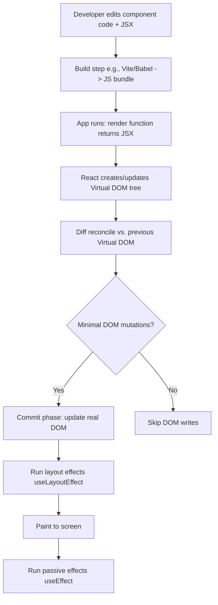
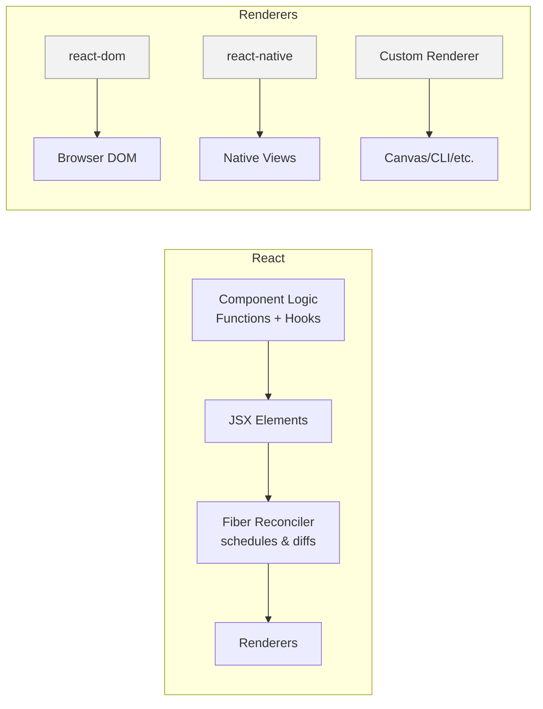
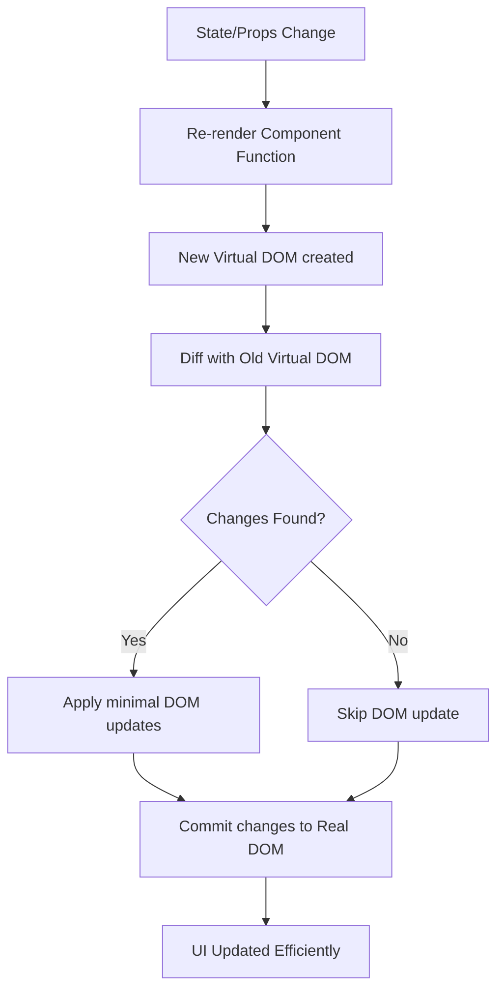

# React — Quick, Practical Overview

> A concise guide to what React is, why it matters, why it’s popular, how it flows, and its architecture (in a nutshell).

---

## What is React?
React is a **JavaScript library for building user interfaces**. It lets you compose small, reusable **components** that describe what the UI should look like at any point in time. React efficiently updates the **real DOM** by first computing changes in a **virtual DOM** and then applying the minimal set of updates (the **reconciliation** process).

- **Library, not a framework**: Focused on the view layer (UI). You add routing, data fetching, state management, etc., as needed.
- **Declarative**: You describe the end state of the UI; React figures out how to update the DOM.
- **Component-based**: Build UIs from isolated, reusable pieces (components).

---

## Why is it important?
- **Scale & maintainability**: Componentization and one-way data flow help teams scale large UIs with fewer bugs.
- **Performance**: The virtual DOM + Fiber scheduler reduce unnecessary DOM work and enable responsive UIs.
- **Ecosystem**: Rich ecosystem (Next.js, Remix, React Native, Vite, TanStack Query, Redux Toolkit, Zustand, etc.).
- **Cross-platform**: Render to web (React DOM), native mobile (React Native), desktop (Electron), or even terminal/Canvas.
- **Longevity**: Backed by Meta and a massive community, used widely in production.

---

## Why is it popular?
- **Developer experience**: JSX, Hooks, and excellent dev tools shorten feedback loops.
- **Flexibility**: Opt‑in approach — bring your own router, state, or data layer.
- **SSR/SSG/ISR options**: Mature meta-frameworks (e.g., Next.js) for server rendering and static generation.
- **Learning curve**: Core API is relatively small; you can get productive quickly.
- **Community & hiring**: Huge talent pool, abundant learning resources, and wide industry adoption.

---

## Core Concepts at a Glance
- **Components**: Functions returning JSX.
- **Props & State**: Inputs (props) vs. internal data (state via `useState`, `useReducer`).
- **Hooks**: Functions like `useEffect`, `useMemo`, `useRef` to manage side effects and performance.
- **Context**: Share data without prop drilling.
- **Reconciliation**: Virtual DOM diffing to compute minimal DOM changes.
- **Concurrent Rendering** (modern React): Scheduling that keeps UIs snappy under load.
- **Strict Mode** (dev): Helps find side-effect bugs by invoking certain functions twice in dev.

---

## Example (Functional Component + Hooks)

```jsx
import { useState, useEffect } from "react";

export default function Counter() {
  const [count, setCount] = useState(0);

  useEffect(() => {
    document.title = `Clicked ${count} times`;
    return () => {
      // cleanup (runs before next effect or on unmount)
    };
  }, [count]);

  return (
    <button onClick={() => setCount(c => c + 1)}>
      Clicked {count} times
    </button>
  );
}
```

---

## Flow Chart — How React Updates the UI



**Notes**
- React’s **render phase** is pure and can be interrupted (in concurrent rendering).
- The **commit phase** applies changes atomically to the real DOM.
- Effects run after paint (`useEffect`) or just before paint (`useLayoutEffect`).

---

## Architecture — In a Nutshell



**Key Pieces**
- **Function Components + Hooks**: The standard way to express UI logic/state.
- **Fiber Reconciler**: Core engine that breaks rendering work into units, prioritizes, and can pause/resume (concurrent rendering).
- **Renderers**: Targets like **react-dom** (web) and **react-native** (mobile). You can build custom renderers with `react-reconciler`.
- **One-way Data Flow**: State flows down; events bubble up. Makes reasoning about changes easier.
- **Server Components (RSC)** (modern React): Let you run components on the server for data fetching and smaller client bundles.
- **Suspense/Transitions**: Coordinate async UI states for smoother loading.

---

## When to Use React (and When Not To)
**Use it when**
- Your UI is **interactive** and **stateful**.
- You expect the project to **grow** with multiple contributors.
- You want access to a **large ecosystem** and **SSR/SSG** options.

**Skip it when**
- The site is **static** or a small brochure page — static site generators or simple HTML might be enough.
- You have **no build step** or want to minimize JS — consider Web Components or vanilla JS + HTML.

---

## Mental Model Summary
- Think in **components** (small, testable units).
- Keep **state local** where possible; move it up only when shared.
- Make renders **pure**: same props/state => same UI.
- Use **effects** only for side effects; not for rendering logic.
- Use **memoization** (`useMemo`, `useCallback`) for performance hotspots, not prematurely.

---

## Glossary (Super Short)
- **JSX**: HTML-like syntax inside JS, compiled to `React.createElement` calls (or equivalent).
- **Virtual DOM**: In-memory tree React diffs to compute DOM updates.
- **Reconciliation**: The diffing process determining minimal changes.
- **Fiber**: Internal data structure enabling scheduling & concurrent rendering.
- **RSC**: React Server Components, run on the server, reduce client JS.

---

## Further Steps
- Build something small (Todo, Counter, Fetch list).
- Add routing (e.g., React Router) and data fetching (e.g., fetch/TanStack Query).
- Try a meta-framework (Next.js) for server rendering and routing.


### What are the limitations of React?
The few limitations of React are as given below:

- React is not a full-blown framework as it is only a library.
- The components of React are numerous and will take time to fully grasp the benefits of all.
- It might be difficult for beginner programmers to understand React.
- Coding might become complex as it will make use of inline templating and JSX.


---


# DOM, Virtual DOM, and React Updates — In a Nutshell

---

## What is the DOM?
- **DOM (Document Object Model)**: A programming interface that represents an HTML or XML document as a **tree structure**.
- Each HTML element (like `<div>`, `<button>`) is a **node** in this tree.
- JavaScript can **read, add, update, or delete** nodes in the DOM to change the page dynamically.
- Example:
  ```html
  <div id="app">
    <h1>Hello</h1>
    <button>Click</button>
  </div>
  ```
  The above becomes a tree with `div` as parent → children: `h1`, `button`.

---

## What is the Virtual DOM?
- The **Virtual DOM (VDOM)** is a **lightweight copy** of the real DOM kept in memory by React.
- Instead of changing the real DOM directly (which is **slow**), React:
  1. Updates the virtual DOM.
  2. Compares it with the previous version (called **diffing**).
  3. Applies only the **minimal changes** to the real DOM (called **reconciliation**).
- This reduces performance costs since the real DOM is expensive to manipulate.

---

## How React Updates the DOM


---

## When Does React Update the DOM?
React updates the real DOM **only when necessary**:

1. **State changes** (`useState`, `useReducer`)  
   - Example: A counter button increments its displayed number.
2. **Props changes** (data passed from parent component).  
   - Example: Parent sends new data to child → child re-renders.
3. **Context changes** (if the component consumes a context that updated).  
   - Example: Theme context changes from "light" → "dark".
4. **Force re-render** (`key` change or `forceUpdate` in class components).  

**Important:**  
- React will **not** update the DOM if the new Virtual DOM tree matches the old one (no real change).  
- This makes React efficient — it avoids unnecessary DOM writes.

---

## Mental Model Summary
- **DOM** = Real page tree → slow to update often.  
- **Virtual DOM** = In-memory copy React controls.  
- **React update flow** = state/props/context change → VDOM diff → minimal real DOM update.  
- **Scenario for updates** = Only when there is an actual change between old VDOM and new VDOM.

---

## React 19 - What's New? 🆕

React 19, released in 2024 and current in 2026, brings significant improvements and new features:

### 1. React Compiler (Auto-Optimization)
React 19 includes a compiler that **automatically optimizes your code** without manual memoization:

```jsx
// ❌ React 18: Manual memoization needed
const MemoizedComponent = memo(({ data }) => {
  const processedData = useMemo(() => expensiveOperation(data), [data]);
  const handleClick = useCallback(() => doSomething(data), [data]);
  
  return <div onClick={handleClick}>{processedData}</div>;
});

// ✅ React 19: Compiler handles it automatically
function Component({ data }) {
  const processedData = expensiveOperation(data);
  const handleClick = () => doSomething(data);
  
  return <div onClick={handleClick}>{processedData}</div>;
}
// React Compiler auto-memoizes when needed!
```

**Benefits:**
- Less boilerplate code
- Better performance by default
- Focus on logic, not optimization
- Compiler is smart about when to optimize

### 2. React Server Components (RSC)
Server Components render on the server and send **zero JavaScript to the client**:

```jsx
// Server Component (runs on server only)
async function BlogPost({ id }) {
  // This runs on server, no client bundle impact
  const post = await db.posts.findById(id);
  
  return (
    <article>
      <h1>{post.title}</h1>
      <p>{post.content}</p>
    </article>
  );
}

// Client Component (interactive)
'use client'; // Directive marks client component

import { useState } from 'react';

export function LikeButton() {
  const [likes, setLikes] = useState(0);
  return <button onClick={() => setLikes(l => l + 1)}>❤️ {likes}</button>;
}
```

**Use Server Components for:**
- Data fetching from databases
- Accessing backend services
- Large dependencies (markdown parsers, date libraries)
- Static content

**Use Client Components for:**
- Interactivity (onClick, onChange)
- Browser-only APIs (localStorage, window)
- State and effects (useState, useEffect)
- Custom hooks

### 3. Actions - Built-in Form Handling

Actions simplify form handling with built-in pending states:

```jsx
import { useActionState } from 'react';

function AddTodoForm() {
  const [state, formAction, isPending] = useActionState(
    async (previousState, formData) => {
      const title = formData.get('title');
      
      try {
        await addTodoToDatabase(title);
        return { success: true, message: 'Todo added!' };
      } catch (error) {
        return { success: false, message: error.message };
      }
    },
    { success: false, message: '' }
  );

  return (
    <form action={formAction}>
      <input name="title" disabled={isPending} required />
      <button type="submit" disabled={isPending}>
        {isPending ? 'Adding...' : 'Add Todo'}
      </button>
      {state.message && (
        <p className={state.success ? 'success' : 'error'}>
          {state.message}
        </p>
      )}
    </form>
  );
}
```

### 4. New React 19 Hooks

#### `use()` - Read Promises and Context
```jsx
import { use, Suspense } from 'react';

function UserProfile({ userPromise }) {
  // use() can read promises directly
  const user = use(userPromise);
  
  return (
    <div>
      <h2>{user.name}</h2>
      <p>{user.email}</p>
    </div>
  );
}

function App() {
  const userPromise = fetchUser(userId);
  
  return (
    <Suspense fallback={<div>Loading...</div>}>
      <UserProfile userPromise={userPromise} />
    </Suspense>
  );
}
```

#### `useOptimistic()` - Optimistic Updates
```jsx
import { useOptimistic } from 'react';

function TodoList({ todos, onToggle }) {
  const [optimisticTodos, setOptimisticTodos] = useOptimistic(todos);

  const handleToggle = async (id) => {
    // Update UI immediately (optimistic)
    setOptimisticTodos((current) =>
      current.map((todo) =>
        todo.id === id ? { ...todo, completed: !todo.completed } : todo
      )
    );

    // Then update server
    await onToggle(id);
  };

  return (
    <ul>
      {optimisticTodos.map((todo) => (
        <li key={todo.id}>
          <input
            type="checkbox"
            checked={todo.completed}
            onChange={() => handleToggle(todo.id)}
          />
          {todo.title}
        </li>
      ))}
    </ul>
  );
}
```

#### `useFormStatus()` - Form Submission Status
```jsx
import { useFormStatus } from 'react-dom';

function SubmitButton() {
  const { pending, data, method, action } = useFormStatus();
  
  return (
    <button type="submit" disabled={pending}>
      {pending ? 'Submitting...' : 'Submit'}
    </button>
  );
}
```

### 5. React 19 Improvements

#### `ref` as a Prop (No more forwardRef!)
```jsx
// ❌ React 18: Needed forwardRef
const Input = forwardRef((props, ref) => {
  return <input ref={ref} {...props} />;
});

// ✅ React 19: ref is just a prop
function Input({ ref, ...props }) {
  return <input ref={ref} {...props} />;
}
```

#### Context as Provider (No more .Provider!)
```jsx
// ❌ React 18: Used .Provider
<ThemeContext.Provider value={theme}>
  <App />
</ThemeContext.Provider>

// ✅ React 19: Context is the provider
<ThemeContext value={theme}>
  <App />
</ThemeContext>
```

#### Document Metadata Support
```jsx
function BlogPost({ post }) {
  return (
    <article>
      {/* These are hoisted to <head> automatically */}
      <title>{post.title} - My Blog</title>
      <meta name="description" content={post.excerpt} />
      <meta property="og:title" content={post.title} />
      
      <h1>{post.title}</h1>
      <div>{post.content}</div>
    </article>
  );
}
```

#### Ref Cleanup Functions
```jsx
function VideoPlayer({ src }) {
  return (
    <video
      ref={(node) => {
        if (node) {
          node.play();
          
          // Return cleanup function
          return () => {
            node.pause();
          };
        }
      }}
      src={src}
    />
  );
}
```

---

## React 19 Benefits Summary

| Feature | Benefit |
|---------|---------|
| **React Compiler** | Automatic optimization, less manual memoization |
| **Server Components** | Zero JS for static content, better performance |
| **Actions** | Simplified form handling with built-in pending states |
| **use() Hook** | Clean async data fetching |
| **useOptimistic()** | Better UX with optimistic updates |
| **ref as Prop** | Simpler component APIs |
| **Context Updates** | Cleaner syntax |
| **Document Metadata** | SEO-friendly without libraries |

---

## Next Steps

- 📖 Learn all hooks in detail: [Hooks Complete Guide](02-hooks-complete-guide.md)
- 🔍 Understand Virtual DOM deeply: [Virtual DOM & Reconciliation](03-virtual-dom-reconciliation.md)
- 🛡️ Handle errors properly: [Error Boundaries](09-error-boundaries.md)
- 🎯 Master performance: [Profiler & Performance](11-profiler-performance.md)
- 🚀 Explore concurrent features: [Suspense & Concurrent](12-suspense-concurrent.md)
- 📝 Prepare for interviews: [30 Essential Questions](05-interview-questions-30.md)

---

## Event Handling: onClick vs onChange

Both are React synthetic events, but they fire on different interactions:

- **`onClick`** - fires when an element is clicked (buttons, icons, divs). The handler usually acts on *intent* and needs no value: submit, toggle, navigate.
- **`onChange`** - fires when the **value of a form control changes** (`<input>`, `<textarea>`, `<select>`). In React it fires on *every keystroke* (unlike native HTML `change`, which fires on blur). You read the new value from `event.target.value` (or `.checked` for checkboxes). This is the backbone of **controlled components**.

```jsx
// onClick: respond to an action
<button onClick={() => setCount(c => c + 1)}>Increment</button>

// onChange: track the new value of an input (controlled component)
<input value={name} onChange={e => setName(e.target.value)} />

// checkboxes read .checked
<input type="checkbox" checked={agree} onChange={e => setAgree(e.target.checked)} />
```

Rule of thumb: **onClick** = "the user did something"; **onChange** = "this field's value is now different." Controlled inputs and hooks are covered in [02-hooks-complete-guide.md](02-hooks-complete-guide.md).

---

*Last Updated: January 2026 - React 19*
