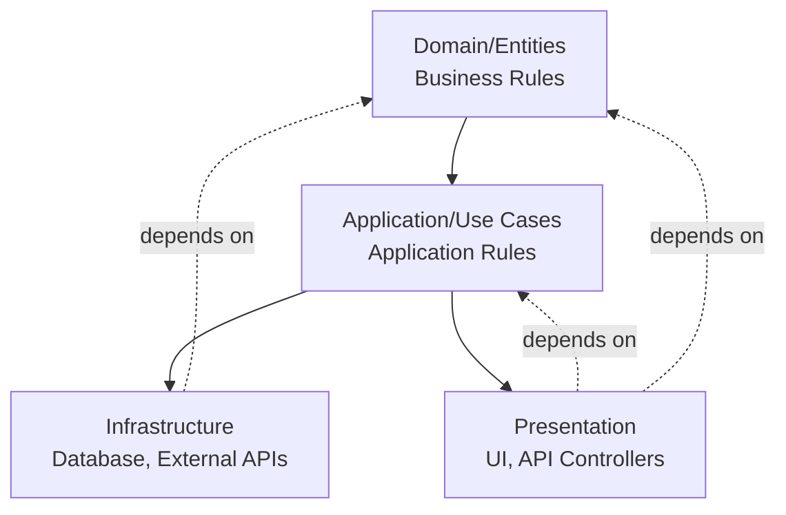

# Clean Architecture in .NET 9 - Production Guide

## Table of Contents
1. [Introduction](#introduction)
2. [Core Principles](#core-principles)
3. [Layer Structure](#layer-structure)
4. [Implementation Guide](#implementation-guide)
5. [Dependency Management](#dependency-management)
6. [Real-World Example](#real-world-example)
7. [Best Practices](#best-practices)
8. [Interview Questions](#interview-questions)

## Introduction

Clean Architecture, popularized by Robert C. Martin (Uncle Bob), is an architectural pattern that emphasizes separation of concerns, testability, and independence from frameworks, databases, and external agencies.

### Key Benefits
- **Independent of Frameworks**: Architecture doesn't depend on libraries
- **Testable**: Business rules can be tested without UI, database, or external elements
- **Independent of UI**: UI can change without changing the rest of the system
- **Independent of Database**: Business rules aren't bound to the database
- **Independent of External Agencies**: Business rules don't know about the outside world

### The Dependency Rule
**Dependencies must point inward**. Source code dependencies can only point inward toward higher-level policies. Inner circles cannot know anything about outer circles.



## Core Principles

### 1. SOLID Principles Foundation
Clean Architecture is built on SOLID principles:

```csharp
// Single Responsibility Principle
public class OrderService
{
    private readonly IOrderRepository _repository;
    private readonly IEmailService _emailService;
    
    public OrderService(IOrderRepository repository, IEmailService emailService)
    {
        _repository = repository;
        _emailService = emailService;
    }
    
    public async Task<Result<Order>> CreateOrderAsync(CreateOrderCommand command)
    {
        // Only responsible for order creation logic
        var order = new Order(command.CustomerId, command.Items);
        await _repository.AddAsync(order);
        await _emailService.SendOrderConfirmationAsync(order);
        return Result<Order>.Success(order);
    }
}

// Dependency Inversion Principle
// High-level module (Application) depends on abstraction
// Low-level module (Infrastructure) implements the abstraction
public interface IOrderRepository // In Application Layer
{
    Task<Order> GetByIdAsync(Guid id);
    Task AddAsync(Order order);
}

public class OrderRepository : IOrderRepository // In Infrastructure Layer
{
    private readonly ApplicationDbContext _context;
    
    public async Task<Order> GetByIdAsync(Guid id)
    {
        return await _context.Orders
            .Include(o => o.Items)
            .FirstOrDefaultAsync(o => o.Id == id);
    }
}
```

### 2. Domain-Driven Design (DDD) Integration

```csharp
// Domain Layer - Rich Domain Model
public class Order : AggregateRoot
{
    private readonly List<OrderItem> _items = new();
    
    public Guid Id { get; private set; }
    public Guid CustomerId { get; private set; }
    public OrderStatus Status { get; private set; }
    public DateTime CreatedAt { get; private set; }
    public IReadOnlyCollection<OrderItem> Items => _items.AsReadOnly();
    public decimal TotalAmount => _items.Sum(i => i.Price * i.Quantity);
    
    private Order() { } // EF Core
    
    public Order(Guid customerId, List<OrderItem> items)
    {
        Id = Guid.NewGuid();
        CustomerId = customerId;
        Status = OrderStatus.Pending;
        CreatedAt = DateTime.UtcNow;
        _items.AddRange(items);
        
        // Domain event
        AddDomainEvent(new OrderCreatedEvent(Id, CustomerId, TotalAmount));
    }
    
    public Result Confirm()
    {
        if (Status != OrderStatus.Pending)
            return Result.Failure("Only pending orders can be confirmed");
            
        Status = OrderStatus.Confirmed;
        AddDomainEvent(new OrderConfirmedEvent(Id));
        return Result.Success();
    }
    
    public Result Cancel(string reason)
    {
        if (Status == OrderStatus.Delivered)
            return Result.Failure("Delivered orders cannot be cancelled");
            
        Status = OrderStatus.Cancelled;
        AddDomainEvent(new OrderCancelledEvent(Id, reason));
        return Result.Success();
    }
}

// Value Object
public class OrderItem : ValueObject
{
    public Guid ProductId { get; private set; }
    public string ProductName { get; private set; }
    public decimal Price { get; private set; }
    public int Quantity { get; private set; }
    
    private OrderItem() { }
    
    public OrderItem(Guid productId, string productName, decimal price, int quantity)
    {
        if (quantity <= 0)
            throw new ArgumentException("Quantity must be positive");
        if (price < 0)
            throw new ArgumentException("Price cannot be negative");
            
        ProductId = productId;
        ProductName = productName;
        Price = price;
        Quantity = quantity;
    }
    
    protected override IEnumerable<object> GetEqualityComponents()
    {
        yield return ProductId;
        yield return Price;
        yield return Quantity;
    }
}
```

## Layer Structure

### Project Organization

```
MyApp/
├── src/
│   ├── MyApp.Domain/                  # Core business logic
│   │   ├── Entities/
│   │   ├── ValueObjects/
│   │   ├── Enums/
│   │   ├── Events/
│   │   ├── Exceptions/
│   │   └── Interfaces/
│   ├── MyApp.Application/             # Use cases
│   │   ├── Common/
│   │   │   ├── Interfaces/
│   │   │   ├── Models/
│   │   │   └── Behaviors/
│   │   ├── Orders/
│   │   │   ├── Commands/
│   │   │   ├── Queries/
│   │   │   └── Validators/
│   │   └── DependencyInjection.cs
│   ├── MyApp.Infrastructure/          # External concerns
│   │   ├── Persistence/
│   │   │   ├── Configurations/
│   │   │   ├── Migrations/
│   │   │   └── ApplicationDbContext.cs
│   │   ├── Services/
│   │   ├── Identity/
│   │   └── DependencyInjection.cs
│   └── MyApp.Api/                     # API entry point
│       ├── Controllers/
│       ├── Middleware/
│       ├── Filters/
│       └── Program.cs
└── tests/
    ├── MyApp.Domain.Tests/
    ├── MyApp.Application.Tests/
    └── MyApp.Api.IntegrationTests/
```

### Layer Dependencies

```xml
<!-- Domain - No dependencies -->
<Project Sdk="Microsoft.NET.Sdk">
  <PropertyGroup>
    <TargetFramework>net9.0</TargetFramework>
  </PropertyGroup>
</Project>

<!-- Application - Depends on Domain only -->
<Project Sdk="Microsoft.NET.Sdk">
  <PropertyGroup>
    <TargetFramework>net9.0</TargetFramework>
  </PropertyGroup>
  
  <ItemGroup>
    <ProjectReference Include="..\MyApp.Domain\MyApp.Domain.csproj" />
  </ItemGroup>
  
  <ItemGroup>
    <PackageReference Include="MediatR" Version="12.4.0" />
    <PackageReference Include="FluentValidation" Version="11.9.0" />
  </ItemGroup>
</Project>

<!-- Infrastructure - Depends on Application -->
<Project Sdk="Microsoft.NET.Sdk">
  <PropertyGroup>
    <TargetFramework>net9.0</TargetFramework>
  </PropertyGroup>
  
  <ItemGroup>
    <ProjectReference Include="..\MyApp.Application\MyApp.Application.csproj" />
  </ItemGroup>
  
  <ItemGroup>
    <PackageReference Include="Microsoft.EntityFrameworkCore.SqlServer" Version="9.0.0" />
    <PackageReference Include="StackExchange.Redis" Version="2.8.0" />
  </ItemGroup>
</Project>
```

## Implementation Guide

### 1. Domain Layer

```csharp
// Base entity with domain events
public abstract class Entity
{
    private readonly List<DomainEvent> _domainEvents = new();
    
    public IReadOnlyCollection<DomainEvent> DomainEvents => _domainEvents.AsReadOnly();
    
    protected void AddDomainEvent(DomainEvent domainEvent)
    {
        _domainEvents.Add(domainEvent);
    }
    
    public void ClearDomainEvents()
    {
        _domainEvents.Clear();
    }
}

public abstract class AggregateRoot : Entity
{
    // Aggregate roots are entry points for business operations
}

// Domain event base class
public abstract record DomainEvent
{
    public Guid Id { get; init; } = Guid.NewGuid();
    public DateTime OccurredOn { get; init; } = DateTime.UtcNow;
}

// Specific domain event
public record OrderCreatedEvent(Guid OrderId, Guid CustomerId, decimal TotalAmount) : DomainEvent;

// Result pattern for operations
public class Result
{
    public bool IsSuccess { get; }
    public bool IsFailure => !IsSuccess;
    public string Error { get; }
    
    protected Result(bool isSuccess, string error)
    {
        IsSuccess = isSuccess;
        Error = error;
    }
    
    public static Result Success() => new(true, string.Empty);
    public static Result Failure(string error) => new(false, error);
}

public class Result<T> : Result
{
    public T Value { get; }
    
    private Result(bool isSuccess, T value, string error) : base(isSuccess, error)
    {
        Value = value;
    }
    
    public static Result<T> Success(T value) => new(true, value, string.Empty);
    public static new Result<T> Failure(string error) => new(false, default!, error);
}
```

### 2. Application Layer - CQRS Pattern

```csharp
// Command with MediatR
public record CreateOrderCommand(
    Guid CustomerId,
    List<CreateOrderItemDto> Items
) : IRequest<Result<OrderDto>>;

public class CreateOrderCommandHandler : IRequestHandler<CreateOrderCommand, Result<OrderDto>>
{
    private readonly IOrderRepository _orderRepository;
    private readonly IProductRepository _productRepository;
    private readonly IUnitOfWork _unitOfWork;
    
    public CreateOrderCommandHandler(
        IOrderRepository orderRepository,
        IProductRepository productRepository,
        IUnitOfWork unitOfWork)
    {
        _orderRepository = orderRepository;
        _productRepository = productRepository;
        _unitOfWork = unitOfWork;
    }
    
    public async Task<Result<OrderDto>> Handle(
        CreateOrderCommand request, 
        CancellationToken cancellationToken)
    {
        // Validate products exist
        var productIds = request.Items.Select(i => i.ProductId).ToList();
        var products = await _productRepository.GetByIdsAsync(productIds, cancellationToken);
        
        if (products.Count != productIds.Count)
            return Result<OrderDto>.Failure("One or more products not found");
        
        // Create order items
        var orderItems = request.Items.Select(dto =>
        {
            var product = products.First(p => p.Id == dto.ProductId);
            return new OrderItem(product.Id, product.Name, product.Price, dto.Quantity);
        }).ToList();
        
        // Create order
        var order = new Order(request.CustomerId, orderItems);
        
        await _orderRepository.AddAsync(order, cancellationToken);
        await _unitOfWork.SaveChangesAsync(cancellationToken);
        
        return Result<OrderDto>.Success(OrderDto.FromOrder(order));
    }
}

// Query
public record GetOrderByIdQuery(Guid OrderId) : IRequest<Result<OrderDto>>;

public class GetOrderByIdQueryHandler : IRequestHandler<GetOrderByIdQuery, Result<OrderDto>>
{
    private readonly IOrderRepository _orderRepository;
    
    public GetOrderByIdQueryHandler(IOrderRepository orderRepository)
    {
        _orderRepository = orderRepository;
    }
    
    public async Task<Result<OrderDto>> Handle(
        GetOrderByIdQuery request, 
        CancellationToken cancellationToken)
    {
        var order = await _orderRepository.GetByIdAsync(request.OrderId, cancellationToken);
        
        if (order == null)
            return Result<OrderDto>.Failure("Order not found");
        
        return Result<OrderDto>.Success(OrderDto.FromOrder(order));
    }
}

// Validation with FluentValidation
public class CreateOrderCommandValidator : AbstractValidator<CreateOrderCommand>
{
    public CreateOrderCommandValidator()
    {
        RuleFor(x => x.CustomerId)
            .NotEmpty().WithMessage("Customer ID is required");
        
        RuleFor(x => x.Items)
            .NotEmpty().WithMessage("Order must have at least one item")
            .Must(items => items.Count <= 100)
            .WithMessage("Order cannot have more than 100 items");
        
        RuleForEach(x => x.Items).ChildRules(item =>
        {
            item.RuleFor(x => x.ProductId).NotEmpty();
            item.RuleFor(x => x.Quantity).GreaterThan(0);
        });
    }
}

// MediatR Pipeline Behavior for Validation
public class ValidationBehavior<TRequest, TResponse> : IPipelineBehavior<TRequest, TResponse>
    where TRequest : IRequest<TResponse>
{
    private readonly IEnumerable<IValidator<TRequest>> _validators;
    
    public ValidationBehavior(IEnumerable<IValidator<TRequest>> validators)
    {
        _validators = validators;
    }
    
    public async Task<TResponse> Handle(
        TRequest request,
        RequestHandlerDelegate<TResponse> next,
        CancellationToken cancellationToken)
    {
        if (!_validators.Any())
            return await next();
        
        var context = new ValidationContext<TRequest>(request);
        
        var validationResults = await Task.WhenAll(
            _validators.Select(v => v.ValidateAsync(context, cancellationToken)));
        
        var failures = validationResults
            .SelectMany(r => r.Errors)
            .Where(f => f != null)
            .ToList();
        
        if (failures.Any())
            throw new ValidationException(failures);
        
        return await next();
    }
}
```

### 3. Infrastructure Layer

```csharp
// DbContext with domain events
public class ApplicationDbContext : DbContext, IUnitOfWork
{
    private readonly IMediator _mediator;
    
    public ApplicationDbContext(
        DbContextOptions<ApplicationDbContext> options,
        IMediator mediator) : base(options)
    {
        _mediator = mediator;
    }
    
    public DbSet<Order> Orders => Set<Order>();
    public DbSet<Product> Products => Set<Product>();
    
    protected override void OnModelCreating(ModelBuilder modelBuilder)
    {
        modelBuilder.ApplyConfigurationsFromAssembly(typeof(ApplicationDbContext).Assembly);
        base.OnModelCreating(modelBuilder);
    }
    
    public override async Task<int> SaveChangesAsync(CancellationToken cancellationToken = default)
    {
        // Dispatch domain events before saving
        var domainEvents = ChangeTracker.Entries<Entity>()
            .Select(e => e.Entity)
            .Where(e => e.DomainEvents.Any())
            .SelectMany(e => e.DomainEvents)
            .ToList();
        
        var result = await base.SaveChangesAsync(cancellationToken);
        
        // Publish domain events after successful save
        foreach (var domainEvent in domainEvents)
        {
            await _mediator.Publish(domainEvent, cancellationToken);
        }
        
        // Clear domain events
        ChangeTracker.Entries<Entity>()
            .Select(e => e.Entity)
            .ToList()
            .ForEach(e => e.ClearDomainEvents());
        
        return result;
    }
}

// Entity Configuration
public class OrderConfiguration : IEntityTypeConfiguration<Order>
{
    public void Configure(EntityTypeBuilder<Order> builder)
    {
        builder.ToTable("Orders");
        
        builder.HasKey(o => o.Id);
        
        builder.Property(o => o.CustomerId)
            .IsRequired();
        
        builder.Property(o => o.Status)
            .HasConversion<string>()
            .IsRequired();
        
        builder.OwnsMany(o => o.Items, items =>
        {
            items.ToTable("OrderItems");
            items.WithOwner().HasForeignKey("OrderId");
            items.Property(i => i.ProductName).HasMaxLength(200);
            items.Property(i => i.Price).HasPrecision(18, 2);
        });
        
        // Ignore domain events
        builder.Ignore(o => o.DomainEvents);
    }
}

// Repository Implementation
public class OrderRepository : IOrderRepository
{
    private readonly ApplicationDbContext _context;
    
    public OrderRepository(ApplicationDbContext context)
    {
        _context = context;
    }
    
    public async Task<Order?> GetByIdAsync(Guid id, CancellationToken cancellationToken = default)
    {
        return await _context.Orders
            .AsNoTracking()
            .Include(o => o.Items)
            .FirstOrDefaultAsync(o => o.Id == id, cancellationToken);
    }
    
    public async Task AddAsync(Order order, CancellationToken cancellationToken = default)
    {
        await _context.Orders.AddAsync(order, cancellationToken);
    }
    
    public void Update(Order order)
    {
        _context.Orders.Update(order);
    }
}
```

### 4. API/Presentation Layer

```csharp
// Controller using MediatR
[ApiController]
[Route("api/[controller]")]
public class OrdersController : ControllerBase
{
    private readonly IMediator _mediator;
    
    public OrdersController(IMediator mediator)
    {
        _mediator = mediator;
    }
    
    [HttpGet("{id:guid}")]
    [ProducesResponseType(typeof(OrderDto), StatusCodes.Status200OK)]
    [ProducesResponseType(StatusCodes.Status404NotFound)]
    public async Task<IActionResult> GetById(Guid id)
    {
        var query = new GetOrderByIdQuery(id);
        var result = await _mediator.Send(query);
        
        return result.IsSuccess 
            ? Ok(result.Value) 
            : NotFound(new { error = result.Error });
    }
    
    [HttpPost]
    [ProducesResponseType(typeof(OrderDto), StatusCodes.Status201Created)]
    [ProducesResponseType(typeof(ValidationProblemDetails), StatusCodes.Status400BadRequest)]
    public async Task<IActionResult> Create([FromBody] CreateOrderCommand command)
    {
        var result = await _mediator.Send(command);
        
        if (result.IsFailure)
            return BadRequest(new { error = result.Error });
        
        return CreatedAtAction(
            nameof(GetById), 
            new { id = result.Value.Id }, 
            result.Value);
    }
}

// Global exception handler
public class GlobalExceptionHandler : IExceptionHandler
{
    private readonly ILogger<GlobalExceptionHandler> _logger;
    
    public GlobalExceptionHandler(ILogger<GlobalExceptionHandler> logger)
    {
        _logger = logger;
    }
    
    public async ValueTask<bool> TryHandleAsync(
        HttpContext httpContext,
        Exception exception,
        CancellationToken cancellationToken)
    {
        _logger.LogError(exception, "An error occurred: {Message}", exception.Message);
        
        var (statusCode, title) = exception switch
        {
            ValidationException => (StatusCodes.Status400BadRequest, "Validation Error"),
            NotFoundException => (StatusCodes.Status404NotFound, "Not Found"),
            UnauthorizedException => (StatusCodes.Status401Unauthorized, "Unauthorized"),
            _ => (StatusCodes.Status500InternalServerError, "Internal Server Error")
        };
        
        var problemDetails = new ProblemDetails
        {
            Status = statusCode,
            Title = title,
            Detail = exception.Message
        };
        
        if (exception is ValidationException validationException)
        {
            problemDetails.Extensions["errors"] = validationException.Errors;
        }
        
        httpContext.Response.StatusCode = statusCode;
        await httpContext.Response.WriteAsJsonAsync(problemDetails, cancellationToken);
        
        return true;
    }
}
```

## Dependency Management

### Dependency Injection Setup

```csharp
// Application Layer - DependencyInjection.cs
public static class DependencyInjection
{
    public static IServiceCollection AddApplication(this IServiceCollection services)
    {
        var assembly = typeof(DependencyInjection).Assembly;
        
        // MediatR
        services.AddMediatR(cfg =>
        {
            cfg.RegisterServicesFromAssembly(assembly);
            cfg.AddOpenBehavior(typeof(ValidationBehavior<,>));
            cfg.AddOpenBehavior(typeof(LoggingBehavior<,>));
            cfg.AddOpenBehavior(typeof(PerformanceBehavior<,>));
        });
        
        // FluentValidation
        services.AddValidatorsFromAssembly(assembly);
        
        return services;
    }
}

// Infrastructure Layer - DependencyInjection.cs
public static class DependencyInjection
{
    public static IServiceCollection AddInfrastructure(
        this IServiceCollection services,
        IConfiguration configuration)
    {
        // Database
        services.AddDbContext<ApplicationDbContext>(options =>
            options.UseSqlServer(
                configuration.GetConnectionString("DefaultConnection"),
                b => b.MigrationsAssembly(typeof(ApplicationDbContext).Assembly.FullName)));
        
        services.AddScoped<IUnitOfWork>(sp => sp.GetRequiredService<ApplicationDbContext>());
        
        // Repositories
        services.AddScoped<IOrderRepository, OrderRepository>();
        services.AddScoped<IProductRepository, ProductRepository>();
        
        // Services
        services.AddScoped<IEmailService, EmailService>();
        services.AddScoped<IPaymentService, PaymentService>();
        
        // Caching
        services.AddStackExchangeRedisCache(options =>
        {
            options.Configuration = configuration.GetConnectionString("Redis");
        });
        
        services.AddScoped<ICacheService, CacheService>();
        
        return services;
    }
}

// Program.cs
var builder = WebApplication.CreateBuilder(args);

// Add layers
builder.Services.AddApplication();
builder.Services.AddInfrastructure(builder.Configuration);

// API services
builder.Services.AddControllers();
builder.Services.AddEndpointsApiExplorer();
builder.Services.AddSwaggerGen();

// Exception handling
builder.Services.AddExceptionHandler<GlobalExceptionHandler>();
builder.Services.AddProblemDetails();

var app = builder.Build();

// Middleware pipeline
if (app.Environment.IsDevelopment())
{
    app.UseSwagger();
    app.UseSwaggerUI();
}

app.UseExceptionHandler();
app.UseHttpsRedirection();
app.UseAuthorization();
app.MapControllers();

app.Run();
```

## Real-World Example

### E-Commerce Order Management System

```csharp
// Domain - Order Aggregate
public class Order : AggregateRoot
{
    public Guid Id { get; private set; }
    public Guid CustomerId { get; private set; }
    public OrderStatus Status { get; private set; }
    public Address ShippingAddress { get; private set; }
    public PaymentInfo PaymentInfo { get; private set; }
    private readonly List<OrderItem> _items = new();
    public IReadOnlyCollection<OrderItem> Items => _items.AsReadOnly();
    
    public decimal Subtotal => _items.Sum(i => i.Price * i.Quantity);
    public decimal Tax => Subtotal * 0.1m;
    public decimal ShippingCost { get; private set; }
    public decimal Total => Subtotal + Tax + ShippingCost;
    
    public Result ProcessPayment(IPaymentService paymentService)
    {
        if (Status != OrderStatus.Pending)
            return Result.Failure("Only pending orders can be paid");
        
        var paymentResult = paymentService.ProcessPayment(PaymentInfo, Total);
        
        if (paymentResult.IsFailure)
            return Result.Failure($"Payment failed: {paymentResult.Error}");
        
        Status = OrderStatus.Paid;
        AddDomainEvent(new OrderPaidEvent(Id, Total));
        
        return Result.Success();
    }
    
    public Result Ship(string trackingNumber)
    {
        if (Status != OrderStatus.Paid)
            return Result.Failure("Only paid orders can be shipped");
        
        Status = OrderStatus.Shipped;
        AddDomainEvent(new OrderShippedEvent(Id, trackingNumber));
        
        return Result.Success();
    }
}

// Application - Process Order Command
public record ProcessOrderPaymentCommand(Guid OrderId) : IRequest<Result>;

public class ProcessOrderPaymentHandler : IRequestHandler<ProcessOrderPaymentCommand, Result>
{
    private readonly IOrderRepository _orderRepository;
    private readonly IPaymentService _paymentService;
    private readonly IUnitOfWork _unitOfWork;
    
    public async Task<Result> Handle(
        ProcessOrderPaymentCommand request,
        CancellationToken cancellationToken)
    {
        var order = await _orderRepository.GetByIdAsync(request.OrderId, cancellationToken);
        
        if (order == null)
            return Result.Failure("Order not found");
        
        var result = order.ProcessPayment(_paymentService);
        
        if (result.IsFailure)
            return result;
        
        _orderRepository.Update(order);
        await _unitOfWork.SaveChangesAsync(cancellationToken);
        
        return Result.Success();
    }
}

// Domain Event Handler
public class OrderPaidEventHandler : INotificationHandler<OrderPaidEvent>
{
    private readonly IEmailService _emailService;
    private readonly IInventoryService _inventoryService;
    
    public async Task Handle(OrderPaidEvent notification, CancellationToken cancellationToken)
    {
        // Reserve inventory
        await _inventoryService.ReserveItemsAsync(notification.OrderId, cancellationToken);
        
        // Send confirmation email
        await _emailService.SendOrderPaidConfirmationAsync(notification.OrderId, cancellationToken);
    }
}
```

## Best Practices

### 1. Keep Domain Pure

```csharp
// ✅ GOOD: Domain entity with pure business logic
public class Product
{
    public Guid Id { get; private set; }
    public string Name { get; private set; }
    public decimal Price { get; private set; }
    public int StockQuantity { get; private set; }
    
    public Result DecreaseStock(int quantity)
    {
        if (quantity <= 0)
            return Result.Failure("Quantity must be positive");
        
        if (StockQuantity < quantity)
            return Result.Failure("Insufficient stock");
        
        StockQuantity -= quantity;
        return Result.Success();
    }
}

// ❌ BAD: Domain entity with infrastructure concerns
public class Product
{
    public async Task<bool> DecreaseStock(int quantity, IDbContext context)
    {
        StockQuantity -= quantity;
        await context.SaveChangesAsync(); // Don't do this!
        return true;
    }
}
```

### 2. Use Value Objects

```csharp
public class Address : ValueObject
{
    public string Street { get; private set; }
    public string City { get; private set; }
    public string State { get; private set; }
    public string ZipCode { get; private set; }
    public string Country { get; private set; }
    
    private Address() { }
    
    public static Result<Address> Create(
        string street, string city, string state, string zipCode, string country)
    {
        if (string.IsNullOrWhiteSpace(street))
            return Result<Address>.Failure("Street is required");
        
        if (string.IsNullOrWhiteSpace(city))
            return Result<Address>.Failure("City is required");
        
        // Additional validation...
        
        return Result<Address>.Success(new Address
        {
            Street = street,
            City = city,
            State = state,
            ZipCode = zipCode,
            Country = country
        });
    }
    
    protected override IEnumerable<object> GetEqualityComponents()
    {
        yield return Street;
        yield return City;
        yield return State;
        yield return ZipCode;
        yield return Country;
    }
}
```

### 3. Interface Segregation

```csharp
// ✅ GOOD: Small, focused interfaces
public interface IOrderRepository
{
    Task<Order?> GetByIdAsync(Guid id, CancellationToken cancellationToken = default);
    Task AddAsync(Order order, CancellationToken cancellationToken = default);
    void Update(Order order);
}

public interface IOrderReadRepository
{
    Task<IEnumerable<Order>> GetByCustomerIdAsync(Guid customerId);
    Task<IEnumerable<Order>> GetPendingOrdersAsync();
}

// ❌ BAD: God interface
public interface IOrderRepository
{
    Task<Order> GetByIdAsync(Guid id);
    Task<IEnumerable<Order>> GetAllAsync();
    Task<IEnumerable<Order>> GetByCustomerIdAsync(Guid customerId);
    Task AddAsync(Order order);
    void Update(Order order);
    void Delete(Order order);
    Task<int> GetCountAsync();
    Task<bool> ExistsAsync(Guid id);
    // Many more methods...
}
```

### 4. Command Query Separation

```csharp
// Commands modify state
public record CreateOrderCommand(...) : IRequest<Result<OrderDto>>;
public record UpdateOrderCommand(...) : IRequest<Result>;
public record DeleteOrderCommand(...) : IRequest<Result>;

// Queries read state
public record GetOrderByIdQuery(Guid Id) : IRequest<Result<OrderDto>>;
public record GetOrdersQuery(int Page, int PageSize) : IRequest<Result<PagedResult<OrderDto>>>;
```

### 5. Use the Result Pattern

```csharp
// Instead of throwing exceptions for business rule violations
public Result<Order> CreateOrder(CreateOrderDto dto)
{
    if (dto.Items.Count == 0)
        return Result<Order>.Failure("Order must have at least one item");
    
    if (dto.Items.Any(i => i.Quantity <= 0))
        return Result<Order>.Failure("All items must have positive quantity");
    
    var order = new Order(dto);
    return Result<Order>.Success(order);
}
```

## Interview Questions

### Conceptual Questions

1. **What is Clean Architecture and what problems does it solve?**
   - Answer: Clean Architecture is an architectural pattern that enforces separation of concerns through layered architecture. It solves problems like tight coupling, difficulty in testing, and framework dependency by ensuring business logic remains independent of external concerns.

2. **Explain the Dependency Rule in Clean Architecture**
   - Answer: The Dependency Rule states that source code dependencies must point inward. Inner layers cannot know about outer layers. This is achieved through dependency inversion - high-level modules depend on abstractions, not concrete implementations.

3. **What's the difference between Domain Layer and Application Layer?**
   - Answer: Domain layer contains business entities and domain logic that doesn't change based on use cases. Application layer contains use case specific business rules that orchestrate domain entities and external services.

4. **How does Clean Architecture improve testability?**
   - Answer: By isolating business logic in the domain and application layers with no external dependencies, you can test these layers without needing databases, APIs, or UI. Dependencies are injected as interfaces, making mocking easy.

### Technical Questions

5. **How do you handle transactions in Clean Architecture?**
   ```csharp
   // Use Unit of Work pattern
   public interface IUnitOfWork
   {
       Task<int> SaveChangesAsync(CancellationToken cancellationToken = default);
   }
   
   // In handler
   await _unitOfWork.SaveChangesAsync(cancellationToken);
   ```

6. **How do you implement domain events?**
   ```csharp
   // Entity raises events
   public void Confirm()
   {
       Status = OrderStatus.Confirmed;
       AddDomainEvent(new OrderConfirmedEvent(Id));
   }
   
   // DbContext dispatches them
   public override async Task<int> SaveChangesAsync(...)
   {
       var events = GetDomainEvents();
       var result = await base.SaveChangesAsync(...);
       await DispatchEventsAsync(events);
       return result;
   }
   ```

7. **How do you handle validation in Clean Architecture?**
   - Use FluentValidation in Application layer
   - Use invariants and guard clauses in Domain layer
   - Use data annotations in API/presentation layer only for input validation

8. **What's the difference between Anemic Domain Model and Rich Domain Model?**
   - Anemic: Entities are just data containers, logic in services
   - Rich: Entities contain business logic and enforce invariants
   - Clean Architecture prefers Rich Domain Model

### Scenario Questions

9. **How would you implement caching in Clean Architecture?**
   ```csharp
   // Define interface in Application
   public interface ICacheService
   {
       Task<T?> GetAsync<T>(string key);
       Task SetAsync<T>(string key, T value, TimeSpan expiration);
   }
   
   // Implement in Infrastructure
   public class RedisCacheService : ICacheService { }
   
   // Use in query handler
   var cached = await _cacheService.GetAsync<OrderDto>($"order:{id}");
   if (cached != null) return cached;
   ```

10. **How do you migrate a monolith to Clean Architecture?**
    - Start with new features using Clean Architecture
    - Extract domain entities from existing code
    - Create interfaces for existing services
    - Gradually refactor existing features
    - Use Strangler Fig pattern

## See Also

- [SOLID Principles Guide](./12-solid-principles.md)
- [Repository Pattern](./15-repository-pattern.md)
- [CQRS Pattern](./16-cqrs-pattern.md)
- [Domain-Driven Design](./17-domain-driven-design.md)
- [Testing Strategies](./10-testing-dotnet-9.md)

## Additional Resources

- [Clean Architecture by Robert C. Martin](https://blog.cleancoder.com/uncle-bob/2012/08/13/the-clean-architecture.html)
- [Microsoft Architecture Guides](https://docs.microsoft.com/en-us/dotnet/architecture/)
- [Jason Taylor's Clean Architecture Template](https://github.com/jasontaylordev/CleanArchitecture)
