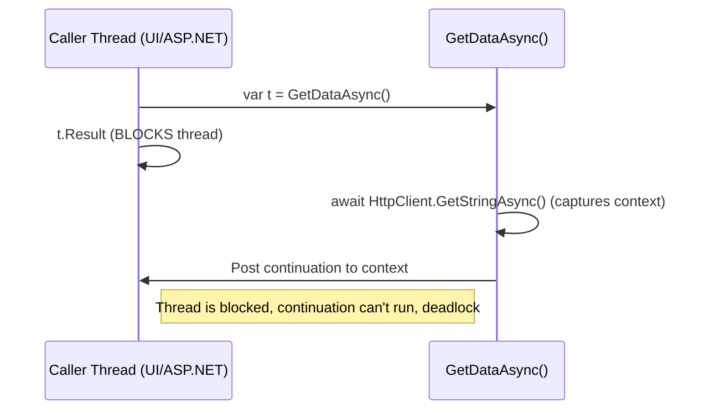
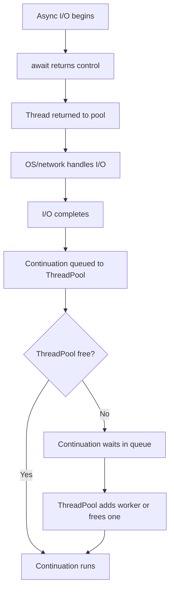
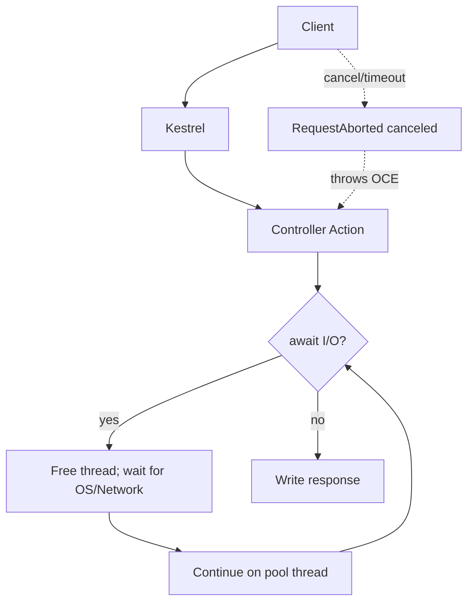

# Async, Await & Parallel Programming

A complete guide to asynchronous programming in C# / .NET 9 — from fundamentals through a deep dive on `ConfigureAwait`, return types, the ThreadPool, and the nuanced edge cases and pitfalls that trip people up in production.

---

## 1. What Asynchronous Programming Is

- Asynchronous programming lets a program perform other work while waiting for long-running operations (I/O, network calls, database queries) to complete — **without blocking the calling thread**.
- In C#, it is implemented with the `async` and `await` keywords (introduced in .NET Framework 4.5).
- This model is the **Task-based Asynchronous Pattern (TAP)** — the modern standard for async code in .NET.

> Async is **not** automatic parallelism. It's cooperation: "I'm waiting; let someone else use the thread."

### The Big Idea (in one minute)
- Async/await is about *not blocking a thread while you wait*.
- When your code does I/O (HTTP, DB, file), `await` lets the thread go do other work.
- When the I/O finishes, your method **continues** from where it left off.
- Servers can then handle **more concurrent requests** with the **same number of threads**.

---

## 2. Core Concepts

### Tasks
- A `Task` represents an operation that runs asynchronously and may return a value.
- `Task` → a void-returning async operation.
- `Task<T>` → an async operation that returns a value of type `T`.

### async and await
- `async` marks a method as asynchronous.
- `await` pauses execution until the awaited task completes, **without blocking the thread**.

```csharp
public async Task<string> GetDataAsync()
{
    HttpClient client = new HttpClient();
    string result = await client.GetStringAsync("https://api.example.com/data");
    return result;
}
```

Here the method is declared `async`, `await` suspends it until the HTTP request completes, and it returns `Task<string>` instead of `string`.

### How It Works Under the Hood
- When an async method hits an incomplete `await`, control returns to the caller and the method returns a `Task`.
- `await` does **not** create a thread; it registers a **continuation** to run later when the awaited task completes.
- When the awaited task completes, the method resumes from where it left off.
- **I/O-bound work** is handled by the OS (sockets, files, DB); no thread is held while waiting.
- **CPU-bound work** requires a thread (use `Task.Run` on client/UI apps; avoid on servers).
- This avoids thread blocking — essential for UI responsiveness and server scalability.

> Bottom line: `await` frees the thread during I/O, improving scalability. It does not create new threads by itself.

---

## 3. What Actually Happens With Threads (ASP.NET Core)

- ASP.NET Core uses a **thread pool** to run your code.
- When you hit `await` on an **I/O operation** (`HttpClient.GetAsync`, EF Core `ToListAsync`):
  1. Your method returns a `Task` to the caller.
  2. **No thread is held** during the wait; the OS/device does the I/O.
  3. When the I/O completes, the **continuation** (the rest of your method) runs on a thread-pool thread.
- In ASP.NET Core there is **no `SynchronizationContext`** to hop back to, so continuations can run on **any** pool thread.

---

## 4. Parallel Async Operations

Run multiple independent asynchronous tasks concurrently with `Task.WhenAll`:

```csharp
public async Task LoadMultipleDataAsync()
{
    var task1 = GetDataAsync("https://api.example.com/users");
    var task2 = GetDataAsync("https://api.example.com/orders");

    var results = await Task.WhenAll(task1, task2);
    Console.WriteLine($"Users: {results[0]}");
    Console.WriteLine($"Orders: {results[1]}");
}
```

Both tasks run concurrently, improving efficiency.

---

## 5. Cancellation (including `HttpContext.RequestAborted`)

- Every HTTP request in ASP.NET Core has a `CancellationToken`: **`HttpContext.RequestAborted`**.
- If the client disconnects or times out, this token is **canceled**.
- If your code accepts a `CancellationToken` and passes it to I/O calls, work **stops quickly** instead of wasting CPU/DB resources.

### Controller example

```csharp
[ApiController]
[Route("api/users")]
public sealed class UsersController : ControllerBase
{
    private readonly IUserService _svc;
    public UsersController(IUserService svc) => _svc = svc;

    // ASP.NET Core automatically binds this to HttpContext.RequestAborted
    [HttpGet("{id:int}")]
    public async Task<ActionResult<UserDto>> Get(int id, CancellationToken ct)
    {
        var dto = await _svc.GetUserAsync(id, ct);
        return dto is null ? NotFound() : Ok(dto);
    }
}
```

### Service example (propagate the token)

```csharp
public interface IUserService
{
    Task<UserDto?> GetUserAsync(int id, CancellationToken ct);
}

public sealed class UserService : IUserService
{
    private readonly AppDbContext _db;
    private readonly HttpClient _client;
    public UserService(AppDbContext db, IHttpClientFactory factory)
        => (_db, _client) = (db, factory.CreateClient("users-api"));

    public async Task<UserDto?> GetUserAsync(int id, CancellationToken ct)
    {
        var user = await _db.Users
            .Where(u => u.Id == id)
            .Select(u => new UserDto { Id = u.Id, Name = u.Name })
            .FirstOrDefaultAsync(ct); // pass ct to EF

        if (user is null) return null;

        var details = await _client.GetFromJsonAsync<UserDetails>($"users/{id}", ct); // pass ct to HTTP
        return new UserDto { Id = user.Id, Name = user.Name, Details = details };
    }
}
```

### Optional: friendly cancellation logging

```csharp
public sealed class CancellationLoggingMiddleware
{
    private readonly RequestDelegate _next;
    private readonly ILogger<CancellationLoggingMiddleware> _logger;
    public CancellationLoggingMiddleware(RequestDelegate next, ILogger<CancellationLoggingMiddleware> logger)
        => (_next, _logger) = (next, logger);

    public async Task Invoke(HttpContext ctx)
    {
        try
        {
            await _next(ctx);
        }
        catch (OperationCanceledException) when (ctx.RequestAborted.IsCancellationRequested)
        {
            _logger.LogInformation("Request canceled by client: {Path}", ctx.Request.Path);
        }
    }
}
```

Register: `app.UseMiddleware<CancellationLoggingMiddleware>();`

---

## 6. ConfigureAwait — When to Use

By default, `await` tries to resume on the **same context** it started:
- In a UI app (WPF/WinForms), that's the UI thread.
- In legacy ASP.NET, that's the request thread.
- In ASP.NET Core or console apps, there's no special context — continuations resume on the thread pool.

| Environment | SynchronizationContext? | Need `ConfigureAwait(false)`? |
|---|---|---|
| ASP.NET Core | No | Usually **no** — continuations already resume on the ThreadPool |
| UI (WPF/WinForms) / legacy ASP.NET | Yes | **Yes** in library code, to avoid deadlocks / unnecessary context switches |

```csharp
// Library code best practice
public async Task<byte[]> FetchAsync(HttpClient client, string url, CancellationToken ct)
{
    using var resp = await client.GetAsync(url, ct).ConfigureAwait(false);
    resp.EnsureSuccessStatusCode();
    return await resp.Content.ReadAsByteArrayAsync(ct).ConfigureAwait(false);
}
```

When you write `await SomethingAsync().ConfigureAwait(false);` you are saying: "Don't go back to the original thread/context — continue on any available thread." Your continuation no longer depends on the caller's environment, so even if the caller is blocking you avoid deadlocks.

**Myth busted:** `ConfigureAwait(false)` does **not** force a new thread — it only avoids posting the continuation back to the captured context.

---

## 7. Return Types

| Return Type | Use When | Notes |
|---|---|---|
| `Task` | Async method, no result | Most common |
| `Task<T>` | Async method returning a result | Most common |
| `ValueTask` / `ValueTask<T>` | Method often completes synchronously | Only await once; prefer `Task` unless performance-critical |
| `IAsyncEnumerable<T>` | Stream results asynchronously | Use `await foreach` |
| `async void` | Event handlers only | Never for general async code (exceptions can't be awaited/caught) |

`IActionResult` vs `Task<IActionResult>`: use the synchronous form for synchronous actions, the `Task` form for asynchronous controller actions.

---

## 8. Important Classes & Methods

### Task & Coordination
- `Task.WhenAll`, `Task.WhenAny`
- `Task.Delay`, `Task.Yield`, `Task.FromResult`
- `Task.WaitAsync(timeout, ct)` — add timeout/cancellation to any task (.NET 7+)
- `SemaphoreSlim.WaitAsync` / `Release`
- `Channel<T>` for producer-consumer patterns
- `IAsyncEnumerable<T>` with `await foreach`
- `CancellationToken` / `CancellationTokenSource`
- `IAsyncDisposable` with `await using`

### Context / Scheduling
- `SynchronizationContext`
- `TaskScheduler`
- `ThreadPool` (`SetMinThreads` to tune, but only after fixing blocking)

---

## 9. Exception Handling

| Concept | Meaning |
|---|---|
| `await` | Automatically rethrows exceptions from async methods on your current thread (at the await site) |
| `Task.Exception` | Holds the exception if a task fails |
| `TaskCompletionSource` | Lets you manually propagate exceptions between threads |
| `try`/`catch` | Works normally with async/await — just wrap your awaits |
| `async void` | Exceptions can't be awaited or caught properly — avoid it |

**Timing of exceptions:**
- **Before** the first `await`: the exception is captured on the returned `Task`.
- **After** an `await`: it is rethrown at the `await` site.

**Aggregating failures from many tasks:**
```csharp
var tasks = new[] { Task1(), Task2(), Task3() };

try
{
    await Task.WhenAll(tasks);
}
catch
{
    foreach (var t in tasks.Where(t => t.IsFaulted))
        Console.WriteLine(t.Exception?.InnerException?.Message);
}
```

**Propagating exceptions through layers (repo → service → controller):**
```csharp
// Repository Layer
public class UserRepository
{
    public async Task<User> GetUserFromDbAsync(int id)
    {
        // Simulating DB failure
        throw new Exception("Database connection failed");
    }
}

// Service Layer
public class UserService
{
    private readonly UserRepository _repo = new UserRepository();

    public async Task<User> GetUserAsync(int id)
    {
        var user = await _repo.GetUserFromDbAsync(id); // may throw
        return user;
    }
}

// Controller (or top layer)
public class UserController
{
    private readonly UserService _service = new UserService();

    public async Task GetUserControllerAsync()
    {
        try
        {
            var user = await _service.GetUserAsync(1);
            Console.WriteLine($"User: {user.Name}");
        }
        catch (Exception ex)
        {
            Console.WriteLine($"Handled in controller: {ex.Message}");
        }
    }
}
```

---

## 10. Resilience With `IHttpClientFactory` + Polly

**Why Polly?** Networks are unreliable. Polly gives you **retries (with backoff + random jitter)**, **per-try timeouts**, and a **circuit breaker** to fail fast when a dependency is unstable.

Install: `Microsoft.Extensions.Http.Polly`, `Polly`, `Polly.Extensions.Http`.

```csharp
using Polly;
using Polly.Extensions.Http;
using Polly.CircuitBreaker;

builder.Services.AddHttpClient("users-api", c =>
{
    c.BaseAddress = new Uri("https://downstream.svc/");
})
.AddPolicyHandler(PollyPolicies.Default());
```

```csharp
public static class PollyPolicies
{
    public static IAsyncPolicy<HttpResponseMessage> Default()
    {
        var jitter = new Random();

        var retry = HttpPolicyExtensions
            .HandleTransientHttpError()              // 5xx + HttpRequestException
            .OrResult(r => (int)r.StatusCode == 408) // Request Timeout
            .WaitAndRetryAsync(
                retryCount: 3,
                sleepDurationProvider: attempt =>
                    TimeSpan.FromMilliseconds(200 * Math.Pow(2, attempt)) +
                    TimeSpan.FromMilliseconds(jitter.Next(0, 100)));

        var timeout = Policy.TimeoutAsync<HttpResponseMessage>(TimeSpan.FromSeconds(2));

        var breaker = HttpPolicyExtensions
            .HandleTransientHttpError()
            .CircuitBreakerAsync(handledEventsAllowedBeforeBreaking: 5,
                                 durationOfBreak: TimeSpan.FromSeconds(30));

        // Order matters: outermost executes first, innermost last.
        // Typical: Breaker (outer) -> Retry -> Timeout (inner per-try)
        return Policy.WrapAsync(breaker, retry, timeout);
    }
}
```

> **Tip:** Prefer Polly per-try timeouts and keep `HttpClient.Timeout` high or unset to avoid conflicts.

---

## 11. Calling Synchronous Methods from Async Methods

You **can** call synchronous methods inside async methods:

- **Good use:** quick CPU-bound work (validation, mapping, calculations).
- **Risk:** blocking I/O (DB, HTTP, file) or heavy CPU work pins a thread → scalability/performance issues.

### Patterns
- **Server (ASP.NET Core):** prefer async I/O APIs. Avoid `Task.Run` for I/O. For CPU work, offload to background services/queues.
- **UI (WPF/WinForms):** use `await Task.Run(...)` to prevent UI freezing.

```csharp
// UI only, not server
await Task.Run(() => ComputeFractals(input), ct);
```

---

## 12. Async Without Await

If a method is marked `async` but has no `await`, the compiler warns **CS1998**.

- It runs **synchronously**.
- It returns a **completed** `Task`/`Task<T>`.
- Exceptions are stored in the Task and observed when awaited.

```csharp
public async Task<int> FooAsync() // CS1998
{
    return 42; // synchronous
}

// Better:
public Task<int> FooAsync() => Task.FromResult(42);
```

---

## 13. SynchronizationContext & Deadlocks

`SynchronizationContext` determines **where continuations run** after `await`.

- **UI apps (WPF/WinForms):** context = UI thread. Continuations resume there.
- **Legacy ASP.NET:** context = request thread. Blocking can deadlock.
- **ASP.NET Core:** no `SynchronizationContext`. Continuations resume on the thread pool.

### Classic Deadlock Example (UI / legacy ASP.NET)
```csharp
public string GetDataSync()
{
    return GetDataAsync().Result; // blocks UI/request thread
}

public async Task<string> GetDataAsync()
{
    var s = await client.GetStringAsync("..."); // captures context
    return s; // continuation needs the blocked thread -> deadlock
}
```

### Visual Deadlock Flow (UI / Legacy ASP.NET)


---

## 14. What Happens if the ThreadPool Is Busy?

- While awaiting I/O, **no thread is held**.
- When the I/O completes, the continuation is **queued** to the ThreadPool (or context).
- If the ThreadPool is **saturated**, the continuation **waits** in the queue until a thread frees up or the pool grows.
- This does not lose work — it delays execution.

### Symptoms of Starvation
- Slow response times
- Long queue of pending work items
- Low available ThreadPool threads

### Mitigations
- Eliminate blocking calls (`.Result`, `.Wait`).
- Avoid `Task.Run` for I/O.
- Limit fan-out concurrency (`SemaphoreSlim`).
- Tune ThreadPool minimum threads only after fixing root causes.

```csharp
ThreadPool.GetMinThreads(out var worker, out var io);
ThreadPool.SetMinThreads(Math.Max(worker, 200), io);
```

### Flowchart: Async Await & ThreadPool Saturation


---

## 15. Scenario Outcomes (Quick Reference)

| Scenario | Outcome | Fix |
|---|---|---|
| Sync I/O in async method | Thread blocked until I/O finishes | Use async I/O (`ReadAsync`, `ToListAsync`, …) |
| CPU work inside async | Pins a thread | Server: don't `Task.Run`; UI: wrap in `Task.Run` |
| Async without await | Runs synchronously | Prefer `Task.FromResult` / `ValueTask` |
| `async void` | Can't await; exceptions crash the process | Only for event handlers |
| Exceptions before first await | Captured on the Task | — |
| Exceptions after await | Rethrown at the await site | — |
| Fire-and-forget in requests | Work aborted on request end; exceptions lost | Use background queues |
| Mixed timeouts (`HttpClient.Timeout` vs Polly) | Conflicts / flaky behavior | Prefer Polly per-try timeouts |
| `ValueTask` misuse | Subtle bugs (only await once) | Use `Task` unless profiled |
| ThreadPool saturation | Continuations queued, then wait | See Section 14 |
| `lock` with `await` | Deadlocks | Use `SemaphoreSlim` |

---

## 16. Common Pitfalls (and Easy Fixes)

| Pitfall | Why it hurts | Easy fix |
|---|---|---|
| Blocking on async (`.Result`, `.Wait()`) | Ties up threads; can deadlock in legacy ASP.NET | "Async all the way"; always `await` |
| Forgetting `CancellationToken` | Wastes work if client goes away | Add `CancellationToken ct`; pass to all I/O |
| Fire-and-forget tasks | Lost errors; work may be aborted | Avoid; use a background queue / HostedService |
| Sharing `DbContext` concurrently | Not thread-safe; random errors | Keep per-request; no parallel EF ops on one context |
| `Task.Run` for I/O on server | Burns pool threads for no gain | Remove; only offload *CPU* to background workers |
| Conflicting timeouts | Flaky behavior | Use Polly per-try timeouts; keep `HttpClient.Timeout` high |
| Misusing `ValueTask` | Complexity; only await once | Prefer `Task` unless you've measured clear gains |
| `lock` across `await` | Deadlock risk | Use `SemaphoreSlim` |

---

## 17. Asynchronous Patterns (History)

| Pattern | Description | Status |
|---|---|---|
| TAP (Task-based Asynchronous Pattern) | Modern approach using `Task` and `async`/`await` | Preferred |
| APM (Asynchronous Programming Model) | Legacy model using `Begin`/`End` methods | Outdated |
| EAP (Event-based Asynchronous Pattern) | Uses events (e.g., `DownloadFileAsync`) | Legacy (WinForms/WPF) |

---

## 18. Pros & Cons of Async in Web APIs

### Pros
- **Higher throughput:** same hardware handles more concurrent requests.
- **Lower latency under load:** threads aren't blocked on I/O.
- **Responsive cancellations:** free up DB/HTTP work when clients disconnect.
- **Composability:** `await` reads like synchronous code.

### Cons
- **Complexity:** more moving parts (tokens, retries, timeouts).
- **Pitfalls:** blocking on async, misusing `DbContext`, fire-and-forget.
- **Observability needs:** you should log timeouts, retries, cancellations.
- **CPU-bound work:** async doesn't speed up CPU; you still need background workers/queues.

---

## 19. Handy Code Snippets

**Return cached result as Task**
```csharp
public Task<User> GetCachedAsync(string key)
    => _cache.TryGetValue(key, out var u)
       ? Task.FromResult(u)
       : FetchFromSourceAsync(key);
```

**Timeout any Task**
```csharp
await task.WaitAsync(TimeSpan.FromSeconds(2), ct);
```

**Concurrency throttle (limit fan-out)**
```csharp
var sem = new SemaphoreSlim(8);
var tasks = ids.Select(async id => {
    await sem.WaitAsync(ct);
    try { return await FetchAsync(id, ct); }
    finally { sem.Release(); }
});
var results = await Task.WhenAll(tasks);
```

**Program.cs (core pieces)**
```csharp
builder.Services.AddDbContext<AppDbContext>(...);
builder.Services.AddScoped<IUserService, UserService>();
builder.Services.AddHttpClient("users-api").AddPolicyHandler(PollyPolicies.Default());
app.UseMiddleware<CancellationLoggingMiddleware>();
```

---

## 20. Simple Request Flow



---

## 21. Best Practices & Decision Guide

- Use async I/O **end-to-end**; never mix with blocking calls (`.Result`, `.Wait()`).
- Avoid `async void` (except in event handlers); use `Task`/`Task<T>` for error handling and chaining.
- Use `ConfigureAwait(false)` in **library** code (not needed in ASP.NET Core app code).
- Return `Task`/`Task<T>` — prefer over `ValueTask` unless proven by profiling.
- Accept a `CancellationToken` on public APIs (from `HttpContext.RequestAborted`) and pass it to all I/O.
- Parallelize independent work with `Task.WhenAll`.
- Keep `DbContext` per request; never run parallel EF ops on one instance.
- Don't use `Task.Run` for I/O on the server.
- Use Polly for retries/timeouts with `HttpClient` (one shared `IHttpClientFactory`, never `new HttpClient()` per call).
- Treat `OperationCanceledException` as **info**, not an error.
- Use `SemaphoreSlim` instead of `lock` when awaiting; use it to throttle fan-out.
- Monitor ThreadPool queues for starvation; log/measure retries, timeouts, cancellations.

---

## 22. FAQ (super short)

- **Does `await` create new threads?** No. It frees the current thread during I/O.
- **Do I need `ConfigureAwait(false)` in ASP.NET Core?** Usually no — there's no UI sync context.
- **What about CPU-heavy work?** Use background workers/queues; async I/O won't speed up CPU.
- **Is one `HttpClient` per call okay?** No. Use `IHttpClientFactory` or a singleton `HttpClient`.

---

## 23. Quick Checklist

- [ ] Use async I/O end-to-end; no `.Result` / `.Wait()`.
- [ ] Don't use `async` without `await` (prefer `Task.FromResult` / `ValueTask`).
- [ ] Use `ConfigureAwait(false)` in libraries (not in ASP.NET Core app code).
- [ ] Return `Task`/`Task<T>`; prefer over `ValueTask` unless proven.
- [ ] Accept `CancellationToken` on public APIs and pass it down to all I/O.
- [ ] Avoid `async void`; avoid fire-and-forget in request scope.
- [ ] Use `IHttpClientFactory` + Polly (retry with jitter, per-try timeout, circuit breaker).
- [ ] Keep `DbContext` per request; avoid concurrent use.
- [ ] Don't use `Task.Run` for I/O on the server.
- [ ] Handle cancellations/timeouts; treat `OperationCanceledException` as info.
- [ ] Monitor the ThreadPool for saturation.
