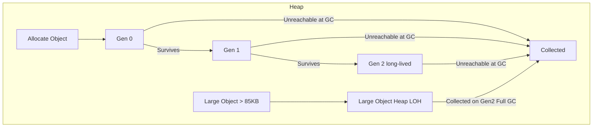
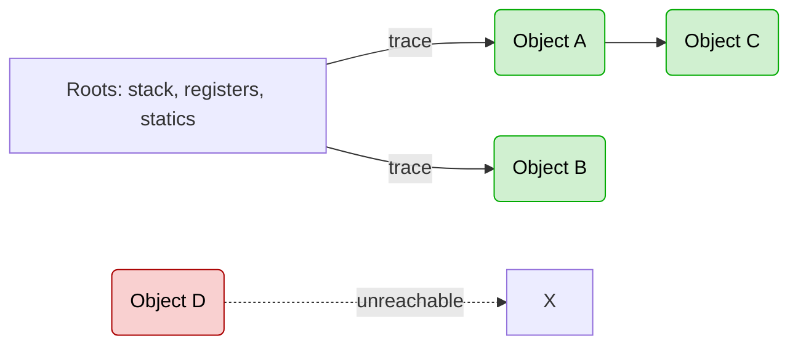

# Garbage Collection & Memory Management

A practical, developer-friendly reference for **how the .NET garbage collector works** and **how to work with it** in real apps (ASP.NET Core, services, CLIs) — covering generations, the Large Object Heap, GC modes, finalization, and the `IDisposable` / `using` / destructor cleanup patterns.

---

## 1. Overview

- .NET uses a **managed heap** and an **automatic, generational, compacting GC**.
- Objects created with `new` are stored on the **managed heap**.
- New objects start in **Gen 0**. Survivors are **promoted** to **Gen 1**, then **Gen 2**.
- **Large objects (> 85 KB)** go to the **Large Object Heap (LOH)**.
- The GC automatically detects and removes **unreachable objects** (no longer referenced), avoiding manual memory management (`free`/`delete` as in C/C++).
- It runs **automatically** based on **allocation pressure** and heuristics; you rarely need (or want) to call `GC.Collect()` yourself.

---

## 2. How GC Determines Lifetimes (Survival & Promotion)

The GC doesn't predict the future. It relies on **reachability** at collection time and **survival history**:

1. **Roots** (stack locals, CPU registers, static fields, GC handles) are scanned.
2. Anything **reachable** from roots is **alive** (survives).
3. Survivors are **promoted** to the next generation (Gen 0 → 1 → 2).
4. Unreachable objects are **collected**, memory is reclaimed, and the heap may be **compacted**.

### Flowchart — Allocation to Promotion


### Flowchart — Root Tracing & Collection


---

## 3. Generations

The GC uses a **generational model**:

- **Generation 0 (Gen 0)** → short-lived objects (local variables, temp data). Most frequent collections.
- **Generation 1 (Gen 1)** → medium-lived objects; acts as a buffer between Gen 0 and Gen 2.
- **Generation 2 (Gen 2)** → long-lived objects (static fields, caches). Full collections include Gen 2.

### Memory Layout Diagram
```text
+--------------------+--------------------+--------------------+
|   Generation 0     |   Generation 1     |   Generation 2     |
+--------------------+--------------------+--------------------+
         ^                    ^                    ^
    Short-lived          Medium-lived         Long-lived
```

| Area | What lives here | Collection frequency | Notes |
|---|---|---|---|
| **Gen 0** | New, short-lived objects | Very frequent | Cheap, fast collections |
| **Gen 1** | Survived Gen 0 | Moderate | Buffer between Gen 0 and 2 |
| **Gen 2** | Long-lived objects | Infrequent (Full GC) | Expensive; sweeps entire heap |
| **LOH** (> 85 KB) | Large arrays/buffers | During Full GC | Freed automatically; compaction is opt-in |

> **Rule of thumb:** Most objects die in **Gen 0**. Objects that survive multiple GCs are promoted and treated as long-lived.

---

## 4. Large Object Heap (LOH)

- Objects **> 85 KB** are stored in the **Large Object Heap**.
- Collected only during **Gen 2 (Full) collections**.
- Prone to **fragmentation** because compaction is rare (it is **opt-in** to avoid long pauses).

```text
+----------------------+
|   Large Object Heap  |
+----------------------+
```

### LOH Compaction (when you really need it)

If you've **diagnosed LOH fragmentation** (big arrays allocated/freed repeatedly), you can request a one-time compaction:

```csharp
using System.Runtime;

GCSettings.LargeObjectHeapCompactionMode = GCLargeObjectHeapCompactionMode.CompactOnce;
GC.Collect(); // forces a Full, blocking Gen2 GC now (do this off the hot path)
```

> Run from a **maintenance/background task**, not per-request. Use **sparingly**.

---

## 5. The GC Process: Mark → Sweep → Compact

1. **Mark:** Identify all **reachable/live objects** (from roots: locals, statics, registers, GC handles).
2. **Sweep:** Reclaim memory of unreferenced objects.
3. **Compact:** Move live objects together to reduce fragmentation (Small Object Heap is compacted; **LOH is only compacted on a Full GC when explicitly requested**).

```text
Before GC:     [Live][Dead][Live][Dead][Live]
After Sweep:   [Live]     [Live]     [Live]
After Compact: [Live][Live][Live]
```

The runtime **reserves contiguous segments** for the managed heap and commits memory as needed. Separate segments exist for the Small Object Heap (SOH) generations and the LOH.

---

## 6. GC Modes & Pauses

- **Workstation GC** → lower latency; optimized for desktop/interactive apps.
- **Server GC** → parallel, high-throughput; uses multiple threads/CPUs; default for ASP.NET Core on servers/containers.
- **Background (Concurrent) GC** → Gen 2 collections can run concurrently with user code (reduces pause time), but **LOH compaction** only occurs on a **blocking Gen 2** (Full GC).

Set in `.csproj`:
```xml
<PropertyGroup>
  <ServerGarbageCollection>true</ServerGarbageCollection>
</PropertyGroup>
```

---

## 7. Triggers: When Does GC Run?

- **Allocation pressure** — Gen 0 fills up → Gen 0 GC; escalation can trigger higher generations.
- **Low memory notifications** from the OS/host.
- **Manual** (`GC.Collect()`) — **avoid in production**.
- **LOH compaction requested** → will compact on the next **blocking Gen 2**.

### When (If Ever) to Call `GC.Collect()`
- **Diagnostics** in dev/test to measure live heap/leaks.
- **One-off LOH compaction** during a **maintenance window** (after you've proven fragmentation).
- **After a short, bursty background job** that allocates heavily and then the process will be **idle**.

> **Never** inside controllers/middleware or per-request logic in ASP.NET Core. Schedule from a `BackgroundService` if truly necessary.

---

## 8. Finalization

In .NET, **finalization** is how the GC cleans up **unmanaged resources** if they weren't explicitly released via `Dispose()`.

### What is Finalize?
- `Finalize` is a special method called by the GC **before reclaiming an object's memory**.
- In C#, you cannot override `Finalize()` directly. Instead you declare a **destructor (`~ClassName`)**, which the compiler translates into an override of `Object.Finalize()`.

```csharp
class MyClass
{
    // Destructor (C# syntax) -> compiled into Finalize()
    ~MyClass()
    {
        Console.WriteLine("Finalizer called!");
    }
}
```

### Lifecycle of Finalization
1. Object becomes **unreachable**.
2. GC checks if it has a finalizer.
3. If yes → object is moved to the **finalization queue**.
4. The finalizer (`Finalize`) is executed on a dedicated GC thread.
5. Memory is released in the **next GC cycle**.

> Objects with finalizers live longer (at least two GC cycles).

### Problems with Finalize
- **Non-deterministic:** you don't know when it will run.
- **Performance cost:** finalizable objects survive longer.
- **Complex:** should not touch managed objects (they may already be finalized).
- **Not guaranteed:** finalizers may never run if the process terminates abruptly.

### Best Practices
1. Prefer **`IDisposable` + `Dispose`** for deterministic cleanup.
2. Implement `Finalize` only as a **backup** for unmanaged resources.
3. If implementing both:
   - Call `Dispose()` from the finalizer if not already called.
   - Use `GC.SuppressFinalize(this)` in `Dispose()`.

---

## 9. `using` vs `IDisposable` vs `Dispose()` vs Destructor

### IDisposable Interface
An interface that contains a single method:
```csharp
public interface IDisposable
{
    void Dispose();
}
```
**Purpose:** a standard way to release **unmanaged resources** (file handles, DB connections, sockets). When a class implements `IDisposable`, it signals that explicit cleanup is required.

```csharp
public class FileManager : IDisposable
{
    private FileStream _stream;

    public FileManager(string path)
    {
        _stream = new FileStream(path, FileMode.Open);
    }

    public void Dispose()
    {
        _stream?.Dispose();
        Console.WriteLine("FileStream disposed.");
    }
}
```

### Dispose() Method
The method from `IDisposable` that actually **frees resources**. Call it manually or automatically via `using`. It releases unmanaged resources and can suppress finalization via `GC.SuppressFinalize(this)`.

```csharp
var file = new FileManager("test.txt");
file.Dispose(); // manual cleanup
```

### using Statement
A syntactic shortcut ensuring `Dispose()` is called automatically — it compiles into a `try-finally` block.

```csharp
using (var file = new FileManager("test.txt"))
{
    // use file
} // Dispose() is called here
```

Equivalent to:
```csharp
var file = new FileManager("test.txt");
try
{
    // use file
}
finally
{
    if (file != null)
        file.Dispose();
}
```

### Destructor (~Finalizer)
A special method (`~ClassName`) the GC calls before reclaiming memory. Acts as a **safety net** if `Dispose()` wasn't called. Downsides: non-deterministic (runs when GC decides) and adds overhead (the object survives at least two GC cycles).

```csharp
public class FileManager
{
    ~FileManager()
    {
        Console.WriteLine("Finalizer called (GC cleanup).");
    }
}
```

### Key Differences

| Feature | `IDisposable` | `Dispose()` | `using` | Destructor (`~`) |
|---|---|---|---|---|
| **What it is** | Interface contract | Method implementation | Syntax sugar (`try-finally`) | Special method (Finalizer) |
| **Purpose** | Define cleanup rule | Actual resource cleanup | Auto-call `Dispose()` | Cleanup by GC if needed |
| **When it runs** | Design-time (implements) | When called manually or via `using` | At end of `using` block | Non-deterministic (GC decides) |
| **For** | Managed + unmanaged | Managed + unmanaged | Mostly unmanaged | Unmanaged resources (backup) |
| **Control** | Developer | Developer | Compiler ensures call | CLR decides (not immediate) |

---

## 10. Full Dispose + Finalize Pattern

```csharp
using System;

public class ResourceHolder : IDisposable
{
    private bool _disposed = false;

    // Destructor -> compiles to Finalize()
    ~ResourceHolder()
    {
        Dispose(disposing: false);
    }

    public void Dispose()
    {
        Dispose(disposing: true);
        GC.SuppressFinalize(this); // Skip finalizer if already cleaned up
    }

    protected virtual void Dispose(bool disposing)
    {
        if (_disposed) return;

        // Always release unmanaged resources
        Console.WriteLine("Releasing unmanaged resources...");

        if (disposing)
        {
            // Release managed resources if needed
            Console.WriteLine("Releasing managed resources...");
        }

        _disposed = true;
    }
}
```

**Usage:**
```csharp
using (var obj = new ResourceHolder())
{
    Console.WriteLine("Using object...");
}
// Dispose() is called -> GC.SuppressFinalize prevents Finalize
```

**Modern sealed variant using `SafeHandle`:**
```csharp
public sealed class Foo : IDisposable
{
    private SafeHandle _handle = /* ... */;
    private bool _disposed;

    public void Dispose()
    {
        if (_disposed) return;
        _handle.Dispose();
        _disposed = true;
        GC.SuppressFinalize(this);
    }
}
```

---

## 11. Diagnostics & Tooling

- **dotnet-counters** — live GC/CPU counters.
- **dotnet-trace** / **dotnet-gcdump** — traces and GC dumps in production.
- **Visual Studio Profiler** — allocation and heap analysis.
- **PerfView** — advanced ETW-based analysis.

**What to watch:** allocated bytes/sec, Gen 0/1/2 collection counts, LOH size, pinned objects, fragmentation, working set, keyspace.

---

## 12. Advanced Levers (use with care)

- **`GC.TryStartNoGCRegion(totalSize)`** — temporarily prevents GC when you've **preallocated** enough memory for a short critical section; must call `EndNoGCRegion()`. Easy to misuse; rare in web apps.
- **Pinned objects** — use only when necessary (interop, fixed buffers); they hurt compaction.
- **Profile-Guided Optimization (PGO)** and **Tiered Compilation** — not GC features per se, but they reduce allocation hot paths via better JIT decisions.

---

## 13. Reducing Allocations

**Array pooling** — reuse large buffers instead of churning the LOH:
```csharp
using System.Buffers;

var pool = ArrayPool<byte>.Shared;
byte[] buffer = pool.Rent(1024 * 64);
try
{
    // use buffer
}
finally
{
    pool.Return(buffer, clearArray: true);
}
```

**Background LOH maintenance (rare):**
```csharp
public sealed class LohMaintenanceService : BackgroundService
{
    protected override async Task ExecuteAsync(CancellationToken ct)
    {
        while (!ct.IsCancellationRequested)
        {
            await Task.Delay(TimeSpan.FromDays(1), ct);
            if (ShouldCompactLoh())
            {
                System.Runtime.GCSettings.LargeObjectHeapCompactionMode =
                    System.Runtime.GCLargeObjectHeapCompactionMode.CompactOnce;
                GC.Collect();
            }
        }
    }
    bool ShouldCompactLoh() => /* evidence-based condition */ false;
}
```

---

## 14. Best Practices (Do's & Don'ts)

**Do**
- Prefer **Server GC** for web/services.
- Keep allocations small and short-lived; let Gen 0 do the work.
- Use `IDisposable` + `using` for **unmanaged resources** (files, sockets, DB).
- Reuse large buffers with **`ArrayPool<T>`**; consider object pooling.
- Release references ASAP (avoid long-lived statics that hold big graphs).
- Consider **`Span<T>` / `Memory<T>`** to reduce allocations.
- Use **`SafeHandle`** or managed wrappers for unmanaged resources.

**Don't**
- Don't call `GC.Collect()` on request paths or frequently.
- Don't allocate **> 85 KB** repeatedly if you can reuse (LOH churn).
- Don't pin memory unnecessarily (hurts compaction).
- Don't rely on finalizers for timely cleanup — **dispose deterministically**.

---

## 15. Summary

- GC is **automatic**, **generational**, and **compacting**.
- It uses **generations (0, 1, 2)** plus a special **Large Object Heap** for big allocations (> 85 KB).
- **Survival** is determined by **root reachability** at collection time; survivors are promoted.
- Collection runs in **Mark → Sweep → Compact** phases.
- **Gen 2** and **LOH** are handled during **Full GC**; **LOH compaction is opt-in**.
- Supports **finalization** (the destructor `~ClassName`) and the **`IDisposable` / `using`** patterns — prefer deterministic `Dispose` over finalizers, and pair both with `GC.SuppressFinalize`.
- Focus on **reducing allocations**, **disposing unmanaged resources**, and **profiling with data** before touching GC knobs.
