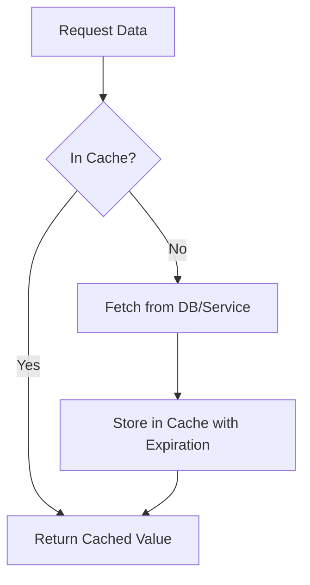
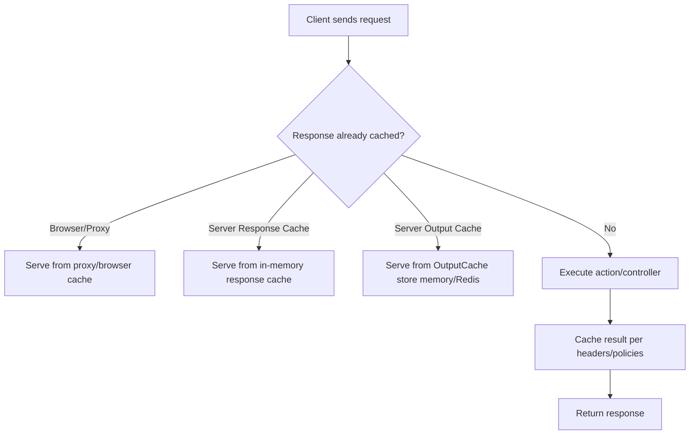

# Caching in .NET

A deep dive into caching strategies in .NET and ASP.NET Core — **in-memory**, **distributed (Redis)**, **response caching**, and **output caching** — with code samples, expiration strategies, stampede mitigation, and a clear comparison of response vs output caching.

---

## 1. Why Caching?

Caching = storing data closer to where it's consumed.

- Improves performance.
- Reduces expensive I/O (DB, network).
- Improves scalability.
- Needs careful **invalidation** and **memory management**.

---

## 2. Types of Caching in .NET

### A) In-Memory Caching

Stores data in the app's own process memory.

- API: `IMemoryCache`
- Great for single-instance apps.
- Data is lost on app restart.

```csharp
// Register
builder.Services.AddMemoryCache();

// Use
public class UserService
{
    private readonly IMemoryCache _cache;
    public UserService(IMemoryCache cache) => _cache = cache;

    public User GetUser(int id)
    {
        return _cache.GetOrCreate($"user:{id}", entry =>
        {
            entry.AbsoluteExpirationRelativeToNow = TimeSpan.FromMinutes(5);
            return LoadUserFromDb(id);
        });
    }
}
```

### B) Distributed Caching

Stores cache data in external systems (Redis, SQL Server, NCache).

- API: `IDistributedCache`
- Useful for load-balanced, multi-server apps.

```csharp
// Register (Redis)
builder.Services.AddStackExchangeRedisCache(options =>
{
    options.Configuration = "localhost:6379";
    options.InstanceName = "SampleApp:";
});

// Use
public class ProductService
{
    private readonly IDistributedCache _cache;
    public ProductService(IDistributedCache cache) => _cache = cache;

    public async Task<Product?> GetProductAsync(int id)
    {
        var key = $"product:{id}";
        var cached = await _cache.GetStringAsync(key);
        if (cached is not null) return JsonSerializer.Deserialize<Product>(cached);

        var product = await LoadFromDbAsync(id);
        await _cache.SetStringAsync(key, JsonSerializer.Serialize(product),
            new DistributedCacheEntryOptions
            {
                AbsoluteExpirationRelativeToNow = TimeSpan.FromMinutes(10)
            });
        return product;
    }
}
```

### C) Response Caching (HTTP)

Caches responses at the HTTP layer, controlled with headers.

```csharp
builder.Services.AddResponseCaching();

var app = builder.Build();
app.UseResponseCaching();

[HttpGet]
[ResponseCache(Duration = 60, Location = ResponseCacheLocation.Any)]
public ActionResult<string> Get() => DateTime.Now.ToString();
```

### D) Output Caching (ASP.NET Core 7+)

Caches **action results** inside the ASP.NET Core pipeline, with rich policies.

```csharp
builder.Services.AddOutputCache();

var app = builder.Build();
app.UseOutputCache();

app.MapGet("/time", () => DateTime.Now.ToString())
   .CacheOutput(p => p.Expire(TimeSpan.FromSeconds(30))
                     .Tag("time-tag"));
```

### E) EF Second-Level Cache

Use libraries like `EFCoreSecondLevelCacheInterceptor` to cache EF Core query results.

### Comparison of Cache Types

| Type | API | Scope | Best For |
|---|---|---|---|
| In-Memory | `IMemoryCache` | Local process | Single-server apps |
| Distributed | `IDistributedCache` | Shared external | Multi-server apps |
| Response Caching | Middleware | HTTP responses | Simple GETs |
| Output Caching | Middleware (.NET 7+) | ASP.NET Core | Flexible per-action |
| EF 2nd-level | 3rd-party lib | ORM layer | DB-heavy apps |

---

## 3. Cache Expiration Strategies

- **Absolute Expiration** → fixed duration.
- **Sliding Expiration** → resets if accessed.
- **Size-based eviction** → under memory pressure.
- **Manual invalidation** → remove explicitly.
- **Tags/keys** → group invalidation.

---

## 4. Cache Lookup Flow



---

## 5. Redis Caching in Depth

**Redis** is the go-to distributed cache for .NET. This section covers wiring it up, applying absolute/sliding expiration correctly, avoiding stampedes, and measuring effectiveness — using both `IDistributedCache` and StackExchange.Redis.

### 5.1) When to Use Redis
- **Multi-instance / load-balanced** apps need a **shared cache** → Redis is ideal.
- Use for **expensive, read-heavy** data (computed results, reference data, rendered fragments).
- Avoid for **secrets** or **strong consistency** needs — a cache is an optimization; always keep a source of truth.

### 5.2) Wiring Redis with `IDistributedCache`

`IDistributedCache` provides a framework-level abstraction.

```csharp
// Program.cs
builder.Services.AddStackExchangeRedisCache(options =>
{
    options.Configuration = builder.Configuration.GetConnectionString("Redis"); // e.g. "localhost:6379"
    options.InstanceName = "MyApp:"; // optional key prefix/namespace
});
```

**Cache-aside usage with JSON:**
```csharp
using System.Text.Json;
using Microsoft.Extensions.Caching.Distributed;

public sealed class ProductService
{
    private readonly IDistributedCache _cache;
    private readonly IProductRepository _repo;

    public ProductService(IDistributedCache cache, IProductRepository repo)
        => (_cache, _repo) = (cache, repo);

    public async Task<Product?> GetProductAsync(int id, CancellationToken ct)
    {
        var key = $"product:{id}";
        var cached = await _cache.GetStringAsync(key, ct);
        if (cached is not null)
            return JsonSerializer.Deserialize<Product>(cached);

        var product = await _repo.LoadAsync(id, ct);
        if (product is null) return null;

        var json = JsonSerializer.Serialize(product);

        // Absolute expiration preferred for cross-instance consistency
        var opts = new DistributedCacheEntryOptions
        {
            AbsoluteExpirationRelativeToNow = TimeSpan.FromMinutes(10),
            // Or use SlidingExpiration (see 5.4)
            // SlidingExpiration = TimeSpan.FromMinutes(5)
        };

        await _cache.SetStringAsync(key, json, opts, ct);
        return product;
    }

    public Task InvalidateProductAsync(int id, CancellationToken ct)
        => _cache.RemoveAsync($"product:{id}", ct);
}
```

> **Note:** `IDistributedCache.Get*` **refreshes sliding expiration** automatically when `SlidingExpiration` is used. You can also call `RefreshAsync` explicitly.

### 5.3) Using StackExchange.Redis Directly (advanced scenarios)

For fine control (data structures, Lua, pub/sub), use the lower-level client.

```csharp
using StackExchange.Redis;
using System.Text.Json;

public static class RedisModule
{
    public static IServiceCollection AddRedis(this IServiceCollection services, string conn)
    {
        var muxer = ConnectionMultiplexer.Connect(conn);
        services.AddSingleton<IConnectionMultiplexer>(muxer);
        services.AddSingleton(sp => sp.GetRequiredService<IConnectionMultiplexer>().GetDatabase());
        return services;
    }
}
```

```csharp
public sealed class CatalogCache
{
    private readonly IDatabase _db;
    public CatalogCache(IDatabase db) => _db = db;

    public async Task SetAsync<T>(string key, T value, TimeSpan? ttl = null)
    {
        var payload = JsonSerializer.Serialize(value);
        await _db.StringSetAsync(key, payload, ttl);
    }

    public async Task<T?> GetAsync<T>(string key)
    {
        var val = await _db.StringGetAsync(key);
        return val.HasValue ? JsonSerializer.Deserialize<T>(val!) : default;
    }

    public Task RemoveAsync(string key) => _db.KeyDeleteAsync(key);
}
```

**Sliding expiration with Redis (manual):** Redis **does not** natively slide TTL on read; you must **reset TTL** when you read:
```csharp
public async Task<T?> GetSlidingAsync<T>(string key, TimeSpan slideBy)
{
    var tran = _db.CreateTransaction();
    var getTask = tran.StringGetAsync(key);
    // Only extend TTL if key exists after GET
    _ = tran.KeyExpireAsync(key, slideBy, CommandFlags.FireAndForget);
    var committed = await tran.ExecuteAsync();
    var val = await getTask;
    return val.HasValue ? JsonSerializer.Deserialize<T>(val!) : default;
}
```

### 5.4) Expiration Models — What's the Difference?

| Expiration | Where configured | Behavior | Notes |
|---|---|---|---|
| **Absolute** | `DistributedCacheEntryOptions.AbsoluteExpiration` / `...RelativeToNow`; Redis `EX` | Key expires at a fixed time/TTL regardless of access | **Most predictable** across instances; recommended default |
| **Sliding** | `DistributedCacheEntryOptions.SlidingExpiration`; custom with Redis | TTL **resets on access** | Good for hot items; risk of keys living forever — add a cap |
| **No expiration** | Avoid | Keys stay until evicted/removed | Risk of unbounded growth |
| **Size/Memory eviction** | Redis server policy | Redis evicts under pressure (LRU, LFU) | Set `maxmemory` and policy carefully; last-resort eviction |

**Best practice:** if using sliding, **combine** with an **absolute cap** ("sliding with absolute max") so items don't survive indefinitely.

```csharp
var opts = new DistributedCacheEntryOptions
{
    SlidingExpiration = TimeSpan.FromMinutes(10),
    AbsoluteExpirationRelativeToNow = TimeSpan.FromHours(1) // hard cap
};
```

### 5.5) Avoiding Cache Stampedes (thundering herds)

**Problem:** Many concurrent misses trigger simultaneous expensive recomputation.

**1) Single-flight (mutex) in-process:**
```csharp
private static readonly SemaphoreSlim _mutex = new(1, 1);

public async Task<Product?> GetProductSafeAsync(int id, CancellationToken ct)
{
    var key = $"product:{id}";
    var cached = await _cache.GetStringAsync(key, ct);
    if (cached is not null) return JsonSerializer.Deserialize<Product>(cached);

    await _mutex.WaitAsync(ct);
    try
    {
        // Double-check after entering the lock
        cached = await _cache.GetStringAsync(key, ct);
        if (cached is not null) return JsonSerializer.Deserialize<Product>(cached);

        var product = await _repo.LoadAsync(id, ct);
        if (product is null) return null;
        await _cache.SetStringAsync(key, JsonSerializer.Serialize(product),
            new DistributedCacheEntryOptions { AbsoluteExpirationRelativeToNow = TimeSpan.FromMinutes(10) });
        return product;
    }
    finally { _mutex.Release(); }
}
```

**2) Jittered TTLs** to avoid synchronized expiry:
```csharp
var baseTtl = TimeSpan.FromMinutes(10);
var jitter = TimeSpan.FromSeconds(Random.Shared.Next(0, 60));
await _cache.SetStringAsync(key, json, new DistributedCacheEntryOptions
{
    AbsoluteExpirationRelativeToNow = baseTtl + jitter
});
```

**3) Refresh-ahead (background):** refresh popular keys **before** they expire (via a `HostedService`) to keep hit ratio high.

**4) Distributed lock (advanced):** use a library (e.g., Redlock) when you must coordinate **across instances**. Prefer single-flight + short TTL + jitter first.

### 5.6) Key Design & Namespacing

- Use stable, clear keys: `entity:{type}:{id}`, e.g., `product:42`.
- For query results: normalized, sorted keys, e.g., `search:category=shoes&color=red&page=1`.
- For bulk invalidation, **prefix** or **tag** keys and publish invalidations (e.g., keep a set `tag:product:42` of keys to purge).

### 5.7) Measuring Effectiveness

- Track **hit ratio** = hits / (hits + misses). Aim for > 0.8 on hot paths.
- Monitor **tail latency**; stampedes show up as spikes near expiry.
- Watch Redis metrics: CPU, memory used, eviction count, keyspace hits/misses.
- Add **tracing** around cache get/set/refresh to see impact.

### 5.8) End-to-End Example

```csharp
public sealed class CachedCatalogService
{
    private readonly IDistributedCache _cache;
    private readonly CatalogRepository _repo;

    public CachedCatalogService(IDistributedCache cache, CatalogRepository repo)
        => (_cache, _repo) = (cache, repo);

    public async Task<CatalogItem?> GetAsync(int id, CancellationToken ct)
    {
        var key = $"catalog:item:{id}";
        var hit = await _cache.GetStringAsync(key, ct);
        if (hit is not null) return JsonSerializer.Deserialize<CatalogItem>(hit);

        // cache miss
        var item = await _repo.GetAsync(id, ct);
        if (item is null) return null;

        var json = JsonSerializer.Serialize(item);
        var ttl = TimeSpan.FromMinutes(15) + TimeSpan.FromSeconds(Random.Shared.Next(0, 60));
        await _cache.SetStringAsync(key, json, new DistributedCacheEntryOptions
        {
            AbsoluteExpirationRelativeToNow = ttl
        }, ct);

        return item;
    }

    public Task InvalidateAsync(int id, CancellationToken ct)
        => _cache.RemoveAsync($"catalog:item:{id}", ct);
}
```

---

## 6. Response Caching vs Output Caching

These two are easily confused. Both reduce work, but they operate at different layers.

### 6.1) Response Caching (HTTP)

- Enables/controls **HTTP caching** using standard headers: `Cache-Control`, `Expires`, `Vary`, `ETag`, `Last-Modified`.
- Works with **browsers**, **CDNs**, **reverse proxies** (CloudFront, Azure Front Door, NGINX).
- Middleware can also keep a small **in-process cache** of responses.

**Limitations:**
- Server storage: in-memory only (per instance).
- Not pluggable: cannot use Redis / `IDistributedCache`.
- Best used to leverage **client/proxy caching**.

```csharp
builder.Services.AddResponseCaching();

var app = builder.Build();
app.UseResponseCaching();

[HttpGet]
[ResponseCache(Duration = 60, Location = ResponseCacheLocation.Any, VaryByHeader = "Accept-Encoding")]
public IActionResult Get() => Ok(DateTime.Now);
```

### 6.2) Output Caching (ASP.NET Core 7+)

- **Server-side response memoization**: captures action results and replays them.
- Rich policies: **vary-by-query**, **vary-by-header**, **tagging**, **programmatic invalidation**.
- **More powerful than Response Caching.**

**Storage:**
- Default: in-memory (per instance).
- Pluggable: replace `IOutputCacheStore` to back it with **Redis** or another distributed cache → shared cache across servers.

```csharp
builder.Services.AddOutputCache();

var app = builder.Build();
app.UseOutputCache();

app.MapGet("/products", () => new[] { "A", "B" })
   .CacheOutput(p => p.Expire(TimeSpan.FromMinutes(5))
                      .SetVaryByQuery("category", "page", "pageSize")
                      .Tag("products-list"));
```

**Output Caching backed by Redis (shared across instances):**
```csharp
builder.Services.AddOutputCache();
builder.Services.AddSingleton<IOutputCacheStore>(sp =>
    new RedisOutputCacheStore(/* inject IConnectionMultiplexer, db index, key prefix, serializer */));

var app = builder.Build();
app.UseOutputCache();

app.MapGet("/products", () => GetProducts())
   .CacheOutput(p => p.Expire(TimeSpan.FromMinutes(5))
                      .SetVaryByQuery("category", "page")
                      .Tag("products-list"));
```

> Implement `IOutputCacheStore` with `GetAsync`, `SetAsync`, `EvictByTagAsync` using Redis keys and TTLs (or use a community package).

### 6.3) Key Differences

| Aspect | Response Caching (HTTP) | Output Caching |
|---|---|---|
| Goal | Guide browsers/CDNs/proxies with headers | Cache responses server-side with policies |
| Driven by | HTTP headers (`Cache-Control`, `ETag`) | `OutputCachePolicy` / attributes |
| Scope | Mainly GET/HEAD | Usually GET/HEAD, but flexible |
| Storage | In-memory only (per instance) | In-memory by default; can use Redis/other stores |
| Multi-server | Each server caches separately | Can share via distributed store |
| Invalidation | Expiry headers, revalidation (`304`) | Tag/key-based, programmatic purge |
| Revalidation | Supports `304 Not Modified` | Full cached body (no built-in `304`) |
| Use case | Leverage browser/CDN cache | Reduce server load, multi-instance scaling |

### 6.4) Which Cache Handles It?



### 6.5) Practical Guidance

- **Response Caching** → use to leverage **client & CDN caching** via HTTP headers.
- **Output Caching** → use for **server-side caching** with fine-grained control and invalidation.
- **Combine them:** Output Caching for server-load reduction + Response Caching headers for browser/CDN efficiency.
- For **multi-server** environments → Output Caching + Redis store.

---

## 7. Best Practices

- Use **IMemoryCache** for local caches.
- Use **Redis / `IDistributedCache`** for multi-instance apps.
- Always set **expiration policies**; prefer **absolute TTL** (with an optional sliding cap).
- Add **jitter** to TTLs; prevent stampedes with single-flight / refresh-ahead.
- Cache only **expensive results**; limit value sizes and compress large payloads if bandwidth matters.
- Use consistent, namespaced **cache keys** and a clear invalidation strategy on writes.
- Use `System.Text.Json` for fast serialization.
- Monitor **cache hit ratio**, latency, and Redis memory/evictions.
- Never cache secrets; never treat the cache as the source of truth.

---

## 8. Pitfalls

- **Stale data** if invalidation is missed.
- **Over-caching** → memory pressure.
- **Cache stampede** (many misses at once) → use locking / async factory / jitter.
- **Distributed cache latency** may offset benefits.
- **Unbounded collections** cached without paging.
- Don't rely on cache for **critical correctness**.

---

## 9. Quick Checklist

- [ ] Pick the correct cache type (memory vs distributed).
- [ ] Add Redis via `AddStackExchangeRedisCache` (or `StackExchange.Redis` directly) for multi-instance.
- [ ] Choose **absolute TTL**; consider sliding + cap for hot items.
- [ ] Add **jitter**; prevent stampedes with single-flight / refresh-ahead.
- [ ] Define a **key scheme** & invalidation on writes.
- [ ] Avoid caching sensitive data.
- [ ] Monitor hit ratio, latency, Redis memory/evictions.
