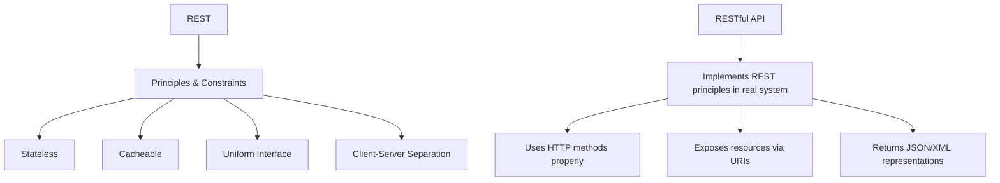
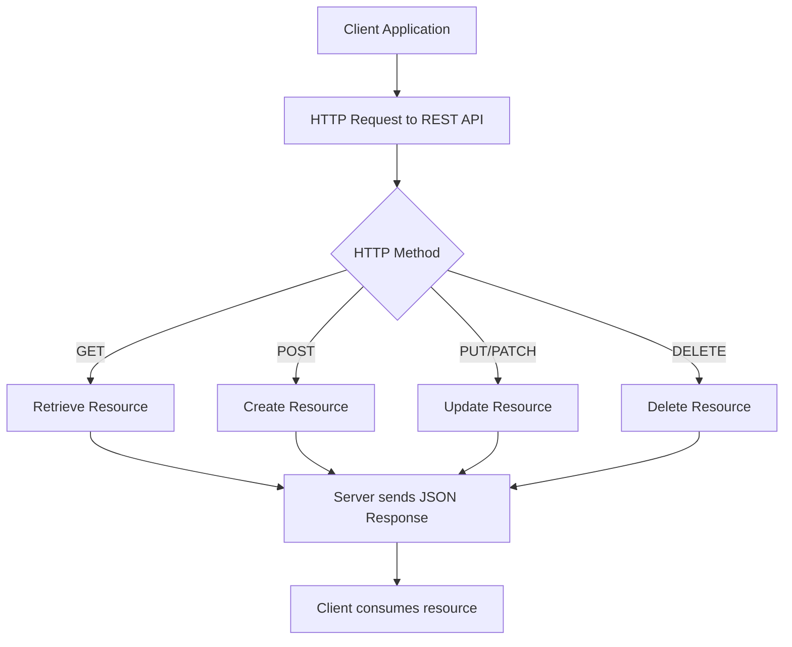
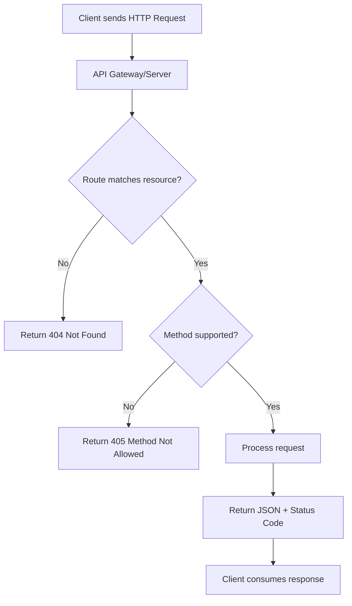
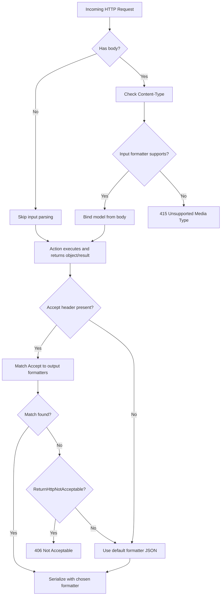

# REST & Content Negotiation

A consolidated reference covering **REST as an architectural style**, the distinction between **REST and a RESTful API**, **controller action return types**, **REST best practices**, and **content negotiation** (request vs response) in ASP.NET Core / .NET 9.

> Note: broader API guidance (versioning, validation, error handling, middleware, etc.) lives in **14-web-api-best-practices.md**.

---

## 1. What is REST?

**REST (Representational State Transfer)** is an **architectural style** for building distributed systems, especially web APIs. It was defined by Roy Fielding in his 2000 dissertation — it is **not a protocol or standard**, but a set of *constraints* and *principles*.

- Uses **HTTP** as the communication protocol.
- Exposes **resources** (data entities like `users`, `orders`) identified by **URIs**.
- Uses **stateless** interactions: each request contains all info needed (no server session state).
- Supports multiple formats (JSON, XML, plain text), but JSON is most common today.
- HTTP verbs map to actions:
  - `GET` → read
  - `POST` → create
  - `PUT`/`PATCH` → update
  - `DELETE` → remove

### REST Constraints
- Client–server separation
- Stateless interactions (no server session state)
- Cacheable responses
- Uniform interface (resources via URIs, standard HTTP verbs)
- Layered system (client doesn't care about intermediaries)
- *Optional:* Code-on-demand

### Why REST is Useful
- **Simplicity:** built directly on HTTP; no extra layers required.
- **Scalability:** statelessness allows easy scaling across servers.
- **Flexibility:** works with many formats (JSON, XML, HTML).
- **Interoperability:** any client that can speak HTTP can consume REST APIs.
- **Performance:** can leverage HTTP features like caching and compression.

Typical use cases: mobile & web apps consuming backend APIs, microservices communication, public APIs (Twitter, GitHub, Google Maps).

---

## 2. REST vs RESTful API

- **REST** is the *theory* — the blueprint, rules, and philosophy (architectural style).
- **RESTful API** is the *practice* — a real API that implements REST principles using HTTP.

### Analogy
- **REST:** the blueprint (rules of architecture).
- **RESTful API:** the house you build following the blueprint (implementation).

### A RESTful API in Practice
- Exposes **resources** (`/users/123`, `/orders/567`).
- Uses **HTTP verbs** properly (`GET`, `POST`, `PUT`/`PATCH`, `DELETE`).
- Returns resource representations (commonly JSON).
- Is **stateless** (all info is in each request).
- Supports **caching** via HTTP headers.

### Key Differences

| Aspect | REST | RESTful API |
|---|---|---|
| Type | Architectural style (theory) | Practical API implementation (practice) |
| Defined by | Roy Fielding's dissertation (2000) | Developers building APIs |
| Scope | Principles & constraints | Real-world API that follows REST |
| Example | Rules: stateless, cacheable, uniform interface | `/api/users/1` with GET, POST, PUT, DELETE |

> You can build an API that is "partially RESTful" if not all constraints are applied. In common usage, "REST API" and "RESTful API" are used interchangeably, but technically REST → architecture and RESTful API → implementation.

### Relationship Diagram


---

## 3. REST vs Traditional Web Services (SOAP)

A **Web Service** is any service accessible over the web using standard protocols — REST is one type, SOAP is another.

### SOAP (Simple Object Access Protocol)
- Protocol-based, uses **XML** for request/response.
- Requires **WSDL** to describe operations.
- Strict standards for security (WS-Security), transactions, etc.
- More heavyweight compared to REST.

### RESTful Web Services
- Resource-oriented, uses standard HTTP verbs.
- Typically use **JSON** for lightweight data exchange.
- Easier for public APIs and modern systems.

| Feature | REST | SOAP / Traditional Web Services |
|---|---|---|
| Protocol | Uses HTTP directly | Uses HTTP, SMTP, etc., with XML-based SOAP |
| Data Format | JSON, XML, text, HTML | XML only |
| Complexity | Simple, lightweight | Heavy, strict standards |
| Scalability | Stateless, easy to scale | Often stateful |
| Use case | Web & mobile APIs, microservices | Enterprise apps needing strict contracts/security |
| Performance | Faster (less overhead) | Slower (XML parsing, envelope overhead) |

Choose REST for most modern APIs; choose SOAP for enterprise needs requiring strict contracts, advanced security, or legacy integration.

### RESTful Request Lifecycle


---

## 4. Controller Action Return Types

### IActionResult
- **Type:** interface.
- Represents the contract for an action result in ASP.NET Core.
- Any class implementing `IActionResult` can be returned from a controller action (`OkResult`, `NotFoundResult`, `BadRequestResult`, etc.).
- Used when your action can return different result types depending on conditions.

```csharp
[HttpGet("{id}")]
public IActionResult GetItem(int id)
{
    var item = _repository.Get(id);

    if (item == null)
        return NotFound();  // returns 404

    return Ok(item);        // returns 200 + JSON object
}
```

### ActionResult\<T>
- **Type:** generic class (introduced in ASP.NET Core 2.1) to improve Web API return-type clarity.
- Combines the flexibility of `IActionResult` with the strong typing of `T`.
- Lets you return either a specific type `T` (your model/DTO) **or** an `IActionResult` (like `NotFound()` or `BadRequest()`).

```csharp
[HttpGet("welcome")]
public ActionResult<string> Welcome()
{
    return "Hello, welcome to the API!";
}

[HttpGet("products")]
public ActionResult<List<Product>> GetProducts()
{
    var products = new List<Product>
    {
        new Product { Id = 1, Name = "Laptop" },
        new Product { Id = 2, Name = "Phone" }
    };

    return products;
}
```

### Synchronous vs Asynchronous
- `IActionResult` → used for **synchronous** controller actions.
- `Task<IActionResult>` (or `Task<ActionResult<T>>`) → used for **asynchronous** controller actions.

---

## 5. REST API Best Practices

### 5.1) Resource Design
- Use **nouns, not verbs**: `/users` instead of `/getUsers`.
- Use **plural** for collections: `/users/123`.
- Use **hierarchical** resources when related: `/users/123/orders/456`.

### 5.2) HTTP Methods
- `GET` → retrieve resource (safe, idempotent).
- `POST` → create new resource.
- `PUT` → full update.
- `PATCH` → partial update.
- `DELETE` → remove resource.

Stick to standard semantics.

### 5.3) Status Codes

| Code | Meaning |
|---|---|
| `200 OK` | Success with body |
| `201 Created` | New resource created |
| `204 No Content` | Success, no body |
| `400 Bad Request` | Client error |
| `401 Unauthorized` | Authentication needed |
| `403 Forbidden` | Not allowed |
| `404 Not Found` | Resource missing |
| `405 Method Not Allowed` | Verb not supported for resource |
| `406 Not Acceptable` | No representation matches `Accept` |
| `409 Conflict` | Duplicate/resource conflict |
| `415 Unsupported Media Type` | Request body format not supported |
| `500 Internal Server Error` | Server failure |

### 5.4) Naming & Versioning
- Use **lowercase + hyphens**: `/user-profiles/`.
- Version in URL or header: `/api/v1/users`.

### 5.5) Data Formats
- Default to **JSON**.
- Respect `Content-Type` and `Accept` headers (see Section 6).
- Return structured error responses:

```json
{
  "error": "ValidationError",
  "message": "Email is invalid",
  "field": "email"
}
```

### 5.6) Pagination, Filtering, Sorting
- Pagination: `/users?page=2&limit=20`
- Filtering: `/users?role=admin`
- Sorting: `/users?sort=name,-createdAt`

### 5.7) HATEOAS (optional but powerful)
Add links to related actions:
```json
{
  "id": 123,
  "name": "Alice",
  "links": [
    { "rel": "self", "href": "/users/123" },
    { "rel": "orders", "href": "/users/123/orders" }
  ]
}
```

### 5.8) Security
- Use **HTTPS everywhere**.
- Authentication & authorization: OAuth2, JWT, API keys.
- Don't put sensitive data in URL query params.

### 5.9) Caching
- Use HTTP caching headers: `ETag`, `Last-Modified`, `Cache-Control`.
- Example: `Cache-Control: max-age=3600, must-revalidate`.

### 5.10) Idempotency
- `PUT` and `DELETE` must be idempotent.
- `POST` is not idempotent, but can use idempotency keys.

### 5.11) Rate Limiting & Throttling
- Protect APIs with rate limits.
- Return headers: `X-RateLimit-Limit`, `X-RateLimit-Remaining`.

### 5.12) Documentation & Discoverability
- Use **OpenAPI/Swagger**.
- Provide request/response examples.
- Version documentation alongside the API.

### REST API Request Lifecycle


---

## 6. Content Negotiation in ASP.NET Core

Content negotiation (conneg) selects the best **representation** of a resource. The key insight: the **request side declares** its body format, while the **response side negotiates** the output format — only the latter is "content negotiation" in the strict sense.

### 6.1) TL;DR — Request vs Response

- **Request (input) side:** the client declares the body format via **`Content-Type`**. ASP.NET Core uses **input formatters** to parse it. If unsupported → **`415 Unsupported Media Type`**. This is **declaration**, not negotiation.
- **Response (output) side — true content negotiation:** the client indicates preferred formats via **`Accept`**. ASP.NET Core picks an **output formatter** (JSON, XML, CSV, …). If none match → fallback to default (JSON), or **`406 Not Acceptable`** if configured.

### 6.2) Request Side (Input) — `Content-Type`

1. Client sends `Content-Type: application/json` (or `application/xml`, `multipart/form-data`, etc.).
2. MVC chooses an **input formatter** that supports that media type.
3. The formatter binds the body into your DTO/model (`[FromBody]`).
4. If no input formatter supports the `Content-Type` → **`415 Unsupported Media Type`**.

```http
POST /api/users HTTP/1.1
Content-Type: application/json

{"name":"Ada","email":"ada@example.com"}
```

```csharp
[HttpPost]
[Consumes("application/json", "application/xml")]
public ActionResult<UserDto> Create([FromBody] UserDto input) => Created(...);
```

> `[Consumes]` is optional but documents and constrains which `Content-Type`s your action accepts.

### 6.3) Response Side (Output) — `Accept` (real conneg)

1. Your action **returns a .NET object** (e.g., `return Ok(user);`).
2. MVC looks at **registered output formatters** (JSON by default; XML/custom if added).
3. It matches the **`Accept`** header (order & quality `q=`) to pick the best formatter.
4. If no match: default → fallback to JSON; with `options.ReturnHttpNotAcceptable = true` → **`406 Not Acceptable`**.

```http
GET /api/users/1
Accept: application/xml, application/json;q=0.8
```

```csharp
[HttpGet("{id:int}")]
[Produces("application/json", "application/xml")]
public ActionResult<UserDto> Get(int id) => Ok(new UserDto { Id = id, Name = "Ada" });
```

### 6.4) How ASP.NET Core Does It (under the hood)

- **Input formatters** parse request bodies into .NET types (e.g., JSON → object).
- **Output formatters** serialize your object results to the negotiated media type.
- Default: **System.Text.Json** for JSON (`application/json`).
- You can add more (e.g., XML) and **custom** ones (e.g., CSV).

Negotiation order of preference (simplified):
1. Respect an explicit **`[Produces]`** attribute on action/controller.
2. Respect **`Accept`** header order and quality.
3. Respect **route/query format** (`.{format}` or `?format=`) if **`FormatFilter`** and `FormatterMappings` are configured.
4. Fall back to defaults (usually JSON) or return **`406`** if configured.

### 6.5) Configuring Strict & Browser-Friendly Behavior

```csharp
var builder = WebApplication.CreateBuilder(args);

builder.Services
    .AddControllers(options =>
    {
        // Consider the browser's Accept header instead of ignoring */*
        options.RespectBrowserAcceptHeader = true;

        // If no formatter matches the Accept header, return 406 Not Acceptable
        options.ReturnHttpNotAcceptable = true;

        // Map route/query formats to media types (for FormatFilter)
        options.FormatterMappings.SetMediaTypeMappingForFormat("json", "application/json");
        options.FormatterMappings.SetMediaTypeMappingForFormat("xml",  "application/xml");
        options.FormatterMappings.SetMediaTypeMappingForFormat("csv",  "text/csv");
    })
    // Add XML support (optional)
    .AddXmlSerializerFormatters();

// Register a custom CSV output formatter (see class below)
builder.Services.AddControllers(options =>
{
    options.OutputFormatters.Add(new CsvOutputFormatter());
});

var app = builder.Build();
app.MapControllers();
app.Run();
```

### 6.6) A Custom CSV Output Formatter

```csharp
using System.Text;
using Microsoft.AspNetCore.Mvc.Formatters;
using Microsoft.Net.Http.Headers;

public sealed class CsvOutputFormatter : TextOutputFormatter
{
    public CsvOutputFormatter()
    {
        SupportedMediaTypes.Add(MediaTypeHeaderValue.Parse("text/csv"));
        SupportedEncodings.Add(Encoding.UTF8);
        SupportedEncodings.Add(Encoding.Unicode);
    }

    protected override bool CanWriteType(Type? type)
    {
        if (type is null) return false;

        // Allow IEnumerable<T> and single T (where T is a simple DTO)
        if (typeof(IEnumerable<object>).IsAssignableFrom(type)) return true;
        if (!type.IsPrimitive && type != typeof(string)) return true;

        return false;
    }

    public override async Task WriteResponseBodyAsync(OutputFormatterWriteContext context, Encoding selectedEncoding)
    {
        var response = context.HttpContext.Response;
        var sb = new StringBuilder();

        // Simple reflective CSV writer. For production, use a proper CSV library.
        void WriteObject(object obj)
        {
            var props = obj.GetType().GetProperties();
            if (sb.Length == 0)
            {
                // header
                sb.AppendLine(string.Join(",", props.Select(p => p.Name)));
            }
            var values = props.Select(p => Escape(p.GetValue(obj, null)));
            sb.AppendLine(string.Join(",", values));
        }

        static string Escape(object? v)
        {
            if (v is null) return "";
            var s = v.ToString() ?? "";
            if (s.Contains('"') || s.Contains(',') || s.Contains('\n') || s.Contains('\r'))
            {
                s = "\"" + s.Replace("\"", "\"\"") + "\"";
            }
            return s;
        }

        if (context.Object is IEnumerable<object> list)
        {
            foreach (var item in list) WriteObject(item!);
        }
        else if (context.Object is not null)
        {
            WriteObject(context.Object);
        }

        await response.WriteAsync(sb.ToString(), selectedEncoding);
    }
}
```

### 6.7) Controller Examples (JSON, XML, CSV)

```csharp
using Microsoft.AspNetCore.Mvc;

[ApiController]
[Route("api/[controller]")]
public sealed class UsersController : ControllerBase
{
    // Advertise supported outputs (helps negotiation)
    [HttpGet("{id:int}")]
    [Produces("application/json", "application/xml", "text/csv")]
    public ActionResult<UserDto> Get(int id)
    {
        var user = new UserDto { Id = id, Name = "Ada", Email = "ada@example.com" };
        return Ok(user);
    }

    // Parse JSON or XML bodies (input declaration)
    [HttpPost]
    [Consumes("application/json", "application/xml")]
    [Produces("application/json")]
    public ActionResult<UserDto> Create([FromBody] UserDto input)
    {
        input.Id = 42; // pretend we created it
        return CreatedAtAction(nameof(Get), new { id = input.Id }, input);
    }

    // Allow route or query format: /api/users/list.csv OR /api/users/list?format=csv
    [HttpGet("list.{format?}")]
    [FormatFilter]
    [Produces("application/json", "application/xml", "text/csv")]
    public ActionResult<IEnumerable<UserDto>> List()
    {
        var users = new[]
        {
            new UserDto { Id = 1, Name = "Ada", Email = "ada@example.com" },
            new UserDto { Id = 2, Name = "Grace", Email = "grace@example.com" }
        };
        return Ok(users);
    }
}

public sealed record UserDto
{
    public int Id { get; init; }
    public string Name { get; init; } = default!;
    public string Email { get; init; } = default!;
}
```

### 6.8) End-to-End Examples (curl)

```bash
# A) Request body format (declaration) -> Content-Type
curl -s -X POST http://localhost:5000/api/users \
  -H "Content-Type: application/json" \
  -d '{"name":"Ada","email":"ada@example.com"}'

# If you send XML but didn't enable XML input -> 415
curl -i -X POST http://localhost:5000/api/users \
  -H "Content-Type: application/xml" \
  -d '<UserDto><Name>Ada</Name></UserDto>'

# B) Response format (negotiation) -> Accept
curl -s -H "Accept: application/xml"  http://localhost:5000/api/users/1
curl -s -H "Accept: application/json" http://localhost:5000/api/users/1

# CSV (custom formatter)
curl -s -H "Accept: text/csv" http://localhost:5000/api/users/1

# If Accept asks for unsupported type and ReturnHttpNotAcceptable=true -> 406
curl -i -H "Accept: application/x-yaml" http://localhost:5000/api/users/1

# C) Route/query format (FormatFilter)
curl -s http://localhost:5000/api/users/list.csv
curl -s http://localhost:5000/api/users/list?format=csv
```

### 6.9) Flowchart — Request vs Response Paths



### 6.10) Minimal APIs Note

Minimal APIs negotiate JSON by default when you `return` a POCO. For XML/CSV you can:
- Manually serialize and return `Results.Text(...)` / `Results.File(...)` with the correct `contentType`, or
- Add MVC and reuse output formatters.

```csharp
app.MapGet("/users/{id}", (int id) =>
{
    var user = new UserDto { Id = id, Name = "Ada" };
    return Results.Json(user); // application/json
});
```

### 6.11) Content Negotiation Best Practices & Pitfalls

- **Be explicit** with `[Produces]` / `[Consumes]` to make your API contract clear.
- **Keep JSON as default** for broad compatibility; add XML only if you need it.
- **Return `406`** when the client requests unsupported media types (helps clients fail fast).
- **Document** supported media types in OpenAPI/Swagger (e.g., Swashbuckle).
- **Use versioned vendor media types** only if truly needed (e.g., `application/vnd.company.user+json`).
- **Validate inputs** with model binding + data annotations regardless of media type.
- **Don't confuse** `Content-Type` (request body format) with `Accept` (response preference).
- **Compression** (`Accept-Encoding: gzip, br`) is orthogonal to conneg; enable Response Compression middleware separately.

---

## 7. Quick Checklists

### REST API
- [ ] Use nouns, plural, hierarchical URLs.
- [ ] Stick to HTTP methods & semantics.
- [ ] Use correct status codes.
- [ ] Support pagination, filtering, sorting.
- [ ] Secure with HTTPS & auth.
- [ ] Implement caching.
- [ ] Provide structured errors.
- [ ] Document with OpenAPI.

### Content Negotiation
- [ ] `RespectBrowserAcceptHeader = true`
- [ ] `ReturnHttpNotAcceptable = true`
- [ ] Add XML: `.AddXmlSerializerFormatters()` (if needed)
- [ ] Register any custom formatters (e.g., CSV)
- [ ] Map `.{format}` and `?format=` via `FormatFilter` + `FormatterMappings`
- [ ] Mark actions with `[Produces]` / `[Consumes]`
- [ ] Test with `curl` and Swagger UI
