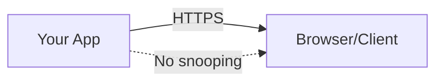
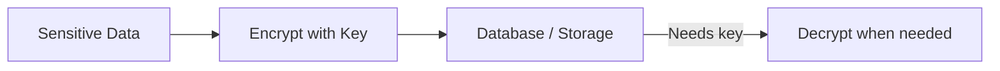
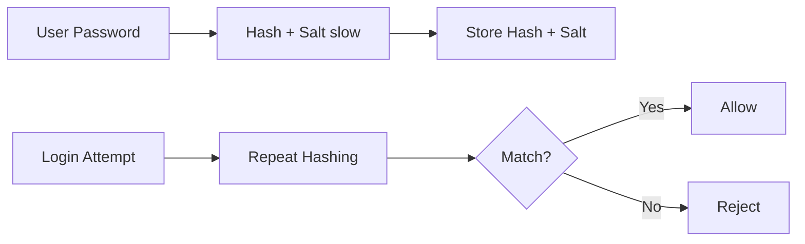
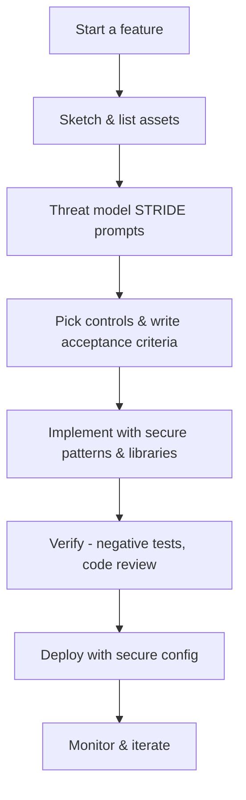
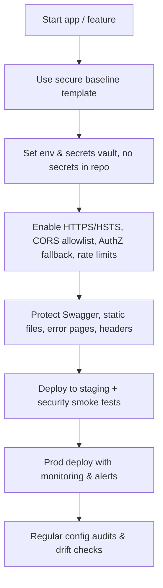
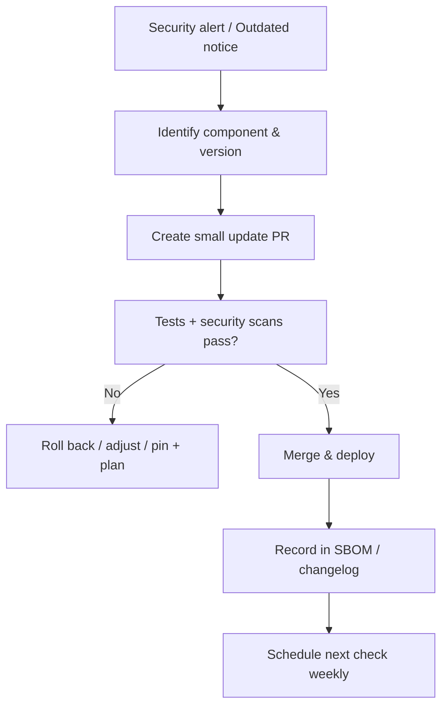
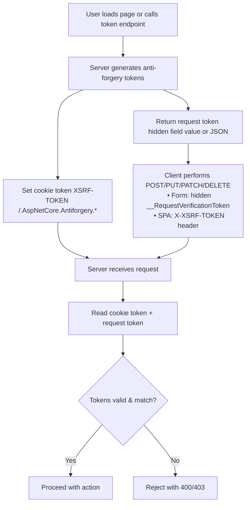

# Application Security & OWASP Top 10

A practical, .NET 9 / C#-centric guide to application security: the OWASP Top 10 risk categories, core security principles, and concrete mitigations for the most common vulnerability classes (injection, broken access control, cryptographic failures, insecure design, security misconfiguration, vulnerable components, XSS, and CSRF).

---

## OWASP Top 10 (2021) — Overview

The **OWASP Top 10** is the most recognized list of application security risks. Below are the 2021 categories with short explanations and .NET developer guidelines. Each of the major categories is expanded into its own section later in this document.

### 1. Broken Access Control
- Users must only access resources they're authorized for.
- **.NET Example:** Use `[Authorize]` attributes and role-based policies. Deny by default.

### 2. Cryptographic Failures (Sensitive Data Exposure)
- Protect data at rest and in transit with strong encryption.
- **.NET Example:** Use `System.Security.Cryptography` APIs, enforce TLS 1.2+ in `HttpClient`.

### 3. Injection
- Prevent SQL/NoSQL/OS/LDAP injection.
- **.NET Example:** Always use parameterized queries or Entity Framework LINQ (not string concatenation).

### 4. Insecure Design
- Security must be built into the design (threat modeling, secure patterns).
- **.NET Example:** Plan for multi-tenant separation, secure session management before coding.

### 5. Security Misconfiguration
- Don't use default credentials or leave unnecessary features enabled.
- **.NET Example:** Disable detailed error messages in production (`UseExceptionHandler` not `UseDeveloperExceptionPage`).

### 6. Vulnerable and Outdated Components
- Keep frameworks, servers, and libraries patched.
- **.NET Example:** Run `dotnet list package --outdated`, fix vulnerable NuGet dependencies, monitor NVD and GitHub Dependabot alerts.

### 7. Identification and Authentication Failures
- Strong authentication and session management.
- **.NET Example:** Use ASP.NET Identity with MFA, avoid session IDs in URLs, configure secure cookies.

### 8. Software and Data Integrity Failures
- Protect CI/CD pipelines and verify software integrity.
- **.NET Example:** Sign assemblies, validate package sources (`nuget.org`), enforce checksum validation in builds.

### 9. Security Logging and Monitoring Failures
- Log security-relevant events and monitor them.
- **.NET Example:** Use `ILogger` with centralized sinks (e.g., Seq, ELK), protect log storage, never log sensitive data.

### 10. Server-Side Request Forgery (SSRF)
- Prevent attackers from tricking servers into making unintended requests.
- **.NET Example:** Validate/whitelist URLs before making `HttpClient` calls, block internal/private IP ranges.

---

## Core OWASP Security Principles

- **Least Privilege** – Users/services should only have the minimum required access.
- **Defense in Depth** – Multiple layers of security controls (auth + input validation + monitoring).
- **Fail Securely** – Default to secure settings; do not reveal sensitive info in errors.
- **Don't Trust User Input** – Validate, sanitize, and encode all external input.
- **Keep Security Simple** – Avoid complexity that creates security holes.
- **Security by Design** – Integrate security into the architecture from the start.

### Interview Tip
Be prepared to:
- Map each OWASP principle to a **real-world .NET example**.
- Explain how to detect and fix a **vulnerable NuGet dependency**.
- Demonstrate secure API design (OAuth2, JWT, input validation).

---

## Injection — SQL / NoSQL / OS / LDAP

A production-focused look at injection prevention with copy-paste C# snippets.

### Core principles (apply to all)
- **Treat all input as data, never code.** Don't concatenate user input into commands/queries.
- **Prefer framework APIs that parameterize by default** (LINQ/EF Core, Mongo Builders, etc.).
- **Whitelist & normalize** inputs where you can (IDs, enums, filenames, booleans).
- **Escape only when you must**, and only with the correct, context-specific escaper.
- **Log attempts, test negative paths,** and add rate limits to slow brute-force guessing.

### 1) SQL Injection (SQL Server / Postgres / MySQL)

SQL Injection is an attack where user input is executed as **SQL code**. It happens when queries are built with **string concatenation**, so input is treated as code instead of data.

**Safe patterns**

Entity Framework Core (LINQ auto-parameterizes):
```csharp
// LINQ => parameterized by EF Core
var user = await db.Users.SingleOrDefaultAsync(u => u.Email == email);
```

Raw SQL with parameters (never concat):
```csharp
// Interpolated: parameters auto-generated
var rows = await db.Database.ExecuteSqlInterpolatedAsync(
    $"UPDATE Users SET LastLogin = {DateTime.UtcNow} WHERE Id = {userId}");

// Or Raw + parameters array
await db.Database.ExecuteSqlRawAsync(
    "UPDATE Users SET LastLogin = @p0 WHERE Id = @p1",
    parameters: new object[] { DateTime.UtcNow, userId });
```

Dapper (parameters by name):
```csharp
using var conn = new SqlConnection(cs);
var user = await conn.QuerySingleAsync<User>(
    "SELECT * FROM Users WHERE Email = @Email", new { Email = email });
```

ADO.NET (`SqlCommand` with parameters):
```csharp
using var cmd = new SqlCommand("SELECT * FROM Users WHERE Email = @email", conn);
cmd.Parameters.AddWithValue("@email", email);
using var rdr = await cmd.ExecuteReaderAsync();
```

**Dangerous (do not do this)**
```csharp
// Vulnerable: string concatenation/interpolation
var sql = $"SELECT * FROM Users WHERE Email = '{email}'";
```

**Extra tips**
- For `LIKE`, add wildcards to **the parameter**, not the SQL string:
```csharp
var pattern = $"%{term}%";
await db.Products.FromSqlInterpolated($"SELECT * FROM Products WHERE Name LIKE {pattern}").ToListAsync();
```
- Avoid building dynamic `ORDER BY` / column names from user input. If needed, use a **whitelist**:
```csharp
var orderBy = sort switch {
  "name" => "Name",
  "price" => "Price",
  _ => "CreatedAt"
};
var sql = $"SELECT * FROM Products ORDER BY {orderBy} OFFSET @o ROWS FETCH NEXT @n ROWS ONLY";
```

#### How EF Mitigates SQL Injection
- **LINQ → parameterized SQL** – translates to queries with `@p0`, `@p1`, keeping values separate.
- **Safe raw SQL APIs** – `FromSqlInterpolated`, `ExecuteSqlInterpolated` apply parameters; `FromSqlRaw("... {0}", param)` is safe.
- **Restrictions** – EF Core enforces entity shape and limits multiple statements.

#### EF Edge Cases (risk returns)
- String interpolation/concatenation in `FromSqlRaw` / `ExecuteSqlRaw`.
- Dynamic **table/column names, ORDER BY** → not parameterized.
- Stored procs with **dynamic SQL inside**.
- **Second-order injection** (malicious data stored then reused later).
- `LIKE` patterns: safe from injection, but can cause abuse/perf issues.
- Dynamic LINQ / string APIs (`OrderBy("...")`, `Include("...")`) → validate.

#### Best Practices (SQL/EF)
- Prefer **LINQ** over raw SQL.
- Use **interpolated/raw with parameters** — never concatenation.
- **Whitelist** schema identifiers (columns, tables, sort keys).
- Keep stored procs **parameterized internally**.
- Apply **least-privilege DB accounts**.

> **In short:** EF protects by default with parameterization. Risk comes back if you build raw SQL strings or dynamic identifiers without validation.

### 2) NoSQL Injection (MongoDB / Elasticsearch / Others)

**MongoDB** — use typed builders; never accept raw operator JSON (`$ne`, `$where`, …) from clients.
```csharp
var filter = Builders<User>.Filter.Eq(u => u.Email, email); // parameterized
var user = await users.Find(filter).SingleOrDefaultAsync();
```

Whitelist fields for filters/sorts:
```csharp
string field = sort switch { "email" => "Email", "created" => "CreatedAt", _ => "CreatedAt" };
var sortDef = Builders<User>.Sort.Ascending(field);
```

Disable risky features (e.g., server-side `$where` JavaScript).

**Elasticsearch** — build queries with **object models/clients** instead of concatenating JSON strings. If you must accept user text, **map it to a single "query_string" clause** you control, not raw JSON.

### 3) OS Command Injection

Never invoke a shell with concatenated strings. Prefer direct executables with `ArgumentList`.
```csharp
using System.Diagnostics;

var psi = new ProcessStartInfo
{
    FileName = "/usr/bin/grep",        // or full path to your tool
    UseShellExecute = false,
    RedirectStandardOutput = true
};
psi.ArgumentList.Add("-R");
psi.ArgumentList.Add(pattern);         // user input as an argument (no shell parsing)
psi.ArgumentList.Add(directory);       // validate/whitelist directory!
using var p = Process.Start(psi);
string output = await p.StandardOutput.ReadToEndAsync();
```

Avoid:
```csharp
// Vulnerable: sends to shell for parsing
Process.Start(new ProcessStartInfo("bash", $"-lc \"grep -R {pattern} {directory}\""));
Process.Start("cmd.exe", $"/c dir {userInput}"); // Windows example
```

**Hardening:**
- Use **allowlists** for commands and flags; reject everything else.
- Validate file paths with `Path.GetFullPath` + ensure they reside under an allowed base directory.
- Run commands with least privilege; prefer sandboxed services over shelling out.

### 4) LDAP Injection

When creating LDAP **filters** (RFC 4515), escape user values: `\`, `*`, `(`, `)`, and NUL must be encoded.

```csharp
static string EscapeLdapFilter(string value) => value
    .Replace("\\", "\\5c")
    .Replace("*",  "\\2a")
    .Replace("(",  "\\28")
    .Replace(")",  "\\29")
    .Replace("\0", "\\00");
```

> Note: the source note for this snippet was truncated; the NUL replacement is shown to complete the RFC 4515 escape set.

---

## Broken Access Control

Broken Access Control is any flaw that lets users perform actions or read/write data they're not authorized to. It's not about who you are (authentication); it's about what you're allowed to do (authorization). You fix it by enforcing rules on the server—consistently—at every layer that handles resource access.

### Canonical failure modes
- **IDOR / BOLA (object-level):** `/api/orders/{id}` returns an order you don't own.
- **BFLA (function-level):** Non-admin can call admin endpoints.
- **Horizontal/vertical escalation:** Read/update other users' rows, or jump to higher privileges.
- **Multi-tenant leaks:** Tenant A can see Tenant B's data.
- **Mass assignment:** Client sets fields like `isAdmin`, `tenantId`.
- **Enumeration:** Guessing predictable IDs without rate limits or opaque keys.
- **Client-side checks only:** Hidden buttons ≠ security.
- **Over-permissive CORS:** Lets a hostile origin use user cookies.

### Design principles
- **Deny by default.** Require explicit allow.
- **Centralize enforcement.** Policies/handlers, not scattered `if`s.
- **Server-side only.** Client checks are UX, not security.
- **Least privilege.** Prefer fine-grained policies over mega "Admin".
- **Per-resource checks.** Role/claim gates + ownership/tenant gates.
- **Whitelisting DTOs.** Never bind entities directly from user input.
- **Defense in depth.** Rate limits, opaque IDs, strict CORS, audit logs.

### ASP.NET Core building blocks

**1) Make authorization default**
```csharp
// Program.cs
using Microsoft.AspNetCore.Authorization;

builder.Services.AddAuthorization(options =>
{
    // Everything requires an authenticated user unless explicitly allowed
    options.FallbackPolicy = new AuthorizationPolicyBuilder()
        .RequireAuthenticatedUser()
        .Build();

    // Example role/claim policy
    options.AddPolicy("CanManageUsers", p => p.RequireRole("Admin"));
});

var app = builder.Build();
app.UseAuthentication();
app.UseAuthorization();

// Lock down a whole area via endpoint routing
app.MapGroup("/admin").RequireAuthorization("CanManageUsers")
   .MapGet("/users", /* ... */);
```
Add `[AllowAnonymous]` only where you truly need it (login, health checks, webhooks with alt security).

**2) Resource-based authorization (object-level)**

Use `IAuthorizationService` + a custom `AuthorizationHandler<TRequirement, TResource>` to check ownership/tenant per record.
```csharp
public sealed class CanEditDocument : IAuthorizationRequirement { }

public sealed class CanEditDocumentHandler
    : AuthorizationHandler<CanEditDocument, Document>
{
    protected override Task HandleRequirementAsync(
        AuthorizationHandlerContext ctx,
        CanEditDocument req,
        Document doc)
    {
        var userId = ctx.User.FindFirst("sub")?.Value; // your subject/user id claim
        if (userId is not null && doc.OwnerId == userId)
            ctx.Succeed(req);
        return Task.CompletedTask;
    }
}

// Registration
builder.Services.AddSingleton<IAuthorizationHandler, CanEditDocumentHandler>();

// Use in endpoint
app.MapPut("/docs/{id}", async (
    string id,
    ClaimsPrincipal user,
    IAuthorizationService authz,
    IDocRepo repo,
    DocumentUpdate dto) =>
{
    var doc = await repo.GetAsync(id);
    if (doc is null) return Results.NotFound();

    var decision = await authz.AuthorizeAsync(user, doc, new CanEditDocument());
    if (!decision.Succeeded) return Results.Forbid(); // or NotFound() to avoid leaking existence

    doc.Title = dto.Title;   // map only allowed fields
    await repo.SaveAsync(doc);
    return Results.NoContent();
});
```

---

## Cryptographic Failures (Sensitive Data Exposure)

A practical explainer — no crypto degree required.

### What's the problem?
**Sensitive data exposure** happens when private stuff (passwords, tokens, personal info, card data) leaks because we didn't protect it properly — or at all.

Think of your data like a letter. You need:
- **A locked envelope while it travels** (HTTPS).
- **A safe when it's stored** (encryption at rest).
- **A shredder for passwords** (hashing — one-way!).
- **Good key management** (don't tape the safe's key to the door).

### Real-world "oops" moments
- Sending login pages over plain **HTTP** → anyone on the same Wi-Fi can eavesdrop.
- Storing **passwords** as plain text or with a fast hash → attackers crack them fast.
- Keeping **encryption keys** in source code or a public repo → the "safe" isn't safe.
- Logging **secrets/PII** in plaintext → logs become a treasure map for attackers.
- Using weak/random-looking but actually **guessable numbers** → tokens can be guessed.

### The fixes (what "good" looks like)

**1) Protect data in transit (on the wire)**
- Use **HTTPS** everywhere (TLS). Redirect HTTP → HTTPS.
- Turn on **HSTS** (tells browsers "always use HTTPS for this site").

**2) Protect data at rest (when stored)**
- Use **encryption** for sensitive fields and files.
- Prefer modern "all-in-one" algorithms that protect both secrecy **and** tamper-proofing (e.g., **AES-GCM**).
- Store the **nonce/IV** with the ciphertext; it's not secret, just must be unique.

**3) Handle passwords the right way**
- **Never encrypt passwords.** Don't store what you could "decrypt."
- Use **slow, salted hashing** (e.g., PBKDF2/Argon2). "Slow" helps stop brute force.
- Use the framework's built-in password hasher unless you absolutely must roll your own.

**4) Treat keys like crown jewels**
- Keep encryption keys **out of code and repos**.
- Store keys in a proper **Key Management Service** (e.g., cloud key vaults).
- **Rotate** keys regularly; don't reuse forever.
- Separate duties: app uses wrapped keys; security team controls unwrapping/rotation.

**5) Use real randomness**
- For tokens/keys/IVs, use a **cryptographic** random generator (not the normal `Random`).
- Longer, truly random values are harder to guess.

**6) Be careful with logs & analytics**
- **Never** log secrets, passwords, full tokens, full card numbers.
- Redact/mask sensitive fields; restrict who can read logs.
- Don't ship raw production logs to open dashboards or chat rooms.

**7) Collect less data**
- If you don't store it, it can't be breached. Keep only what you truly need.
- Set retention: delete old data on a schedule.

### .NET cheat sheet
- **HTTPS & HSTS:** add `UseHttpsRedirection()` and `UseHsts()` in production.
- **Encrypting data:** use `AesGcm` for field/file encryption; keep nonce unique per encryption.
- **Password hashing:** use `PasswordHasher<TUser>` (ASP.NET Core Identity). For custom cases, use `KeyDerivation.Pbkdf2` with a unique salt and high iterations.
- **Keys:** use **Data Protection** for app keys (cookies, tokens), and **store/rotate keys** outside the app (e.g., Azure Key Vault + Blob for the key ring).
- **Randomness:** use `RandomNumberGenerator.GetBytes(...)` for keys, tokens, and nonces.
- **Don't log secrets:** add filters/redactors; review what your log sink collects by default.

### Quick "5-minute" checklist
- [ ] Force HTTPS site-wide; enable HSTS.
- [ ] Hash passwords with a slow, salted function (use the framework default).
- [ ] Encrypt sensitive data at rest (prefer AES-GCM).
- [ ] Keep keys out of code; store in a key vault; rotate them.
- [ ] Generate secrets/IVs with a crypto-secure RNG.
- [ ] Redact sensitive fields from logs/analytics.
- [ ] Keep only the data you need; set deletion/retention rules.

### Intuition diagrams

Data in transit:


Data at rest:


Passwords:


### FAQ
**Q: Do I need to encrypt everything in the DB?**
A: No. Focus on truly sensitive fields (passwords → hashed only, tokens, PII, card data). Encrypt backups, too.

**Q: Can we just "encode" instead of encrypt?**
A: No. Encoding (like Base64) is reversible and not security.

**Q: Why not just use one secret key in code?**
A: If the repo leaks, attackers get your key. Use a key vault and rotate keys.

**Q: Is HTTPS alone enough?**
A: No. HTTPS protects in transit; you still need hashing/encryption at rest and safe key management.

---

## Insecure Design — Build Security Into the Design

### What "Insecure Design" means
It's not a typo or a bug — it's when the **plan itself** makes risky choices. Examples:
- Anyone can hit admin endpoints because "we'll hide the button."
- App trusts `tenantId` from the client to filter data.
- File uploads go straight to `/wwwroot` without checks.
- No rate limits; attackers can guess IDs all day.

**Fix:** decide security up front — who can do what, which data is sensitive, and which controls you'll use **every time**.

### The 30-Minute Threat Model
1. **Sketch the system:** users, services, DBs, third parties, data flows.
2. **List assets:** accounts, money, PII, secrets, files.
3. **Ask "what could go wrong?"** Use the STRIDE prompts:
   - **S**poofing (fake identity) → strong auth, MFA, tokens
   - **T**ampering → signatures, integrity checks
   - **R**epudiation → audit logs
   - **I**nformation disclosure → encryption, access controls
   - **D**enial of service → rate limits, quotas
   - **E**levation of privilege → least privilege, code reviews
4. **Pick controls** (below) and write them into stories/acceptance criteria.

**Accept/transfer/fix:** for each risk, decide what to do and track it like any other requirement.

### Secure-by-Design Controls (with .NET patterns)

**1) Authentication & Authorization (deny by default)**
```csharp
// Program.cs
using Microsoft.AspNetCore.Authorization;

builder.Services.AddAuthorization(options =>
{
    options.FallbackPolicy = new AuthorizationPolicyBuilder()
        .RequireAuthenticatedUser()  // everything requires auth unless allowed
        .Build();

    options.AddPolicy("AdminOnly", p => p.RequireRole("Admin"));
});

var app = builder.Build();
app.UseAuthentication();
app.UseAuthorization();

app.MapGroup("/admin").RequireAuthorization("AdminOnly")
   .MapGet("/users", /* ... */);
```
- **Key classes:** `[Authorize]`, `AuthorizationPolicyBuilder`, `IAuthorizationService`, `AuthorizationHandler<TReq, TRes>`
- **Rule:** resource-level checks for **ownership/tenant** with `IAuthorizationService.AuthorizeAsync`.

**2) Input validation (never trust input)**
```csharp
public record UpdateProfileDto(
    [property: System.ComponentModel.DataAnnotations.Required]
    [property: System.ComponentModel.DataAnnotations.StringLength(80)]
    string DisplayName,
    [property: System.ComponentModel.DataAnnotations.RegularExpression("^[a-z0-9_.-]+$")]
    string Handle);
```
- **Key attributes:** `[Required]`, `[StringLength]`, `[Range]`, `[RegularExpression]`, `[EmailAddress]`
- Prefer **DTOs** over binding entities (prevents mass assignment).

**3) Data access & object ownership**
```csharp
// Resource-based check (ownership)
var decision = await auth.AuthorizeAsync(User, document, new CanEditDocument());
if (!decision.Succeeded) return Results.NotFound(); // avoid leaking existence
```
- **Key classes:** `IAuthorizationService`, custom `AuthorizationHandler`.

**4) CSRF, HTTPS, cookies (platform defenses)**
```csharp
builder.Services.AddControllersWithViews(o =>
    o.Filters.Add(new Microsoft.AspNetCore.Mvc.AutoValidateAntiforgeryTokenAttribute()));

if (!app.Environment.IsDevelopment()) app.UseHsts();
app.UseHttpsRedirection();
```
- **Key classes:** `IAntiforgery`, `AutoValidateAntiforgeryTokenAttribute`, `UseHsts`, `UseHttpsRedirection`.
- Set cookies `Secure`, `HttpOnly` (auth), and `SameSite` (Lax/Strict when possible).

**5) Rate limiting & quotas (slow the attacker)**
```csharp
builder.Services.AddRateLimiter(o =>
    o.AddFixedWindowLimiter("api", options => { options.PermitLimit = 100; options.Window = TimeSpan.FromSeconds(10); }));

app.UseRateLimiter();
app.MapGroup("/api").RequireRateLimiting("api");
```
- **Key namespace:** `Microsoft.AspNetCore.RateLimiting`.

**6) Secrets & keys (keep out of code)**
- Load from **configuration**/secret stores, not from source:
```csharp
var conn = builder.Configuration.GetConnectionString("MainDb");
```
- **Key pieces:** `IConfiguration`, **User Secrets** (dev), cloud **Key Vaults**, `Microsoft.AspNetCore.DataProtection` for app key rotation.

**7) Output encoding & content security**
- Razor auto-encodes: avoid `@Html.Raw` on untrusted input.
- Add a **Content-Security-Policy (CSP)** header; prefer nonces/hashes for scripts.

**8) File uploads (safe by design)**
- Limit **size**, **type**, and storage **location** (outside web root).
- Generate random filenames; scan if needed; never execute uploaded files.

**9) Errors, logging, and privacy**
```csharp
if (!app.Environment.IsDevelopment())
    app.UseExceptionHandler("/error"); // return generic message, log details
```
- Log denials (401/403), but **don't log secrets/PII**. Mask/redact sensitive fields.

### Minimal "secure-by-default" Program.cs
```csharp
var builder = WebApplication.CreateBuilder(args);

builder.Services.AddAuthentication(/* your scheme(s) */);
builder.Services.AddAuthorization(o =>
{
    o.FallbackPolicy = new AuthorizationPolicyBuilder()
        .RequireAuthenticatedUser()
        .Build();
});
builder.Services.AddControllersWithViews(o =>
    o.Filters.Add(new Microsoft.AspNetCore.Mvc.AutoValidateAntiforgeryTokenAttribute()));

builder.Services.AddRateLimiter(o =>
    o.AddFixedWindowLimiter("api", opt => { opt.PermitLimit = 100; opt.Window = TimeSpan.FromSeconds(10); }));

var app = builder.Build();

if (!app.Environment.IsDevelopment()) app.UseHsts();
app.UseHttpsRedirection();
app.UseAuthentication();
app.UseAuthorization();
app.UseRateLimiter();

app.MapControllers().RequireAuthorization(); // default: locked
app.Run();
```

### Flowchart — "Design security into every change"


### Design Review One-Pager (template)
- **Feature:** What are we adding?
- **Assets:** Which data/actions matter?
- **Trust boundaries:** Browser ↔ API ↔ DB; third parties?
- **Abuse cases:** How could this be misused?
- **Controls selected:** AuthZ policy, DTO validation, rate limit, CSRF, CSP, file rules, logging
- **Decisions & owners:** Who's responsible?
- **Tests:** Unit/integration/negative cases
- **Follow-ups:** Docs, runbooks, alerts

### Key .NET Concepts, Classes & Methods (quick index)
- **AuthN/Z:** `[Authorize]`, `AuthorizationPolicyBuilder`, `IAuthorizationService.AuthorizeAsync`, `AuthorizationHandler<TReq, TRes>`
- **Validation:** `System.ComponentModel.DataAnnotations` (`[Required]`, `[StringLength]`, `[Range]`, `[RegularExpression]`)
- **CSRF:** `IAntiforgery`, `AutoValidateAntiforgeryTokenAttribute`
- **TLS/HSTS:** `UseHttpsRedirection()`, `UseHsts()`
- **Rate limiting:** `AddRateLimiter(...)`, `RequireRateLimiting()`
- **Data Protection:** `AddDataProtection()`, `PersistKeys...`, `ProtectKeysWith...`
- **Configuration/Secrets:** `IConfiguration`, User Secrets, Key Vaults
- **Razor encoding:** default HTML encoding (avoid `@Html.Raw` on untrusted data)
- **CSP/security headers:** add via middleware/library; prefer nonces/hashes
- **Logging & errors:** `ILogger`, `UseExceptionHandler()`
- **File uploads:** `IFormFile`, size/type checks, store outside web root

### Quick "done-done" checklist
- [ ] Threat model & one-pager attached to the story
- [ ] Auth required by default; policies for sensitive actions
- [ ] Resource ownership/tenant checks in place
- [ ] DTO validation for every request; entity binding avoided
- [ ] CSRF/HTTPS/HSTS/cookies configured correctly
- [ ] Rate limits enabled on all external endpoints
- [ ] Secrets in vault/config; keys rotate; no secrets in logs
- [ ] File upload rules (size/type/location) enforced
- [ ] CSP set; Razor uses auto-encoding (no unsafe `Html.Raw`)
- [ ] Negative tests for abuse cases; monitoring/alerts wired

---

## Security Misconfiguration (ASP.NET Core)

### TL;DR
- Most breaches are not fancy hacks — they're **bad settings**.
- Make a **secure baseline** once, reuse it in every app.
- Lock down **errors, HTTPS/HSTS, CORS, auth by default, headers, Swagger, proxies, uploads, secrets**.

### What is "Security Misconfiguration"?
Mistakes or unsafe defaults like "debug on in prod," "CORS allow all," "secrets in the repo," or "Swagger open to the world." These don't require a code bug — just **wrong switches**.

### The Best Pattern: Secure Baseline (drop-in)
Use this as your default `Program.cs` and tweak per app.

```csharp
var builder = WebApplication.CreateBuilder(args);

// Hide banner headers in prod (less info to attackers)
if (!builder.Environment.IsDevelopment())
{
    builder.WebHost.ConfigureKestrel(o => o.AddServerHeader = false);
}

// MVC + global CSRF (for browser apps)
builder.Services.AddControllersWithViews(o =>
    o.Filters.Add(new Microsoft.AspNetCore.Mvc.AutoValidateAntiforgeryTokenAttribute()));

// CORS: exact allowlist only (enable only if you truly need cross-origin browser calls)
builder.Services.AddCors(o => o.AddPolicy("Strict", p => p
    .WithOrigins("https://app.example.com")
    .WithMethods("GET","POST","PUT","PATCH","DELETE")
    .WithHeaders("Content-Type","Authorization","X-XSRF-TOKEN")
    .AllowCredentials()));

// AuthZ: deny by default
builder.Services.AddAuthorization(o =>
{
    o.FallbackPolicy = new AuthorizationPolicyBuilder()
        .RequireAuthenticatedUser()
        .Build();
});

// Rate limiting: slow down abuse
builder.Services.AddRateLimiter(o => o.AddFixedWindowLimiter("api", opt =>
{
    opt.PermitLimit = 100;
    opt.Window = TimeSpan.FromSeconds(10);
    opt.QueueLimit = 0;
}));

// Reverse proxy awareness (if behind Nginx/ALB/etc.)
builder.Services.Configure<ForwardedHeadersOptions>(opt =>
{
    opt.ForwardedHeaders = ForwardedHeaders.XForwardedFor | ForwardedHeaders.XForwardedProto;
    // opt.KnownProxies.Add(IPAddress.Parse("10.0.0.100"));
});

var app = builder.Build();

// Errors & HSTS
if (app.Environment.IsDevelopment())
{
    app.UseDeveloperExceptionPage();
    app.UseSwagger();
    app.UseSwaggerUI();
}
else
{
    app.UseExceptionHandler("/error"); // generic to users, detailed in logs
    app.UseHsts();
    // Option: protect or disable Swagger in prod
    // app.Map("/swagger", s => s.RequireAuthorization());
}

app.UseHttpsRedirection();
app.UseStaticFiles(); // never store secrets under wwwroot
app.UseForwardedHeaders();
app.UseRouting();

app.UseCors("Strict");             // apply narrowly if possible
app.UseAuthentication();
app.UseAuthorization();
app.UseRateLimiter();

app.MapControllers().RequireAuthorization(); // default: locked
app.Run();
```

Guardrails in `appsettings.json`:
```json
{
  "AllowedHosts": "app.example.com",
  "Logging": { "LogLevel": { "Default": "Information", "Microsoft": "Warning" } }
}
```
> Keep **secrets out** of `appsettings.json`. Use environment variables, User Secrets (dev), or a cloud Key Vault.

### Common "oops" and the fix

**1) Detailed errors in production**
- **Problem:** users see stack traces with secrets/paths.
- **Fix:** `UseExceptionHandler("/error")` in prod, `UseDeveloperExceptionPage()` only in dev.

**2) CORS too open**
- **Problem:** `AllowAnyOrigin()` + `AllowCredentials()` lets **any site** call your API with the user's cookies.
- **Fix:** use **exact origins** only.
```csharp
// Don't
builder.Services.AddCors(p => p.AddDefaultPolicy(b => b.AllowAnyOrigin().AllowAnyHeader().AllowAnyMethod().AllowCredentials()));
// Do
builder.Services.AddCors(o => o.AddPolicy("Strict", p => p
    .WithOrigins("https://app.example.com")
    .WithMethods("GET","POST","PUT","PATCH","DELETE")
    .WithHeaders("Content-Type","Authorization","X-XSRF-TOKEN")
    .AllowCredentials()));
```

**3) Swagger open to the internet**
- **Fix:** turn off in prod or **require auth** for `/swagger`.

**4) No HTTPS/HSTS**
- **Fix:** `UseHttpsRedirection()` and `UseHsts()` in prod.

**5) Weak cookies & headers**
- **Fix:** secure cookie settings + add minimal security headers.
```csharp
builder.Services.ConfigureApplicationCookie(o =>
{
    o.Cookie.HttpOnly = true;
    o.Cookie.SecurePolicy = CookieSecurePolicy.Always;
    o.Cookie.SameSite = SameSiteMode.Lax; // or Strict if flows allow
});

app.Use(async (ctx, next) =>
{
    ctx.Response.Headers["X-Content-Type-Options"] = "nosniff";
    ctx.Response.Headers["X-Frame-Options"] = "DENY"; // or CSP frame-ancestors
    ctx.Response.Headers["Referrer-Policy"] = "no-referrer";
    await next();
});
```

**6) Reverse proxy misconfig**
- **Problem:** app thinks requests are HTTP, not HTTPS → bad redirects, cookie flags wrong.
- **Fix:** configure `ForwardedHeadersOptions`; set `AllowedHosts`.

**7) Static files & uploads**
- **Fix:** store uploads **outside** `wwwroot`, disable directory browsing, set size/type limits.
```csharp
[RequestSizeLimit(10 * 1024 * 1024)] // example 10 MB limit
public async Task<IActionResult> Upload(IFormFile file) { /* ... */ }
```

**8) Secrets in repo / images**
- **Fix:** use `IConfiguration` with env variables / Key Vault; never hard-code secrets.

**9) Over-broad IAM / public storage**
- **Fix:** least-privilege roles, no public S3/Blob containers by default.

### Important .NET Concepts (quick index)
- **Environment & hosting:** `IWebHostEnvironment`, `ASPNETCORE_ENVIRONMENT`, `UseExceptionHandler`, `UseDeveloperExceptionPage`, `UseHsts`, `UseHttpsRedirection`
- **CORS:** `AddCors`, `WithOrigins`, `AllowCredentials`, `RequireCors`
- **AuthZ default deny:** `AuthorizationPolicyBuilder`, `FallbackPolicy`, `RequireAuthorization`
- **Rate limiting:** `AddRateLimiter`, `RequireRateLimiting`
- **Reverse proxy:** `ForwardedHeadersOptions`, `UseForwardedHeaders`
- **Host filtering:** `AllowedHosts` (appsettings)
- **Swagger:** `UseSwagger`, `UseSwaggerUI` (dev only or protected)
- **Uploads & static:** `RequestSizeLimit`, `IFormFile`, `UseStaticFiles`
- **Cookies & headers:** `CookieSecurePolicy`, `SameSiteMode`, `AddServerHeader`
- **Config & secrets:** `IConfiguration`, User Secrets, Key Vaults
- **Logging:** `ILogger`, structured logs with PII redaction

### Flowchart — "From code to prod without misconfig"


### Quick "done-done" checklist
- [ ] Prod uses `UseExceptionHandler` (not DeveloperExceptionPage).
- [ ] `UseHttpsRedirection()` + `UseHsts()` enabled; Kestrel `AddServerHeader=false`.
- [ ] CORS allowlist only (no `AnyOrigin` + credentials).
- [ ] `FallbackPolicy` requires auth by default; sensitive routes grouped.
- [ ] Swagger disabled or behind auth in prod.
- [ ] `ForwardedHeadersOptions` set; `AllowedHosts` configured.
- [ ] Secrets via env/Key Vault; none in repo/images.
- [ ] Uploads constrained; no directory browsing; nothing private under `wwwroot`.
- [ ] Rate limits on public endpoints; security headers added.
- [ ] Cloud/storage/IAM reviewed for least privilege.

---

## Vulnerable & Outdated Components (ASP.NET Core)

Keep your app safe by keeping **everything you depend on** safe: frameworks, NuGet packages, container images, OS, and 3rd-party services.

### What this means
Most apps use lots of components you didn't write. If any of those have a **known security hole** or are **too old to get patches**, attackers can walk right in — even if your code is perfect.

**Goal:** Know what you use, keep it updated, and **block risky versions** from shipping.

### Fast signals you're at risk
- You're on an **old .NET** (or OS/container base) that's **out of support**.
- Your repo has **floating package versions** (`1.*`, `-preview`) or **no lockfile**.
- You don't run **"outdated/vulnerable" checks** in CI.
- You ship **debug builds** or **leave sample/unused packages** in.
- You don't have a **bill of materials (SBOM)** for what's in prod.

### The easy wins (do these now)
1. **Pin package versions** in `*.csproj` (no `*` or ranges for prod).
2. **Check what's outdated & vulnerable** locally:
   ```bash
   dotnet list <path-to.sln> package --outdated
   dotnet list <path-to.sln> package --vulnerable
   dotnet list <path-to.sln> package --deprecated
   ```
3. Turn on **Dependabot or Renovate** for automatic PRs.
4. **Lock restores** so builds are reproducible:
   ```bash
   dotnet restore --locked-mode         # use packages.lock.json
   ```
   Add `RestorePackagesWithLockFile=true` and commit `packages.lock.json`.
5. Run your app on a **supported .NET** (LTS if possible) and **patch monthly**.

### Best pattern: "Update → Test → Ship" loop
- Update **one or a few** packages per PR.
- Run tests & security scans.
- Ship quickly; repeat. Smaller changes = fewer surprises.

### .NET-specific playbook

**1) Centralize & pin versions** — use **Central Package Management** so all projects share one version source. `Directory.Packages.props` (at the solution root):
```xml
<Project>
  <ItemGroup>
    <PackageVersion Include="Serilog.AspNetCore" Version="8.0.0" />
    <PackageVersion Include="FluentValidation" Version="11.9.0" />
  </ItemGroup>
</Project>
```
Each `*.csproj` references by name only:
```xml
<ItemGroup>
  <PackageReference Include="Serilog.AspNetCore" />
</ItemGroup>
```

**2) Reproducible builds with a lock file** — enable and commit `packages.lock.json`:
```xml
<PropertyGroup>
  <RestorePackagesWithLockFile>true</RestorePackagesWithLockFile>
</PropertyGroup>
```
CI uses locked mode:
```bash
dotnet restore --locked-mode
```

**3) CI: fail builds on risky versions** — GitHub Actions example:
```yaml
name: deps-audit
on: [push, pull_request]
jobs:
  audit:
    runs-on: ubuntu-latest
    steps:
      - uses: actions/checkout@v4
      - uses: actions/setup-dotnet@v4
        with: { dotnet-version: '8.0.x' }
      - run: dotnet restore --locked-mode
      - run: dotnet build --configuration Release --no-restore
      - name: List outdated
        run: dotnet list ./YourSolution.sln package --outdated
      - name: List vulnerable
        run: dotnet list ./YourSolution.sln package --vulnerable
      # Optional: fail on known vulns
      - name: Fail if vulnerable
        run: |
          dotnet list ./YourSolution.sln package --vulnerable --include-transitive > audit.txt
          if grep -q "Vulnerabilities" audit.txt; then
            echo "Vulnerable packages found"; cat audit.txt; exit 1
          fi
```

**4) SBOM (know exactly what's in your build)** — produce a CycloneDX SBOM:
```bash
dotnet tool install --global CycloneDX
cyclonedx --project-file YourSolution.sln --output-dir ./sbom
```
Ship the SBOM artifact with your release and store it in artifact storage.

**5) Containers & OS (don't forget the base image)**
- Choose a **supported** base image (e.g., `mcr.microsoft.com/dotnet/aspnet:8.0-alpine`).
- **Scan** images in CI (Trivy/Grype/Docker Scout).
- Rebuild on **base image patch** (weekly is common).

Example `Dockerfile`:
```dockerfile
FROM mcr.microsoft.com/dotnet/aspnet:8.0-alpine AS base
WORKDIR /app
EXPOSE 8080
FROM mcr.microsoft.com/dotnet/sdk:8.0-alpine AS build
WORKDIR /src
COPY . .
RUN dotnet restore --locked-mode
RUN dotnet publish -c Release -o /app/publish --no-restore
FROM base AS final
COPY --from=build /app/publish .
ENTRYPOINT ["dotnet","YourApp.dll"]
```

**6) Third-party services & front-end bits**
- Keep **CDN scripts** pinned by **SRI hashes** (subresource integrity).
- Track versions of **JavaScript packages** (package.json) and run `npm audit` if you ship a SPA.
- Review **SDKs** (cloud providers, payment gateways) for version and deprecation notices.

### Safe update tips
- Read change logs for **breaking changes**; prefer **patch**/**minor** bumps first.
- If a package is unmaintained, **swap it out** for an active alternative.
- If you **cannot update immediately**, apply temporary mitigations (feature flags, firewall/WAF rules) and plan the upgrade.

### Visual: from alert to fixed


### Quick checklist
- [ ] On a **supported .NET** and base image; OS patched.
- [ ] **Pinned** package versions (no floating ranges); **lock file** committed.
- [ ] CI runs `dotnet list package --outdated/--vulnerable` and **fails** on risks.
- [ ] **Dependabot/Renovate** enabled; small PRs merged regularly.
- [ ] **SBOM** generated and stored with releases.
- [ ] Container images **scanned**; rebuilt on base patches.
- [ ] 3rd-party SDKs, CDN scripts, and front-end packages **tracked & updated**.
- [ ] Mitigations documented when updates must be delayed.

---

## Cross-Site Scripting (XSS)

Cross-Site Scripting (XSS) is a security vulnerability that enables a cyberattacker to place client-side scripts (usually JavaScript) into web pages. When other users load affected pages, the attacker's scripts run, enabling theft of cookies and session tokens, DOM manipulation, or redirection. XSS vulnerabilities generally occur when an application takes user input and outputs it to a page without validating, encoding, or escaping it.

This applies primarily to ASP.NET Core MVC with views, Razor Pages, and other apps that return HTML. Web APIs that return data as HTML, XML, or JSON can trigger XSS attacks in their client apps if they don't properly sanitize user input. To prevent XSS, web APIs should implement **input validation** (input meets expected criteria, no malicious code) and **output encoding** (data is sanitized so it can't execute as code in the browser).

### How to prevent it (framework-agnostic)
1. **Encode on output (by context).** Encode *when rendering*, using the right encoder for the context (HTML, HTML attribute, JavaScript string, URL component). Don't "HTML-encode on input"; store raw data and encode at render time.
2. **Sanitize only when you must render user-authored HTML.** For WYSIWYG/CMS/comment content, use a robust sanitizer to whitelist tags/attributes.
3. **Set a strong Content-Security-Policy (CSP).** Use nonces or hashes for scripts, block `unsafe-inline`, disallow `object`. CSP won't fix XSS by itself but limits impact.
4. **Avoid dangerous sinks.** Prefer `textContent` / safe templating over `innerHTML`; never use `eval`/`new Function` unless absolutely necessary.
5. **Security headers.** Prefer CSP; `X-XSS-Protection` is obsolete and should not be relied upon.

### What ASP.NET Core gives you

**1) Razor auto-encodes by default**
```cshtml
@* In Razor views, expressions are HTML-encoded automatically *@
<p>@Model.Comment</p>

@* Avoid using Html.Raw on untrusted content *@
@Html.Raw(safeButSanitizedHtml)  @* Only after sanitization *@
```

**2) First-class encoders in `System.Text.Encodings.Web`**
```csharp
using System.Text.Encodings.Web;

public class NotesService
{
    private readonly HtmlEncoder _html;
    private readonly JavaScriptEncoder _js;

    public NotesService(HtmlEncoder html, JavaScriptEncoder js)
    {
        _html = html;
        _js = js;
    }

    public string SafeHtml(string s) => _html.Encode(s);
    public string SafeJsString(string s) => _js.Encode(s);
}
```
The key encoders are `HtmlEncoder`, `JavaScriptEncoder`, and `UrlEncoder`.

**3) JSON serialization is XSS-aware by default**

`System.Text.Json` escapes HTML-significant characters (`<`, `>`, `&`) by default so JSON is safer if embedded in HTML. Avoid turning this off with `JavaScriptEncoder.UnsafeRelaxedJsonEscaping` unless you're certain the JSON will **never** be embedded in HTML.
```csharp
// Keep the safe default:
builder.Services.AddControllers()
    .AddJsonOptions(o =>
    {
        // DON'T do this unless you really know why:
        // o.JsonSerializerOptions.Encoder = JavaScriptEncoder.UnsafeRelaxedJsonEscaping;
    });
```

**4) Sanitization (when you must render HTML)**

ASP.NET Core does not include a built-in sanitizer (by design). Use a well-maintained library such as **Ganss.XSS (HtmlSanitizer)** to whitelist tags/attributes and strip script content.
```csharp
using Ganss.XSS;

var sanitizer = new HtmlSanitizer();
sanitizer.AllowedTags.Add("b");
sanitizer.AllowedAttributes.Add("class");

string safeHtml = sanitizer.Sanitize(untrustedHtml);

// Now and only now — if you must render raw HTML:
@Html.Raw(safeHtml)
```

**5) Content-Security-Policy (CSP) middleware**

Add CSP headers with a library like **NWebsec.AspNetCore**. Use nonces for scripts, block inline scripts, and disable plugin objects.
```csharp
// Program.cs (after installing NWebsec.AspNetCore.* packages)
app.UseCsp(options =>
{
    options.DefaultSources(s => s.Self());
    options.ScriptSources(s => s.Self().Https().WithNonce());
    options.ObjectSources(s => s.None());
    options.FrameAncestors(s => s.Self());
});
```

> **Note on legacy AntiXSS:** `System.Web.Security.AntiXss` was for classic ASP.NET. In ASP.NET Core, prefer Razor's default encoding and the encoders in `System.Text.Encodings.Web` rather than trying to port AntiXSS.

### Quick checklist
- **Views (Razor):** Rely on auto-encoding; never `Html.Raw` unsanitized input.
- **Controllers/Services:** Use `HtmlEncoder` / `JavaScriptEncoder` / `UrlEncoder` for manual encoding in the right context.
- **JSON:** Keep `System.Text.Json` defaults; avoid `UnsafeRelaxedJsonEscaping` unless you're *certain* about the embedding context.
- **Rich-text inputs:** Sanitize with `HtmlSanitizer` before rendering; store raw data, sanitize at render time.
- **Front-end:** Avoid `innerHTML`/`eval`; prefer `textContent` and safe templating.
- **Headers:** Deploy a strict CSP with nonces/hashes; don't rely on `X-XSS-Protection`.

---

## Cross-Site Request Forgery (CSRF / XSRF)

Cross-site request forgery is an attack against web-hosted apps whereby a malicious web app can influence the interaction between a client browser and a web app that trusts that browser. These attacks are possible because web browsers send some types of authentication tokens automatically with every request to a website. This exploit is also known as a one-click attack or session riding because it takes advantage of the user's previously authenticated session. It is also known as XSRF or CSRF.

### Flowchart (Token Lifecycle)


When a user first loads your SPA (e.g., React app), you need a way for the server to hand out the initial XSRF token.

### Approach 1: Bootstrap on SPA GET (Recommended if .NET serves the React app)
- When the browser requests `/` (or `/index.html`), your .NET middleware issues the `XSRF-TOKEN` cookie.
- React doesn't need to call anything extra — the cookie is already there when the app boots.
- Your axios/fetch interceptor just picks it up and sends it back with every POST/PUT/DELETE.

```csharp
// Middleware to issue token whenever serving SPA
app.Use(async (context, next) =>
{
    if (context.Request.Path == "/" || context.Request.Path == "/index.html")
    {
        var antiforgery = context.RequestServices.GetRequiredService<IAntiforgery>();
        var tokens = antiforgery.GetAndStoreTokens(context);

        context.Response.Cookies.Append("XSRF-TOKEN", tokens.RequestToken!, new CookieOptions
        {
            HttpOnly = false,
            Secure = true,
            SameSite = SameSiteMode.Strict
        });
    }
    await next();
});
```

### Approach 2: Dedicated Token Endpoint (If SPA is static-hosted elsewhere, e.g., S3/Netlify)
- If your React app is not served by .NET, the first request to `/` never touches .NET.
- In that case, create an endpoint like `/api/antiforgery/token`.
- React calls it after mounting to fetch the token, and stores it (cookie or in-memory).

```csharp
[ApiController]
[Route("api/[controller]")]
public class AntiforgeryController : ControllerBase
{
    private readonly IAntiforgery _antiforgery;
    public AntiforgeryController(IAntiforgery antiforgery) => _antiforgery = antiforgery;

    [HttpGet("token")]
    public IActionResult GetToken()
    {
        var tokens = _antiforgery.GetAndStoreTokens(HttpContext);
        Response.Cookies.Append("XSRF-TOKEN", tokens.RequestToken!,
            new CookieOptions { HttpOnly = false, Secure = true, SameSite = SameSiteMode.Strict });
        return Ok(new { token = tokens.RequestToken });
    }
}
```
