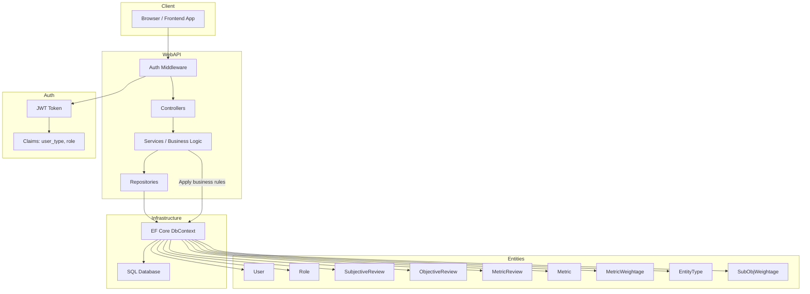

# ASP.NET & EF Core — Interview Notes / Quick Handbook

A compact handbook covering architecture patterns, Entity Framework (EF/Core) fundamentals, SQL, ASP.NET MVC/Web API/Core, RESTful CRUD, middleware, and global exception handling—with code you can adapt quickly.

---

## Entity Framework (EF / EF Core)

**What it is:** an Object-Relational Mapper (ORM) from Microsoft that maps .NET classes to database tables and lets you work with data using LINQ instead of raw SQL. EF Core is the cross-platform, modernized version.

### Core concepts
- **DbContext** — unit of work + change tracker; represents a session with the DB.
- **DbSet<TEntity>** — represents a table.
- **Migrations** — track schema changes and update DB.
- **Querying** — LINQ translates to SQL.
- **Change tracking** — EF tracks entity state (Added/Modified/Deleted/Unchanged).
- **Loading strategies** — Eager (`Include`), Lazy (proxied), Explicit (`Load`).

---

## N-tier architecture

Typical layers:
- **Presentation** (UI / API)
- **Business Logic** (services)
- **Data Access** (repositories / EF)
- **Database** (SQL/NoSQL)

**Benefits:** separation of concerns, testability, independent evolution.
**Tradeoffs:** tends to be more complex than simple layered apps; latency between layers if remote.

---

## Purpose of tracking in EF(Core)
- **Change Tracking:** DbContext keeps snapshots of entity states (**Added / Modified / Deleted / Unchanged / Detached**).
- On `SaveChanges()`, EF generates SQL based on tracked state → **automatic UPDATE/INSERT/DELETE**.
- Enables **relationship fix-up** (navigation properties sync) and **lazy loading** (if enabled).
- Costs memory/CPU; for read-only queries use `AsNoTracking()` to speed up and reduce memory.
- For long-running contexts, prefer **short-lived DbContexts** (scoped per request/unit of work) to avoid stale tracking graphs.

**When to disable tracking:** read-heavy or reporting endpoints, list pages, caching layers. Use `AsNoTrackingWithIdentityResolution()` when you need deduped instances without full tracking.

---

## How to manage data loss in EF/Core
- **Migrations discipline:** version your schema with `Add-Migration` / `dotnet ef migrations add` and apply in CI/CD. Avoid manual schema drift.
- **Backups:** before destructive migrations (drop column/table), backup DB or the table; use feature flags & phased rollouts.
- **Concurrency control:** add **rowversion/timestamp** (SQL Server) or a `ConcurrencyToken` to detect lost updates. Handle `DbUpdateConcurrencyException`.
- **Foreign keys & cascades:** set explicit `DeleteBehavior` to avoid accidental cascades.
- **Transactions & retries:** wrap multi-step ops in `DbContext.Database.BeginTransaction()`; enable **execution strategies** (transient fault handling) to avoid partial failures.
- **`SaveChanges(acceptAllChangesOnSuccess:false)`:** call `AcceptAllChanges()` only after side effects succeed (outbox pattern), reducing risk when coordinating with external systems.
- **Soft deletes** and **audit tables:** add `IsDeleted` flag + global query filter; or shadow tables/audit triggers for recovery.

---

## ASP.NET MVC request life cycle (high-level)
1. **Request arrives** → Hosting (Kestrel/IIS) → ASP.NET pipeline.
2. **Middleware** runs (logging, auth, routing, exception, etc.).
3. **Routing** selects controller/action.
4. **Model binding** binds route/query/body to parameters/models; **validation** runs.
5. **Action filters** (before), then **action** executes.
6. **Result** (view, object, status) → **Result filters**.
7. **Response** written; middleware post-processing.

> ASP.NET Framework MVC uses a slightly different pipeline than ASP.NET **Core** (Core uses middleware + endpoint routing).

---

## Web API vs Core MVC vs "Core issues"
- **ASP.NET Web API (Framework):** legacy (System.Web), separate from MVC; for .NET Framework apps.
- **ASP.NET Core MVC:** unified framework for **controllers + views + APIs**; cross-platform; endpoint routing; minimal hosting model in .NET 6+.
- **Common pitfalls in Core:**
  - Missing DI registrations (scoped DbContext vs singleton service).
  - JSON reference loops; configure `ReferenceHandler.IgnoreCycles`.
  - Model binding for complex types vs `[FromBody]`/`[FromQuery]`.
  - CORS not enabled (`UseCors`) or order of middleware incorrect.
  - Async blocking (`.Result`/`.Wait()`) causing deadlocks.

---

## What is a CTE (SQL)
- **Common Table Expression:** a named temporary result set defined with `WITH`, used by the subsequent `SELECT/INSERT/UPDATE/DELETE`.
- Useful for readability, recursion (hierarchies), breaking up complex queries.

```sql
WITH RecursiveCTE AS (
  SELECT Id, ParentId, 0 AS Depth FROM Categories WHERE ParentId IS NULL
  UNION ALL
  SELECT c.Id, c.ParentId, Depth + 1
  FROM Categories c
  JOIN RecursiveCTE r ON c.ParentId = r.Id
)
SELECT * FROM RecursiveCTE;
```

---

## WCF vs Web API / SQL Server quick notes
- **WCF:** SOAP/WS-* protocols, multiple bindings (net.tcp, msmq), contracts, service behaviors. Best for legacy enterprise or where SOAP/interoperability features are required.
- **Web API/Core:** HTTP-first, JSON by default, REST-style.
- **SQL Server:** EF Core's provider; use **migrations**, **schemas**, **indexes**, **computed columns**, **TVPs**, **SPs** where appropriate. For heavy SP usage, map with `FromSql`/`ExecuteSql`.

---

## Create RESTful APIs for CRUD using EF(Core)

### Example domain
`Product { Id, Name, Price, IsActive }`

**DbContext & entity**
```csharp
public sealed class AppDbContext : DbContext
{
    public DbSet<Product> Products => Set<Product>();

    public AppDbContext(DbContextOptions<AppDbContext> options) : base(options) { }

    protected override void OnModelCreating(ModelBuilder b)
    {
        b.Entity<Product>(e =>
        {
            e.HasKey(p => p.Id);
            e.Property(p => p.Name).IsRequired().HasMaxLength(200);
            e.Property(p => p.Price).HasColumnType("decimal(18,2)");
            e.Property<byte[]>("RowVersion").IsRowVersion(); // concurrency token
            e.HasIndex(p => p.Name).IsUnique(false);
        });
    }
}

public sealed class Product
{
    public int Id { get; set; }
    public string Name { get; set; } = string.Empty;
    public decimal Price { get; set; }
    public bool IsActive { get; set; } = true;
}
```

**Program.cs (minimal API)**
```csharp
var builder = WebApplication.CreateBuilder(args);
builder.Services.AddDbContext<AppDbContext>(o =>
    o.UseSqlServer(builder.Configuration.GetConnectionString("Default"))
     .EnableSensitiveDataLogging(false));

builder.Services.AddProblemDetails();
var app = builder.Build();
app.UseExceptionHandler();
app.UseHttpsRedirection();

app.MapGet("/api/products", async (AppDbContext db) =>
    await db.Products.AsNoTracking().Where(p => p.IsActive).ToListAsync());

app.MapGet("/api/products/{id:int}", async (int id, AppDbContext db) =>
    await db.Products.FindAsync(id) is { } p ? Results.Ok(p) : Results.NotFound());

app.MapPost("/api/products", async (Product dto, AppDbContext db) =>
{
    db.Products.Add(dto);
    await db.SaveChangesAsync();
    return Results.Created($"/api/products/{dto.Id}", dto);
});

app.MapPut("/api/products/{id:int}", async (int id, Product dto, AppDbContext db) =>
{
    var existing = await db.Products.FirstOrDefaultAsync(p => p.Id == id);
    if (existing is null) return Results.NotFound();

    existing.Name = dto.Name;
    existing.Price = dto.Price;
    existing.IsActive = dto.IsActive;

    try
    {
        await db.SaveChangesAsync();
        return Results.NoContent();
    }
    catch (DbUpdateConcurrencyException)
    {
        return Results.Problem(title: "Conflict", detail: "The resource was updated by someone else.", statusCode: StatusCodes.Status409Conflict);
    }
});

app.MapDelete("/api/products/{id:int}", async (int id, AppDbContext db) =>
{
    var existing = await db.Products.FindAsync(id);
    if (existing is null) return Results.NotFound();
    db.Remove(existing);
    await db.SaveChangesAsync();
    return Results.NoContent();
});

app.Run();
```

**Notes**
- Returns proper **HTTP status codes** and a location header on create.
- Uses **AsNoTracking** for the list endpoint.
- Handles **concurrency** with `RowVersion`.
- Add **validation** with `FluentValidation` or data annotations.

---

## Implement Global Exception Handling

### Option A: Built-in handler + RFC 7807 Problem Details
```csharp
// Program.cs
builder.Services.AddProblemDetails(options =>
{
    options.CustomizeProblemDetails = ctx =>
    {
        ctx.ProblemDetails.Extensions["traceId"] = ctx.HttpContext.TraceIdentifier;
    };
});

var app = builder.Build();
app.UseExceptionHandler(); // returns application/problem+json by default
```

### Option B: Custom middleware
```csharp
public sealed class ExceptionMiddleware : IMiddleware
{
    private readonly ILogger<ExceptionMiddleware> _logger;
    public ExceptionMiddleware(ILogger<ExceptionMiddleware> logger) => _logger = logger;

    public async Task InvokeAsync(HttpContext context, RequestDelegate next)
    {
        try { await next(context); }
        catch (DbUpdateConcurrencyException ex)
        {
            _logger.LogWarning(ex, "Concurrency");
            context.Response.StatusCode = StatusCodes.Status409Conflict;
            await context.Response.WriteAsJsonAsync(new { title = "Conflict", detail = "Concurrency conflict.", traceId = context.TraceIdentifier });
        }
        catch (Exception ex)
        {
            _logger.LogError(ex, "Unhandled");
            context.Response.StatusCode = StatusCodes.Status500InternalServerError;
            await context.Response.WriteAsJsonAsync(new { title = "ServerError", detail = "Unexpected error.", traceId = context.TraceIdentifier });
        }
    }
}

// Program.cs
builder.Services.AddTransient<ExceptionMiddleware>();
var app = builder.Build();
app.UseMiddleware<ExceptionMiddleware>();
```

**Best practices:** never leak stack traces in production, log with correlation IDs, map known exceptions to 4xx/409, default to 500 for unknowns.

---

## "Explain in detail about your code" – how to present
Use this structure when asked in interviews:
1. **High-level overview:** purpose, major features, users.
2. **Architecture:** diagram of layers/microservices, key dependencies, contracts.
3. **Data model:** entities, aggregates, boundaries.
4. **Key flows:** create/read/update/delete, happy path + failure path.
5. **Cross-cutting:** logging, tracing, caching, config, security, resiliency.
6. **Trade-offs:** why EF Core (vs Dapper), why REST (vs gRPC), consistency vs availability, etc.
7. **Ops:** migrations, seeding, zero-downtime deploys, feature flags, observability.

---

## Implement Middleware in ASP.NET Core

### Quick custom middleware
```csharp
public class RequestTimingMiddleware
{
    private readonly RequestDelegate _next;
    private readonly ILogger<RequestTimingMiddleware> _logger;
    public RequestTimingMiddleware(RequestDelegate next, ILogger<RequestTimingMiddleware> logger)
        => (_next, _logger) = (next, logger);

    public async Task Invoke(HttpContext context)
    {
        var sw = Stopwatch.StartNew();
        await _next(context);
        sw.Stop();
        _logger.LogInformation("{Method} {Path} took {Elapsed} ms", context.Request.Method, context.Request.Path, sw.ElapsedMilliseconds);
    }
}

// Extension
public static class RequestTimingExtensions
{
    public static IApplicationBuilder UseRequestTiming(this IApplicationBuilder app)
        => app.UseMiddleware<RequestTimingMiddleware>();
}

// Program.cs
app.UseRequestTiming();
```

### Ordering matters (typical)
```text
UseDeveloperExceptionPage / UseExceptionHandler
UseHttpsRedirection
UseRouting
UseCors
UseAuthentication
UseAuthorization
UseRateLimiter (if any)
MapControllers / MapEndpoints
```

---

## Extras: testing, validation, and performance
- **Testing:** use `WebApplicationFactory` for integration tests; `Sqlite InMemory` provider for EF Core tests.
- **Validation:** `AddFluentValidation()` or data annotations + automatic 400s on invalid model state.
- **Performance:** compiled queries, projections (`Select`), pagination, `AsSplitQuery()` for large include graphs.

---

## Common CLI
```bash
# Add EF Core tools
dotnet tool install --global dotnet-ef

# Add migration
dotnet ef migrations add InitialCreate

# Update database
dotnet ef database update
```

---

## Suggested folder layout (Clean-ish)
```text
src/
  Api/
    Program.cs
    Controllers/
    Middleware/
  Application/
    Abstractions/
    Services/
    DTOs/
  Infrastructure/
    Persistence/
      AppDbContext.cs
      Configurations/
      Migrations/
  Domain/
    Entities/
    ValueObjects/

tests/
  Api.Tests/
```

---

## Appendix: Sample System Diagram

A reference architecture for a review/scoring system showing the flow from client through the Web API layers and auth, into the EF Core/infrastructure layer and entity model.


