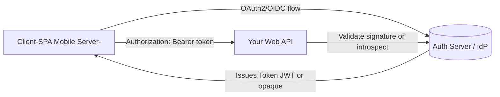

# Authentication Server (Auth Server) — Nutshell Guide

---

## 🔹 What is an Auth Server?
An **Auth Server** is an **API** that issues and validates tokens for clients and APIs, following **OAuth 2.0** and **OpenID Connect (OIDC)** standards.  
Your Web API trusts tokens issued by this service.

**Common endpoints (per spec):**
- `/authorize` → user login/consent
- `/token` → exchange credentials for tokens
- `/introspect` → check opaque token validity
- `/userinfo` → fetch user claims
- `/.well-known/openid-configuration` → discovery document
- `/jwks` → JSON Web Key Set (public signing keys for JWTs)

---

## 🔹 Options for Auth Servers

### 1. Managed (Third-Party) IdP
**Examples:** Azure AD (Entra ID), Auth0, Okta, AWS Cognito, Google Identity

**Pros**
- Fastest to production; high reliability & security
- Supports MFA, SSO, social logins out of the box
- Handles key rotation, logging, monitoring

**Cons**
- Ongoing per-user costs
- Vendor lock-in; limited custom flows

**Use when**
- You need SSO, MFA, social logins quickly
- Compliance requirements (SOC2, SAML, OIDC)
- You don’t want to maintain auth infra

---

### 2. Self-Hosted IdP (You Run It)
**Examples:** Keycloak, FusionAuth, Ory (Hydra/Kratos), Zitadel, Duende IdentityServer

**Pros**
- Full control of policies and data
- Can be more cost-effective at scale
- On-prem or private cloud ready

**Cons**
- You own upgrades, patching, scaling
- Requires in-house security expertise

**Use when**
- Strict compliance/data residency requirements
- Complex multi-tenant or custom auth flows
- You want to avoid SaaS per-user fees

---

### 3. Build Your Own (Roll Your Own)
Implement `/token`, signing, rotation, revocation, refresh, MFA, device flows, etc.

**Pros**
- Maximum flexibility

**Cons**
- **High risk**: security, correctness, maintenance
- Easy to mis-implement (rotation, replay, PKCE, nonce, JOSE, etc.)

**Use when**
- Only if **standards IdPs cannot satisfy requirements** (rare)

---

## 🔹 How It Fits with Your Web API



- **JWT bearer** → API validates using IdP’s `/jwks` (stateless)  
- **Opaque bearer** → API calls IdP’s `/introspect` (stateful)

---

## 🔹 Decision Table

| Constraint | Best Fit |
|------------|----------|
| Need quick launch + SSO + MFA | Managed IdP (Auth0, Okta, Azure AD) |
| On-prem / strict residency | Self-hosted IdP (Keycloak, FusionAuth, Zitadel) |
| Custom login flows | Self-hosted IdP |
| Easy revocation required | Opaque tokens + introspection |
| Large scale, low latency | JWT + JWKS validation |
| Small team, low security bandwidth | Managed IdP |

---

## 🔹 ASP.NET Core Integration

- **JWT Bearer**  
```csharp
builder.Services.AddAuthentication(JwtBearerDefaults.AuthenticationScheme)
    .AddJwtBearer(options =>
    {
        options.Authority = "https://your-idp";
        options.Audience = "your-api";
    });
```

- **OIDC (web apps)**  
```csharp
builder.Services.AddAuthentication()
    .AddOpenIdConnect("oidc", options =>
    {
        options.Authority = "https://your-idp";
        options.ClientId = "client-id";
        options.ClientSecret = "secret";
    });
```

---

## 🔹 Gotchas & Tips
- Always use **HTTPS**
- Use **PKCE** for SPAs/mobile
- Enable **key rotation**; validate `iss`, `aud`, `exp`
- For **instant revocation**, prefer opaque tokens or short JWT expiry
- Centralize roles/scopes in IdP; enforce in API with policies

---

### ✅ Bottom Line
- An **Auth Server is an API** that issues and validates tokens.  
- **Don’t build your own** unless absolutely necessary.  
- Prefer **Managed IdPs** first, **Self-Hosted** if compliance/customization demand it.  
- Your API just **validates tokens** and applies **authorization policies**.
