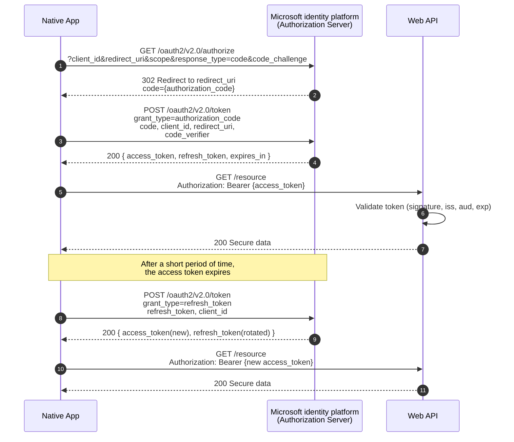
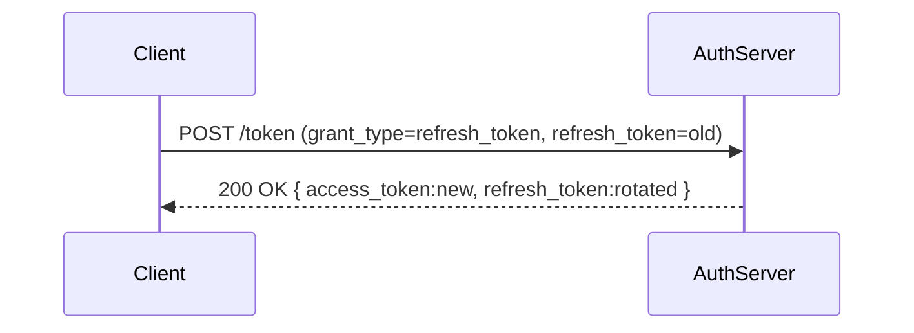

# OAuth 2.0 for Web APIs — Setup, Claims/Roles, Auth Handling, Refresh Workflow

> Pragmatic guide for ASP.NET Core APIs & clients using OAuth 2.0 and (optionally) OpenID Connect (OIDC).

---

## 🔹 OAuth 2.0 vs OIDC (Quick)
- **OAuth 2.0** → Authorization (get an **access token** to call APIs).
- **OpenID Connect (OIDC)** → Authentication layer on top of OAuth 2.0 (adds **ID token** + user info & discovery).  
**Most real-world setups use OIDC** for login, and OAuth 2.0 access tokens for APIs.

---

## 🔹 Choose the Right Flow

| Scenario | Flow | Notes |
|---|---|---|
| SPA (browser JS), Mobile | **Authorization Code + PKCE** | No client secret; use PKCE |
| Server-rendered Web App | **Authorization Code** | Confidential client with secret |
| Machine-to-Machine | **Client Credentials** | No user; app identity only |
| Device/Console | **Device Code** | User authorizes on another device |

> Avoid implicit flow. Always prefer **Authorization Code (+PKCE)** for public clients.

---

## 🔹 High-Level Diagrams

### A) Authorization Code (+PKCE)


### B) Refresh Token Rotation


---

## 🔹 IdP Setup (Generic Steps)
1. **Create Application** in your Identity Provider (Auth0/Okta/Azure AD/Keycloak/etc.).  
2. Configure **Redirect URI** (e.g., `https://app.example.com/callback`), and **Logout URI**.  
3. Define **API / Resource** (audience) and **scopes** (e.g., `orders.read`, `orders.write`).  
4. Define **roles** and assign them to **users** or **groups**.  
5. (Optional) Add **custom claims** in tokens via IdP rules/policies (e.g., `tenant_id`, `department`).  
6. Turn on **Refresh Tokens** and **Rotation** (if using long-lived sessions).

---

## 🔹 ASP.NET Core — Protecting the API (JWT Bearer)

```csharp
using Microsoft.AspNetCore.Authentication.JwtBearer;
using Microsoft.IdentityModel.Tokens;

var builder = WebApplication.CreateBuilder(args);

builder.Services.AddAuthentication(JwtBearerDefaults.AuthenticationScheme)
    .AddJwtBearer(options =>
    {
        options.Authority = "https://your-idp.example.com"; // OIDC discovery
        options.Audience  = "your-api";                     // the API identifier ('aud')
        options.TokenValidationParameters = new TokenValidationParameters
        {
            ValidateIssuer = true,
            ValidateAudience = true,
            ValidateLifetime = true,
            ValidateIssuerSigningKey = true,
            // Optional mappings based on your IdP's claim types:
            NameClaimType = "name",
            RoleClaimType = "role"
        };
    });

builder.Services.AddAuthorization(options =>
{
    // Scope-based policy
    options.AddPolicy("Orders.Read", p => p.RequireClaim("scope", "orders.read"));
    options.AddPolicy("Orders.Write", p => p.RequireClaim("scope", "orders.write"));

    // Role-based policy
    options.AddPolicy("AdminsOnly", p => p.RequireRole("admin"));
});

var app = builder.Build();
app.UseHttpsRedirection();
app.UseAuthentication();
app.UseAuthorization();

app.MapGet("/api/orders", () => Results.Ok(new[] { "A1001", "A1002" }))
   .RequireAuthorization("Orders.Read");

app.MapPost("/api/orders", () => Results.Created("/api/orders/123", new { Id = 123 }))
   .RequireAuthorization("Orders.Write");

app.MapGet("/api/admin", () => Results.Ok(new { secret = "42" }))
   .RequireAuthorization("AdminsOnly");

app.Run();
```

**What happens?**  
- Middleware validates token signature/issuer/audience/lifetime.  
- Builds a **ClaimsPrincipal** (`HttpContext.User`).  
- **Authorization policies** enforce scopes/roles before your endpoint runs.

---

## 🔹 Claims & Roles (Where They Come From and How to Use Them)

### Where claims/roles come from
- The **IdP issues them** at token creation. You typically configure this in the IdP’s admin UI (rules/mappings).

### Common claims
- **OIDC**: `sub`, `name`, `preferred_username`, `email`
- **Authorization**: `scope` (space-separated) and **`role`** claims
- **Custom**: `tenant_id`, `department`, `permissions` (keep it small!)

### Using them in ASP.NET Core
```csharp
// Scope-based authorization
options.AddPolicy("Reports.View", p => p.RequireClaim("scope", "reports.view"));

// Role-based authorization
options.AddPolicy("ManagersOnly", p => p.RequireRole("manager"));

app.MapGet("/api/reports", () => "ok").RequireAuthorization("Reports.View");
app.MapGet("/api/manage",  () => "ok").RequireAuthorization("ManagersOnly");
```

> If your IdP uses different claim names (e.g., `roles` or `permissions`), set `RoleClaimType` and/or use custom **authorization handlers**.

---

## 🔹 Client: Getting Tokens (Auth Code + PKCE - Pseudocode)

```ts
// 1) Redirect to /authorize with code_challenge (PKCE)
const verifier = generateRandomString();
const challenge = base64url(sha256(verifier));
location.href = `https://idp/authorize?client_id=...&response_type=code&redirect_uri=${cb}&scope=openid%20profile%20orders.read&code_challenge=${challenge}&code_challenge_method=S256`;

// 2) On callback, exchange code + verifier for tokens at /token
POST https://idp/token
  grant_type=authorization_code
  code=...
  redirect_uri=...
  code_verifier=<verifier>

// 3) Store access_token securely (and refresh_token if allowed)
```

> SPAs: avoid localStorage for long-term storage; use **httpOnly secure cookies** or a **BFF** pattern.

---

## 🔹 Refresh Workflow (Keep Sessions Alive)

### Access Tokens
- Short-lived (e.g., **5–15 minutes**). API rejects expired tokens with **401**.

### Refresh Tokens
- Long-lived, **rotate** on each use. Store **securely** (httpOnly cookie or server session).

#### Client refresh call
```http
POST /token
Content-Type: application/x-www-form-urlencoded

grant_type=refresh_token&client_id=...&refresh_token=<old>
```
**Response**
```json
{
  "access_token": "...",
  "refresh_token": "...", // rotated
  "expires_in": 900,
  "token_type": "Bearer",
  "scope": "orders.read orders.write"
}
```

**Best practices**
- Enable **reuse detection** and token **rotation** in IdP.
- Refresh **proactively** (e.g., 60–120s before expiry) + **retry on 401**.
- Re-authenticate when refresh fails (revoked/expired).

---

## 🔹 Client Credentials (Machine-to-Machine)

```http
POST /token
grant_type=client_credentials&client_id=...&client_secret=...&scope=orders.read
```
- Token has **no user**; claims represent the **application**.  
- Use for **backend-to-backend** calls and scheduled jobs.

---

## 🔹 Handling Authentication Failures in API

```csharp
.AddJwtBearer(options =>
{
    options.Events = new JwtBearerEvents
    {
        OnChallenge = ctx =>
        {
            // Adds standard WWW-Authenticate header for clients
            ctx.Response.Headers["WWW-Authenticate"] =
              "Bearer error=\"invalid_token\"";
            return Task.CompletedTask;
        },
        OnAuthenticationFailed = ctx =>
        {
            if (ctx.Exception is SecurityTokenExpiredException)
                ctx.Response.Headers["Token-Expired"] = "true";
            return Task.CompletedTask;
        }
    };
});
```
- **401 Unauthorized** → token invalid/expired/missing.  
- **403 Forbidden** → token valid, but **missing required scopes/roles**.

---

## 🔹 Security Checklist

- [ ] **HTTPS only** (HSTS enabled)  
- [ ] Use **Authorization Code + PKCE** for SPAs/mobile  
- [ ] Short-lived access tokens; **refresh rotation** enabled  
- [ ] Validate `iss`, `aud`, `exp`, `nbf`; small clock skew  
- [ ] Minimal claims; set `RoleClaimType`/`NameClaimType` if needed  
- [ ] Least-privilege **scopes**; deny by default with policies  
- [ ] Key rotation (JWKs, `kid` header); monitor token errors  
- [ ] Avoid storing tokens in localStorage; prefer **BFF** or secure cookies

---

### ✅ Bottom Line
- Configure your **IdP** (scopes, roles, claims).  
- Protect your **API** with `AddJwtBearer` and **policies**.  
- Use **Authorization Code (+PKCE)** to get tokens; **refresh** for long sessions.  
- Enforce **scopes/roles** at the API and return **401/403** appropriately.
