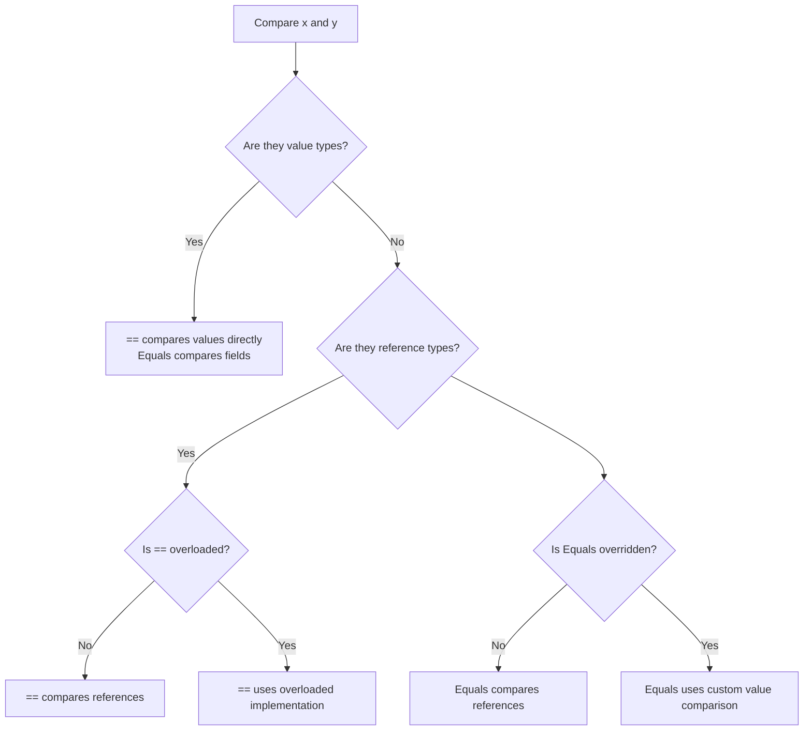

# Equals() vs == in C#

A deep dive into the difference between **`Equals()`** and **`==`**, with code examples, best practices, and when to use each.

---

## 1) High-Level Difference

| Feature | `Equals()` | `==` |
|---------|------------|------|
| Type | Virtual **method** (from `object`) | **Operator**, can be overloaded |
| Default (Reference Types) | Compares **references** (identity) | Compares **references** unless overloaded |
| Default (Value Types) | Field-by-field comparison (`ValueType.Equals`) | Value comparison (for built-in types); not defined unless overloaded |
| Overridable? | Yes (override in your class/struct) | Yes (operator overload) |
| Polymorphic? | Yes (virtual dispatch at runtime) | No (resolved at compile-time unless overloaded) |
| Null Handling | `null.Equals(x)` throws, but `object.Equals(null, x)` works | `null == null` is safe (`true`) |

---

## 2) Default Behavior

- **Reference types (classes)**  
  - `Equals()` → compares references (same object?).  
  - `==` → compares references unless overridden.

- **Value types (structs)**  
  - `Equals()` → compares fields.  
  - `==` → works for built-in structs (int, double, etc.). Custom structs must overload.

---

## 3) Special Case: `string`

Both are overridden to compare **contents**:

```csharp
string a = "hello";
string b = new string("hello".ToCharArray());

Console.WriteLine(a == b);       // True (value comparison)
Console.WriteLine(a.Equals(b));  // True (value comparison)
```

---

## 4) When to Use

✅ **Use `==` when:**
- Comparing primitives (`int`, `double`, `bool`).
- Comparing strings (clean syntax, compares values).
- When type properly overloads `==` (e.g., `DateTime`, `Guid`).

✅ **Use `Equals()` when:**
- You need polymorphic equality (base class reference → derived class).  
- Implementing equality in custom types (`override Equals()` + `GetHashCode()`).  
- Avoiding surprises with overloaded operators.  

⚠️ **Avoid pitfalls:**
- If a class doesn’t overload `==`, it defaults to reference equality.  
- Use `== null`, not `Equals(null)` (avoids `NullReferenceException`).

---

## 5) Example

```csharp
public class Person
{
    public string Name { get; set; }

    public override bool Equals(object obj)
    {
        if (obj is Person other)
            return Name == other.Name;
        return false;
    }

    public override int GetHashCode() => Name.GetHashCode();

    // Overload operators for consistency
    public static bool operator ==(Person left, Person right) =>
        Equals(left, right);

    public static bool operator !=(Person left, Person right) =>
        !Equals(left, right);
}

var p1 = new Person { Name = "Alice" };
var p2 = new Person { Name = "Alice" };

Console.WriteLine(p1.Equals(p2)); // True
Console.WriteLine(p1 == p2);      // True (because we overloaded)
```

Without operator overload → `p1 == p2` would be `false` (different references).

---

## 6) Best Practices

- If you override `Equals()`, also override `GetHashCode()` and (ideally) `==`/`!=`.  
- Use `==` for primitives and strings.  
- Use `Equals()` for polymorphism or null-safe static call (`object.Equals(a,b)`).  
- Keep `Equals`, `==`, and `GetHashCode` consistent.  

---

## 7) Flowchart — How Comparison Works



---

## 8) Quick Summary

- `==` → operator, can be overloaded, defaults to reference equality (except for value types/strings).  
- `Equals()` → virtual method, polymorphic, usually overridden for value semantics.  
- **Strings** → both compare values.  
- Always override `Equals`, `GetHashCode`, and `==` together for consistency.  
