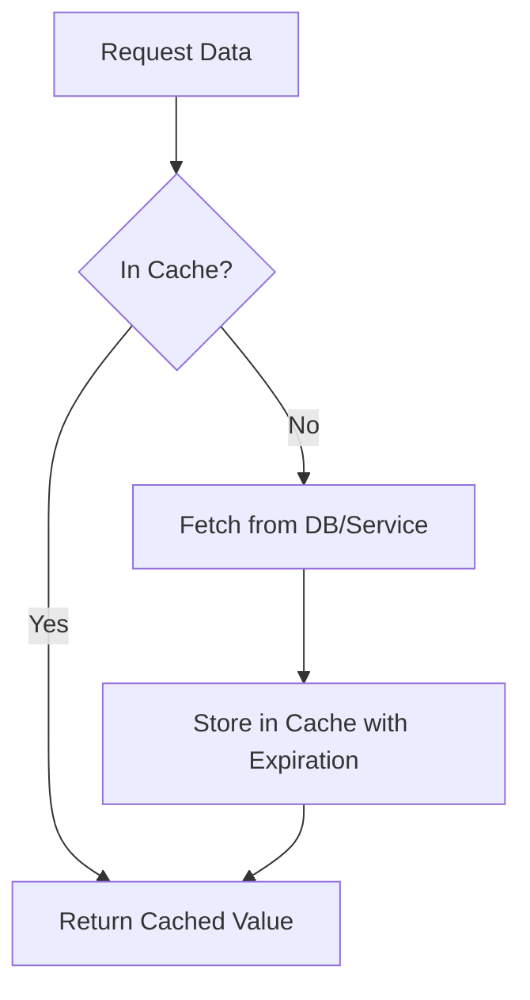

# Caching in .NET — Complete Guide

A deep dive into caching strategies in .NET and ASP.NET Core, including **in-memory**, **distributed**, **response caching**, and more. Includes code samples and flowcharts.

---

## 1) Why Caching?

Caching = storing data closer to where it’s consumed.

- ✅ Improves performance  
- ✅ Reduces expensive I/O (DB, network)  
- ✅ Improves scalability  
- ⚠️ Needs careful invalidation & memory management  

---

## 2) Types of Caching in .NET

### A) In-Memory Caching

Stores data in the app’s memory.

- API: `IMemoryCache`
- Great for single-instance apps.
- Data lost on app restart.

```csharp
// Register
builder.Services.AddMemoryCache();

// Use
public class UserService
{
    private readonly IMemoryCache _cache;
    public UserService(IMemoryCache cache) => _cache = cache;

    public User GetUser(int id)
    {
        return _cache.GetOrCreate($"user:{id}", entry =>
        {
            entry.AbsoluteExpirationRelativeToNow = TimeSpan.FromMinutes(5);
            return LoadUserFromDb(id);
        });
    }
}
```

---

### B) Distributed Caching

Stores cache data in external systems (Redis, SQL Server, NCache).

- API: `IDistributedCache`
- Useful for load-balanced, multi-server apps.

```csharp
// Register (Redis)
builder.Services.AddStackExchangeRedisCache(options =>
{
    options.Configuration = "localhost:6379";
    options.InstanceName = "SampleApp:";
});

// Use
public class ProductService
{
    private readonly IDistributedCache _cache;
    public ProductService(IDistributedCache cache) => _cache = cache;

    public async Task<Product?> GetProductAsync(int id)
    {
        var key = $"product:{id}";
        var cached = await _cache.GetStringAsync(key);
        if (cached is not null) return JsonSerializer.Deserialize<Product>(cached);

        var product = await LoadFromDbAsync(id);
        await _cache.SetStringAsync(key, JsonSerializer.Serialize(product),
            new DistributedCacheEntryOptions
            {
                AbsoluteExpirationRelativeToNow = TimeSpan.FromMinutes(10)
            });
        return product;
    }
}
```

---

### C) Response Caching (HTTP)

Caches responses at HTTP layer.

- Middleware: `app.UseResponseCaching()`
- Controlled with headers.

```csharp
builder.Services.AddResponseCaching();

var app = builder.Build();
app.UseResponseCaching();

[HttpGet]
[ResponseCache(Duration = 60, Location = ResponseCacheLocation.Any)]
public ActionResult<string> Get() => DateTime.Now.ToString();
```

---

### D) Output Caching (ASP.NET Core 7+)

Caches **action results** inside ASP.NET Core pipeline.

```csharp
builder.Services.AddOutputCache();

var app = builder.Build();
app.UseOutputCache();

app.MapGet("/time", () => DateTime.Now.ToString())
   .CacheOutput(p => p.Expire(TimeSpan.FromSeconds(30))
                     .Tag("time-tag"));
```

---

### E) EF Second-Level Cache

Use libraries like `EFCoreSecondLevelCacheInterceptor` to cache EF Core queries.

---

## 3) Cache Expiration Strategies

- **Absolute Expiration** → fixed duration.  
- **Sliding Expiration** → reset if accessed.  
- **Size-based eviction** → memory pressure.  
- **Manual invalidation** → remove explicitly.  
- **Tags/keys** → group invalidation.  

---

## 4) Best Practices

- ✅ Use **IMemoryCache** for local caches.  
- ✅ Use **Redis/IDistributedCache** for multi-instance apps.  
- ✅ Always set **expiration policies**.  
- ✅ Cache only **expensive results**.  
- ✅ Use consistent **cache keys**.  
- ✅ Monitor **cache hit ratio**.  
- ✅ Don’t cache secrets.  

---

## 5) Pitfalls

- ❌ **Stale data** if invalidation is missed.  
- ❌ **Over-caching** → memory pressure.  
- ❌ **Cache stampede** (many misses at once).  
  - Fix: use **locking** or async factory.  
- ❌ **Distributed cache latency** may offset benefits.  
- ❌ Don’t rely on cache for **critical correctness**.  

---

## 6) Flowchart: Cache Lookup



---

## 7) Comparison

| Type              | API                  | Scope           | Best For                |
|-------------------|----------------------|-----------------|-------------------------|
| In-Memory         | `IMemoryCache`       | Local process   | Single server apps      |
| Distributed       | `IDistributedCache`  | Shared external | Multi-server apps       |
| Response Caching  | Middleware           | HTTP responses  | Simple GETs             |
| Output Caching    | Middleware (.NET 7+) | ASP.NET Core    | Flexible per-action     |
| EF 2nd-level      | 3rd party lib        | ORM layer       | DB-heavy apps           |

---

## ✅ Quick Checklist

- [ ] Pick correct cache type (memory vs distributed).  
- [ ] Always set expirations.  
- [ ] Avoid caching sensitive data.  
- [ ] Watch for stampedes.  
- [ ] Add monitoring & metrics.  
