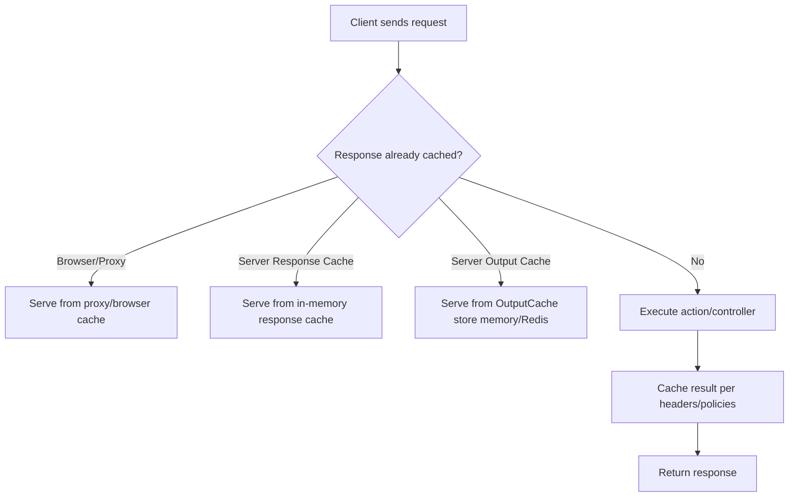

# Response Caching vs Output Caching in ASP.NET Core

A clear comparison of **Response Caching (HTTP)** and **Output Caching (ASP.NET Core 7+)**, including where data is stored, whether Redis can be used, and practical usage.

---

## 1) Response Caching (HTTP)

- Enables/controls **HTTP caching** using standard headers:  
  - `Cache-Control`, `Expires`, `Vary`, `ETag`, `Last-Modified`
- Works with **browsers**, **CDNs**, **reverse proxies** (CloudFront, Azure Front Door, NGINX).  
- Middleware can also keep a small **in-process cache** of responses.

### Limitations
- **Server storage**: in-memory only (per instance).  
- **Not pluggable**: cannot use Redis/IDistributedCache.  
- **Best used**: to leverage **client/proxy caching**.

### Example
```csharp
builder.Services.AddResponseCaching();

var app = builder.Build();
app.UseResponseCaching();

[HttpGet]
[ResponseCache(Duration = 60, Location = ResponseCacheLocation.Any, VaryByHeader = "Accept-Encoding")]
public IActionResult Get() => Ok(DateTime.Now);
```

---

## 2) Output Caching (ASP.NET Core 7+)

- **Server-side response memoization**: captures action results and replays them.  
- Rich policies: **vary-by-query**, **vary-by-header**, **tagging**, **programmatic invalidation**.  
- **More powerful than Response Caching**.  

### Storage
- **Default**: in-memory (per instance).  
- **Pluggable**: replace `IOutputCacheStore` to back it with **Redis** or other distributed caches → shared cache across servers.

### Example (in-memory)
```csharp
builder.Services.AddOutputCache();

var app = builder.Build();
app.UseOutputCache();

app.MapGet("/products", () => new[] { "A", "B" })
   .CacheOutput(p => p.Expire(TimeSpan.FromMinutes(5))
                      .SetVaryByQuery("category", "page", "pageSize")
                      .Tag("products-list"));
```

### Example (with distributed store like Redis)
```csharp
builder.Services.AddOutputCache();

// Plug in a custom or library-provided IOutputCacheStore backed by Redis
builder.Services.AddSingleton<IOutputCacheStore>(sp =>
    new RedisOutputCacheStore(/* Redis connection */));
```

---

## 3) Key Differences

| Aspect | Response Caching (HTTP) | Output Caching |
|--------|--------------------------|----------------|
| Goal | Guide browsers/CDNs/proxies with headers | Cache responses server-side with policies |
| Driven by | HTTP headers (`Cache-Control`, `ETag`) | OutputCachePolicy / attributes |
| Scope | Mainly GET/HEAD | Usually GET/HEAD, but flexible |
| Storage | In-memory only (per instance) | In-memory by default; can use Redis or other stores |
| Multi-server | ❌ Each server caches separately | ✅ Can share via distributed store |
| Invalidation | Expiry headers, revalidation (`304`) | Tag/key-based, programmatic purge |
| Revalidation | Supports 304 Not Modified | Full cached body (no built-in 304) |
| Use Case | Leverage browser/CDN cache | Reduce server load, multi-instance scaling |

---

## 4) Flowchart — Which Cache Handles It?



---

## 5) Practical Guidance

- **Response Caching** → use when you want to leverage **client & CDN caching** via HTTP headers.  
- **Output Caching** → use when you need **server-side caching** with fine-grained control and invalidation.  
- Combine them:  
  - Output Caching for **server load reduction**.  
  - Response Caching headers for **browser/CDN efficiency**.  
- For **multi-server** environments → Output Caching + Redis store.  

---
