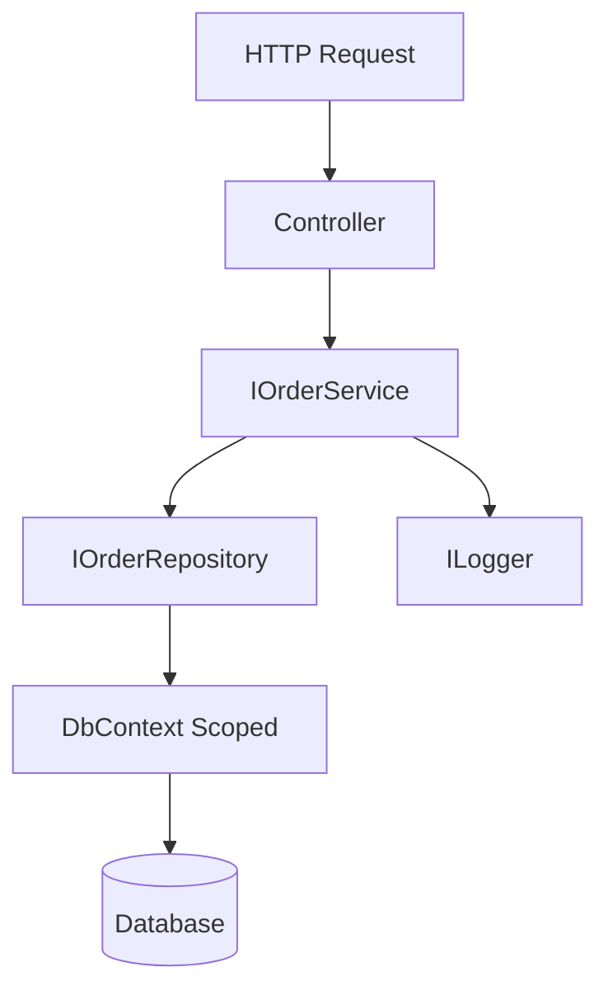

# 🤝 Dependency Injection (DI) in .NET Core

**Dependency Injection (DI)** is a technique where an object’s dependencies are **provided from the outside** (injected), rather than the object creating them itself. ASP.NET Core has DI **built-in** via `IServiceCollection` and `IServiceProvider`.

---

## Why DI? (Benefits)
- **Unit testing**: inject **mocks/fakes** easily → fast, isolated tests.
- **Loose coupling**: code depends on **abstractions** (interfaces), not implementations.
- **Maintainability & extensibility**: swap implementations via registration, not code changes.
- **Lifetime management**: container owns object lifetimes and disposal.
- **Cross‑cutting**: logging, options, HTTP clients, caching through DI in a consistent way.
- **SOLID alignment**: Strongly supports SRP, OCP, DIP.

---

## What are “services” in ASP.NET Core?
“**Services**” are *objects registered in the DI container* (via `IServiceCollection` in `Program.cs`) and later **resolved** by the framework (`IServiceProvider`) and injected into constructors (controllers, Razor pages, minimal API handlers, background workers, etc.).

Examples of services:
- Your app abstractions (e.g., `IOrderService`, `IEmailSender`, `IOrderRepository`).
- Framework services (logging via `ILogger<T>`, configuration `IConfiguration`, options `IOptions<T>`, `IHttpClientFactory`, caching, EF Core `DbContext`, hosted services, etc.).

---

## DI Basics (Program.cs)
```csharp
var builder = WebApplication.CreateBuilder(args);

// Register services (the Composition Root)
builder.Services.AddControllers();
builder.Services.AddLogging();
builder.Services.AddDbContext<AppDbContext>(o =>
    o.UseSqlServer(builder.Configuration.GetConnectionString("Default")));

// App abstractions
builder.Services.AddScoped<IOrderService, OrderService>();
builder.Services.AddScoped<IOrderRepository, EfOrderRepository>();

// Options & HttpClient
builder.Services.Configure<EmailOptions>(builder.Configuration.GetSection("Email"));
builder.Services.AddHttpClient<IEmailSender, SmtpEmailSender>();

var app = builder.Build();
app.MapControllers();
app.Run();
```

> `builder.Services` is the place you **register** all dependencies; ASP.NET Core then **injects** them where needed.

---

## Lifetimes: Transient, Scoped, Singleton
| Lifetime    | When created                                 | Typical usage |
|-------------|----------------------------------------------|---------------|
| **Transient**  | New instance **every resolution**             | Stateless, lightweight operations |
| **Scoped**     | One per **HTTP request** (or logical scope)   | Web requests, EF `DbContext`, business services |
| **Singleton**  | **One for the app** (until shutdown)          | Config readers, caches, stateless singletons |

```csharp
services.AddTransient<IIdGenerator, GuidIdGenerator>();
services.AddScoped<IOrderService, OrderService>();         // per request
services.AddSingleton<ISystemClock, SystemClock>();
```

> ⚠️ **Captive dependency**: Don’t inject a **Scoped** service into a **Singleton** (scope mismatch).

---

## Constructor Injection (preferred)
```csharp
public class OrdersController : ControllerBase
{
    private readonly IOrderService _service;
    private readonly ILogger<OrdersController> _logger;

    public OrdersController(IOrderService service, ILogger<OrdersController> logger)
    {
        _service = service;
        _logger = logger;
    }

    [HttpPost("orders")]
    public async Task<IActionResult> Create([FromBody] CreateOrderDto dto)
    {
        var id = await _service.PlaceAsync(dto);
        _logger.LogInformation("Order {OrderId} created", id);
        return CreatedAtAction(nameof(GetById), new { id }, null);
    }
}
```

---

## How DI helps Unit Testing

### 1) Mocking dependencies (classic example with xUnit + Moq)
```csharp
public interface IOrderRepository
{
    Task AddAsync(Order order);
    Task<Order?> GetAsync(Guid id);
}

public interface IPaymentGateway
{
    Task<bool> ChargeAsync(decimal amount);
}

public class OrderService : IOrderService
{
    private readonly IOrderRepository _repo;
    private readonly IPaymentGateway _payments;

    public OrderService(IOrderRepository repo, IPaymentGateway payments)
    {
        _repo = repo; _payments = payments;
    }

    public async Task<Guid> PlaceAsync(CreateOrderDto dto)
    {
        var order = new Order { Id = Guid.NewGuid(), Total = dto.Total };
        var ok = await _payments.ChargeAsync(order.Total);
        if (!ok) throw new InvalidOperationException("Payment failed");
        await _repo.AddAsync(order);
        return order.Id;
    }
}
```

**Unit test:**
```csharp
public class OrderServiceTests
{
    [Fact]
    public async Task PlaceAsync_ChargesAndSaves_WhenPaymentSucceeds()
    {
        var repo = new Mock<IOrderRepository>();
        var gateway = new Mock<IPaymentGateway>();
        gateway.Setup(g => g.ChargeAsync(It.IsAny<decimal>())).ReturnsAsync(true);

        var sut = new OrderService(repo.Object, gateway.Object);
        var id = await sut.PlaceAsync(new CreateOrderDto { Total = 42m });

        repo.Verify(r => r.AddAsync(It.Is<Order>(o => o.Total == 42m)), Times.Once);
        gateway.Verify(g => g.ChargeAsync(42m), Times.Once);
        Assert.NotEqual(Guid.Empty, id);
    }
}
```

- Because the service depends on **interfaces**, we can **mock** them to isolate the test from real DB/HTTP.

### 2) Minimal integration test with WebApplicationFactory
```csharp
public class OrdersApiTests : IClassFixture<WebApplicationFactory<Program>>
{
    private readonly WebApplicationFactory<Program> _factory;

    public OrdersApiTests(WebApplicationFactory<Program> factory)
    {
        _factory = factory.WithWebHostBuilder(builder =>
        {
            builder.ConfigureServices(services =>
            {
                // Replace real repo with in-memory fake for tests
                services.RemoveAll<IOrderRepository>();
                services.AddSingleton<IOrderRepository, InMemoryOrderRepository>();
            });
        });
    }

    [Fact]
    public async Task PostOrders_Returns201()
    {
        var client = _factory.CreateClient();
        var response = await client.PostAsJsonAsync("/orders", new { total = 10m });
        response.EnsureSuccessStatusCode();
        Assert.Equal(HttpStatusCode.Created, response.StatusCode);
    }
}
```
- DI allows **overriding registrations** at test time for fast, deterministic integration tests.

---

## Beyond Unit Tests — Other Wins with DI
- **Observability**: Inject `ILogger<T>`, `IMeterFactory`, `IHostApplicationLifetime` for logging/metrics/lifecycle hooks.
- **Configuration & Options**: Bind settings to POCOs via `IOptions<T>` and inject them.
- **HTTP calls**: Use `IHttpClientFactory` and **typed clients** for resilience (retry, circuit breaker via Polly).
- **Background tasks**: `IHostedService`/`BackgroundService` are registered and injected via DI.
- **EF Core**: Register `DbContext` as **Scoped** and inject it; context lifetime matches request lifetime.

```csharp
// Options pattern
builder.Services.Configure<SmtpOptions>(builder.Configuration.GetSection("Smtp"));
public class SmtpEmailSender : IEmailSender
{
    private readonly IOptions<SmtpOptions> _options;
    private readonly HttpClient _http;
    public SmtpEmailSender(IOptions<SmtpOptions> options, HttpClient http)
    { _options = options; _http = http; }

    public Task SendAsync(string to, string subject, string body)
    {
        // Use _options.Value and _http
        return Task.CompletedTask;
    }
}
```

---

## Flow: Request → Controller → Service → Repository → Database

### ASCII Diagram
```
[HTTP Request]
      |
      v
 [Controller]  -->  (DI injects)  -->  [IOrderService]
                                       /                                                v            v
                           [IOrderRepository]   [ILogger]
                                      |
                                      v
                                [EF Core DbContext]
                                      |
                                      v
                                   [Database]
```

### Mermaid


---

## Anti‑patterns & Pitfalls
- ❌ **Service Locator**: calling `IServiceProvider.GetService` deep inside your code hides dependencies.
- ❌ **Static singletons**: hard to test; prefer container-managed singletons.
- ⚠️ **Captive dependencies**: Injecting Scoped into Singleton causes runtime errors and hidden state sharing.
- ⚠️ **Disposal**: If you create IDisposable manually, ensure disposal; DI handles disposal of container‑owned instances.

---

## Console/Worker Apps (Generic Host)
DI isn’t just for ASP.NET. Use it in workers/console apps too:

```csharp
using Microsoft.Extensions.DependencyInjection;
using Microsoft.Extensions.Hosting;

await Host.CreateDefaultBuilder(args)
    .ConfigureServices(services =>
    {
        services.AddSingleton<ISystemClock, SystemClock>();
        services.AddTransient<IWorker, Worker>();
        services.AddHostedService<WorkerHostedService>();
    })
    .RunConsoleAsync();
```

---

## Quick Glossary
- **IServiceCollection**: Registration list (add services here).
- **IServiceProvider**: Resolver/factory built from the collection.
- **Service**: Any class registered and resolved by DI.
- **Descriptor**: Registration entry (`ServiceDescriptor`), stores service type, implementation, lifetime.

---

## Checklist
- Use **constructor injection** and depend on **interfaces**.
- Choose correct **lifetime**: DbContext = Scoped; HttpClient via factory; stateless helpers = Singleton/Transient.
- Replace infrastructure with **fakes/mocks** in tests.
- Avoid Service Locator; keep a clear **composition root** (Program.cs).
- Wire cross‑cutting concerns (logging, options, caching) via DI.

---
