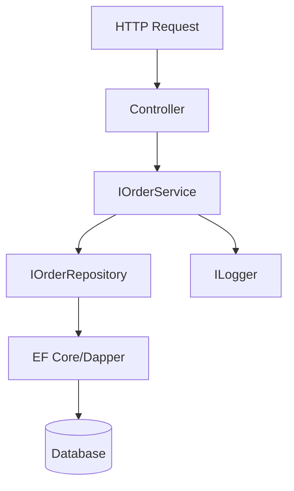

# 🧱 SOLID Principles in C# (.NET / ASP.NET Core)

SOLID is a set of principles that help you design **maintainable, testable, and extensible** software.

- **S** — Single Responsibility Principle (SRP)
- **O** — Open/Closed Principle (OCP)
- **L** — Liskov Substitution Principle (LSP)
- **I** — Interface Segregation Principle (ISP)
- **D** — Dependency Inversion Principle (DIP)

---

## 🟦 S — Single Responsibility Principle
> A class should have **one reason to change**.

### ✅ Good (ASP.NET Core Logging)
Keep logging concerns separate from business logic using `ILogger<T>`.

```csharp
public interface IOrderService
{
    Task PlaceOrderAsync(Order order);
}

public class OrderService : IOrderService
{
    private readonly IInventoryClient _inventory;
    private readonly IPaymentGateway _payments;
    private readonly ILogger<OrderService> _logger;

    public OrderService(IInventoryClient inventory, IPaymentGateway payments, ILogger<OrderService> logger)
    {
        _inventory = inventory;
        _payments = payments;
        _logger = logger;
    }

    public async Task PlaceOrderAsync(Order order)
    {
        _logger.LogInformation("Placing order {OrderId}", order.Id);
        await _inventory.ReserveAsync(order.Items);
        await _payments.ChargeAsync(order.Total);
        _logger.LogInformation("Order {OrderId} completed", order.Id);
    }
}
```

- `OrderService` handles **only order orchestration**. Logging is a **cross-cutting concern** injected via `ILogger`.

---

## 🟩 O — Open/Closed Principle
> Software entities should be **open for extension**, but **closed for modification**.

### ✅ Good (Extensible Pricing Strategy)
Add new discount rules without modifying the calculator.

```csharp
public interface IPricingRule
{
    decimal Apply(decimal subtotal, Customer ctx);
}

public class LoyaltyDiscountRule : IPricingRule
{
    public decimal Apply(decimal subtotal, Customer ctx)
        => ctx.IsLoyal ? subtotal * 0.95m : subtotal;
}

public class SeasonalDiscountRule : IPricingRule
{
    public decimal Apply(decimal subtotal, Customer ctx)
        => DateTime.UtcNow.Month == 12 ? subtotal * 0.90m : subtotal;
}

public class PriceCalculator
{
    private readonly IEnumerable<IPricingRule> _rules;
    public PriceCalculator(IEnumerable<IPricingRule> rules) => _rules = rules;

    public decimal Calculate(decimal subtotal, Customer ctx)
        => _rules.Aggregate(subtotal, (acc, r) => r.Apply(acc, ctx));
}
```

- To add a new rule, implement `IPricingRule` and register it in DI — **no changes** to `PriceCalculator`.

---

## 🟥 L — Liskov Substitution Principle
> Objects of a superclass should be **replaceable** with objects of its subclasses without breaking correctness.

### ✅ Good (Repository Abstraction)
Repositories respect contracts; swapping implementations (EF Core / Dapper) doesn’t break callers.

```csharp
public interface IOrderRepository
{
    Task<Order?> GetAsync(Guid id);
    Task AddAsync(Order order);
}

public class EfOrderRepository : IOrderRepository
{
    private readonly AppDbContext _db;
    public EfOrderRepository(AppDbContext db) => _db = db;

    public Task<Order?> GetAsync(Guid id) 
        => _db.Orders.FindAsync(id).AsTask();

    public async Task AddAsync(Order order)
    {
        _db.Orders.Add(order);
        await _db.SaveChangesAsync();
    }
}

public class DapperOrderRepository : IOrderRepository
{
    private readonly IDbConnection _conn;
    public DapperOrderRepository(IDbConnection conn) => _conn = conn;

    public async Task<Order?> GetAsync(Guid id)
        => await _conn.QuerySingleOrDefaultAsync<Order>("SELECT * FROM Orders WHERE Id=@id", new { id });

    public Task AddAsync(Order order)
        => _conn.ExecuteAsync("INSERT INTO Orders ...", order);
}
```

- Both implementations honor the **same contract** — any consumer of `IOrderRepository` keeps working.

---

## 🟨 I — Interface Segregation Principle
> Many client‑specific interfaces are better than one general‑purpose interface.

### ✅ Good (Split Interfaces)
Avoid “fat” interfaces that force implementations to support unused members.

```csharp
public interface IReader<T>
{
    Task<T?> GetAsync(Guid id);
}
public interface IWriter<T>
{
    Task AddAsync(T entity);
    Task UpdateAsync(T entity);
}

public class OrderQueryService : IReader<Order> { /* only reads */ }
public class OrderCommandService : IWriter<Order> { /* only writes */ }
```

- Read and write concerns are separated → simpler testing and deployment patterns (CQRS-friendly).

---

## 🟪 D — Dependency Inversion Principle
> High-level modules should not depend on low-level modules. Both should depend on **abstractions**.

### ✅ Good (ASP.NET Core DI + Logging + Data)
Controllers/services depend on **interfaces**; infrastructure is plugged via DI.

```csharp
builder.Services.AddScoped<IOrderService, OrderService>();
builder.Services.AddScoped<IOrderRepository, EfOrderRepository>();
builder.Services.AddDbContext<AppDbContext>(options =>
    options.UseSqlServer(builder.Configuration.GetConnectionString("Default")));
builder.Services.AddLogging();
```

- `OrderService` depends on `IOrderRepository`, **not** on EF Core. You can swap EF Core for Dapper or an API client by changing DI registration.

---

## 🔄 Flow (Request → Controller → Service → Repository → DB)

### ASCII Flowchart
```
[HTTP Request]
      |
      v
[Controller] --uses--> [IOrderService]
      |                         |
      v                         v
   [DTO -> Domain]        [IOrderRepository] <-----> [ILogger]
                                  |
                                  v
                             [EF Core / Dapper]
                                  |
                                  v
                               [Database]
```

### (Optional) Mermaid Diagram


---

## 🌐 Real-World Scenarios in .NET Core

### 1) Logging (SRP, DIP)
- Services log via `ILogger<T>` (**SRP: separation of concerns**).
- Code depends on **abstractions** (`ILogger`) while DI wires Serilog, Console, or Application Insights (**DIP**).

```csharp
public class PaymentService : IPaymentService
{
    private readonly ILogger<PaymentService> _logger;
    private readonly IPaymentGateway _gateway;

    public PaymentService(ILogger<PaymentService> logger, IPaymentGateway gateway)
    {
        _logger = logger;
        _gateway = gateway;
    }

    public async Task<bool> PayAsync(Order order)
    {
        _logger.LogInformation("Charging order {OrderId}", order.Id);
        var ok = await _gateway.ChargeAsync(order.Total);
        _logger.LogInformation("Payment {Status} for {OrderId}", ok ? "OK" : "FAILED", order.Id);
        return ok;
    }
}
```

### 2) Database Access (LSP, OCP, DIP)
- Swap EF Core / Dapper / API without touching business logic (LSP, DIP).
- Add caching or new pricing rules as decorators/strategies (OCP).

```csharp
public class CachingOrderRepository : IOrderRepository
{
    private readonly IOrderRepository _inner;
    private readonly IMemoryCache _cache;

    public CachingOrderRepository(IOrderRepository inner, IMemoryCache cache)
    {
        _inner = inner; _cache = cache;
    }

    public async Task<Order?> GetAsync(Guid id)
    {
        if (_cache.TryGetValue(id, out Order cached)) return cached;
        var order = await _inner.GetAsync(id);
        if (order != null) _cache.Set(id, order, TimeSpan.FromMinutes(5));
        return order;
    }

    public Task AddAsync(Order order) => _inner.AddAsync(order);
}
```

- `CachingOrderRepository` **extends** behavior without modifying the original repository (**OCP**).

### 3) Clean Boundaries with Interfaces (ISP, DIP)
- Web controllers → Services → Repos are wired via interfaces.
- Each interface is **focused** (ISP) and injected (DIP).

```csharp
public interface IEmailSender { Task SendAsync(string to, string subject, string body); }
public interface ISmsSender   { Task SendAsync(string to, string message); }

// A class that needs only emails shouldn't depend on SMS as well.
public class OrderNotifier
{
    private readonly IEmailSender _email;
    public OrderNotifier(IEmailSender email) => _email = email;
    public Task NotifyAsync(string to, string subject, string body) => _email.SendAsync(to, subject, body);
}
```

---

## 🧪 Testing Benefits
- **SRP**: Unit tests target small, focused classes.
- **OCP**: Add features by adding classes → fewer regression risks.
- **LSP**: Mocks/stubs replace real implementations safely.
- **ISP**: Mocks are tiny and precise.
- **DIP**: Constructor injection enables full **testability** without infrastructure.

---

## 🧰 Registration Snippets (Program.cs)
```csharp
builder.Services.AddScoped<IOrderService, OrderService>();
builder.Services.AddScoped<IOrderRepository, EfOrderRepository>(); // or DapperOrderRepository
builder.Services.AddScoped<IPricingRule, LoyaltyDiscountRule>();
builder.Services.AddScoped<IPricingRule, SeasonalDiscountRule>();
builder.Services.AddDbContext<AppDbContext>(o => o.UseNpgsql(cfg.GetConnectionString("Default")));
builder.Services.AddLogging();
builder.Services.AddMemoryCache();
```

---

## ✅ Quick Checklist
- SRP: Does each class have one reason to change?
- OCP: Can I extend behavior without modifying existing classes?
- LSP: Can I substitute any implementation for its abstraction safely?
- ISP: Are my interfaces minimal and client‑specific?
- DIP: Do high‑level modules depend on abstractions, not concretions?

---
