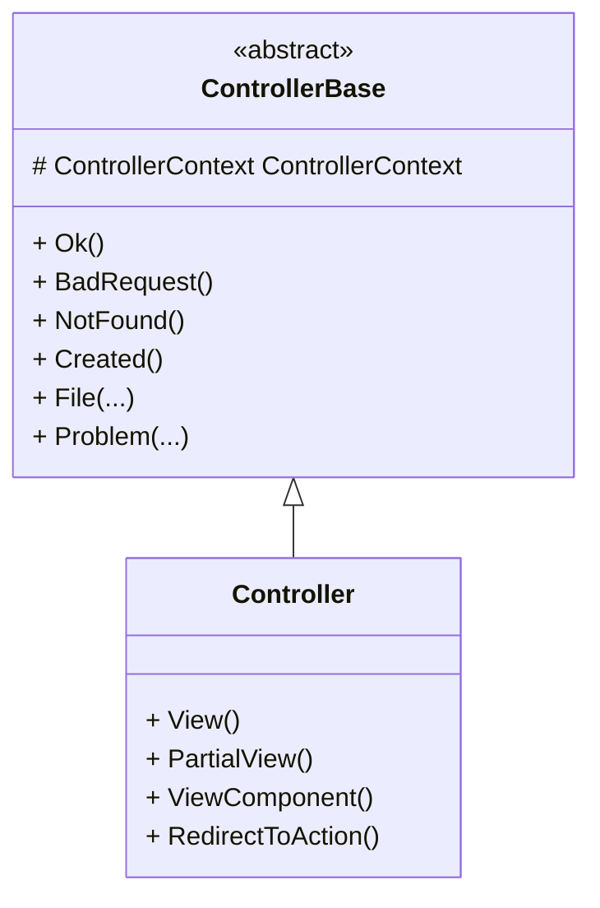

# 🧭 `ControllerBase` vs `Controller` in ASP.NET Core (with `IActionResult` patterns)

---

## TL;DR
- **`ControllerBase`** → lean base class for **Web APIs** (no view engine).  
- **`Controller`** → adds **view support** (`View()`, `PartialView()`) on top of `ControllerBase` for MVC apps.

Use **`ControllerBase`** for pure REST APIs. Use **`Controller`** when you also render Razor views.

---

## Inheritance Hierarchy

### ASCII
```
object
  └─ ControllerContext
       └─ ControllerBase      (API helpers: Ok, BadRequest, NotFound, Created, etc.)
            └─ Controller     (adds View(), PartialView(), ViewComponent(), RedirectToAction(), ...)
```

### Mermaid


---

## Typical Usage

### Web API (recommended): `ControllerBase` + `[ApiController]`
```csharp
[ApiController]
[Route("api/[controller]")]
public class ProductsController : ControllerBase
{
    [HttpGet("{id:int}")]
    public IActionResult GetById(int id)
    {
        if (id <= 0) return BadRequest("Invalid id");
        var product = new { Id = id, Name = "Laptop" };
        return Ok(product);
    }
}
```

### MVC + API mixed: `Controller`
```csharp
public class HomeController : Controller
{
    public IActionResult Index() => View(); // Razor view

    [HttpGet("api/ping")]
    public IActionResult Ping() => Ok(new { message = "pong" });
}
```

---

## Returning Results: `IActionResult` vs `ActionResult<T>`

### 1) `IActionResult`
- Most flexible: you return **any** action result.
- Good when different branches return **different result types**.

```csharp
[HttpGet("{id:int}")]
public IActionResult Get(int id)
{
    var entity = _repo.Find(id);
    if (entity is null) return NotFound();
    return Ok(entity); // 200 + JSON body
}
```

### 2) `ActionResult<T>` (strongly-typed convenience)
- Combines a **typed body** with action results (introduced for Web APIs).
- Enables better **OpenAPI/Swagger** metadata and model binding.

```csharp
[HttpGet("{id:int}")]
[ProducesResponseType(StatusCodes.Status200OK)]
[ProducesResponseType(StatusCodes.Status404NotFound)]
public ActionResult<ProductDto> Get(int id)
{
    var dto = _repo.FindDto(id);
    if (dto is null) return NotFound();
    return dto; // implicit 200 OK with body
}
```

> Rule of thumb: Prefer **`ActionResult<T>`** for GETs that normally return a T, and **`IActionResult`** when you frequently return varied results.

---

## Common Response Helpers (both `ControllerBase` & `Controller`)

| Helper/Result                    | Purpose / HTTP Status                  | Example                                                      |
|----------------------------------|----------------------------------------|--------------------------------------------------------------|
| `Ok(object value)`               | 200 OK                                  | `return Ok(dto);`                                            |
| `Created(uri, value)`            | 201 Created + `Location` header         | `return Created($"/api/p/{id}", dto);`                      |
| `CreatedAtAction(...)`           | 201 Created pointing to action          | `return CreatedAtAction(nameof(GetById), new { id }, dto);`  |
| `NoContent()`                    | 204 No Content                          | `return NoContent();`                                        |
| `BadRequest(object error)`       | 400 Bad Request                         | `return BadRequest(ModelState);`                             |
| `Unauthorized()`                 | 401 Unauthorized                        | `return Unauthorized();`                                     |
| `Forbid()`                       | 403 Forbidden (authorization failed)    | `return Forbid();`                                           |
| `NotFound(object value?)`        | 404 Not Found                           | `return NotFound(id);`                                       |
| `Conflict(object value?)`        | 409 Conflict                            | `return Conflict("Version mismatch");`                       |
| `StatusCode(int code, object?)`  | custom code                             | `return StatusCode(418, "I'm a teapot");`                    |
| `File(...)`                      | Return files/streams                    | `return File(bytes, "application/pdf", "file.pdf");`         |
| `PhysicalFile(...)`              | Return file from disk                   | `return PhysicalFile(path, "image/png");`                    |
| `VirtualFile(...)`               | Return file from web root               | `return VirtualFile("~/docs/readme.txt");`                   |
| `Redirect(...)`                  | 302/307/308 Redirect                    | `return Redirect("/login");`                                 |
| `Problem(...)`                   | RFC 7807 problem details                | `return Problem("Something broke");`                         |
| `ValidationProblem(...)`         | 400 with validation payload             | `return ValidationProblem(ModelState);`                      |

> MVC-only (available on `Controller`): `View()`, `PartialView()`, `ViewComponent()`, `RedirectToAction()`.

---

## Realistic REST Endpoints: Examples

### POST create (201 + Location)
```csharp
[HttpPost]
public ActionResult<ProductDto> Create(CreateProductDto input)
{
    var created = _service.Create(input); // returns ProductDto with Id
    return CreatedAtAction(nameof(GetById), new { id = created.Id }, created);
}
```

### PUT update (204)
```csharp
[HttpPut("{id:int}")]
public IActionResult Update(int id, UpdateProductDto input)
{
    if (!_service.Exists(id)) return NotFound();
    _service.Update(id, input);
    return NoContent();
}
```

### DELETE (404 or 204)
```csharp
[HttpDelete("{id:int}")]
public IActionResult Delete(int id)
{
    var removed = _service.Delete(id);
    return removed ? NoContent() : NotFound();
}
```

---

## Model Validation with `[ApiController]`
- Automatic 400 responses when `ModelState` is invalid (unless suppressed).
- Access validation details via `ModelState` and `ProblemDetails`.

```csharp
public record CreateProductDto([Required] string Name, [Range(0, 9999)] decimal Price);

[HttpPost]
public IActionResult Create(CreateProductDto dto)
{
    if (!ModelState.IsValid) return ValidationProblem(ModelState);
    // ...
    return Ok();
}
```

---

## When to Choose Which Base Class?

| Scenario                                 | Choose |
|------------------------------------------|--------|
| Pure JSON/REST API                       | **ControllerBase** |
| API + Razor views in same project        | **Controller**     |
| Minimal overhead / no `View()` needed    | **ControllerBase** |
| Need `View()` helpers (MVC)              | **Controller**     |

---

## Bonus: Minimal APIs vs Controllers
- Minimal APIs use endpoint mapping (e.g., `app.MapGet`) and return any serializable type or `IResult`.
- Controllers (ControllerBase/Controller) are better for **complex APIs** needing filters, model binding/validation attributes, or versioning.

```csharp
app.MapGet("/api/products/{id:int}", (int id, IProductService svc) =>
{
    var dto = svc.Find(id);
    return dto is null ? Results.NotFound() : Results.Ok(dto);
});
```

---

## Quick Checklist
- Pure API? → `ControllerBase`.  
- Need views? → `Controller`.  
- Prefer `ActionResult<T>` for typed success results; use `IActionResult` when branching widely.  
- Leverage built-in helpers (`Ok`, `CreatedAtAction`, `NoContent`, `Problem`, `File`, etc.).

---
