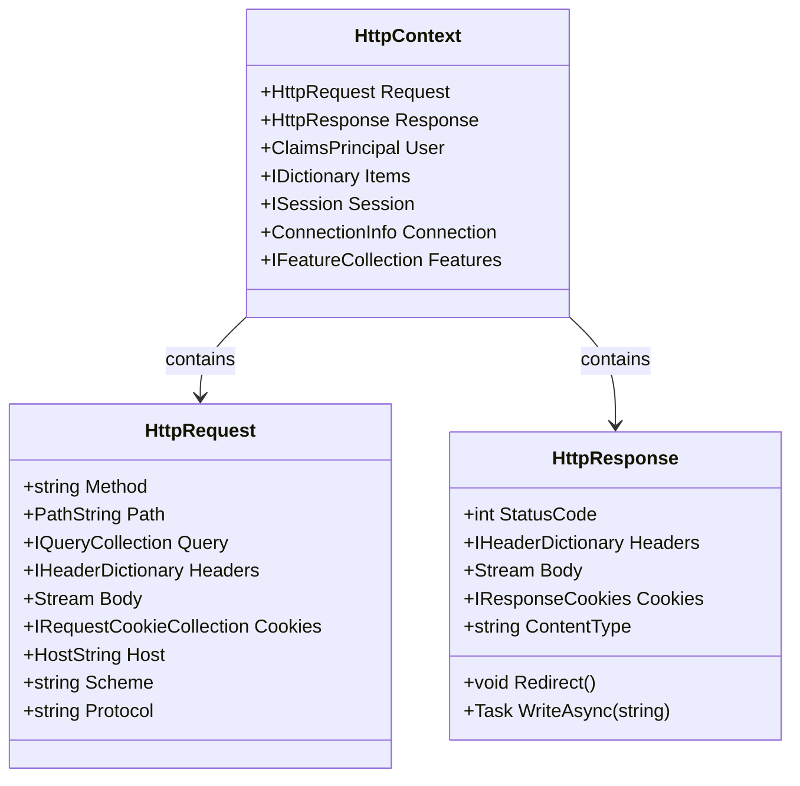

# 🌐 `HttpContext` vs `HttpRequest` vs `HttpResponse` in ASP.NET Core

**Short version:**  
- **`HttpContext`** = the *entire* HTTP transaction (request + response + user + items + session + connection + features).  
- **`HttpRequest`** = details of the *incoming request* (method, path, headers, query, cookies, body).  
- **`HttpResponse`** = represents the *outgoing response* (status code, headers, body, cookies).  

---

## 🧱 Object Model (Hierarchy)

### ASCII Diagram
```
HttpContext
├── Request : HttpRequest   (incoming)
├── Response : HttpResponse (outgoing)
├── User : ClaimsPrincipal
├── Items : IDictionary<object, object?>
├── Session : ISession (if enabled)
├── Connection : ConnectionInfo
└── Features : IFeatureCollection (WebSockets, Http/2, etc.)
```

### Mermaid Diagram


---

## 📌 Role of Each

| Object | Direction | Purpose |
|--------|-----------|---------|
| **HttpContext** | Both | Container for entire transaction (request + response + user + items + session) |
| **HttpRequest** | Incoming | Data about the request (method, path, query, headers, body, cookies) |
| **HttpResponse** | Outgoing | Data you send back (status code, headers, body, cookies) |

---

## 🧩 Middleware Examples

### 1) Read request (HttpRequest) and set response (HttpResponse)
```csharp
public class AuthMiddleware
{
    private readonly RequestDelegate _next;
    public AuthMiddleware(RequestDelegate next) => _next = next;

    public async Task InvokeAsync(HttpContext context)
    {
        HttpRequest req = context.Request;
        HttpResponse res = context.Response;

        if (!req.Headers.ContainsKey("Authorization"))
        {
            res.StatusCode = StatusCodes.Status401Unauthorized;
            await res.WriteAsync("Unauthorized");
            return; // short-circuit pipeline
        }

        await _next(context);
    }
}
```

---

### 2) Add correlation ID (HttpContext.Items + HttpResponse.Headers)
```csharp
public class CorrelationMiddleware
{
    private readonly RequestDelegate _next;
    public const string Key = "CorrelationId";

    public CorrelationMiddleware(RequestDelegate next) => _next = next;

    public async Task InvokeAsync(HttpContext ctx)
    {
        var id = Guid.NewGuid().ToString("n");
        ctx.Items[Key] = id;                        // store per-request
        ctx.Response.Headers["X-Correlation-Id"] = id; // include in response
        await _next(ctx);
    }
}
```

---

## 🎯 Controller Examples

### Inspect only the request
```csharp
[HttpGet]
public IActionResult List()
{
    var method = Request.Method;       // GET
    var path = Request.Path;           // /api/orders
    var query = Request.Query["page"]; // ?page=2
    var ua = Request.Headers.UserAgent;
    return Ok(new { method, path, query, ua });
}
```

### Set response data
```csharp
[HttpGet("{id}")]
public IActionResult Get(int id)
{
    if (id < 0)
    {
        Response.StatusCode = StatusCodes.Status400BadRequest;
        return BadRequest("Invalid ID");
    }

    Response.Headers["X-Sample"] = "true";
    Response.Cookies.Append("SeenBefore", "yes");
    return Ok(new { id, timestamp = DateTime.UtcNow });
}
```

---

## 🧪 Testing Considerations

- **HttpContext** → create with `new DefaultHttpContext()` for unit tests.  
- **HttpRequest** → set `Method`, `Path`, `Headers`, `Body` as needed.  
- **HttpResponse** → check `StatusCode`, `Headers`, `Body` after middleware/controller runs.

```csharp
[Fact]
public async Task Middleware_Sets_401_Without_Authorization()
{
    var ctx = new DefaultHttpContext();
    var mw = new AuthMiddleware(_ => Task.CompletedTask);

    await mw.InvokeAsync(ctx);

    Assert.Equal(401, ctx.Response.StatusCode);
    Assert.Equal("Unauthorized", await new StreamReader(ctx.Response.Body).ReadToEndAsync());
}
```

---

## ✅ Quick Summary

- **HttpContext** = whole transaction container.  
- **HttpRequest** = everything about the *incoming request*.  
- **HttpResponse** = everything about the *outgoing response*.  

**Rule of thumb:**  
- Inspect **HttpRequest** for inbound details.  
- Set **HttpResponse** to send results back.  
- Use **HttpContext** when you need access to both, plus per-request storage and metadata.

---
