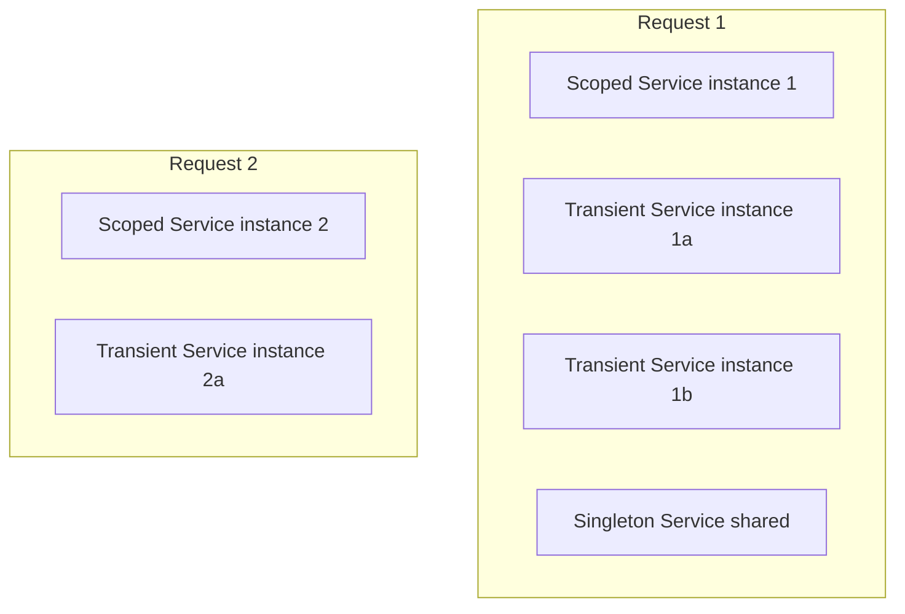

# ⚡ Service Lifetimes in .NET Core (Scoped vs Transient vs Singleton)

ASP.NET Core Dependency Injection supports **3 main lifetimes**: **Transient, Scoped, Singleton**.  
Understanding them is crucial for HTTP request handling, performance, and correctness.

---

## 1. Transient
- **Definition**: A new instance is created **every time** it is requested.
- **Lifecycle**:
  - Each resolve → new object.
  - Even within one request, multiple resolves = multiple instances.
- **Best for**: Lightweight, **stateless** operations.

**Example**:
```csharp
services.AddTransient<IIdGenerator, GuidIdGenerator>();
```

---

## 2. Scoped
- **Definition**: One instance **per HTTP request** (or logical scope).
- **Lifecycle**:
  - Same instance reused across all services in one request.
  - Disposed when request ends.
- **Best for**: Request-context services like **EF Core DbContext**.

**Example**:
```csharp
services.AddScoped<IOrderService, OrderService>();
services.AddScoped<AppDbContext>(); // EF Core context
```

---

## 3. Singleton
- **Definition**: One instance for the **entire application lifetime**.
- **Lifecycle**:
  - Created once, reused across all requests.
- **Best for**: **Caches, configuration readers, logging, HttpClientFactory**.

**Example**:
```csharp
services.AddSingleton<ISystemClock, SystemClock>();
```

---

# 📊 Lifecycle Comparison (HTTP Request Context)

| Lifetime    | Instance per Request | Instance per Resolve | Instance per App |
|-------------|----------------------|----------------------|------------------|
| **Transient** | ❌                  | ✅ (new each time)   | ❌               |
| **Scoped**    | ✅ (one per request)| Same in request      | ❌               |
| **Singleton** | ✅ (same for all)   | Same for all resolves| ✅               |

---

# 🔄 Visual Lifecycle in HTTP Requests

### ASCII Diagram
```
HTTP Request 1
   ├─ Scoped Service A (same across this request)
   ├─ Transient Service B (new each time resolved)
   └─ Singleton Service C (shared app-wide)

HTTP Request 2
   ├─ Scoped Service A' (different from Request 1)
   ├─ Transient Service B' (new again)
   └─ Singleton Service C (same as Request 1)
```

### Mermaid Flowchart


---

# ⚠️ Common Pitfalls
- ❌ Injecting **Scoped into Singleton** → runtime errors (“captured scoped instance”).
- ❌ Singleton with mutable state → thread safety issues.
- ✅ Correct usage:
  - `DbContext` → Scoped  
  - Business services → Scoped  
  - Utilities/config → Singleton  
  - Lightweight helpers → Transient  

---

# ✅ Summary
- **Transient** → New every resolve. Best for **stateless helpers**.  
- **Scoped** → One per HTTP request. Best for **DbContext, request-based services**.  
- **Singleton** → One per application lifetime. Best for **logging, caching, config**.  

---

# 🟢 Stateless Helpers in .NET Core

**Stateless helpers** are lightweight, utility-style services that do **not maintain state** across calls or requests.  
They are best registered as **Transient** services in Dependency Injection.

---

## 1. Password Hasher

Used in authentication to hash/verify passwords.

```csharp
public interface IPasswordHasher
{
    string Hash(string password);
    bool Verify(string password, string hash);
}

public class PasswordHasher : IPasswordHasher
{
    public string Hash(string password)
        => Convert.ToBase64String(System.Text.Encoding.UTF8.GetBytes(password));

    public bool Verify(string password, string hash)
        => Hash(password) == hash;
}

// Registration
services.AddTransient<IPasswordHasher, PasswordHasher>();
```

👉 Stateless: each call is independent.

---

## 2. GUID Generator

Generates unique IDs.

```csharp
public interface IIdGenerator
{
    Guid NewId();
}

public class GuidIdGenerator : IIdGenerator
{
    public Guid NewId() => Guid.NewGuid();
}

// Registration
services.AddTransient<IIdGenerator, GuidIdGenerator>();
```

👉 Stateless: every call produces a new `Guid`.

---

## 3. String Formatter

Formats messages, logs, or display strings.

```csharp
public interface IMessageFormatter
{
    string Format(string message);
}

public class MessageFormatter : IMessageFormatter
{
    public string Format(string message)
        => $"[{DateTime.UtcNow}] {message}";
}

// Registration
services.AddTransient<IMessageFormatter, MessageFormatter>();
```

👉 Stateless: formatting has no memory or side effects.

---

## 4. Math/Calculation Helper

Useful for financial apps (discounts, totals).

```csharp
public interface IDiscountCalculator
{
    decimal ApplyDiscount(decimal amount, decimal percentage);
}

public class DiscountCalculator : IDiscountCalculator
{
    public decimal ApplyDiscount(decimal amount, decimal percentage)
        => amount - (amount * (percentage / 100));
}

// Registration
services.AddTransient<IDiscountCalculator, DiscountCalculator>();
```

👉 Stateless: always computes based on input only.

---

# ✅ Key Takeaway

- Stateless helpers = **pure, utility-style services**.  
- They don’t cache, store, or depend on request state.  
- Best suited for **Transient lifetime** in ASP.NET Core DI.  

---

