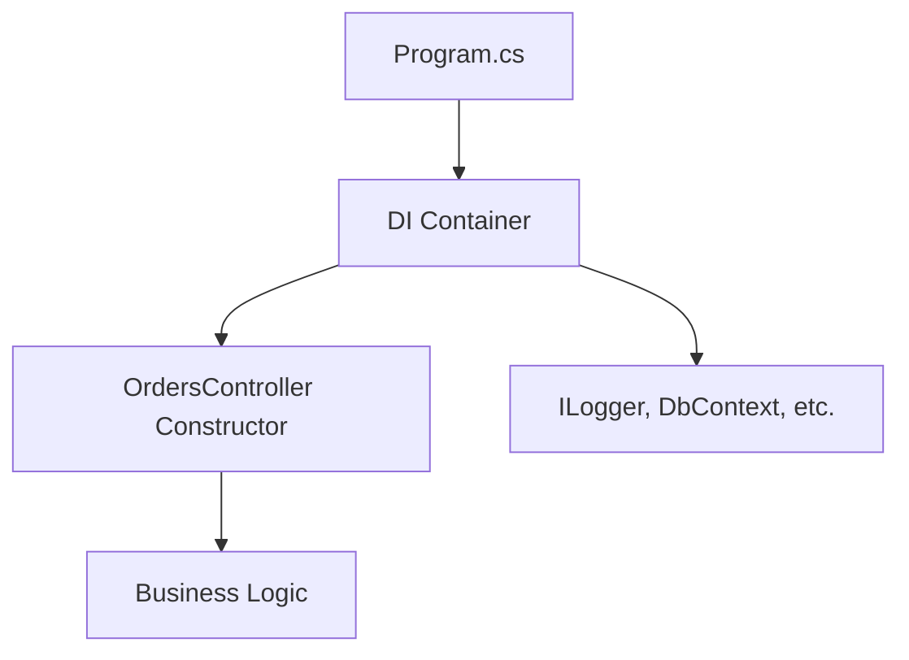

# 🔧 Services in .NET Core

In **ASP.NET Core**, a **service** is any class that is registered in the **Dependency Injection (DI) container** so it can be injected and reused.  

---

# 📌 Examples of Services
- **Built-in framework services**
  - `ILogger<T>` → Logging
  - `IConfiguration` → Configuration settings
  - `DbContext` → Database access (EF Core)
- **Custom services**
  - `IOrderService` → Business logic
  - `IEmailSender` → Email sending
  - `IMessageFormatter` → String utilities

---

# 🛠️ Registering Services (Program.cs)

```csharp
var builder = WebApplication.CreateBuilder(args);

// Framework services
builder.Services.AddLogging();
builder.Services.AddDbContext<AppDbContext>();

// Your custom services
builder.Services.AddScoped<IOrderService, OrderService>();
builder.Services.AddTransient<IEmailSender, SmtpEmailSender>();
builder.Services.AddSingleton<ISystemClock, SystemClock>();

var app = builder.Build();
app.MapControllers();
app.Run();
```

---

# 📥 Fetching Services from Other Classes

## 1. Constructor Injection (✅ Best Practice)

```csharp
public class OrdersController : ControllerBase
{
    private readonly IOrderService _orderService;
    private readonly ILogger<OrdersController> _logger;

    // Services are injected by the framework
    public OrdersController(IOrderService orderService, ILogger<OrdersController> logger)
    {
        _orderService = orderService;
        _logger = logger;
    }

    [HttpPost("orders")]
    public async Task<IActionResult> Create(Order order)
    {
        var id = await _orderService.PlaceOrderAsync(order);
        _logger.LogInformation("Order {id} created", id);
        return Ok(id);
    }
}
```

👉 ASP.NET Core automatically resolves `IOrderService` and `ILogger<T>` from DI.

---

## 2. Property Injection (Less common)

```csharp
public class ReportGenerator
{
    public ILogger<ReportGenerator>? Logger { get; set; }

    public void Generate()
    {
        Logger?.LogInformation("Report generated.");
    }
}
```

---

## 3. Manual Resolution (❌ Avoid unless necessary)

```csharp
public class LegacyHelper
{
    public static void DoWork(IServiceProvider serviceProvider)
    {
        var logger = serviceProvider.GetRequiredService<ILogger<LegacyHelper>>();
        logger.LogInformation("Doing legacy work...");
    }
}
```

👉 Use only if constructor injection is not possible.  
👉 Avoid **Service Locator anti-pattern**.

---

# 🔄 Flow: Service Registration → Injection → Usage

### ASCII Diagram
```
Program.cs (Service Registration)
        |
        v
DI Container ----------------------------+
        |                                |
        v                                v
Controller/Service Constructor   Framework (ILogger, DbContext)
        |
        v
Injected Service Instance is used in Business Logic
```

### Mermaid Diagram


---

# ✅ Best Practice Summary
- Always prefer **Constructor Injection**.  
- Register dependencies in **Program.cs**.  
- Use `IServiceProvider` directly only at **composition root**, not in business logic.  

---
