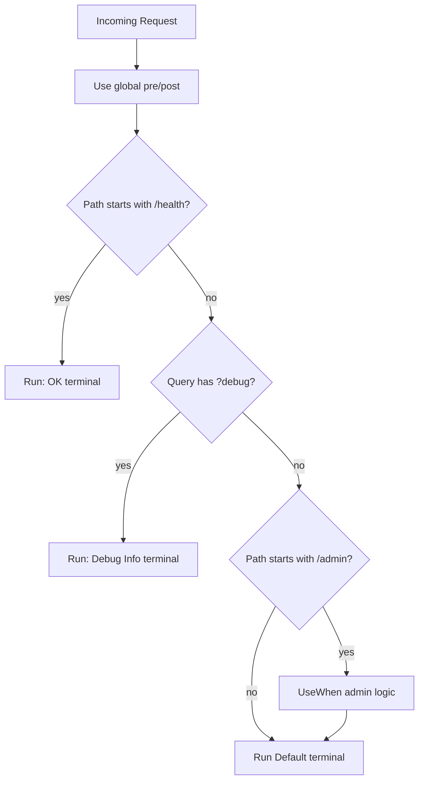

# 🧩 ASP.NET Core Pipeline Builders: `Use` vs `Run` vs `Map` vs `MapWhen` vs `UseWhen` (+ related methods)

These are the core APIs for composing the **HTTP middleware pipeline** in ASP.NET Core.  
They control **order**, **branching**, and **termination** of requests.

---

## TL;DR Comparison

| Method        | Continues to next? | Branches? | Condition Type        | Typical Use |
|---------------|--------------------|-----------|-----------------------|-------------|
| `Use`         | ✅ yes (via `await next()`) | ❌ | —                     | Cross‑cutting (logging, headers, timing) |
| `Run`         | ❌ terminal         | ❌        | —                     | Short‑circuit with a final response |
| `Map`         | ✅ inside branch    | ✅        | Path **prefix**       | Sub‑pipelines like `/health`, `/dashboard` |
| `MapWhen`     | ✅ inside branch    | ✅        | Arbitrary **predicate** (query/headers/etc.) | Conditional routing by logic |
| `UseWhen`     | ✅ returns to main  | ✅        | Arbitrary **predicate** | Conditional logic that should **continue** in main pipeline |

---

## 1) `Use` — wrap logic before & after next middleware

```csharp
app.Use(async (context, next) =>
{
    Console.WriteLine("Before next");
    await next();
    Console.WriteLine("After next");
});
```

- Great for **logging**, **correlation IDs**, **timing**, **headers**.

---

## 2) `Run` — terminal, ends the pipeline

```csharp
app.Run(async context =>
{
    await context.Response.WriteAsync("Hello from Run");
});
```

- Place at the **end** or inside a branch to **short‑circuit**.

---

## 3) `Map` — branch by **path prefix**

```csharp
app.Map("/health", branch =>
{
    branch.Run(async ctx => await ctx.Response.WriteAsync("OK"));
});
```

- Requests like `/health` (and deeper, e.g., `/health/live`) go to this branch.

---

## 4) `MapWhen` — branch by **predicate**

```csharp
app.MapWhen(ctx => ctx.Request.Query.ContainsKey("debug"), branch =>
{
    branch.Run(async ctx => await ctx.Response.WriteAsync("Debug mode"));
});
```

- Condition can check **query**, **headers**, **claims**, etc.

---

## 5) `UseWhen` — conditional sub‑pipeline that returns to main

```csharp
app.UseWhen(ctx => ctx.Request.Path.StartsWithSegments("/admin"), adminApp =>
{
    adminApp.Use(async (ctx, next) =>
    {
        Console.WriteLine("Admin logic");
        await next();
    });
});
```

- Runs only when condition is true, but **continues in the main pipeline** afterward.

---

## 🔄 Flow Example (combined)

```csharp
app.Use(async (ctx, next) =>
{
    Console.WriteLine("Global Use: before");
    await next();
    Console.WriteLine("Global Use: after");
});

app.Map("/health", h => h.Run(async ctx => await ctx.Response.WriteAsync("OK")));
app.MapWhen(ctx => ctx.Request.Query.ContainsKey("debug"),
    dbg => dbg.Run(async ctx => await ctx.Response.WriteAsync("Debug Info")));

app.UseWhen(ctx => ctx.Request.Path.StartsWithSegments("/admin"), admin =>
{
    admin.Use(async (ctx, next) => { Console.WriteLine("Admin section"); await next(); });
});

app.Run(async ctx => await ctx.Response.WriteAsync("Default endpoint"));
```

**Behavior**  
- `/health` → returns `"OK"` (branch terminal).  
- `?debug=true` → returns `"Debug Info"` (branch terminal).  
- `/admin/*` → prints "Admin section" then continues to final `Run`.  
- Everything else → falls through to the default `Run`.

---

## 🗺️ Diagrams

### ASCII
```
          ┌──────────────────────────────────────────────────────────────┐
Request → │ Use (global) → Map("/health") ─┐                             │
          │           └───────────────┬────┘                             │
          │                           │  yes: Run("OK") (terminal)       │
          │                           └─ no → MapWhen(?debug) ─┐         │
          │                                           │ yes → Run("Debug")│
          │                                           └ no ──► UseWhen(/admin)
          │                                                       │ true
          │                                                       ▼
          │                                               (extra admin logic)
          │                                                       │
          └───────────────────────────────────────────────────────┴──► Run("Default") (terminal)
```

### Mermaid


---

## 🧭 Related / Similar Methods You’ll See

- **`UseRouting()` / `UseEndpoints()`** (pre‑.NET 6): set up endpoint routing; now generally replaced by minimal‑API mapping methods.
- **`MapGet` / `MapPost` / `MapPut` / `MapDelete`**: **terminal** endpoint mappings in Minimal APIs. They behave like a specialized `Map + Run`.
  ```csharp
  app.MapGet("/hello", () => "hello"); // terminal for /hello
  ```
- **`MapGroup("/api")`** (.NET 7+): group endpoints and apply filters/middleware to the **group**.
  ```csharp
  var api = app.MapGroup("/api").AddEndpointFilter(new AuthFilter());
  api.MapGet("/orders", GetOrders);
  ```
- **`MapFallback`**: terminal for unmatched routes (e.g., SPA fallback to `index.html`).
  ```csharp
  app.MapFallbackToFile("index.html");
  ```
- **`UseStaticFiles()`**: middleware for serving `wwwroot` content early in the pipeline.
- **`UseCors()` / `UseAuthentication()` / `UseAuthorization()`**: built‑in middleware that must be ordered correctly with routing.

> Think of `MapGet`/friends as **endpoints**; `Use/Run/Map/MapWhen/UseWhen` are **pipeline builders**.

---

## ✅ Best Practices
- Put **exception handling** and **HTTPS redirection** early (before most other middleware).
- `UseRouting()` before `UseAuthentication()`/`UseAuthorization()`; map endpoints last.
- Use **`Map`** for path‑based sub‑pipelines; **`MapWhen`** for arbitrary conditions.
- Prefer **`UseWhen`** if you need to **continue** in the main pipeline after conditional logic.
- Keep middleware **stateless**; avoid storing per‑request data in singletons.

---

## 🔍 Quick Reference Cheat Sheet

```csharp
// Cross-cutting
app.Use(/* pre/post */);

// Terminal
app.Run(/* produce response */);

// Path branch
app.Map("/metrics", m => m.Run(/* terminal */));

// Predicate branch (is mobile user? has header?)
app.MapWhen(ctx => ctx.Request.Headers.ContainsKey("X-Debug"),
            b => b.Run(/* terminal */));

// Conditional sub-pipeline that re-joins main
app.UseWhen(ctx => ctx.Request.Path.StartsWithSegments("/admin"),
            b => b.Use(/* more middleware */));
```

---
