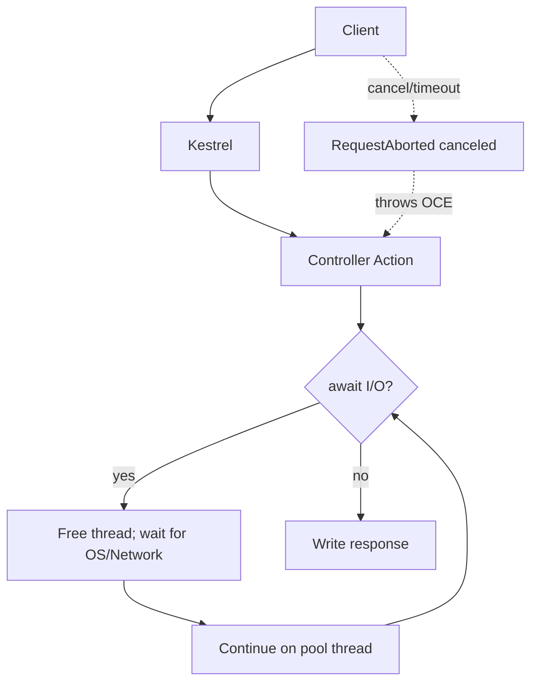

# Async & Await in C# — A Simple Guide for Web APIs

This guide explains **what async/await is**, **how threads are used**, **how cancellation works** (including `HttpContext.RequestAborted`), **how to add resilience with Polly**, plus **pros/cons** and **common pitfalls** — all in plain English.

---

## 1) The Big Idea (in one minute)

- **Async/await is about *not blocking a thread while you wait*.**
- When your code does I/O (HTTP, DB, file), `await` lets the thread go do other work.
- When the I/O finishes, your method **continues** from where it left off.
- This makes servers handle **more concurrent requests** with the **same number of threads**.

> Async is **not** automatic parallelism. It’s cooperation: “I’m waiting; let someone else use the thread.”

---

## 2) What Actually Happens With Threads

- ASP.NET Core uses a **thread pool** to run your code.
- When you hit `await` on an **I/O operation** (e.g., `HttpClient.GetAsync`, EF Core `ToListAsync`):
  1. Your method returns a `Task` to the caller.
  2. **No thread is held** during the wait; the OS/device does the I/O.
  3. When the I/O completes, the **continuation** (the rest of your method) runs on a thread-pool thread.
- In ASP.NET Core there’s **no SynchronizationContext** to “hop back” to, so continuations can run on **any** pool thread.

> Bottom line: `await` frees the thread during I/O, improving scalability. It does not create new threads by itself.

---

## 3) Cancellation 101 (including `HttpContext.RequestAborted`)

- Every HTTP request in ASP.NET Core has a `CancellationToken`: **`HttpContext.RequestAborted`**.
- If the client disconnects or times out, this token is **canceled**.
- If your code accepts a `CancellationToken` and passes it to I/O calls, your work will **stop quickly** instead of wasting CPU/DB resources.

### Controller example

```csharp
[ApiController]
[Route("api/users")]
public sealed class UsersController : ControllerBase
{
    private readonly IUserService _svc;
    public UsersController(IUserService svc) => _svc = svc;

    // ASP.NET Core automatically binds this to HttpContext.RequestAborted
    [HttpGet("{id:int}")]
    public async Task<ActionResult<UserDto>> Get(int id, CancellationToken ct)
    {
        var dto = await _svc.GetUserAsync(id, ct);
        return dto is null ? NotFound() : Ok(dto);
    }
}
```

### Service example (propagate the token)

```csharp
public interface IUserService
{
    Task<UserDto?> GetUserAsync(int id, CancellationToken ct);
}

public sealed class UserService : IUserService
{
    private readonly AppDbContext _db;
    private readonly HttpClient _client;
    public UserService(AppDbContext db, IHttpClientFactory factory)
        => (_db, _client) = (db, factory.CreateClient("users-api"));

    public async Task<UserDto?> GetUserAsync(int id, CancellationToken ct)
    {
        var user = await _db.Users
            .Where(u => u.Id == id)
            .Select(u => new UserDto { Id = u.Id, Name = u.Name })
            .FirstOrDefaultAsync(ct); // pass ct to EF

        if (user is null) return null;

        var details = await _client.GetFromJsonAsync<UserDetails>($"users/{id}", ct); // pass ct to HTTP
        return new UserDto { Id = user.Id, Name = user.Name, Details = details };
    }
}
```

### Optional: friendly cancellation logging

```csharp
public sealed class CancellationLoggingMiddleware
{
    private readonly RequestDelegate _next;
    private readonly ILogger<CancellationLoggingMiddleware> _logger;
    public CancellationLoggingMiddleware(RequestDelegate next, ILogger<CancellationLoggingMiddleware> logger)
        => (_next, _logger) = (next, logger);

    public async Task Invoke(HttpContext ctx)
    {
        try
        {
            await _next(ctx);
        }
        catch (OperationCanceledException) when (ctx.RequestAborted.IsCancellationRequested)
        {
            _logger.LogInformation("Request canceled by client: {Path}", ctx.Request.Path);
        }
    }
}
```

Register: `app.UseMiddleware<CancellationLoggingMiddleware>();`

---

## 4) Resilience With `IHttpClientFactory` + Polly (Retries, Timeouts, Circuit Breaker)

**Why Polly?** Networks are unreliable. Polly gives you **retries (with backoff+random jitter)**, **per-try timeouts**, and a **circuit breaker** to quickly fail when a dependency is unstable.

### Setup

Install: `Microsoft.Extensions.Http.Polly`, `Polly`, `Polly.Extensions.Http`.

```csharp
using Polly;
using Polly.Extensions.Http;
using Polly.CircuitBreaker;

builder.Services.AddHttpClient("users-api", c =>
{
    c.BaseAddress = new Uri("https://downstream.svc/");
})
.AddPolicyHandler(PollyPolicies.Default());
```

```csharp
public static class PollyPolicies
{
    public static IAsyncPolicy<HttpResponseMessage> Default()
    {
        var jitter = new Random();

        var retry = HttpPolicyExtensions
            .HandleTransientHttpError()            // 5xx + HttpRequestException
            .OrResult(r => (int)r.StatusCode == 408) // Request Timeout
            .WaitAndRetryAsync(
                retryCount: 3,
                sleepDurationProvider: attempt =>
                    TimeSpan.FromMilliseconds(200 * Math.Pow(2, attempt)) +
                    TimeSpan.FromMilliseconds(jitter.Next(0, 100)));

        var timeout = Policy.TimeoutAsync<HttpResponseMessage>(TimeSpan.FromSeconds(2));

        var breaker = HttpPolicyExtensions
            .HandleTransientHttpError()
            .CircuitBreakerAsync(handledEventsAllowedBeforeBreaking: 5,
                                 durationOfBreak: TimeSpan.FromSeconds(30));

        // Order matters: outermost executes first, innermost last.
        // Typical: Breaker (outer) -> Retry -> Timeout (inner per-try)
        return Policy.WrapAsync(breaker, retry, timeout);
    }
}
```

> **Tip:** Prefer Polly per-try timeouts and keep `HttpClient.Timeout` high or unset to avoid conflicts.

---

## 5) Simple Request Flow (Mermaid)



---

## 6) Common Pitfalls (and Easy Fixes)

| Pitfall | Why it hurts | Easy fix |
|---|---|---|
| Blocking on async (`.Result`, `.Wait()`) | Ties up threads; can deadlock in legacy ASP.NET | “Async all the way”; always `await` |
| Forgetting `CancellationToken` | Wastes work if client goes away | Add `CancellationToken ct` and pass to all I/O |
| Fire-and-forget tasks | Lost errors; work may be aborted | Avoid; or use a background queue/HostedService |
| Sharing `DbContext` concurrently | Not thread-safe; random errors | Keep per-request; no parallel EF ops on one context |
| `Task.Run` for I/O | Burns pool threads for no gain | Remove; only offload *CPU* to background workers |
| Conflicting timeouts | Flaky behavior | Use Polly per-try timeouts; keep `HttpClient.Timeout` high |
| Misusing `ValueTask` | Complexity; only await once | Prefer `Task` unless you’ve measured clear gains |

---

## 7) Pros & Cons of Async in Web APIs

### Pros
- **Higher throughput**: same hardware handles more concurrent requests.
- **Lower latency under load**: threads aren’t blocked on I/O.
- **Responsive cancellations**: free up DB/HTTP work when clients disconnect.
- **Composability**: `await` reads like synchronous code.

### Cons
- **Complexity**: more moving parts (tokens, retries, timeouts).
- **Pitfalls**: blocking on async, misusing `DbContext`, fire-and-forget.
- **Observability needs**: you should log timeouts, retries, cancellations.
- **CPU-bound work**: async doesn’t speed CPU; you still need background workers/queues.

---

## 8) Copy/Paste Snippets

**Controller**

```csharp
[HttpGet("{id:int}")]
public Task<ActionResult<UserDto>> Get(int id, CancellationToken ct)
    => _svc.GetUserAsync(id, ct) is Task<UserDto?> t
       ? t.ContinueWith<ActionResult<UserDto>>(r => r.Result is null ? NotFound() : Ok(r.Result), ct)
       : Task.FromResult<ActionResult<UserDto>>(NotFound());
```
> Or simply the earlier, clearer `await` version — recommended for readability.

**Service (await version)**

```csharp
public async Task<UserDto?> GetUserAsync(int id, CancellationToken ct)
{
    var user = await _db.Users.Where(u => u.Id == id)
                              .Select(u => new UserDto { Id = u.Id, Name = u.Name })
                              .FirstOrDefaultAsync(ct);
    if (user is null) return null;

    var details = await _client.GetFromJsonAsync<UserDetails>($"users/{id}", ct);
    return new UserDto { Id = user.Id, Name = user.Name, Details = details };
}
```

**Program.cs (core pieces)**

```csharp
builder.Services.AddDbContext<AppDbContext>(...);
builder.Services.AddScoped<IUserService, UserService>();
builder.Services.AddHttpClient("users-api").AddPolicyHandler(PollyPolicies.Default());
app.UseMiddleware<CancellationLoggingMiddleware>();
```

---

## 9) Quick Checklist

- [ ] Use async I/O end-to-end; no `.Result`/`.Wait()`
- [ ] Accept `CancellationToken` on public APIs and pass it down
- [ ] Use `IHttpClientFactory` + Polly (retry with jitter, per-try timeout, circuit-breaker)
- [ ] Keep `DbContext` per request; avoid concurrent use
- [ ] Don’t use `Task.Run` for I/O on the server
- [ ] Treat `OperationCanceledException` as **info**, not error
- [ ] Log/measure retries, timeouts, cancellations

---

## 10) FAQ (super short)

- **Does `await` make new threads?** No. It frees the current thread during I/O.  
- **Do I need `ConfigureAwait(false)` in ASP.NET Core?** Usually no. There’s no UI sync context.  
- **What about CPU-heavy work?** Use background workers/queues; async I/O won’t help CPU speed.  
- **Is one `HttpClient` per call okay?** No. Use `IHttpClientFactory` or a singleton `HttpClient`.  

---

Happy building! 🚀
