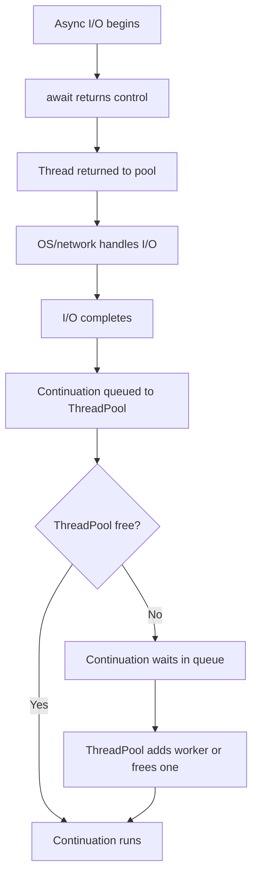

# Async/Await Deep Dive in C#

A detailed guide on `async`/`await`, `ConfigureAwait`, return types, important classes/methods, pitfalls, and what happens when the ThreadPool is saturated.

---

## 1) Refresher: How Async/Await Works

- `async` makes a method return immediately with a **Task** (or `Task<T>`/`ValueTask`) if it hits an incomplete `await`.
- `await` does **not** create a thread; it registers a **continuation** to run later when the awaited task completes.
- **I/O-bound work:** handled by the OS (sockets, files, DB); no thread held while waiting.
- **CPU-bound work:** requires a thread (use `Task.Run` on client apps, avoid on servers).

---

## 2) ConfigureAwait — When to Use

- **ASP.NET Core apps:** no SynchronizationContext; continuations already resume on ThreadPool.  
  → You usually **do not need** `ConfigureAwait(false)`.
- **UI apps (WPF/WinForms) or legacy ASP.NET:** have a SynchronizationContext.  
  → Use **`ConfigureAwait(false)`** in library code to avoid deadlocks or unnecessary context switches.

```csharp
// Library code best practice
public async Task<byte[]> FetchAsync(HttpClient client, string url, CancellationToken ct)
{
    using var resp = await client.GetAsync(url, ct).ConfigureAwait(false);
    resp.EnsureSuccessStatusCode();
    return await resp.Content.ReadAsByteArrayAsync(ct).ConfigureAwait(false);
}
```

**Myth:** `ConfigureAwait(false)` does not force a new thread—it only avoids posting the continuation back to the captured context.

---

## 3) Return Types

| Return Type         | Use When | Notes |
|----------------------|----------|-------|
| `Task`              | Async method, no result | Most common |
| `Task<T>`           | Async method returning a result | Most common |
| `ValueTask`/`ValueTask<T>` | Method often completes synchronously | Only await once; prefer `Task` unless performance-critical |
| `IAsyncEnumerable<T>` | Stream results asynchronously | Use `await foreach` |
| `async void`        | Event handlers only | Never for general async code |

---

## 4) Important Classes & Methods

### Task & Coordination
- `Task.WhenAll`, `Task.WhenAny`
- `Task.Delay`, `Task.Yield`, `Task.FromResult`
- `Task.WaitAsync(timeout, ct)` — add timeout/cancellation to any task (.NET 7+)
- `SemaphoreSlim.WaitAsync` / `Release`
- `Channel<T>` for producer-consumer patterns
- `IAsyncEnumerable<T>` with `await foreach`
- `CancellationToken` / `CancellationTokenSource`
- `IAsyncDisposable` with `await using`

### Context/Scheduling
- `SynchronizationContext`
- `TaskScheduler`
- `ThreadPool` (`SetMinThreads` to tune, but only after fixing blocking)

---

## 5) What *Not* to Do

1. **Block on async (`.Result`, `.Wait`)** → risk deadlocks/starvation  
   ✅ Make call chain fully async.

2. **Fire-and-forget tasks inside API requests** → lost work, unobserved exceptions  
   ✅ Use background queues/hosted services.

3. **Share non-thread-safe objects (e.g., DbContext) across awaits**  
   ✅ One `DbContext` per request; no parallel EF ops on same instance.

4. **Wrap I/O in `Task.Run` on server** → wastes threads  
   ✅ Use native async I/O APIs.

5. **Mix timeouts (HttpClient.Timeout vs Polly)**  
   ✅ Prefer Polly per-try timeouts.

6. **Use `lock` with `await`** → deadlock risk  
   ✅ Use `SemaphoreSlim`.

7. **Overuse `ValueTask`** → subtle bugs  
   ✅ Prefer `Task` unless you’ve profiled.

---

## 6) What Happens if ThreadPool is Busy?

- While awaiting I/O, **no thread is held**.  
- When the I/O completes, the continuation is **queued** to the ThreadPool (or context).  
- If the ThreadPool is **saturated**, the continuation **waits** in the queue until a thread frees up or the pool grows.  
- This does not lose work—it delays execution.  

### Symptoms of Starvation
- Slow response times
- Long queue of pending work items
- Low available ThreadPool threads

### Mitigations
- Eliminate blocking calls (`.Result`, `.Wait`).
- Avoid `Task.Run` for I/O.
- Limit fan-out concurrency (`SemaphoreSlim`).
- Tune ThreadPool minimum threads only after fixing root causes.

```csharp
ThreadPool.GetMinThreads(out var worker, out var io);
ThreadPool.SetMinThreads(Math.Max(worker, 200), io);
```

---

## 7) Flowchart: Async Await & ThreadPool Saturation



---

## 8) Quick Checklist

- [ ] Avoid sync-over-async (`.Result`, `.Wait`).
- [ ] Use `ConfigureAwait(false)` in libraries (not app code in ASP.NET Core).
- [ ] Return `Task`/`Task<T>` (prefer over `ValueTask` unless proven).
- [ ] Pass `CancellationToken` everywhere (from `HttpContext.RequestAborted` in APIs).
- [ ] Avoid fire-and-forget in request scope.
- [ ] Use Polly for timeouts/retries with HttpClient.
- [ ] Monitor ThreadPool queues for starvation.

---
