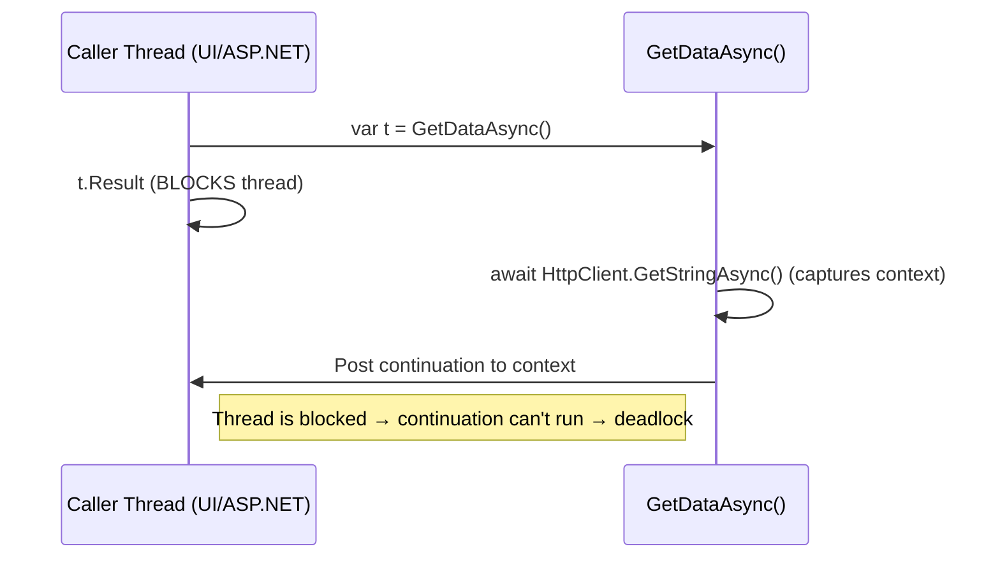

# Async/Await Scenarios Deep Dive in C#

A detailed guide on calling sync methods from async, what happens without `await`, `SynchronizationContext`, and other nuanced scenarios.

---

## 1) Calling Non-Async (Sync) Methods from Async Methods

✔️ You can call synchronous methods inside async methods.

- **Good use:** quick CPU-bound work (validation, mapping, calculations).
- **Risk:** blocking I/O (DB, HTTP, file) or heavy CPU work pins a thread → scalability/performance issues.

### Patterns
- **Server (ASP.NET Core):** prefer async I/O APIs. Avoid `Task.Run` for I/O. For CPU work, offload to background services/queues.
- **UI (WPF/WinForms):** use `await Task.Run(...)` to prevent UI freezing.

```csharp
// UI only, not server
await Task.Run(() => ComputeFractals(input), ct);
```

---

## 2) Async Without Await

If a method is marked `async` but has no `await`, compiler warns **CS1998**.

- Runs **synchronously**.
- Returns a **completed Task/Task<T>**.
- Exceptions are stored in the Task, observed when awaited.

```csharp
public async Task<int> FooAsync() // CS1998
{
    return 42; // synchronous
}

// Better:
public Task<int> FooAsync() => Task.FromResult(42);
```

---

## 3) SynchronizationContext Explained

Determines **where continuations run** after `await`.

- **UI apps (WPF/WinForms):** context = UI thread. Continuations resume there.
- **Legacy ASP.NET:** context = request thread. Blocking can deadlock.
- **ASP.NET Core:** no SynchronizationContext. Continuations resume on thread pool.

### ConfigureAwait(false)
Avoids capturing context.

- Use in **libraries** or UI/legacy code.
- Not needed in ASP.NET Core app code.

```csharp
using var resp = await client.GetAsync(url, ct).ConfigureAwait(false);
```

### Deadlock Example
```csharp
// Legacy ASP.NET/UI
public string GetDataSync()
{
    return GetDataAsync().Result; // blocks UI/request thread
}

public async Task<string> GetDataAsync()
{
    var s = await client.GetStringAsync("..."); // captures context
    return s; // continuation needs the blocked thread -> deadlock
}
```

---

## 4) Scenario Outcomes

### A) Sync I/O in async method
- Thread blocked until I/O finishes.  
- **Fix:** use async I/O (`ReadAsync`, `ToListAsync`, etc.).

### B) CPU work inside async
- Server: don’t use `Task.Run`.  
- UI: wrap CPU in `Task.Run` to keep responsive.

### C) Async without await
- Runs synchronously. Prefer `Task.FromResult` or `ValueTask`.

### D) async void
- Can’t await. Exceptions crash process.  
- Only valid for event handlers.

### E) Exceptions
- Before first await: captured on Task.  
- After await: rethrown at await site.

### F) Fire-and-forget in requests
- Work aborted on request end; exceptions lost.  
- Use background queues.

### G) Mixed timeouts
- Conflicts between `HttpClient.Timeout` and Polly.  
- Prefer Polly per-try.

### H) ValueTask misuse
- Only await once.  
- Use `Task` unless profiled.

### I) ThreadPool saturation
- Awaited I/O frees thread.  
- Continuations queued to pool.  
- If saturated, continuations wait.

### J) lock with await
- Deadlocks.  
- Use `SemaphoreSlim`.

---

## 5) Decision Guide

- ✔️ Call sync code in async for short CPU work.  
- ❌ Avoid sync I/O in async.  
- ❌ Don’t use async without await (prefer `Task.FromResult`).  
- ✔️ Use `ConfigureAwait(false)` in libraries/UI.  
- ❌ Don’t block with `.Result`/`.Wait()`.  
- ✔️ Pass `CancellationToken`.  
- ❌ Don’t use fire-and-forget in APIs.  
- ✔️ Use Polly for retries/timeouts.

---

## 6) Handy Code Snippets

### Return cached result as Task
```csharp
public Task<User> GetCachedAsync(string key)
    => _cache.TryGetValue(key, out var u)
       ? Task.FromResult(u)
       : FetchFromSourceAsync(key);
```

### Timeout any Task
```csharp
await task.WaitAsync(TimeSpan.FromSeconds(2), ct);
```

### Concurrency throttle
```csharp
var sem = new SemaphoreSlim(8);
var tasks = ids.Select(async id => {
    await sem.WaitAsync(ct);
    try { return await FetchAsync(id, ct); }
    finally { sem.Release(); }
});
var results = await Task.WhenAll(tasks);
```

---

## 7) Visual Deadlock Flow (UI/Legacy ASP.NET)



---

## 8) Checklist

- [ ] Avoid `.Result`, `.Wait()`.
- [ ] Don’t use async without await (except Task.FromResult/ValueTask).  
- [ ] Use ConfigureAwait(false) in libraries.  
- [ ] Avoid async void.  
- [ ] Avoid fire-and-forget in APIs.  
- [ ] Handle cancellations and timeouts.  
- [ ] Monitor ThreadPool for saturation.
