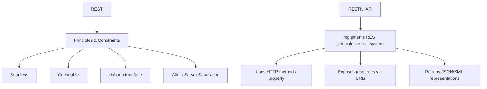

# REST vs RESTful API

A clear distinction between the architectural style (**REST**) and its practical implementations (**RESTful APIs**).

---

## 1) REST (Representational State Transfer)

- **Definition:** An **architectural style** for designing distributed systems, introduced by Roy Fielding in 2000.  
- **Not a protocol or standard**, but a set of *constraints* and *principles*.  

### REST Constraints
- Client–server separation  
- Stateless interactions (no server session state)  
- Cacheable responses  
- Uniform interface (resources via URIs, standard HTTP verbs)  
- Layered system (client doesn’t care about intermediaries)  
- *Optional:* Code-on-demand  

👉 REST is a **blueprint** or **philosophy**.

---

## 2) RESTful API

- **Definition:** A **real API** that implements REST principles.  
- Applies REST constraints in practice using HTTP.  

### Characteristics
- Exposes **resources** (`/users/123`, `/orders/567`)  
- Uses **HTTP verbs** properly (`GET`, `POST`, `PUT/PATCH`, `DELETE`)  
- Returns resource representations (commonly JSON)  
- Is **stateless** (all info is in each request)  
- Supports **caching** via HTTP headers  

👉 RESTful API is the **implementation** of REST.

---

## 3) Analogy

- **REST:** The blueprint (rules of architecture).  
- **RESTful API:** The house you build following the blueprint (implementation).  

---

## 4) Key Differences

| Aspect | REST | RESTful API |
|--------|------|-------------|
| Type | Architectural style (theory) | Practical API implementation (practice) |
| Defined By | Roy Fielding’s dissertation (2000) | Developers building APIs |
| Scope | Principles & constraints | Real-world API that follows REST |
| Example | Rules: stateless, cacheable, uniform interface | `/api/users/1` with GET, POST, PUT, DELETE |

---

## 5) Flowchart — REST vs RESTful API Relationship

---

## 6) Quick Summary

- **REST** = *theory* (style, rules).  
- **RESTful API** = *practice* (actual API).  
- You can build an API that is "partially RESTful" if not all constraints are applied.  
- In common usage, "REST API" and "RESTful API" are often used interchangeably, but technically:  
  - REST → architecture  
  - RESTful API → implementation
