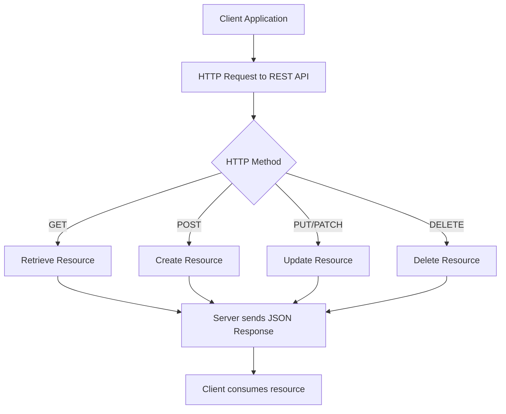

# REST vs Web Services

A structured overview of **REST (Representational State Transfer)**, its usefulness, and differences compared to traditional Web Services. Includes a flowchart.

---

## 1) What is REST?

**REST (Representational State Transfer)** is an **architectural style** for building distributed systems, especially web APIs. It was defined by Roy Fielding in his 2000 dissertation.

- Uses **HTTP** as the communication protocol.
- Exposes **resources** (data entities like `users`, `orders`) identified by **URIs**.
- Uses **stateless** interactions: each request contains all info needed (no server session state).
- Supports multiple formats (JSON, XML, plain text), but JSON is most common today.
- HTTP verbs map to actions:  
  - `GET` → read  
  - `POST` → create  
  - `PUT/PATCH` → update  
  - `DELETE` → remove  

---

## 2) Why REST is Useful

- **Simplicity:** Built directly on HTTP; no extra layers required.
- **Scalability:** Statelessness allows easy scaling across servers.
- **Flexibility:** Works with many formats (JSON, XML, HTML).
- **Interoperability:** Any client that can speak HTTP can consume REST APIs.
- **Performance:** Can leverage HTTP features like caching and compression.

Typical use cases:
- Mobile & web apps consuming backend APIs.
- Microservices communication.
- Public APIs (Twitter, GitHub, Google Maps).

---

## 3) Web Services (SOAP & Others)

**Web Service** is a **broad term**: any service accessible over the web using standard protocols.

### SOAP (Simple Object Access Protocol)
- Protocol-based, uses **XML** for request/response.
- Requires **WSDL** (Web Services Description Language) to describe operations.
- Strict standards for security (WS-Security), transactions, etc.
- More heavyweight compared to REST.

### RESTful Web Services
- Resource-oriented, uses standard HTTP verbs.
- Typically use **JSON** for lightweight data exchange.
- Easier for public APIs and modern systems.

---

## 4) Key Differences Between REST & Traditional Web Services

| Feature | REST | SOAP / Traditional Web Services |
|---------|------|--------------------------------|
| Protocol | Uses HTTP directly | Uses HTTP, SMTP, etc., with XML-based SOAP |
| Data Format | JSON, XML, text, HTML | XML only |
| Complexity | Simple, lightweight | Heavy, strict standards |
| Scalability | Stateless, easy to scale | Often stateful |
| Use Case | Web & mobile APIs, microservices | Enterprise apps needing strict contracts/security |
| Performance | Faster due to less overhead | Slower (XML parsing, envelope overhead) |

---

## 5) Flowchart: RESTful Request Lifecycle

---

## 6) Quick Summary

- **REST** = architectural style using HTTP for stateless, resource-oriented communication.
- **Useful** because it’s simple, scalable, flexible, and interoperable.
- **Web Services** = general category; REST is one type. SOAP is another, more rigid type.
- Choose REST for most modern APIs; choose SOAP for enterprise needs requiring strict contracts, advanced security, or legacy systems.
