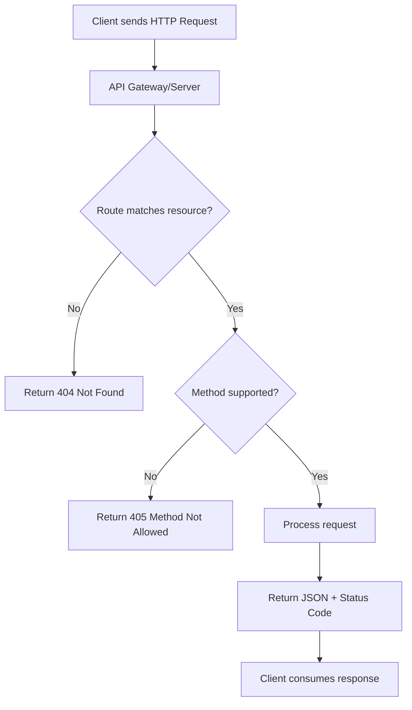

# REST API Best Practices

A practical guide to designing and implementing REST APIs correctly and efficiently.

---

## 1. Resource Design

- Use **nouns, not verbs**.  
  ✅ `/users` instead of `/getUsers`  
- Use **plural** for collections.  
  ✅ `/users/123`  
- Hierarchical resources when related.  
  ✅ `/users/123/orders/456`  

---

## 2. HTTP Methods

- `GET` → retrieve resource (safe, idempotent).  
- `POST` → create new resource.  
- `PUT` → full update.  
- `PATCH` → partial update.  
- `DELETE` → remove resource.  

👉 Stick to standard semantics.

---

## 3. Status Codes

- `200 OK` → success with body.  
- `201 Created` → new resource created.  
- `204 No Content` → success, no body.  
- `400 Bad Request` → client error.  
- `401 Unauthorized` → authentication needed.  
- `403 Forbidden` → not allowed.  
- `404 Not Found` → resource missing.  
- `409 Conflict` → duplicate/resource conflict.  
- `500 Internal Server Error` → server failure.  

---

## 4. Naming & Versioning

- Use **lowercase + hyphens**: `/user-profiles/`  
- Version in URL or header:  
  `/api/v1/users`  

---

## 5. Data Formats

- Default to **JSON**.  
- Respect `Content-Type` and `Accept` headers.  
- Return structured error responses:  

```json
{
  "error": "ValidationError",
  "message": "Email is invalid",
  "field": "email"
}
```

---

## 6. Pagination, Filtering, Sorting

- Pagination: `/users?page=2&limit=20`  
- Filtering: `/users?role=admin`  
- Sorting: `/users?sort=name,-createdAt`  

---

## 7. HATEOAS (optional but powerful)

Add links to related actions:  

```json
{
  "id": 123,
  "name": "Alice",
  "links": [
    { "rel": "self", "href": "/users/123" },
    { "rel": "orders", "href": "/users/123/orders" }
  ]
}
```

---

## 8. Security

- Use **HTTPS everywhere**.  
- Authentication & authorization: OAuth2, JWT, API keys.  
- Don’t put sensitive data in URL query params.  

---

## 9. Caching

- Use HTTP caching headers:  
  - `ETag`, `Last-Modified`  
  - `Cache-Control`  

Example:  
`Cache-Control: max-age=3600, must-revalidate`  

---

## 10. Idempotency

- `PUT` and `DELETE` must be idempotent.  
- `POST` is not idempotent, but can use idempotency keys.  

---

## 11. Rate Limiting & Throttling

- Protect APIs with rate limits.  
- Return headers:  
  - `X-RateLimit-Limit`  
  - `X-RateLimit-Remaining`  

---

## 12. Documentation & Discoverability

- Use **OpenAPI/Swagger**.  
- Provide request/response examples.  
- Version documentation alongside the API.  

---

## Flowchart: REST API Request Lifecycle



---

## ✅ Quick Checklist

- [ ] Use nouns, plural, hierarchical URLs.  
- [ ] Stick to HTTP methods & semantics.  
- [ ] Use correct status codes.  
- [ ] Support pagination, filtering, sorting.  
- [ ] Secure with HTTPS & auth.  
- [ ] Implement caching.  
- [ ] Provide structured errors.  
- [ ] Document with OpenAPI.  
