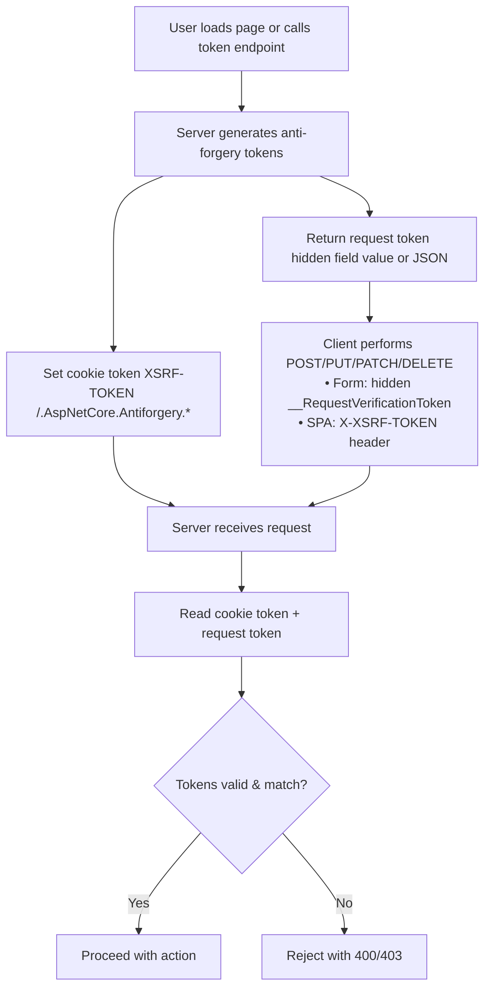

# Cross-site request forgery
Cross-site request forgery is an attack against web-hosted apps whereby a malicious web app can influence the interaction between a client browser and a web app that trusts that browser. These attacks are possible because web browsers send some types of authentication tokens automatically with every request to a website. This form of exploit is also known as a one-click attack or session riding because the attack takes advantage of the user's previously authenticated session. Cross-site request forgery is also known as XSRF or CSRF.


## Flowchart (Token Lifecycle)

When a user first loads your SPA (React app), you need a way for the server to hand out the initial XSRF token.

## Approach 1: Bootstrap on SPA GET (Recommended if .NET serves the React app)
- When the browser requests / (or /index.html), your .NET middleware issues the XSRF-TOKEN cookie.

- React doesn’t need to call anything extra — the cookie is already there when the app boots.

- Your axios/fetch interceptor just picks it up and sends it back with every POST/PUT/DELETE.

  ```csharp
  // Middleware to issue token whenever serving SPA
  app.Use(async (context, next) =>
  {
    if (context.Request.Path == "/" || context.Request.Path == "/index.html")
    {
        var antiforgery = context.RequestServices.GetRequiredService<IAntiforgery>();
        var tokens = antiforgery.GetAndStoreTokens(context);

        context.Response.Cookies.Append("XSRF-TOKEN", tokens.RequestToken!, new CookieOptions
        {
            HttpOnly = false,
            Secure = true,
            SameSite = SameSiteMode.Strict
        });
    }
    await next();
  });
  ```
## Approach 2: Dedicated Token Endpoint (If SPA is static-hosted elsewhere, e.g., S3/Netlify)
- If your React app is not served by .NET, the first request to / never touches .NET.

- In that case, create an endpoint like /api/antiforgery/token.

- React calls it after mounting to fetch the token, and stores it (cookie or in-memory).
```csharp
  [ApiController]
  [Route("api/[controller]")]
  public class AntiforgeryController : ControllerBase
  {
      private readonly IAntiforgery _antiforgery;
      public AntiforgeryController(IAntiforgery antiforgery) => _antiforgery = antiforgery;
  
      [HttpGet("token")]
      public IActionResult GetToken()
      {
          var tokens = _antiforgery.GetAndStoreTokens(HttpContext);
          Response.Cookies.Append("XSRF-TOKEN", tokens.RequestToken!,
              new CookieOptions { HttpOnly = false, Secure = true, SameSite = SameSiteMode.Strict });
          return Ok(new { token = tokens.RequestToken });
      }
  }
```

