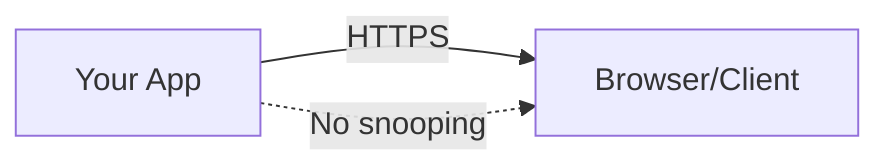
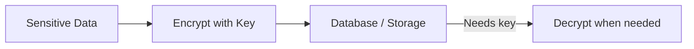
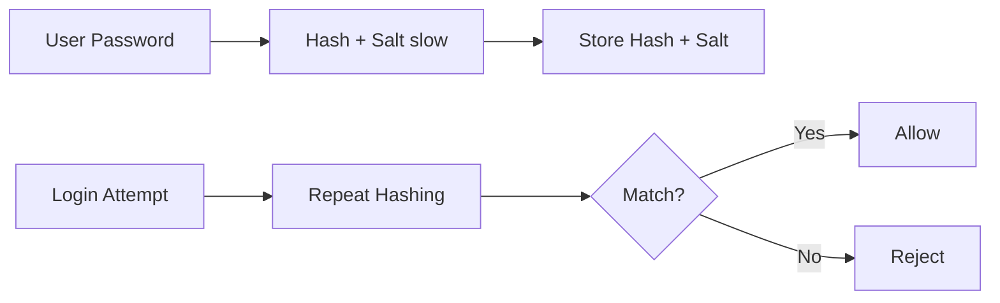

# Cryptographic Failures (Sensitive Data Exposure) — Plain-English Guide

This is a simple, practical explainer for engineers and PMs. No crypto degree required. :)

---

## What’s the problem?
**Sensitive data exposure** happens when private stuff (passwords, tokens, personal info, card data) leaks because we didn’t protect it properly — or at all.

Think of your data like a letter. You need:
- **A locked envelope while it travels** (HTTPS).
- **A safe when it’s stored** (encryption at rest).
- **A shredder for passwords** (hashing — one-way!).
- **Good key management** (don’t tape the safe’s key to the door).

---

## Real-world “oops” moments (in human terms)
- Sending login pages over plain **HTTP** → anyone on the same Wi‑Fi can eavesdrop.
- Storing **passwords** as plain text or with a fast hash → attackers crack them fast.
- Keeping **encryption keys** in the source code or a public repo → the “safe” isn’t safe.
- Logging **secrets/PII** in plaintext → logs become a treasure map for attackers.
- Using weak/random-looking but actually **guessable numbers** → tokens can be guessed.

---

## The fixes (what “good” looks like)
### 1) Protect data **in transit** (on the wire)
- Use **HTTPS** everywhere (TLS). Redirect HTTP → HTTPS.
- Turn on **HSTS** (tells browsers “always use HTTPS for this site”).

### 2) Protect data **at rest** (when stored)
- Use **encryption** for sensitive fields and files.
- Prefer modern “all‑in‑one” algorithms that protect both secrecy **and** tamper‑proofing (e.g., **AES‑GCM**).  
- Store the **nonce/IV** with the ciphertext; it’s not secret, just must be unique.

### 3) Handle **passwords** the right way
- **Never encrypt passwords.** Don’t store what you could “decrypt.”
- Use **slow, salted hashing** (e.g., PBKDF2/Argon2). “Slow” helps stop brute force.
- Use the framework’s built‑in password hasher unless you absolutely must roll your own.

### 4) Treat **keys** like crown jewels
- Keep encryption keys **out of code and repos**.
- Store keys in a proper **Key Management Service** (e.g., cloud key vaults).
- **Rotate** keys regularly; don’t reuse forever.
- Separate duties: app uses wrapped keys; security team controls unwrapping/rotation.

### 5) Use **real randomness**
- For tokens/keys/IVs, use a **cryptographic** random generator (not the normal `Random`).
- Longer, truly random values are harder to guess.

### 6) Be careful with **logs & analytics**
- **Never** log secrets, passwords, full tokens, full card numbers.
- Redact/mask sensitive fields; restrict who can read logs.
- Don’t ship raw production logs to open dashboards or chat rooms.

### 7) Collect **less** data
- If you don’t store it, it can’t be breached. Keep only what you truly need.
- Set retention: delete old data on a schedule.

---

## “.NET Core” cheat sheet (plain language)
- **HTTPS & HSTS**: add `UseHttpsRedirection()` and `UseHsts()` in production.
- **Encrypting data**: use `AesGcm` for field/file encryption; keep nonce unique per encryption.
- **Password hashing**: use `PasswordHasher<TUser>` (ASP.NET Core Identity). For custom cases, use `KeyDerivation.Pbkdf2` with a unique salt and high iterations.
- **Keys**: use **Data Protection** for app keys (cookies, tokens), and **store/rotate keys** outside the app (e.g., Azure Key Vault + Blob for the key ring).
- **Randomness**: use `RandomNumberGenerator.GetBytes(...)` for keys, tokens, and nonces.
- **Don’t log secrets**: add filters/redactors; review what your log sink collects by default.

---

## Quick “5‑minute” checklist
- [ ] Force HTTPS site‑wide; enable HSTS.
- [ ] Hash passwords with a slow, salted function (use the framework default).
- [ ] Encrypt sensitive data at rest (prefer AES‑GCM).
- [ ] Keep keys out of code; store in a key vault; rotate them.
- [ ] Generate secrets/IVs with a crypto‑secure RNG.
- [ ] Redact sensitive fields from logs/analytics.
- [ ] Keep only the data you need; set deletion/retention rules.

---

## Simple pictures (for intuition)

**Data in transit**

**Data at rest**

**Passwords**

---

## FAQ (non‑jargony)
**Q: Do I need to encrypt *everything* in the DB?**  
A: No. Focus on truly sensitive fields (passwords → hashed only, tokens, PII, card data). Encrypt backups, too.

**Q: Can we just “encode” instead of encrypt?**  
A: No. Encoding (like Base64) is reversible and not security.

**Q: Why not just use one secret key in code?**  
A: If the repo leaks, attackers get your key. Use a key vault and rotate keys.

**Q: Is HTTPS alone enough?**  
A: No. HTTPS protects in transit; you still need hashing/encryption at rest and safe key management.
