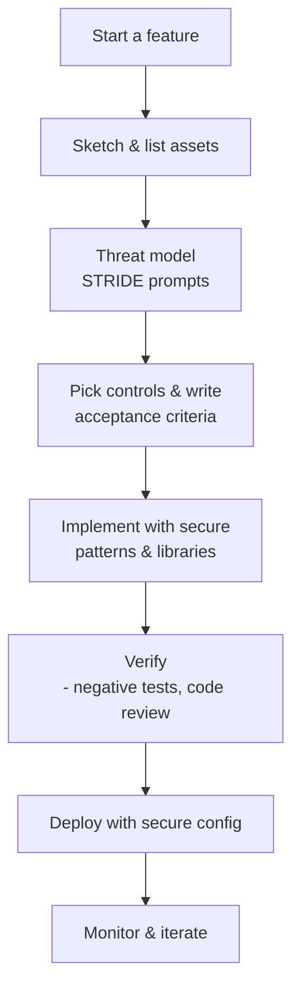

# Insecure Design — Build Security Into the Design (Layman’s Guide for .NET)

Clear, crisp guidance for teams that want to *design out* vulnerabilities before they reach code.

---

## What “Insecure Design” means (in plain English)
It’s not a typo or a bug — it’s when the **plan itself** makes risky choices. Examples:
- Anyone can hit admin endpoints because “we’ll hide the button.”
- App trusts `tenantId` from the client to filter data.
- File uploads go straight to `/wwwroot` without checks.
- No rate limits; attackers can guess IDs all day.

**Fix:** decide security up front: who can do what, which data is sensitive, and which controls you’ll use **every time**.

---

## The 30‑Minute Threat Model (simple & practical)
1) **Sketch the system**: users, services, DBs, third parties, data flows.
2) **List assets**: accounts, money, PII, secrets, files.
3) **Ask “what could go wrong?”** Use the STRIDE prompts:
   - **S**poofing (fake identity) → strong auth, MFA, tokens
   - **T**ampering → signatures, integrity checks
   - **R**epudiation → audit logs
   - **I**nformation disclosure → encryption, access controls
   - **D**enial of service → rate limits, quotas
   - **E**levation of privilege → least privilege, code reviews
4) **Pick controls** (below) and write them into stories/acceptance criteria.

**Accept/transfer/fix**: for each risk, decide what to do and track it like any other requirement.

---

## Secure‑by‑Design Controls (with .NET patterns)

### 1) Authentication & Authorization (deny by default)
```csharp
// Program.cs
using Microsoft.AspNetCore.Authorization;

builder.Services.AddAuthorization(options =>
{
    options.FallbackPolicy = new AuthorizationPolicyBuilder()
        .RequireAuthenticatedUser()  // everything requires auth unless allowed
        .Build();

    options.AddPolicy("AdminOnly", p => p.RequireRole("Admin"));
});

var app = builder.Build();
app.UseAuthentication();
app.UseAuthorization();

app.MapGroup("/admin").RequireAuthorization("AdminOnly")
   .MapGet("/users", /* ... */);
```
- **Key classes**: `[Authorize]`, `AuthorizationPolicyBuilder`, `IAuthorizationService`, `AuthorizationHandler<TReq, TRes>`
- **Rule**: resource‑level checks for **ownership/tenant** with `IAuthorizationService.AuthorizeAsync`.

### 2) Input validation (never trust input)
```csharp
public record UpdateProfileDto(
    [property: System.ComponentModel.DataAnnotations.Required]
    [property: System.ComponentModel.DataAnnotations.StringLength(80)]
    string DisplayName,
    [property: System.ComponentModel.DataAnnotations.RegularExpression("^[a-z0-9_.-]+$")]
    string Handle);
```
- **Key attributes**: `[Required]`, `[StringLength]`, `[Range]`, `[RegularExpression]`, `[EmailAddress]`
- Prefer **DTOs** over binding entities (prevents mass assignment).

### 3) Data access & object ownership
```csharp
// Resource-based check (ownership)
var decision = await auth.AuthorizeAsync(User, document, new CanEditDocument());
if (!decision.Succeeded) return Results.NotFound(); // avoid leaking existence
```
- **Key classes**: `IAuthorizationService`, custom `AuthorizationHandler`.

### 4) CSRF, HTTPS, cookies (platform defenses)
```csharp
builder.Services.AddControllersWithViews(o =>
    o.Filters.Add(new Microsoft.AspNetCore.Mvc.AutoValidateAntiforgeryTokenAttribute()));

if (!app.Environment.IsDevelopment()) app.UseHsts();
app.UseHttpsRedirection();
```
- **Key classes**: `IAntiforgery`, `AutoValidateAntiforgeryTokenAttribute`, `UseHsts`, `UseHttpsRedirection`.
- Set cookies `Secure`, `HttpOnly` (auth), and `SameSite` (Lax/Strict when possible).

### 5) Rate limiting & quotas (slow the attacker)
```csharp
builder.Services.AddRateLimiter(o =>
    o.AddFixedWindowLimiter("api", options => { options.PermitLimit = 100; options.Window = TimeSpan.FromSeconds(10); }));

app.UseRateLimiter();
app.MapGroup("/api").RequireRateLimiting("api");
```
- **Key namespace**: `Microsoft.AspNetCore.RateLimiting`.

### 6) Secrets & keys (keep out of code)
- Load from **configuration**/secret stores, not from source:
```csharp
var conn = builder.Configuration.GetConnectionString("MainDb");
```
- **Key pieces**: `IConfiguration`, **User Secrets** (dev), cloud **Key Vaults**, `Microsoft.AspNetCore.DataProtection` for app key rotation.

### 7) Output encoding & content security
- Razor auto‑encodes: avoid `@Html.Raw` on untrusted input.
- Add a **Content‑Security‑Policy (CSP)** header; prefer nonces/hashes for scripts.

### 8) File uploads (safe by design)
- Limit **size**, **type**, and storage **location** (outside web root).
- Generate random filenames; scan if needed; never execute uploaded files.

### 9) Errors, logging, and privacy
```csharp
if (!app.Environment.IsDevelopment())
    app.UseExceptionHandler("/error"); // return generic message, log details
```
- Log denials (401/403), but **don’t log secrets/PII**. Mask/redact sensitive fields.

---

## Minimal “secure‑by‑default” Program.cs (copy/paste)
```csharp
var builder = WebApplication.CreateBuilder(args);

builder.Services.AddAuthentication(/* your scheme(s) */);
builder.Services.AddAuthorization(o =>
{
    o.FallbackPolicy = new AuthorizationPolicyBuilder()
        .RequireAuthenticatedUser()
        .Build();
});
builder.Services.AddControllersWithViews(o =>
    o.Filters.Add(new Microsoft.AspNetCore.Mvc.AutoValidateAntiforgeryTokenAttribute()));

builder.Services.AddRateLimiter(o =>
    o.AddFixedWindowLimiter("api", opt => { opt.PermitLimit = 100; opt.Window = TimeSpan.FromSeconds(10); }));

var app = builder.Build();

if (!app.Environment.IsDevelopment()) app.UseHsts();
app.UseHttpsRedirection();
app.UseAuthentication();
app.UseAuthorization();
app.UseRateLimiter();

app.MapControllers().RequireAuthorization(); // default: locked
app.Run();
```

---

## Flowchart — “Design security into every change”


---

## Design Review One‑Pager (template)
- **Feature:** _What are we adding?_
- **Assets:** _Which data/actions matter?_
- **Trust boundaries:** _Browser ↔ API ↔ DB; third parties?_
- **Abuse cases:** _How could this be misused?_
- **Controls selected:** _AuthZ policy, DTO validation, rate limit, CSRF, CSP, file rules, logging_
- **Decisions & owners:** _Who’s responsible?_
- **Tests:** _Unit/integration/negative cases_
- **Follow‑ups:** _Docs, runbooks, alerts_

---

## Key .NET Concepts, Classes & Methods (quick index)
- **AuthN/Z:** `[Authorize]`, `AuthorizationPolicyBuilder`, `IAuthorizationService.AuthorizeAsync`, `AuthorizationHandler<TReq, TRes>`  
- **Validation:** `System.ComponentModel.DataAnnotations` (`[Required]`, `[StringLength]`, `[Range]`, `[RegularExpression]`)  
- **CSRF:** `IAntiforgery`, `AutoValidateAntiforgeryTokenAttribute`  
- **TLS/HSTS:** `UseHttpsRedirection()`, `UseHsts()`  
- **Rate limiting:** `AddRateLimiter(...)`, `RequireRateLimiting()`  
- **Data Protection:** `AddDataProtection()`, `PersistKeys...`, `ProtectKeysWith...`  
- **Configuration/Secrets:** `IConfiguration`, User Secrets, Key Vaults  
- **Razor encoding:** default HTML encoding (avoid `@Html.Raw` on untrusted data)  
- **CSP/security headers:** add via middleware/library; prefer nonces/hashes  
- **Logging & errors:** `ILogger`, `UseExceptionHandler()`  
- **File uploads:** `IFormFile`, size/type checks, store outside web root

---

## Quick “done‑done” checklist
- [ ] Threat model & one‑pager attached to the story  
- [ ] Auth required by default; policies for sensitive actions  
- [ ] Resource ownership/tenant checks in place  
- [ ] DTO validation for every request; entity binding avoided  
- [ ] CSRF/HTTPS/HSTS/cookies configured correctly  
- [ ] Rate limits enabled on all external endpoints  
- [ ] Secrets in vault/config; keys rotate; no secrets in logs  
- [ ] File upload rules (size/type/location) enforced  
- [ ] CSP set; Razor uses auto‑encoding (no unsafe `Html.Raw`)  
- [ ] Negative tests for abuse cases; monitoring/alerts wired
