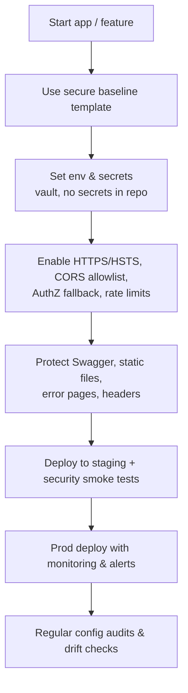

# Security Misconfiguration — Plain-English Guide (ASP.NET Core)

Keep your app safe by **configuring it the right way**. This is a crisp, non‑jargony checklist with copy‑paste .NET snippets.

---

## TL;DR (one minute)
- Most breaches are not fancy hacks — they’re **bad settings**.
- Make a **secure baseline** once, reuse it in every app.
- Lock down **errors, HTTPS/HSTS, CORS, auth by default, headers, Swagger, proxies, uploads, secrets**.

---

## What is “Security Misconfiguration”?
Mistakes or unsafe defaults like “debug on in prod,” “CORS allow all,” “secrets in the repo,” or “Swagger open to the world.” These don’t require a code bug — just **wrong switches**.

---

## The Best Pattern: **Secure Baseline** (drop‑in and forget)
Use this as your default `Program.cs` and tweak per app.

```csharp
var builder = WebApplication.CreateBuilder(args);

// Hide banner headers in prod (less info to attackers)
if (!builder.Environment.IsDevelopment())
{
    builder.WebHost.ConfigureKestrel(o => o.AddServerHeader = false);
}

// MVC + global CSRF (for browser apps)
builder.Services.AddControllersWithViews(o =>
    o.Filters.Add(new Microsoft.AspNetCore.Mvc.AutoValidateAntiforgeryTokenAttribute()));

// CORS: exact allowlist only (enable only if you truly need cross-origin browser calls)
builder.Services.AddCors(o => o.AddPolicy("Strict", p => p
    .WithOrigins("https://app.example.com")
    .WithMethods("GET","POST","PUT","PATCH","DELETE")
    .WithHeaders("Content-Type","Authorization","X-XSRF-TOKEN")
    .AllowCredentials()));

// AuthZ: deny by default
builder.Services.AddAuthorization(o =>
{
    o.FallbackPolicy = new AuthorizationPolicyBuilder()
        .RequireAuthenticatedUser()
        .Build();
});

// Rate limiting: slow down abuse
builder.Services.AddRateLimiter(o => o.AddFixedWindowLimiter("api", opt =>
{
    opt.PermitLimit = 100;
    opt.Window = TimeSpan.FromSeconds(10);
    opt.QueueLimit = 0;
}));

// Reverse proxy awareness (if behind Nginx/ALB/etc.)
builder.Services.Configure<ForwardedHeadersOptions>(opt =>
{
    opt.ForwardedHeaders = ForwardedHeaders.XForwardedFor | ForwardedHeaders.XForwardedProto;
    // opt.KnownProxies.Add(IPAddress.Parse("10.0.0.100"));
});

var app = builder.Build();

// Errors & HSTS
if (app.Environment.IsDevelopment())
{
    app.UseDeveloperExceptionPage();
    app.UseSwagger();
    app.UseSwaggerUI();
}
else
{
    app.UseExceptionHandler("/error"); // generic to users, detailed in logs
    app.UseHsts();
    // Option: protect or disable Swagger in prod
    // app.Map("/swagger", s => s.RequireAuthorization());
}

app.UseHttpsRedirection();
app.UseStaticFiles(); // never store secrets under wwwroot
app.UseForwardedHeaders();
app.UseRouting();

app.UseCors("Strict");             // apply narrowly if possible
app.UseAuthentication();
app.UseAuthorization();
app.UseRateLimiter();

app.MapControllers().RequireAuthorization(); // default: locked
app.Run();
```

### Guardrails in `appsettings.json`
```json
{
  "AllowedHosts": "app.example.com",
  "Logging": { "LogLevel": { "Default": "Information", "Microsoft": "Warning" } }
}
```
> Keep **secrets out** of `appsettings.json`. Use environment variables, User Secrets (dev), or a cloud Key Vault.

---

## Common “oops” and the fix (clear & crisp)

### 1) Detailed errors in production
- **Problem:** users see stack traces with secrets/paths.
- **Fix:** `UseExceptionHandler("/error")` in prod, `UseDeveloperExceptionPage()` only in dev.

### 2) CORS too open
- **Problem:** `AllowAnyOrigin()` + `AllowCredentials()` lets **any site** call your API with the user’s cookies.
- **Fix:** use **exact origins** only.
```csharp
// ❌ Don’t
builder.Services.AddCors(p => p.AddDefaultPolicy(b => b.AllowAnyOrigin().AllowAnyHeader().AllowAnyMethod().AllowCredentials()));
// ✅ Do
builder.Services.AddCors(o => o.AddPolicy("Strict", p => p
    .WithOrigins("https://app.example.com")
    .WithMethods("GET","POST","PUT","PATCH","DELETE")
    .WithHeaders("Content-Type","Authorization","X-XSRF-TOKEN")
    .AllowCredentials()));
```

### 3) Swagger open to the internet
- **Fix:** turn off in prod or **require auth** for `/swagger`.

### 4) No HTTPS/HSTS
- **Fix:** `UseHttpsRedirection()` and `UseHsts()` in prod.

### 5) Weak cookies & headers
- **Fix:** secure cookie settings + add minimal security headers.
```csharp
builder.Services.ConfigureApplicationCookie(o =>
{
    o.Cookie.HttpOnly = true;
    o.Cookie.SecurePolicy = CookieSecurePolicy.Always;
    o.Cookie.SameSite = SameSiteMode.Lax; // or Strict if flows allow
});

app.Use(async (ctx, next) =>
{
    ctx.Response.Headers["X-Content-Type-Options"] = "nosniff";
    ctx.Response.Headers["X-Frame-Options"] = "DENY"; // or CSP frame-ancestors
    ctx.Response.Headers["Referrer-Policy"] = "no-referrer";
    await next();
});
```

### 6) Reverse proxy misconfig
- **Problem:** app thinks requests are HTTP, not HTTPS → bad redirects, cookie flags wrong.
- **Fix:** configure `ForwardedHeadersOptions`; set `AllowedHosts`.

### 7) Static files & uploads
- **Fix:** store uploads **outside** `wwwroot`, disable directory browsing, set size/type limits.
```csharp
[RequestSizeLimit(10 * 1024 * 1024)] // example 10 MB limit
public async Task<IActionResult> Upload(IFormFile file) { /* ... */ }
```

### 8) Secrets in repo / images
- **Fix:** use `IConfiguration` with env variables / Key Vault; never hard‑code secrets.

### 9) Over‑broad IAM / public storage
- **Fix:** least‑privilege roles, no public S3/Blob containers by default.

---

## Important .NET Concepts, Classes & Methods (quick index)
- **Environment & hosting**: `IWebHostEnvironment`, `ASPNETCORE_ENVIRONMENT`, `UseExceptionHandler`, `UseDeveloperExceptionPage`, `UseHsts`, `UseHttpsRedirection`
- **CORS**: `AddCors`, `WithOrigins`, `AllowCredentials`, `RequireCors`
- **AuthZ default deny**: `AuthorizationPolicyBuilder`, `FallbackPolicy`, `RequireAuthorization`
- **Rate limiting**: `AddRateLimiter`, `RequireRateLimiting`
- **Reverse proxy**: `ForwardedHeadersOptions`, `UseForwardedHeaders`
- **Host filtering**: `AllowedHosts` (appsettings)
- **Swagger**: `UseSwagger`, `UseSwaggerUI` (dev only or protected)
- **Uploads & static**: `RequestSizeLimit`, `IFormFile`, `UseStaticFiles`
- **Cookies & headers**: `CookieSecurePolicy`, `SameSiteMode`, `AddServerHeader`
- **Config & secrets**: `IConfiguration`, User Secrets, Key Vaults
- **Logging**: `ILogger`, structured logs with PII redaction

---

## Flowchart — “From code to prod without misconfig”


---

## Quick “done‑done” checklist
- [ ] Prod uses `UseExceptionHandler` (not DeveloperExceptionPage).  
- [ ] `UseHttpsRedirection()` + `UseHsts()` enabled; Kestrel `AddServerHeader=false`.  
- [ ] CORS allowlist only (no `AnyOrigin` + credentials).  
- [ ] `FallbackPolicy` requires auth by default; sensitive routes grouped.  
- [ ] Swagger disabled or behind auth in prod.  
- [ ] `ForwardedHeadersOptions` set; `AllowedHosts` configured.  
- [ ] Secrets via env/Key Vault; none in repo/images.  
- [ ] Uploads constrained; no directory browsing; nothing private under `wwwroot`.  
- [ ] Rate limits on public endpoints; security headers added.  
- [ ] Cloud/storage/IAM reviewed for least privilege.
