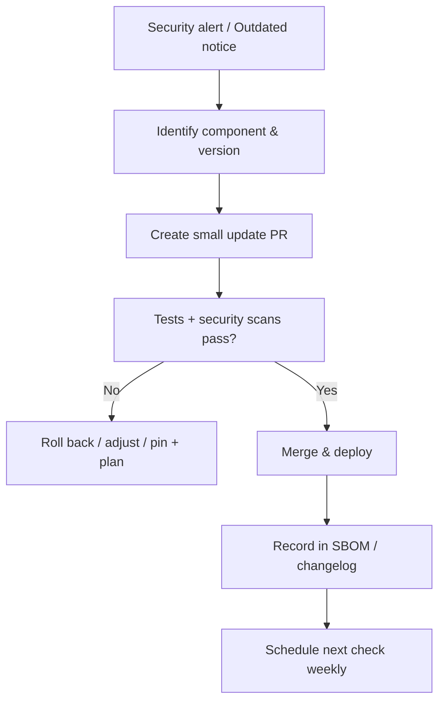

# Vulnerable & Outdated Components — Plain‑English Guide (ASP.NET Core)

Keep your app safe by keeping **everything you depend on** safe: frameworks, NuGet packages, container images, OS, and 3rd‑party services.

---

## What this means (no jargon)
Most apps use lots of components you didn’t write. If any of those have a **known security hole** or are **too old to get patches**, attackers can walk right in — even if your code is perfect.

**Goal:** Know what you use, keep it updated, and **block risky versions** from shipping.

---

## Fast signals you’re at risk
- You’re on an **old .NET** (or OS/container base) that’s **out of support**.
- Your repo has **floating package versions** (`1.*`, `-preview`) or **no lockfile**.
- You don’t run **“outdated/vulnerable” checks** in CI.
- You ship **debug builds** or **leave sample/unused packages** in.
- You don’t have a **bill of materials (SBOM)** for what’s in prod.

---

## The easy wins (do these now)
1) **Pin package versions** in `*.csproj` (no `*` or ranges for prod).
2) **Check what’s outdated & vulnerable** locally:
   ```bash
   dotnet list <path-to.sln> package --outdated
   dotnet list <path-to.sln> package --vulnerable
   dotnet list <path-to.sln> package --deprecated
   ```
3) Turn on **Dependabot or Renovate** for automatic PRs.
4) **Lock restores** so builds are reproducible:
   ```bash
   dotnet restore --locked-mode         # use packages.lock.json
   ```
   Add `RestorePackagesWithLockFile=true` and commit `packages.lock.json`.
5) Run your app on a **supported .NET** (LTS if possible) and **patch monthly**.

---

## Best pattern: “Update → Test → Ship” loop (small, frequent updates)
- Update **one or a few** packages per PR.
- Run tests & security scans.
- Ship quickly; repeat. Smaller changes = fewer surprises.

---

## .NET‑specific playbook (copy/paste)

### 1) Centralize & pin versions
Use **Central Package Management** so all projects share one version source.
`Directory.Packages.props` (at the solution root):
```xml
<Project>
  <ItemGroup>
    <PackageVersion Include="Serilog.AspNetCore" Version="8.0.0" />
    <PackageVersion Include="FluentValidation" Version="11.9.0" />
  </ItemGroup>
</Project>
```
Each `*.csproj` now references by name only:
```xml
<ItemGroup>
  <PackageReference Include="Serilog.AspNetCore" />
</ItemGroup>
```

### 2) Reproducible builds with a lock file
Enable and commit `packages.lock.json`:
```xml
<PropertyGroup>
  <RestorePackagesWithLockFile>true</RestorePackagesWithLockFile>
</PropertyGroup>
```
CI uses locked mode:
```bash
dotnet restore --locked-mode
```

### 3) CI: fail builds on risky versions
**GitHub Actions** example:
```yaml
name: deps-audit
on: [push, pull_request]
jobs:
  audit:
    runs-on: ubuntu-latest
    steps:
      - uses: actions/checkout@v4
      - uses: actions/setup-dotnet@v4
        with: { dotnet-version: '8.0.x' }
      - run: dotnet restore --locked-mode
      - run: dotnet build --configuration Release --no-restore
      - name: List outdated
        run: dotnet list ./YourSolution.sln package --outdated
      - name: List vulnerable
        run: dotnet list ./YourSolution.sln package --vulnerable
      # Optional: fail on known vulns
      - name: Fail if vulnerable
        run: |
          dotnet list ./YourSolution.sln package --vulnerable --include-transitive > audit.txt
          if grep -q "Vulnerabilities" audit.txt; then
            echo "❌ Vulnerable packages found"; cat audit.txt; exit 1
          fi
```

### 4) SBOM (know exactly what’s in your build)
Produce a **CycloneDX SBOM** for visibility/compliance:
```bash
dotnet tool install --global CycloneDX
cyclonedx --project-file YourSolution.sln --output-dir ./sbom
```
Ship the SBOM artifact with your release and store it in artifact storage.

### 5) Containers & OS (don’t forget the base image)
- Choose a **supported** base image (e.g., `mcr.microsoft.com/dotnet/aspnet:8.0-alpine`).
- **Scan** images in CI (Trivy/Grype/Docker Scout).
- Rebuild on **base image patch** (weekly is common).

Example `Dockerfile`:
```dockerfile
FROM mcr.microsoft.com/dotnet/aspnet:8.0-alpine AS base
WORKDIR /app
EXPOSE 8080
FROM mcr.microsoft.com/dotnet/sdk:8.0-alpine AS build
WORKDIR /src
COPY . .
RUN dotnet restore --locked-mode
RUN dotnet publish -c Release -o /app/publish --no-restore
FROM base AS final
COPY --from=build /app/publish .
ENTRYPOINT ["dotnet","YourApp.dll"]
```

### 6) Third‑party services & front‑end bits
- Keep **CDN scripts** pinned by **SRI hashes** (subresource integrity).
- Track versions of **JavaScript packages** (package.json) and run `npm audit` if you ship a SPA.
- Review **SDKs** (cloud providers, payment gateways) for version and deprecation notices.

---

## Safe update tips
- Read change logs for **breaking changes**; prefer **patch**/**minor** bumps first.
- If a package is unmaintained, **swap it out** for an active alternative.
- If you **cannot update immediately**, apply temporary mitigations (feature flags, firewall/WAF rules) and plan the upgrade.

---

## Visual: from alert to fixed


---

## Quick checklist (done‑done)
- [ ] On a **supported .NET** and base image; OS patched.  
- [ ] **Pinned** package versions (no floating ranges); **lock file** committed.  
- [ ] CI runs `dotnet list package --outdated/--vulnerable` and **fails** on risks.  
- [ ] **Dependabot/Renovate** enabled; small PRs merged regularly.  
- [ ] **SBOM** generated and stored with releases.  
- [ ] Container images **scanned**; rebuilt on base patches.  
- [ ] 3rd‑party SDKs, CDN scripts, and front‑end packages **tracked & updated**.  
- [ ] Mitigations documented when updates must be delayed.
