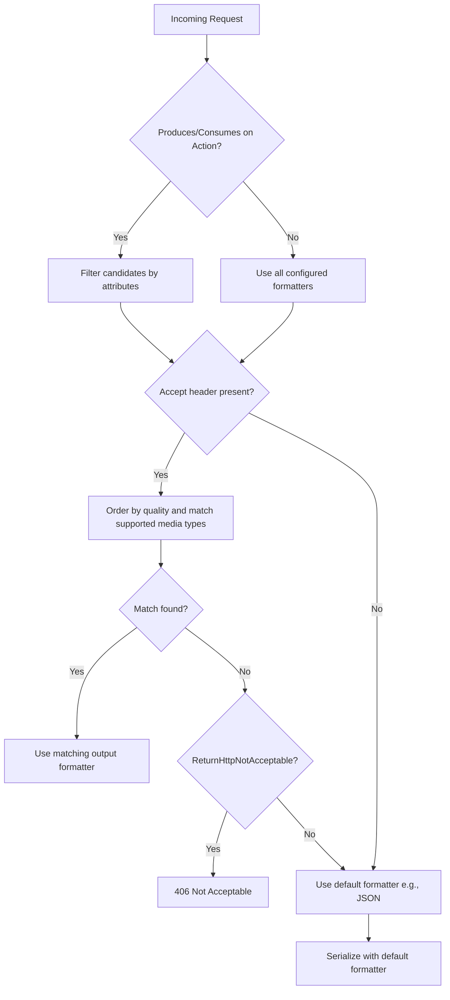

# Content Negotiation in ASP.NET Core — What, Why, and How

A practical guide to HTTP content negotiation and **how to implement it in ASP.NET Core** (JSON, XML, custom CSV), with code you can paste into a .NET 7/8 project and a flowchart of the selection process.

---

## 1) What is Content Negotiation? (a.k.a. conneg)

**Goal:** pick the best **representation** of a resource for a request.

- Driven primarily by the `Accept` header (e.g., `Accept: application/json, application/xml;q=0.8`).
- Server chooses a formatter/representation based on:
  - Supported **media types** (JSON by default in ASP.NET Core).
  - Client preference (quality weights `q=`).
  - App configuration and available formatters.
- If nothing matches and you configure it to be strict, the server can return **`406 Not Acceptable`**.

> Other headers like `Accept-Language`, `Accept-Encoding`, and `Accept-Charset` negotiate **language**, **compression**, and **charsets** respectively. ASP.NET Core MVC’s built‑in content negotiation focuses on **media type** (representation).

---

## 2) How ASP.NET Core Does It (under the hood)

- **Input formatters** parse request bodies into .NET types (e.g., JSON → object).
- **Output formatters** serialize your object results to the negotiated media type.
- Default: **System.Text.Json** for JSON (`application/json`).
- You can add more (e.g., **XML**) and **custom** ones (e.g., CSV).

Negotiation order of preference (simplified):
1. Respect an explicit **`[Produces]`** attribute on action/controller.
2. Respect **`Accept`** header order and quality.
3. Respect **route/query format** (`.{format}` or `?format=`) if **`FormatFilter`** and **FormatterMappings** are configured.
4. Fall back to defaults (usually JSON) or return **406** if configured.

---

## 3) Turn on Strict & Browser-Friendly Behavior

`Program.cs` (Minimal hosting, .NET 7/8)

```csharp
var builder = WebApplication.CreateBuilder(args);

builder.Services
    .AddControllers(options =>
    {
        // Consider the browser's Accept header instead of ignoring */*
        options.RespectBrowserAcceptHeader = true;

        // If no formatter matches the Accept header, return 406 Not Acceptable
        options.ReturnHttpNotAcceptable = true;

        // Map route/query formats to media types (for FormatFilter)
        options.FormatterMappings.SetMediaTypeMappingForFormat("json", "application/json");
        options.FormatterMappings.SetMediaTypeMappingForFormat("xml",  "application/xml");
        options.FormatterMappings.SetMediaTypeMappingForFormat("csv",  "text/csv");
    })
    // Add XML support (optional)
    .AddXmlSerializerFormatters();

// Register a custom CSV output formatter (see class below)
builder.Services.AddControllers(options =>
{
    options.OutputFormatters.Add(new CsvOutputFormatter());
});

var app = builder.Build();
app.MapControllers();
app.Run();
```

> **Tip:** If you’re using **Minimal APIs**, returning a POCO negotiates to JSON by default. For XML/CSV in Minimal APIs, you’ll typically serialize manually or return `Results.File`/`Results.Text` with the appropriate content-type, or add MVC and reuse formatters.

---

## 4) A Custom CSV Output Formatter

Create a class (e.g., `CsvOutputFormatter.cs`) that derives from `TextOutputFormatter`:

```csharp
using System.Text;
using Microsoft.AspNetCore.Mvc.Formatters;
using Microsoft.Net.Http.Headers;

public sealed class CsvOutputFormatter : TextOutputFormatter
{
    public CsvOutputFormatter()
    {
        SupportedMediaTypes.Add(MediaTypeHeaderValue.Parse("text/csv"));
        SupportedEncodings.Add(Encoding.UTF8);
        SupportedEncodings.Add(Encoding.Unicode);
    }

    protected override bool CanWriteType(Type? type)
    {
        if (type is null) return false;

        // Allow IEnumerable<T> and single T (where T is a simple DTO)
        if (typeof(IEnumerable<object>).IsAssignableFrom(type)) return true;
        if (!type.IsPrimitive && type != typeof(string)) return true;

        return false;
    }

    public override async Task WriteResponseBodyAsync(OutputFormatterWriteContext context, Encoding selectedEncoding)
    {
        var response = context.HttpContext.Response;
        var sb = new StringBuilder();

        // Simple reflective CSV writer. For production, you may want a proper CSV library.
        void WriteObject(object obj)
        {
            var props = obj.GetType().GetProperties();
            if (sb.Length == 0)
            {
                // header
                sb.AppendLine(string.Join(",", props.Select(p => p.Name)));
            }
            var values = props.Select(p => Escape(p.GetValue(obj, null)));
            sb.AppendLine(string.Join(",", values));
        }

        static string Escape(object? v)
        {
            if (v is null) return "";
            var s = v.ToString() ?? "";
            if (s.Contains('"') || s.Contains(',') || s.Contains('\n') || s.Contains('\r'))
            {
                s = "\"" + s.Replace("\"", "\"\"") + "\"";
            }
            return s;
        }

        if (context.Object is IEnumerable<object> list)
        {
            foreach (var item in list) WriteObject(item!);
        }
        else if (context.Object is not null)
        {
            WriteObject(context.Object);
        }

        await response.WriteAsync(sb.ToString(), selectedEncoding);
    }
}
```

---

## 5) Controller Examples (JSON, XML, CSV)

```csharp
using Microsoft.AspNetCore.Mvc;

[ApiController]
[Route("api/[controller]")]
public sealed class UsersController : ControllerBase
{
    // Advertise supported outputs (helps negotiation)
    [HttpGet("{id:int}")]
    [Produces("application/json", "application/xml", "text/csv")]
    public ActionResult<UserDto> Get(int id)
    {
        var user = new UserDto { Id = id, Name = "Ada", Email = "ada@example.com" };
        return Ok(user);
    }

    // Parse JSON or XML bodies (input negotiation)
    [HttpPost]
    [Consumes("application/json", "application/xml")]
    [Produces("application/json")]
    public ActionResult<UserDto> Create([FromBody] UserDto input)
    {
        input.Id = 42; // pretend we created it
        return CreatedAtAction(nameof(Get), new { id = input.Id }, input);
    }

    // Allow route or query format: /api/users/list.csv OR /api/users/list?format=csv
    [HttpGet("list.{format?}")]
    [FormatFilter]
    [Produces("application/json", "application/xml", "text/csv")]
    public ActionResult<IEnumerable<UserDto>> List()
    {
        var users = new[]
        {
            new UserDto { Id = 1, Name = "Ada", Email = "ada@example.com" },
            new UserDto { Id = 2, Name = "Grace", Email = "grace@example.com" }
        };
        return Ok(users);
    }
}

public sealed record UserDto
{
    public int Id { get; init; }
    public string Name { get; init; } = default!;
    public string Email { get; init; } = default!;
}
```

**Try it with curl:**

```bash
# JSON (default)
curl -s http://localhost:5000/api/users/1

# Explicit JSON
curl -s -H "Accept: application/json" http://localhost:5000/api/users/1

# XML (requires AddXmlSerializerFormatters)
curl -s -H "Accept: application/xml" http://localhost:5000/api/users/1

# CSV (custom formatter)
curl -s -H "Accept: text/csv" http://localhost:5000/api/users/1

# Format via route or query (FormatFilter)
curl -s http://localhost:5000/api/users/list.csv
curl -s http://localhost:5000/api/users/list?format=csv

# 406 Not Acceptable (since ReturnHttpNotAcceptable = true)
curl -i -H "Accept: application/x-yaml" http://localhost:5000/api/users/1
```

---

## 6) Best Practices & Pitfalls

- **Be explicit** with `[Produces]`/`[Consumes]` to make your API contract clear.
- **Keep JSON as default** for broad compatibility; add XML only if you need it.
- **Return `406`** when the client requests unsupported media types (helps clients fail fast).
- **Document** supported media types in OpenAPI/Swagger (e.g., Swashbuckle).
- **Use versioned vendor media types** only if you truly need them (e.g., `application/vnd.company.user+json`).
- **Validate inputs** with model binding + data annotations regardless of media type.
- **Compression** (`Accept-Encoding: gzip, br`) is orthogonal to conneg; enable Response Compression middleware separately.

---

## 7) Flowchart — ASP.NET Core Content Negotiation



---

## 8) Quick Checklist

- [ ] `RespectBrowserAcceptHeader = true`
- [ ] `ReturnHttpNotAcceptable = true`
- [ ] Add XML: `.AddXmlSerializerFormatters()` (if needed)
- [ ] Register any custom formatters (e.g., CSV)
- [ ] Map `.{format}` and `?format=` via `FormatFilter` + FormatterMappings
- [ ] Mark actions with `[Produces]`/`[Consumes]`
- [ ] Test with `curl` and Swagger UI

---
