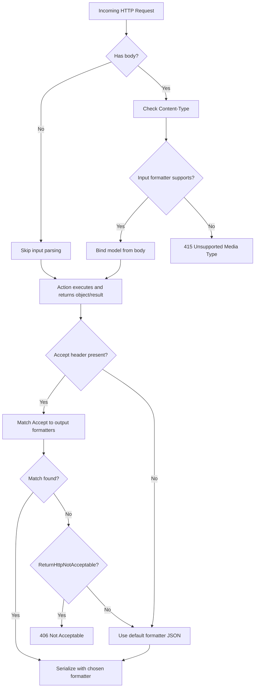

# Content Negotiation — Request vs Response in ASP.NET Core

This add-on guide clarifies **request vs response** content negotiation, shows exactly how ASP.NET Core handles each, and includes copy‑paste snippets plus a flowchart.

---

## 1) TL;DR

- **Request (input) side:** The client declares the body format via **`Content-Type`**. ASP.NET Core uses **input formatters** to parse it. If unsupported → **`415 Unsupported Media Type`**. This is **not** negotiation; it’s declaration.
- **Response (output) side — “content negotiation”:** The client indicates preferred formats via **`Accept`**. ASP.NET Core picks an **output formatter** (JSON, XML, CSV, …). If none match → fallback to default (JSON) or **`406 Not Acceptable`** if configured.

---

## 2) Request Side (Input) — `Content-Type`

### How it works
1. Client sends `Content-Type: application/json` (or `application/xml`, `multipart/form-data`, etc.).
2. MVC chooses an **input formatter** that supports that media type.
3. The formatter binds the body into your DTO/model (`[FromBody]`).  
4. If no input formatter supports the `Content-Type` → **`415 Unsupported Media Type`**.

### Example
```http
POST /api/users HTTP/1.1
Content-Type: application/json

{"name":"Ada","email":"ada@example.com"}
```

**Controller**
```csharp
[HttpPost]
[Consumes("application/json", "application/xml")]
public ActionResult<UserDto> Create([FromBody] UserDto input) => Created(...);
```

> Marking `[Consumes]` is optional but documents + constrains which `Content-Type`s your action accepts.

---

## 3) Response Side (Output) — `Accept` (Real “Conneg”)

### How it works
1. Your action **returns a .NET object** (e.g., `return Ok(user);`).
2. MVC looks at **registered output formatters** (JSON by default; XML/custom if added).
3. It matches the **`Accept`** header (order & quality `q=`) to pick the best formatter.
4. If no match:
   - Default behavior: **fallback to JSON**.
   - If `options.ReturnHttpNotAcceptable = true`: **`406 Not Acceptable`**.

### Example
```http
GET /api/users/1
Accept: application/xml, application/json;q=0.8
```

**Result** (with XML formatter enabled): XML response.  
Change `Accept` to `application/json` → JSON response.

**Controller**
```csharp
[HttpGet("{id:int}")]
[Produces("application/json", "application/xml")]
public ActionResult<UserDto> Get(int id) => Ok(new UserDto { Id = id, Name = "Ada" });
```

**Startup (Program.cs)**
```csharp
builder.Services.AddControllers(options =>
{
    options.RespectBrowserAcceptHeader = true;
    options.ReturnHttpNotAcceptable = true; // 406 if no match
})
.AddXmlSerializerFormatters(); // enable XML

// Optional: add custom CSV output formatter and format mappings
builder.Services.AddControllers(options =>
{
    options.OutputFormatters.Add(new CsvOutputFormatter());
    options.FormatterMappings.SetMediaTypeMappingForFormat("csv", "text/csv");
});
```

---

## 4) End-to-End Examples (curl)

```bash
# A) Request body format (declaration) -> Content-Type
curl -s -X POST http://localhost:5000/api/users \
  -H "Content-Type: application/json" \
  -d '{"name":"Ada","email":"ada@example.com"}'

# If you send XML but didn't enable XML input -> 415
curl -i -X POST http://localhost:5000/api/users \
  -H "Content-Type: application/xml" \
  -d '<UserDto><Name>Ada</Name></UserDto>'

# B) Response format (negotiation) -> Accept
curl -s -H "Accept: application/xml" http://localhost:5000/api/users/1
curl -s -H "Accept: application/json" http://localhost:5000/api/users/1

# If Accept asks for unsupported type and ReturnHttpNotAcceptable=true -> 406
curl -i -H "Accept: application/x-yaml" http://localhost:5000/api/users/1

# C) Route format (optional with FormatFilter)
curl -s http://localhost:5000/api/users/list.csv
curl -s http://localhost:5000/api/users/list?format=csv
```

---

## 5) Flowchart — Request vs Response Paths



---

## 6) Best Practices

- **Be explicit**: use `[Consumes]`/`[Produces]` on actions where it clarifies your contract.
- **Enable 406** for stricter clients: `options.ReturnHttpNotAcceptable = true`.
- **Default to JSON**; add XML only when needed; consider custom formatters for CSV or vendor media types.
- **Document** supported media types via **OpenAPI/Swagger**.
- **Don’t confuse**: `Content-Type` (request body format) vs `Accept` (response preference).

---

## 7) Minimal APIs Note

Minimal APIs negotiate JSON by default when you `return` a POCO. For XML/CSV you can:
- Manually serialize and return `Results.Text(...)`/`Results.File(...)` with the correct `contentType`, or
- Add MVC and reuse output formatters.

```csharp
app.MapGet("/users/{id}", (int id) =>
{
    var user = new UserDto { Id = id, Name = "Ada" };
    return Results.Json(user); // application/json
});
```

---

**That’s it:** Requests use `Content-Type` and **input** formatters. Responses use `Accept` and **output** formatters—this is the real “content negotiation.”
