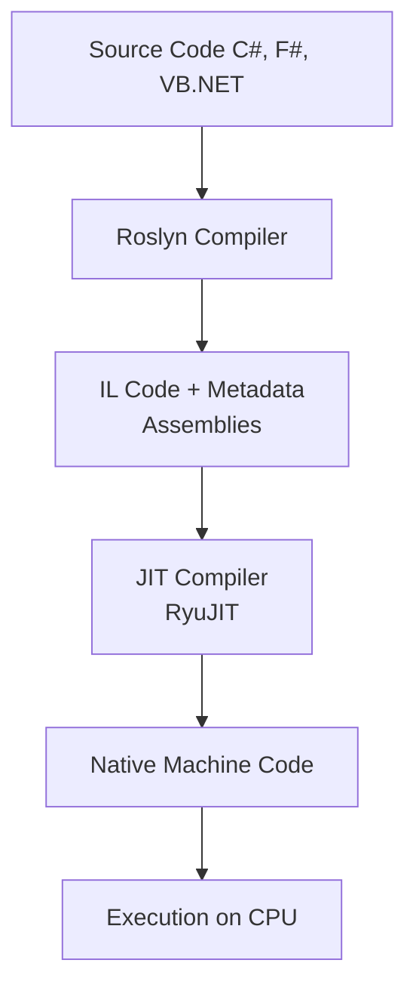

# 🔹 JIT (Just-In-Time) Compilation in .NET Core – Nutshell

## ✅ What is JIT?
The **Just-In-Time (JIT) compiler** is part of the **CoreCLR runtime**.  
It converts **Intermediate Language (IL)** into **native machine code** at runtime, allowing .NET apps to run on any supported OS/CPU.

---

## 🔹 Visual Flowchart of JIT Process

---

## 🔹 Key Features
- **On-demand compilation** → Methods compiled only when called.
- **Cross-platform** → IL runs on Windows, Linux, macOS via JIT.
- **Optimized execution** → Produces fast, CPU-specific machine code.

---

## 🔹 Types of JIT in .NET Core
1. **RyuJIT (Default JIT)** → High-performance, 64-bit, cross-platform.
2. **Tiered Compilation** → Quick initial compilation, then re-optimizes hot methods.
3. **ReadyToRun (R2R)** → Partial AOT + JIT fallback.
4. **NativeAOT** → Full AOT, eliminates JIT.

---

## 🔹 JIT Compilation Process
1. Source code → compiled by **Roslyn** → **IL**.  
2. First method call → **JIT compiles IL → native code**.  
3. Native code cached → reused for subsequent calls.

---

## 🔹 Optimizations by JIT
- **Inlining** → embeds small methods.  
- **Dead Code Elimination** → removes unused paths.  
- **Loop Unrolling** → speeds up loops.  
- **Register Allocation** → efficient CPU usage.  
- **Constant Folding** → precomputes constants.

---

## 🔹 Pros & Cons
| Pros | Cons |
|------|------|
| Optimized for target CPU | Startup delay due to runtime compilation |
| Smaller binaries | Needs memory to store compiled code |
| Dynamic optimizations | Slightly slower cold start |

---

## ✅ Summary
- **JIT** = IL → Native code **at runtime**.  
- Default engine: **RyuJIT** with **tiered compilation**.  
- Balances portability + runtime optimization.  
- For startup-critical apps, use **AOT (ReadyToRun/NativeAOT)**.

