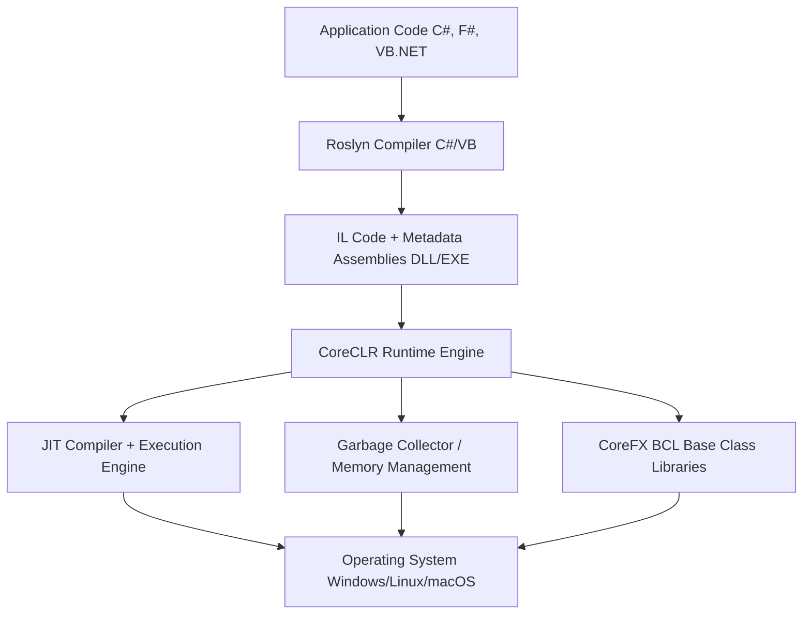

# .NET Core Architecture and Memory Management

## 🔹 Overview
.NET Core is a **cross-platform, open-source framework** for building modern applications (cloud, web, desktop, mobile, IoT).  
It is modular, lightweight, and designed for **performance and scalability**.

---

## 🔹 Visual Flowchart of .NET Core Architecture

---

## 🔹 Explanation of Components

### 1. **Application Code**
Developers write code in **C#, F#, or VB.NET**.

### 2. **Roslyn Compiler**
- Converts source code into **Intermediate Language (IL)** and **metadata**.
- Provides rich tooling support (IntelliSense, code analysis).

### 3. **IL Code + Metadata**
- Output stored in **assemblies (.dll / .exe)**.
- Platform-agnostic representation.

### 4. **CoreCLR (Runtime Engine)**
- The heart of .NET Core.
- Loads assemblies, manages execution, provides **type safety**.

### 5. **JIT Compiler**
- Converts IL into **machine code** for the target OS/CPU.
- Ensures cross-platform support.

### 6. **CoreFX (BCL)**
- Base Class Library for common APIs (collections, IO, networking, JSON, XML).

### 7. **Garbage Collector (GC)**
- Handles **automatic memory management**.
- Frees unused objects, optimizes memory layout, prevents memory leaks.

### 8. **Operating System Layer**
- Abstracted layer so applications can run on **Windows, Linux, or macOS** seamlessly.

---

## 🔹 Memory Management in .NET Core

Memory management is handled by the **Garbage Collector (GC)** inside CoreCLR:

1. **Automatic Allocation**
   - Objects are allocated on the **managed heap**.
   - Stack is used for value types and local variables.

2. **Generational Garbage Collection**
   - **Gen 0**: Short-lived objects (e.g., local variables).
   - **Gen 1**: Objects surviving initial collections.
   - **Gen 2**: Long-lived objects (e.g., static data, global caches).

3. **Garbage Collection Process**
   - GC identifies unused objects.
   - Compacts memory to reduce fragmentation.
   - Optimizes allocation for performance.

4. **Finalization & IDisposable**
   - **Finalizer** cleans unmanaged resources.
   - **IDisposable + `using`** pattern ensures deterministic cleanup.

---

## ✅ Summary
- **.NET Core** is modular, high-performance, and cross-platform.
- CoreCLR + CoreFX form the runtime and libraries.
- **Roslyn** compiles source code → IL → executed by CoreCLR via **JIT**.
- **Garbage Collector** ensures efficient memory usage with minimal developer intervention.

