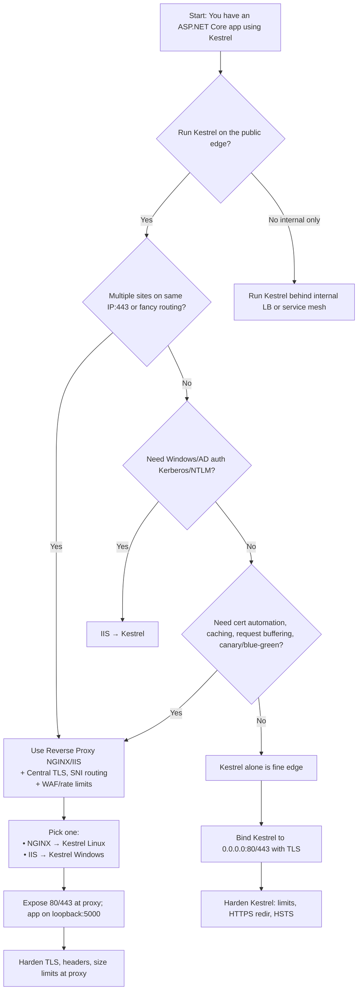
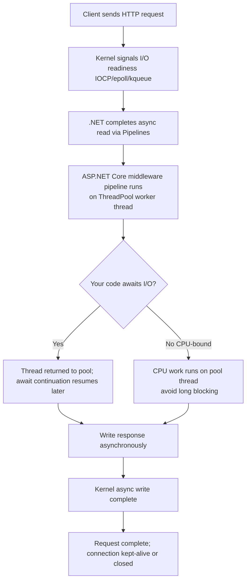
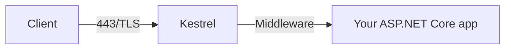
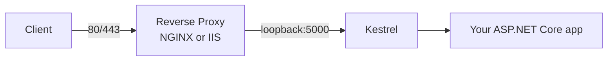

# Kestrel: Deployment & Threading Guide (with NGINX/IIS Patterns)

> A practical, production-focused cheat sheet for running ASP.NET Core with **Kestrel** as the web server — either directly on the edge or behind **NGINX/IIS** — plus a deep dive into the **thread pool & worker thread** behavior.

---

## TL;DR

- **Kestrel can serve the internet directly.** You add **NGINX/IIS** when you need multi‑site routing on one IP, centralized TLS & cert automation, Windows auth, WAF/rate‑limits, request buffering, or blue/green load balancing.
- Kestrel is **async and event-driven** — there is **no one-thread-per-request**. Work runs on the **.NET ThreadPool**; `await` frees the thread.
- Prefer **containerized** or **self-contained** deploys for predictable runtime; use **systemd** (Linux) or **Windows Service/IIS** for lifecycle management.

---

## 1) What is Kestrel?

**Kestrel** is the built-in, cross-platform web server for ASP.NET Core. It handles HTTP/1.1, HTTP/2, and HTTP/3 (QUIC), supports TLS termination, and is included via `Microsoft.AspNetCore.Server.Kestrel`.

### Typical topologies

- **Kestrel only (edge)** → simple, single site/service, you’re fine managing certs in-app.
- **Reverse proxy in front**:
  - **NGINX → Kestrel** (Linux/containers)
  - **IIS → Kestrel** (Windows/enterprise; Windows/AD auth, app pool management)
  - Alternative on Windows: **HTTP.sys** *(kernel-mode server, IIS-like features without IIS)*

---

## 2) Do I need NGINX or IIS? (Decision Flow)



**Rules of thumb**

- **Use Kestrel alone** if: one site, basic TLS, no Windows auth, no special routing/limits.
- **Use NGINX** if: Linux/container-first, cert automation (Let’s Encrypt), host/path routing, caching, canary/blue‑green, WAF.
- **Use IIS** if: Windows/AD auth, enterprise governance, existing IIS ops model.

---

## 3) Packaging & Installation Options

### A) Framework-dependent (FDD)
```bash
dotnet publish -c Release -o out
# Run (requires runtime on server)
dotnet out/MyApp.dll
```

### B) Self-contained (SCD) / Single-file
```bash
dotnet publish -c Release -r linux-x64 --self-contained true \
  -p:PublishSingleFile=true -p:PublishTrimmed=true -o out
chmod +x out/MyApp
./out/MyApp
```

### C) Containerized (recommended for consistency)
```dockerfile
# Dockerfile (multi-stage)
FROM mcr.microsoft.com/dotnet/sdk:8.0 AS build
WORKDIR /src
COPY . .
RUN dotnet publish -c Release -o /app

FROM mcr.microsoft.com/dotnet/aspnet:8.0
WORKDIR /app
COPY --from=build /app .
ENV ASPNETCORE_URLS=http://+:8080
EXPOSE 8080
ENTRYPOINT ["dotnet","MyApp.dll"]
```

---

## 4) Binding Ports & TLS (Kestrel config)

`appsettings.json`:
```json
{
  "Kestrel": {
    "Endpoints": {
      "Http":  { "Url": "http://0.0.0.0:8080" },
      "Https": {
        "Url": "https://0.0.0.0:8443",
        "Certificate": { "Path": "/etc/ssl/mycert.pfx", "Password": "change-me" }
      }
    },
    "Limits": {
      "MaxConcurrentConnections": 1000,
      "MaxRequestBodySize": 104857600
    }
  }
}
```

`Program.cs`:
```csharp
var builder = WebApplication.CreateBuilder(args);
builder.WebHost.ConfigureKestrel(options => 
    builder.Configuration.GetSection("Kestrel").Bind(options));
var app = builder.Build();
app.MapGet("/", () => "OK");
app.Run();
```

---

## 5) Service/Lifecycle Management

### Linux: systemd (Kestrel alone or behind NGINX)
`/etc/systemd/system/myapp.service`:
```ini
[Unit]
Description=My ASP.NET Core app
After=network.target

[Service]
WorkingDirectory=/var/www/myapp
# Self-contained: direct exe; FDD: dotnet MyApp.dll
ExecStart=/var/www/myapp/MyApp
Restart=always
Environment=ASPNETCORE_ENVIRONMENT=Production
Environment=ASPNETCORE_URLS=http://127.0.0.1:5000

[Install]
WantedBy=multi-user.target
```
```bash
sudo systemctl daemon-reload
sudo systemctl enable --now myapp
journalctl -u myapp -f
```

### Windows: Windows Service (no IIS)
```csharp
// Program.cs
var builder = WebApplication.CreateBuilder(args);
builder.Host.UseWindowsService();
var app = builder.Build();
app.MapGet("/", () => "OK");
app.Run();
```
Create the service (Admin):
```powershell
sc.exe create MyApp binPath= "C:\apps\MyApp\MyApp.exe"
sc.exe start MyApp
```

### Windows: IIS → Kestrel (reverse proxy)
- Install **ASP.NET Core Hosting Bundle**.
- Create IIS site → points to your deployment folder.
- IIS acts as reverse proxy via **ASP.NET Core Module** (ANCM).  
- Use IIS for HTTPS bindings, logging, app pool recycling, and Windows/AD auth.

---

## 6) NGINX in front of Kestrel

**Kestrel** listens only on loopback (internal): `127.0.0.1:5000`  
**NGINX** exposes :80/:443 and forwards to Kestrel.

```nginx
server {
    listen 80;
    server_name example.com;
    return 301 https://$host$request_uri;
}

server {
    listen 443 ssl http2;
    server_name example.com;

    ssl_certificate     /etc/letsencrypt/live/example.com/fullchain.pem;
    ssl_certificate_key /etc/letsencrypt/live/example.com/privkey.pem;
    add_header Strict-Transport-Security "max-age=31536000" always;

    location / {
        proxy_pass http://127.0.0.1:5000;
        proxy_http_version 1.1;
        proxy_set_header Upgrade $http_upgrade;
        proxy_set_header Connection keep-alive;
        proxy_set_header Host $host;
        proxy_cache_bypass $http_upgrade;
        proxy_set_header X-Forwarded-For $proxy_add_x_forwarded_for;
        proxy_set_header X-Forwarded-Proto $scheme;
        client_max_body_size 100M; # aligns with Kestrel MaxRequestBodySize
    }
}
```

---

## 7) Request/Threading Model (How it *actually* runs)



**Key points**

- **No one-thread-per-request**. Async I/O means **high concurrency** with few threads.
- **ThreadPool** grows/shrinks automatically (hill-climbing). You can raise minimums for bursty workloads:
  ```csharp
  ThreadPool.SetMinThreads(workerThreads: 200, completionPortThreads: 200);
  ```
- Avoid blocking calls (`.Result`, `.Wait()`) and long CPU loops in request handlers.
- For heavy CPU work, push to **background services/queues** or consider separate worker processes.

### Background jobs (the right way)
```csharp
public sealed class QueueWorker : BackgroundService
{
    private readonly Channel<Job> _queue;
    public QueueWorker(Channel<Job> queue) => _queue = queue;

    protected override async Task ExecuteAsync(CancellationToken ct)
    {
        await foreach (var job in _queue.Reader.ReadAllAsync(ct))
        {
            await ProcessJobAsync(job, ct); // keep it async when possible
        }
    }
}
```

---

## 8) Limits, Backpressure, and Timeouts

Kestrel uses **System.IO.Pipelines** with built-in **backpressure** (pauses reads if writes can’t keep up). Useful knobs:

- `MaxConcurrentConnections`, `MaxConcurrentUpgradedConnections`
- `MaxRequestBodySize`, `RequestHeadersTimeout`, `KeepAliveTimeout`
- `MinRequestBodyDataRate` (protects from slowloris-like clients)
- Configure matching limits at the proxy (NGINX/IIS) for defense‑in‑depth.

---

## 9) HTTP/2 & HTTP/3

- **HTTP/2**: Multiplexed streams over one TCP connection; Kestrel schedules each stream via the ThreadPool.
- **HTTP/3 (QUIC)**: Multiplexed streams over QUIC (UDP). Enable in config & ensure platform support and certs with proper ALPN.

---

## 10) Security & Hardening Checklist

- Enforce HTTPS redirection and **HSTS**.
- Restrict **exposed ports** (public: only proxy 80/443; Kestrel on loopback).
- Set **request size limits** and **timeouts** (both proxy and Kestrel).
- Add security headers (X-Content-Type-Options, X-Frame-Options, CSP as needed).
- Keep runtime & base images updated; run as **non-root** in containers.

---

## 11) Observability & Performance

- Enable structured logging; consider JSON logs.
- Use **dotnet counters** and **EventCounters**:
  ```bash
  dotnet-counters monitor Microsoft.AspNetCore* System.Runtime*
  ```
- Track: ThreadPool starvation, GC pauses, % time in GC, CPU, allocation rate, request queuing, 99p latencies.
- Load test with realistic RPS and payload sizes (uploads/downloads).

---

## 12) Two End-to-End Patterns

### A) Kestrel-only (Edge)
1. Publish SCD, copy to server.
2. Bind HTTPS in `appsettings.json` (PFX + password) or via cert store.
3. Open :443, close everything else.
4. Set limits/timeouts. Add HTTPS redir + HSTS.

**Flow:**



### B) NGINX/IIS → Kestrel (Recommended for complex prod)

**Flow:**



Benefits: central TLS, routing, rate limits, buffering, caching, blue/green, Windows auth (IIS).

---

## 13) Common Gotchas

- Forgetting `X-Forwarded-*` headers at the proxy → wrong scheme/remote IP in app. (Set `UseForwardedHeaders()` when behind a proxy.)
- Client upload limits mismatch (NGINX `client_max_body_size` vs Kestrel `MaxRequestBodySize`). Keep them aligned.
- Blocking work in controllers → ThreadPool stalls, latency spikes.
- Opening Kestrel publicly *and* via proxy simultaneously → port conflicts or bypass paths. Bind Kestrel to loopback behind a proxy.

---

## 14) Quick Reference Snippets

**Forwarded headers (behind proxy)**:
```csharp
app.UseForwardedHeaders(new ForwardedHeadersOptions {
    ForwardedHeaders = ForwardedHeaders.XForwardedFor | ForwardedHeaders.XForwardedProto
});
```

**HTTPS redirection & HSTS**:
```csharp
app.UseHttpsRedirection();
app.UseHsts(); // production only
```

**Set Kestrel URL via env**:
```bash
export ASPNETCORE_URLS=http://127.0.0.1:5000
```

**ThreadPool min threads (rarely needed)**:
```csharp
ThreadPool.SetMinThreads(200, 200);
```

---

## 15) Appendix: IIS vs HTTP.sys vs Kestrel

- **Kestrel**: User-mode server for ASP.NET Core; cross-platform, high-perf, modern HTTP.
- **IIS → Kestrel**: Reverse proxy + Windows features (Kerberos/NTLM, app pool mgmt).
- **HTTP.sys**: Kernel-mode HTTP server used directly by ASP.NET Core apps needing Windows-only features without IIS UI.

---

## License

This guide is provided “as is”, no warranty. Adapt to your org’s security and compliance needs.
