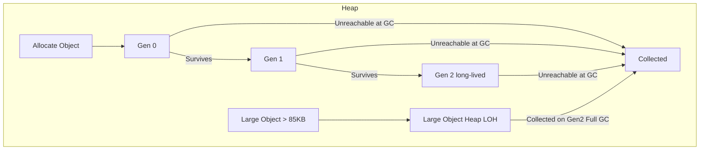
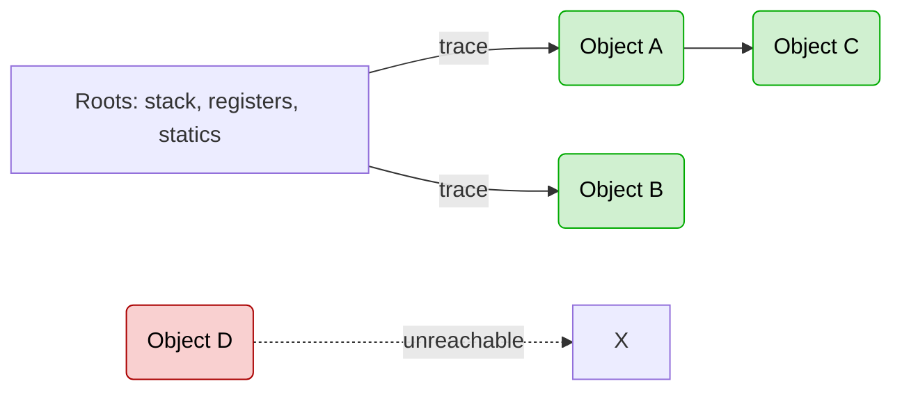

# 🗑️ .NET Garbage Collector (GC) – Complete Guide

A practical, developer-friendly reference for **how the GC works in .NET** and **how to work with it** in real apps (ASP.NET Core, services, CLIs).

---

## 🚀 Quick Overview
- .NET uses a **managed heap** and an **automatic, generational, compacting GC**.
- New objects start in **Gen 0**. Survivors are **promoted** to **Gen 1** and then **Gen 2**.
- **Large objects (> 85 KB)** go to the **Large Object Heap (LOH)**.
- GC runs **automatically** based on **allocation pressure** and **heuristics**; you rarely need (or want) to call `GC.Collect()` yourself.

---

## 🧠 How GC Determines Lifetimes (Survival & Promotion)
The GC doesn’t predict the future. It relies on **reachability** at collection time and **survival history**:

1. **Roots** (stack locals, CPU registers, statics, GC handles) are scanned.  
2. Anything **reachable** from roots is **alive** (survives).  
3. Survivors are **promoted** to the next generation (Gen 0 → 1 → 2).  
4. Unreachable objects are **collected** and memory is reclaimed; the heap may be **compacted**.

### 📈 Flowchart – Allocation → Promotion


---

## 🧩 Heap Layout & Segments
- The runtime **reserves contiguous segments** for the managed heap and commits memory as needed.
- Separate segments exist for **Small Object Heap (SOH)** generations and **LOH**.
- **Compaction**: SOH is compacted to remove fragmentation; **LOH is only compacted during a Full GC if explicitly requested** (see LOH Compaction below).

---

## 🧬 Generations & LOH (Behavior & Frequency)

| Area | What lives here | Collection frequency | Notes |
|---|---|---|---|
| **Gen 0** | New, short-lived objects | **Very frequent** | Cheap, fast collections |
| **Gen 1** | Survived Gen 0 | **Moderate** | Buffer between Gen 0 and 2 |
| **Gen 2** | Long-lived objects | **Infrequent (Full GC)** | Expensive; sweeps entire heap |
| **LOH** (> 85KB) | Large arrays/buffers | **During Full GC** | Freed automatically; **compaction is opt-in** |

> **Rule of thumb**: Most objects die in **Gen 0**. Objects that **survive** multiple GCs **promote** and are treated as long-lived.

---

## 🧭 GC Modes & Pauses
- **Workstation GC**: lower latency; optimized for desktop/interactive apps.
- **Server GC**: parallel, high-throughput; default for ASP.NET Core on servers/containers.
- **Background GC**: Gen 2 collections can run concurrently with user code (reduces pause time), but **LOH compaction** only occurs on **blocking Gen 2** (Full GC).

Set in `.csproj`:
```xml
<PropertyGroup>
  <ServerGarbageCollection>true</ServerGarbageCollection>
</PropertyGroup>
```

---

## 🛎️ Triggers: When does GC run?
- **Allocation pressure** (Gen 0 fills up → Gen 0 GC; escalation can trigger higher gens).
- **Low memory notifications** from the OS/host.
- **Manual** (`GC.Collect()`) — **avoid in production**.
- **LOH compaction requested** → will compact on next **blocking Gen 2**.

### 🔄 Flowchart – Root Tracing & Collection


---

## 🧰 LOH Compaction (When you really need it)
LOH is collected automatically during **Full GC**, but compaction is **opt-in** to avoid long pauses. If you’ve **diagnosed LOH fragmentation** (big arrays allocated/freed repeatedly), you can request a one-time compaction:

```csharp
using System.Runtime;

GCSettings.LargeObjectHeapCompactionMode = GCLargeObjectHeapCompactionMode.CompactOnce;
GC.Collect(); // forces a Full, blocking Gen2 GC now (do this off the hot path)
```

> Run from a **maintenance/background task**, not per-request. Use **sparingly**.

---

## 🧪 Diagnostics & Tooling
- **dotnet-counters**: live GC/CPU counters.
- **dotnet-trace** / **dotnet-gcdump**: traces and GC dumps in prod.
- **Visual Studio Profiler**: allocation and heap analysis.
- **PerfView**: advanced ETW-based analysis.

What to watch:
- **Allocated bytes/sec**, **Gen 0/1/2 collections**, **LOH size**, **Pinned objects**, **Fragmentation**, **working set**.

---

## ✅ Best Practices (Do’s & Don’ts)
**Do**
- Prefer **Server GC** for web/services.
- Keep allocations small and short-lived; let Gen 0 do the work.
- Use `IDisposable` + `using` for **unmanaged resources** (files, sockets, DB).
- Reuse large buffers with **`ArrayPool<T>`**; consider object pooling.
- Release references ASAP (avoid long-lived statics that hold big graphs).
- Consider **`Span<T>`/`Memory<T>`** to reduce allocations.

**Don’t**
- Don’t call `GC.Collect()` on request paths or frequently.
- Don’t allocate **>85KB** repeatedly if you can reuse (LOH churn).
- Don’t pin memory unnecessarily (hurts compaction).
- Don’t rely on finalizers for timely cleanup—**dispose deterministically**.

---

## ❓ When (If Ever) to Call `GC.Collect()`
- **Diagnostics** in dev/test to measure live heap/leaks.
- **One-off LOH compaction** during a **maintenance window** (after you’ve proven fragmentation).
- **After a short, bursty background job** that allocates heavily and then the process will be **idle**.

> **Never** inside controllers/middleware or per-request logic in ASP.NET Core. Schedule from a **BackgroundService** if truly necessary.

---

## 🧱 Advanced Levers (Use with care)
- **`GC.TryStartNoGCRegion(totalSize)`**: temporarily prevents GC when you’ve **preallocated** enough memory for a short critical section; must call `EndNoGCRegion()`. Easy to misuse; rare in web apps.
- **Pinned objects**: use only when necessary (interop, fixed buffers).
- **Profile-Guided Optimization (PGO)** and **Tiered Compilation**: not GC features per se, but reduce allocation hot paths via better JIT decisions.

---

## 🧾 Code Patterns

**Dispose pattern**
```csharp
public sealed class Foo : IDisposable
{
    private SafeHandle _handle = /* ... */;
    private bool _disposed;

    public void Dispose()
    {
        if (_disposed) return;
        _handle.Dispose();
        _disposed = true;
        GC.SuppressFinalize(this);
    }
}
```

**Array pooling**
```csharp
using System.Buffers;

var pool = ArrayPool<byte>.Shared;
byte[] buffer = pool.Rent(1024 * 64);
try
{
    // use buffer
}
finally
{
    pool.Return(buffer, clearArray: true);
}
```

**Background LOH maintenance (rare)**
```csharp
public sealed class LohMaintenanceService : BackgroundService
{
    protected override async Task ExecuteAsync(CancellationToken ct)
    {
        while (!ct.IsCancellationRequested)
        {
            await Task.Delay(TimeSpan.FromDays(1), ct);
            if (ShouldCompactLoh())
            {
                System.Runtime.GCSettings.LargeObjectHeapCompactionMode =
                    System.Runtime.GCLargeObjectHeapCompactionMode.CompactOnce;
                GC.Collect();
            }
        }
    }
    bool ShouldCompactLoh() => /* evidence-based condition */ false;
}
```

---

## 🧩 Summary
- GC is **automatic**, **generational**, and **compacting**.
- **Survival** is determined by **root reachability** at collection time.
- **Gen 2** and **LOH** are handled automatically during **Full GC**; **LOH compaction is opt-in**.
- Focus on **reducing allocations**, **disposing unmanaged resources**, and **profiling with data** before touching GC knobs.
