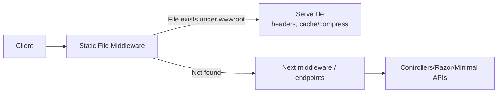

# `wwwroot` — Web Root & Static Files in ASP.NET Core

> A concise, production-focused reference for how **`wwwroot`** works, how to serve and cache static assets, and how to customize or extend the web root.

---

## 1) What is `wwwroot`?
`wwwroot` is the app’s **web root** — everything under it is **publicly accessible** via HTTP as static files (not processed by MVC/Razor). It’s a security boundary: **only `wwwroot` (and explicitly mapped folders) are web-exposed**; your code, views, configs, and secrets outside it are not.

**Examples**
- CSS: `wwwroot/css/site.css` → `/css/site.css`
- JS:  `wwwroot/js/app.js`     → `/js/app.js`
- Images/fonts: `wwwroot/images/logo.png` → `/images/logo.png`
- SPA assets / `index.html`

---

## 2) Enabling static files
Most templates already add the static-file middleware. Ensure it’s in your pipeline:

```csharp
var builder = WebApplication.CreateBuilder(args);
var app = builder.Build();

// Optional: serve default docs (index.html) before static files
app.UseDefaultFiles(); // looks for index.html, default.html, etc.

// Serve files from wwwroot (default web root)
app.UseStaticFiles();

app.Run();
```

**Order matters:** `UseDefaultFiles()` must come **before** `UseStaticFiles()` to rewrite `/` to `/index.html` automatically.

---

## 3) Typical structure
```
wwwroot/
  css/
    site.css
  js/
    app.js
  images/
    logo.png
  index.html    # optional for landing pages / SPAs
```

URL mapping is **relative to `wwwroot`**. File `wwwroot/images/logo.png` is requested at `/images/logo.png`.

---

## 4) Customize the web root
Change the folder name/path if you prefer, e.g. `public`:

**Project file (`.csproj`):**
```xml
<PropertyGroup>
  <WebRoot>public</WebRoot>
</PropertyGroup>
```

**Programmatic (rare):**
```csharp
builder.Environment.WebRootPath = Path.Combine(builder.Environment.ContentRootPath, "public");
```

---

## 5) Serve additional folders
Mount an extra directory under a custom request path:

```csharp
using Microsoft.Extensions.FileProviders;

app.UseStaticFiles(new StaticFileOptions {
    FileProvider = new PhysicalFileProvider(
        Path.Combine(builder.Environment.ContentRootPath, "SharedStatic")),
    RequestPath = "/static"
});
// Now /static/foo.js → {ContentRoot}/SharedStatic/foo.js
```

You can register multiple such mounts (e.g., for shared assets between services).

---

## 6) Caching, versioning & headers

**Cache-control** for long-lived assets (set both at app and proxy):  
```csharp
app.UseStaticFiles(new StaticFileOptions {
    OnPrepareResponse = ctx => {
        // 1 year
        const int duration = 60 * 60 * 24 * 365;
        ctx.Context.Response.Headers["Cache-Control"] = $"public,max-age={duration},immutable";
    }
});
```

**Cache busting**: Tag Helpers append a fingerprint automatically in Razor views:
```html
<link rel="stylesheet" href="~/css/site.css" asp-append-version="true" />
<script src="~/js/app.js" asp-append-version="true"></script>
```

Consider **ETag** and **Last-Modified** headers (framework will emit them for static files). Align caching with NGINX/IIS if a reverse proxy is used.

---

## 7) Compression
Enable response compression for text assets (if not handled by your proxy):
```csharp
builder.Services.AddResponseCompression();
var app = builder.Build();
app.UseResponseCompression();
app.UseStaticFiles();
```
> If NGINX/IIS terminates TLS and handles compression, prefer enabling gzip/brotli there.

---

## 8) SPA hosting & fallback
For SPAs, serve the compiled assets from `wwwroot` and provide a fallback to `index.html` for client-side routes:

```csharp
app.UseDefaultFiles();
app.UseStaticFiles();

app.MapFallbackToFile("index.html"); // after static files
```

---

## 9) Security notes
- **Everything in `wwwroot` is public.** Never place secrets or server-side-only files there.
- Static files **bypass authorization** by default. Authorization runs in MVC/endpoint middleware, not in the static-file middleware.
- Avoid enabling directory browsing in production; if you must:
  ```csharp
  builder.Services.AddDirectoryBrowser();
  app.UseDirectoryBrowser(new DirectoryBrowserOptions {
      RequestPath = "/assets" // mount read-only listings if required
  });
  ```
- By default, unknown file types are not served. To serve them (with caution):
  ```csharp
  app.UseStaticFiles(new StaticFileOptions {
      ServeUnknownFileTypes = false, // keep false unless you know the risks
      ContentTypeProvider = new FileExtensionContentTypeProvider()
  });
  ```

---

## 10) MIME types & custom mappings
Add or override content types when needed (e.g., `.webmanifest`, `.wasm`):

```csharp
using Microsoft.AspNetCore.StaticFiles;

var provider = new FileExtensionContentTypeProvider();
provider.Mappings[".webmanifest"] = "application/manifest+json";
provider.Mappings[".wasm"] = "application/wasm";

app.UseStaticFiles(new StaticFileOptions {
    ContentTypeProvider = provider
});
```

---

## 11) Large files / range requests
Static-file middleware supports **range requests** for efficient video/audio/file downloads. Ensure limits/timeouts align with your proxy (e.g., `client_max_body_size` in NGINX) and Kestrel’s `MaxRequestBodySize` (uploads). For downloads, consider explicit `Content-Disposition` if you want “Save As”.

---

## 12) Reverse proxy interplay (NGINX/IIS)
- Offload **TLS, compression, caching** at the proxy for better performance.
- Set shared policies: cache lifetimes, max body size, timeouts, and security headers.
- Keep Kestrel bound to loopback when using a proxy; expose only 80/443 at the proxy.

---

## 13) Request flow (static vs. app)


---

## 14) Checklist
- [ ] Add `app.UseStaticFiles()` (and `UseDefaultFiles()` if you need `/` → `index.html`)
- [ ] Keep only public assets in `wwwroot`
- [ ] Configure caching & compression (app or proxy)
- [ ] Add MIME mappings for uncommon types
- [ ] Align proxy & Kestrel limits/timeouts
- [ ] For SPAs: add `MapFallbackToFile("index.html")`

---

**Bottom line:** `wwwroot` is your **public static asset root**. Serve assets via `UseStaticFiles`, tune caching/compression, and keep sensitive content out. Customize or add mounts when you need more than one static source.
