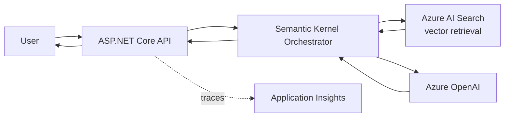

# Resume & LinkedIn Transformation

> **Candidate:** Vamsi Raavala — Cincinnati, OH — +1 513-596-8648 — vamsirm26@gmail.com. **Target roles:** AI Solutions Developer / AI Engineer → AI Solutions Architect (Microsoft-centric). **Baseline:** 14 years enterprise software, deep Azure + .NET, currently Senior Azure .NET & React Technology Lead at Infosys (Kroger account).

---

## 1. Positioning Strategy

### The core narrative

You are **not** a junior trying to break into AI, and **not** pretending to be an ML researcher. You are a *14-year enterprise architect on the Microsoft stack who is now building production-grade AI and agentic systems on that same stack.* That is a rare and valuable profile. Most "AI engineers" flooding the market can call an OpenAI API but have never shipped a regulated, high-availability system to production, never owned a CI/CD pipeline on AKS, never mentored a team, and never carried the reliability/security/cost concerns a real enterprise AI system demands.

Your one-line story:

```text
I've spent 14 years shipping enterprise .NET systems on Azure — microservices on AKS, event-driven integration, OAuth2/JWT security, CI/CD. I'm now applying that same production discipline to AI: RAG, agents, and LLM-backed services on Azure OpenAI and the Microsoft AI stack.
```

The differentiation: **production engineering rigor applied to AI.** The market is short on people who can take a flashy notebook demo and turn it into a secure, observable, cost-controlled service. You already do the hard 80%.

### The honesty line — presenting in-progress portfolio work credibly

Do **not** fabricate AI production experience at Kroger or Kraft Heinz. You did not ship a production LLM system there (ML.NET usage and Copilot-assisted development are real and fine to mention, but they are not "production GenAI platform"). A sharp interviewer will unravel a lie in five minutes and you'll lose the whole credibility you built. Instead use three honest mechanisms:

1. **Reframe transferable enterprise work truthfully.** Your Kroger/Kraft Heinz bullets stay factually accurate but get re-angled to surface the AI-adjacent substrate: data pipelines, system integration, event streaming, API platforms, security, observability. You're not claiming AI work — you're showing you own the foundation.
2. **Make portfolio projects first-class, clearly labeled.** A dedicated **"Selected AI Projects"** section, labeled honestly as portfolio/personal work with dates ("2025–2026"). Credibility comes from artifacts: public GitHub repos, live demos, architecture diagrams, and **evaluation results.** A project with an eval harness and a "here's what broke and how I fixed it" writeup reads more senior than a vague "led AI initiative."
3. **Use precise verb tenses.** In-progress portfolio work → "Building / Developing." Shipped and documented → "Built / Designed / Shipped." Never "Led a team of X" for solo portfolio projects — say "Designed and built."

The combination — *real enterprise depth + real, running portfolio AI projects + honest labeling* — is more persuasive than any inflated claim, and it survives technical scrutiny.

### What to downplay

- Don't bury the lead under "VB6 migration." VB6 is a great *story* (you modernized legacy) but a bad *headline keyword.* Lead with React + ASP.NET Core microservices on AKS.
- Don't over-index on "Technology Lead at Infosys" as a title — recruiters scanning for AI roles want the *work*, not the staffing-firm title. Surface the engineering.

---

## 2. Rewritten Resume — AI Solutions Developer Version

### Professional summary (default / Developer-Engineer)

```text
Senior software engineer and technology lead with 14 years building production systems on the Microsoft and Azure stack — React + ASP.NET Core microservices on AKS, event-driven integration, OAuth2/JWT security, and Azure DevOps/Jenkins CI/CD for Fortune-100 retail and CPG clients. Now focused on AI engineering: designing and building production-grade RAG pipelines, LLM-backed services, and agentic workflows on Azure OpenAI, Semantic Kernel, and ML.NET, with the same emphasis on reliability, security, observability, and cost control I bring to enterprise software. Seeking an AI Solutions Developer / AI Engineer role where deep platform engineering meets applied AI.
```

### Skills block — "AI & Cloud Engineering"

```text
AI / ML: Azure OpenAI Service, Retrieval-Augmented Generation (RAG), LLM orchestration, Semantic Kernel, prompt engineering, agentic workflows / tool-calling, vector search (Azure AI Search), embeddings, ML.NET, evaluation & guardrails, GitHub Copilot, Claude

Cloud & Platform: Microsoft Azure (AKS, App Service, Functions, Service Bus, Application Insights, Azure AI Search, Key Vault), Docker, Kubernetes, microservices, event-driven architecture

Languages & Frameworks: C#, .NET / ASP.NET Core, Python, TypeScript, JavaScript, React, Angular, SQL

Engineering Practices: CI/CD (Azure DevOps, Jenkins), OAuth2 / JWT / OIDC, REST APIs, distributed systems, observability/monitoring, automated testing, secure SDLC, technical leadership & mentoring
```

> *Tip: put the AI row first — ATS and human scanners read top-down. Only list tools you can speak to in an interview.*

### Rewritten experience bullets

**Senior Azure .NET & React Technology Lead — Infosys (Client: Kroger) | Sep 2022 – Present | Cincinnati, OH**

```text
- Led the modernization of Kroger's Enterprise Sales Promotion platform from a legacy VB6 monolith to React + ASP.NET Core microservices on Azure Kubernetes Service (AKS), decoupling a critical revenue system processing high-volume promotional data across the retail enterprise.
- Designed event-driven integration using Azure Service Bus, building the asynchronous data pipelines and messaging backbone that downstream analytics and AI/ML workloads depend on for clean, reliable promotion data.
- Implemented OAuth2 / JWT authentication and authorization across microservices, establishing the secure API and identity layer required for enterprise data access and any LLM/agent integration.
- Built and operated CI/CD pipelines (Azure DevOps, Jenkins) with Docker containerization, enabling safe, repeatable deployment of services to AKS — the same deployment discipline required to ship AI services to production.
- Instrumented services with Azure Application Insights for distributed tracing, latency, and error monitoring — the observability foundation needed to run LLM-backed services with measurable reliability and cost.
- Accelerated delivery by adopting GitHub Copilot and Claude into the team's development workflow, and mentored engineers on microservices patterns, secure coding, and cloud-native practices.
```

**Technology Lead — Infosys (Client: Kraft Heinz) | 2015 – 2022**

```text
- Delivered enterprise web applications on Angular + ASP.NET MVC / Web API supporting approvals, compliance, and operational workflows for a global CPG organization.
- Designed and implemented workflow / approval engines encoding complex business rules and multi-step routing — the kind of deterministic process logic that modern agentic systems augment and partially automate.
- Built REST APIs and data integration layers connecting business systems, surfacing structured operational data that is the raw material for analytics and AI use cases.
- Owned compliance and approval flows with auditability requirements, applying the governance and traceability mindset essential to responsible AI in regulated enterprises.
- Led development teams and mentored engineers across the full SDLC, from design through production support.
```

**Software Engineer — Cyient, Continental Hospitals, Relgo Networks | 2012 – 2015**

```text
- Developed full-stack web and data-driven applications across engineering-services, healthcare, and platform-product domains, building a broad foundation in C#/.NET, databases, and system integration.
```

**Education**

```text
B.Tech, Information Technology — Vemu Institute of Technology (JNTU Anantapur)
```

### Selected AI Projects (portfolio — 2025–2026)

> *Label clearly as personal/portfolio work. Each entry links to a public GitHub repo and, where possible, a live demo. Use present-tense "Building" only for genuinely unfinished projects; switch to past tense once shipped. These map to the six projects in [02-6-month-roadmap.md](02-6-month-roadmap.md) and [15-AI-Portfolio-Projects](../15-AI-Portfolio-Projects/).*

```text
1. Enterprise RAG Assistant over Internal Docs
- Built a Retrieval-Augmented Generation assistant on Azure OpenAI + Azure AI Search, chunking and embedding a document corpus, with citation-grounded answers and a relevance-tuned retrieval pipeline.
- Implemented an evaluation harness (groundedness, answer relevance, retrieval precision) to measure quality regressions across prompt and chunking changes, not just eyeball demos.
- Containerized the service (Docker) and deployed on AKS with Application Insights tracing for token usage, latency, and cost-per-query.

2. Multi-Agent Workflow Orchestrator (Semantic Kernel)
- Designed an agentic system using Semantic Kernel with tool/function calling, where specialized agents (retriever, planner, validator) collaborate to complete multi-step tasks.
- Added guardrails: input validation, output schema enforcement, and a human-in-the-loop approval gate modeled on enterprise approval workflows.

3. Document Intelligence Pipeline
- Built an ingestion pipeline combining Azure AI Document Intelligence with LLM extraction to turn unstructured PDFs/forms into structured, validated JSON.
- Implemented confidence scoring and fallback-to-human routing for low-confidence extractions.

4. .NET + ML.NET Predictive Service
- Trained and served a predictive model with ML.NET behind an ASP.NET Core API, demonstrating classic-ML-in-production patterns (model versioning, scoring endpoint, monitoring).

5. LLM Cost & Quality Observability Dashboard
- Built a React dashboard backed by Application Insights / custom telemetry to track token spend, latency, error rates, and eval scores across LLM endpoints.

6. Conversational Data Q&A (Text-to-Action)
- Built a natural-language interface translating user questions into structured queries/tool calls over a sample enterprise dataset, with prompt templates, schema grounding, and result validation to reduce hallucination.
```

> *Each repo README should carry an architecture diagram, the eval methodology, and an honest "limitations / what I'd do next" section (see GitHub Strategy below).*

---

## 3. Two Summary Variants

### Variant A — AI Solutions Developer / AI Engineer

```text
Senior software engineer (14 yrs) on the Microsoft/Azure stack now focused on AI engineering. I build production-grade RAG pipelines, LLM-backed services, and agentic workflows using Azure OpenAI, Semantic Kernel, and ML.NET, deployed as containerized microservices on AKS with full CI/CD, OAuth2/JWT security, and Application Insights observability. I bring real production discipline — reliability, security, evals, and cost control — to applied AI, backed by a portfolio of running AI projects and 14 years shipping systems for Fortune-100 retail and CPG clients.
```

### Variant B — leaning AI Solutions Architect

```text
Azure & .NET solutions architect with 14 years designing and delivering enterprise systems — microservices on AKS, event-driven integration (Azure Service Bus), secure API platforms (OAuth2/JWT), and CI/CD — for Fortune-100 retail and CPG clients. I architect AI solutions on the Microsoft stack: RAG, agentic/multi-agent systems with Semantic Kernel, Azure OpenAI and Azure AI Search, with first-class attention to security, governance, observability, evaluation, and cost. I translate ambiguous business problems into reliable, well-architected AI systems — and I mentor teams to build them. Targeting AI Solutions Architect roles where deep Azure platform experience meets applied AI design.
```

---

## 4. LinkedIn Headline — 5 Options

```text
1. AI Engineer | Azure OpenAI · RAG · Semantic Kernel · .NET | 14 yrs building production systems on Azure
2. Senior .NET & Azure Engineer pivoting to AI | Building production RAG & agentic systems on the Microsoft AI stack
3. AI Solutions Developer | Azure OpenAI · AKS · Semantic Kernel · ML.NET | Enterprise-grade AI engineering
4. Azure / .NET Technology Lead → AI Engineer | RAG · LLM apps · agents · evals · production reliability
5. AI Solutions Architect (in the making) | 14 yrs Azure & .NET microservices | Now building agentic AI on Azure OpenAI
```

> *Recommendation: use #1 or #3 for AI Engineer applications; use #5 when networking toward architect roles. Front-load searchable keywords — "Azure OpenAI", "RAG", "Semantic Kernel", "AI Engineer" — because recruiter search matches the headline heavily.*

---

## 5. LinkedIn About Section

```text
I spend my days making enterprise software work at scale — and my evenings making AI work at scale.

For 14 years I've built and led production systems on the Microsoft and Azure stack. Most recently, as a Senior Azure .NET & React Technology Lead on the Kroger account at Infosys, I led the modernization of a critical Enterprise Sales Promotion platform from a legacy VB6 monolith into React and ASP.NET Core microservices running on Azure Kubernetes Service — with event-driven integration over Azure Service Bus, OAuth2/JWT security, Docker, CI/CD across Azure DevOps and Jenkins, and Application Insights observability. Before that, I delivered workflow, approval, and compliance systems for Kraft Heinz on Angular and ASP.NET. I've shipped systems that real businesses depend on, and I've mentored the engineers who keep them running.

Now I'm channeling that same production discipline into AI. I'm building RAG pipelines, LLM-backed services, and agentic workflows on Azure OpenAI, Azure AI Search, Semantic Kernel, and ML.NET — and I treat them like real systems: with evaluation harnesses, guardrails, security, distributed tracing, and cost monitoring, not just demos. My portfolio (on GitHub) includes an enterprise RAG assistant, a multi-agent orchestrator, a document-intelligence pipeline, and an LLM cost/quality observability dashboard.

Here's what I believe: the hard part of enterprise AI isn't calling an API — it's making it reliable, secure, observable, and affordable in production. That's exactly the discipline I've practiced for 14 years.

I'm targeting AI Solutions Developer / AI Engineer roles (and growing toward AI Solutions Architect) on the Microsoft stack. If you're building production AI and want someone who already knows how to ship and operate systems at enterprise scale, let's talk.

Cincinnati, OH · vamsirm26@gmail.com
```

> *~300 words. First person, specific, honest about portfolio vs production, with a clear call to action and contact.*

---

## 6. LinkedIn Optimization

### Skills (pin the top 3)

Pin **Azure OpenAI Service**, **Retrieval-Augmented Generation (RAG)**, **C# / .NET** — they drive recruiter search and endorsements most.

| Priority | Skills |
|---|---|
| AI/ML | Azure OpenAI Service, RAG, Large Language Models (LLM), Semantic Kernel, Prompt Engineering, ML.NET, Vector Search, AI Agents |
| Cloud | Microsoft Azure, Azure Kubernetes Service (AKS), Azure Service Bus, Azure AI Search, Docker, Kubernetes, Microservices |
| Core eng | C#, .NET, ASP.NET Core, Python, React, TypeScript, REST APIs, CI/CD, OAuth 2.0 |
| Practice | Software Architecture, Distributed Systems, Application Insights, Technical Leadership |

### Featured section
- Pin your **portfolio site** first, then your **GitHub profile** (or best repo with a live demo).
- Pin one **case-study writeup** for your flagship RAG/agent project — title it like "How I built a production RAG assistant on Azure OpenAI with an eval harness."
- Optionally a **60–90s demo video.**

### Activity strategy
- **Cadence:** 1–2 posts/week. Consistency beats volume — recruiter "active" signals matter.
- **Mix:** ~60% build-in-public (what you shipped, an eval result, an architecture decision, a bug you hit), ~25% commentary on Azure AI / Semantic Kernel updates, ~15% reposts with your take.
- **Comment** thoughtfully on Microsoft AI advocates, Semantic Kernel maintainers, Azure AI accounts — visibility compounds.
- Each post naturally includes 2–3 target keywords so your profile ranks for them.

### Keywords for recruiter search
Make sure these literal strings appear across headline, About, experience, and skills: `Azure OpenAI`, `RAG`, `Retrieval-Augmented Generation`, `Semantic Kernel`, `LLM`, `AI Engineer`, `AI Solutions`, `Generative AI`, `Azure AI Search`, `Vector Search`, `AKS`, `Microservices`, `.NET`, `C#`, `Python`, `Prompt Engineering`, `MLOps / LLMOps`, `Agents`.

---

## 7. GitHub Strategy

GitHub is where your portfolio claims become *verifiable* — your highest-leverage credibility asset.

### Profile README (`vamsi/vamsi` repo)

````markdown
## Hi, I'm Vamsi 👋

Senior Azure & .NET engineer (14 yrs) building production-grade AI on the Microsoft stack.

🔭 Currently building: RAG pipelines, agentic workflows, and LLM-backed services on
   Azure OpenAI · Semantic Kernel · Azure AI Search · ML.NET — deployed on AKS with CI/CD.
🛠️ Stack: C# · .NET · Python · React · Azure (AKS, Service Bus, AI Search, App Insights) · Docker
🎯 Focus: making AI reliable, secure, observable, and affordable in production.
📫 vamsirm26@gmail.com · [LinkedIn] · [Portfolio]

### Pinned projects (see below) — each with architecture diagram, eval results, and a live demo.
````

### Pinned repos
Pin all six portfolio projects, strongest-first: **RAG Assistant**, **Multi-Agent Orchestrator**, **Document Intelligence Pipeline**, then the rest.

### What each repo README must contain
1. **One-line value statement** + a badge row (build status, license, "live demo" link).
2. **Architecture diagram** — Mermaid or PNG showing the full flow (user → API → orchestration → Azure OpenAI / AI Search → response, plus observability). Reviewers look at this first.
3. **Quickstart** — clone, set env vars, run in <5 minutes. If they can't run it, it doesn't count.
4. **Evaluation section** — metrics, methodology, results table. The single biggest seniority signal.
5. **Cost & observability notes** — token/cost tracking, tracing.
6. **Limitations / Next steps** — honest. Reviewers trust people who name their system's weaknesses.

Example Mermaid block:

````markdown

````

### Commit cadence & what reviewers look for
- Aim for a **steady green graph** (3–5 days/week of small commits) over one giant dump; meaningful messages (`feat: add groundedness eval`, not `update`); tag releases (`v0.1`, `v0.2`).
- Reviewers check: does it **run** (clear setup, no committed secrets, `.env.example`)? Is there a **real eval**, not a happy-path demo? Is the **code clean**, with tests on the critical path? **No leaked keys** (Key Vault / env vars). Evidence of **production thinking** — error handling, retries, logging, cost awareness.

---

## 8. Portfolio Strategy

### The site
A simple, fast portfolio site (Next.js or static React on Azure Static Web Apps / GitHub Pages — practice what you preach by hosting on Azure): **Hero** (one-line narrative + headshot + links) → **Projects grid** (6 cards → case studies) → **About / experience** (condensed resume) → **Contact**.

### Case-study format (per project)

| Section | Content |
|---|---|
| Problem | The real-world problem in one paragraph (business framing). |
| Architecture | Diagram + key design decisions and *why*. |
| Stack | Azure services, frameworks, models used. |
| How it works | Walkthrough of the request flow / agent loop. |
| Evaluation | Metrics, methodology, results table, what failed. |
| Cost & ops | Token/cost numbers, latency, observability. |
| Limitations & next steps | Honest. |
| Links | Live demo · GitHub · 90s video. |

### Demo videos & live demos
- One **60–90s screen-recorded walkthrough per flagship project**; narrate the architecture, not just the UI. Host on YouTube (unlisted is fine).
- Manage public-demo cost: **rate limit + daily token budget** (showcase as "cost guardrails" engineering); a **cheaper/smaller model** for the public demo; a **"request a live demo" button** for high-cost projects; Azure **spend cap / budget alert** so a demo can't surprise you.

### Showing evals (per case study)

| Metric | Baseline | After tuning |
|---|---|---|
| Groundedness | 0.78 | 0.91 |
| Answer relevance | 0.81 | 0.89 |
| Retrieval precision@5 | 0.72 | 0.85 |
| Avg cost / query | $0.014 | $0.006 |

> *Use your real numbers. Even modest, honest numbers with a clear methodology beat impressive-sounding claims with no method. Always state how you measured.*

---

## 9. ATS Keyword Checklist

ATS matches literal strings. "Include where" tells you the primary placement.

| Keyword | Include where |
|---|---|
| AI Engineer / AI Solutions Developer | Resume title line, summary, LinkedIn headline |
| Azure OpenAI Service | Summary, skills, AI project bullets, LinkedIn |
| Retrieval-Augmented Generation (RAG) | Summary, skills, project bullets, headline |
| Large Language Models (LLM) | Skills, project bullets, About |
| Semantic Kernel | Skills, project bullets, GitHub README |
| Generative AI / GenAI | Summary, About, skills |
| AI Agents / Agentic / Multi-agent | Project bullets, skills, About |
| Prompt Engineering | Skills, project bullets |
| Azure AI Search / Vector Search / Embeddings | Skills, RAG project bullet |
| ML.NET | Skills, ML project bullet |
| Evaluation / Guardrails / Groundedness | Project bullets, case studies |
| LLMOps / MLOps | Skills, About |
| Microsoft Azure | Summary, every Azure bullet |
| Azure Kubernetes Service (AKS) | Kroger bullets, project bullets, skills |
| Docker / Kubernetes / Containers | Kroger bullets, skills |
| Microservices | Kroger bullets, summary, skills |
| Event-driven / Azure Service Bus | Kroger bullets, skills |
| OAuth2 / JWT / OIDC / Security | Kroger bullets, skills |
| CI/CD / Azure DevOps / Jenkins | Kroger bullets, skills |
| Application Insights / Observability | Kroger + project bullets, skills |
| C# / .NET / ASP.NET Core | Skills, all engineering bullets |
| Python | Skills, AI project bullets |
| React / TypeScript / Angular | Kroger/Kraft bullets, skills |
| REST APIs | Skills, bullets |
| Distributed systems / Scalability | Summary, skills |
| Technical Leadership / Mentoring | Kroger + Kraft bullets, summary |
| Fortune 100 / Retail / CPG | Summary, experience context |

---

### 🔑 Final reminders
- Keep one master resume; tailor the title/summary per application (Developer vs Architect variants in Section 3).
- Every AI claim on the resume should map to a **public, running repo.** If it's not on GitHub, soften the verb to "Building."
- The credibility flywheel: **GitHub (proof) → Portfolio (story) → LinkedIn (reach) → Resume (the ask).** Build them in that order.
