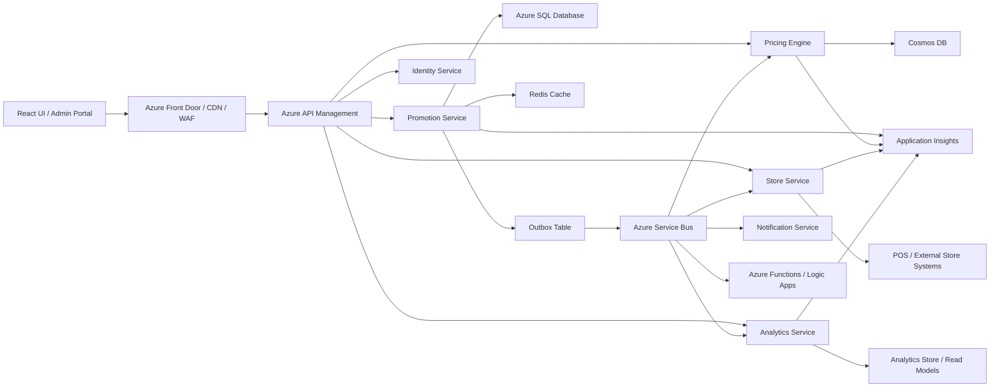
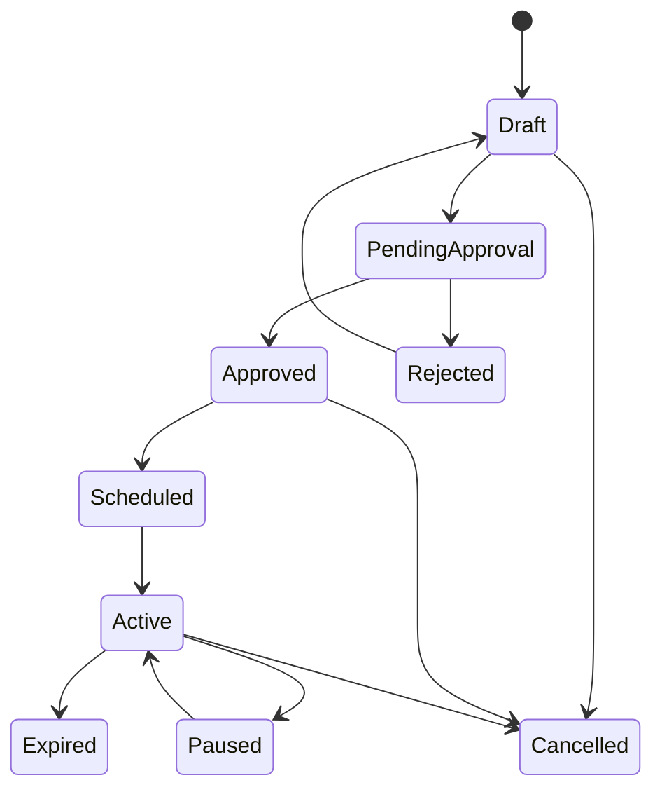

# Complete Study Material: Promotions Management System
## .NET + Azure + Microservices + Retail/POS Interview Guide

---

# TABLE OF CONTENTS

1. [Introduction](#introduction)
2. [System Architecture Overview](#1-system-architecture-overview)
3. [Microservices Design Patterns](#2-microservices-design-patterns)
4. [Azure Services - When & Why](#3-azure-services---when--why)
5. [API Design & Management](#4-api-design--management)
6. [Database Strategy](#5-database-strategy)
7. [Event-Driven Architecture](#6-event-driven-architecture)
8. [DevOps & CI/CD Strategy](#7-devops--cicd-strategy)
9. [Docker & Kubernetes](#8-docker--kubernetes)
10. [Security Architecture](#9-security-architecture)
11. [React Frontend Architecture](#10-react-frontend-architecture)
12. [Retail Domain / POS Knowledge](#11-retail-domain--pos-knowledge)
13. [Monitoring & Observability](#12-monitoring--observability)
14. [Interview Q&A](#13-interview-qa)
15. [System Design Scenarios](#14-system-design-scenarios)
16. [Final Preparation Tips](#15-final-preparation-tips)

---

# INTRODUCTION

This document is a complete interview preparation guide for designing and explaining a **Promotions Management System** using **.NET, Azure, microservices, event-driven architecture, and modern frontend/backend practices**.

The goal is not only to memorize terms, but to deeply understand:

- why each component exists,
- how services interact,
- where trade-offs appear,
- how to explain architecture decisions in interviews,
- how the system behaves under failure and scale,
- and how cloud, domain, and operational concerns fit together.

This guide is especially useful for roles involving:

- .NET backend development
- Azure cloud architecture
- microservices design
- API design and integration
- event-driven systems
- CI/CD and DevOps
- retail / POS / promotions platforms
- technical interviews and system design rounds

---

# 1. SYSTEM ARCHITECTURE OVERVIEW

## 1.1 Business Goal of the System

A Promotions Management System allows business users to create, approve, activate, distribute, monitor, and retire promotions across stores, channels, and POS systems.

Typical examples of promotions:

- 10% off selected products
- Buy One Get One Free
- Flat $5 off above $50 cart value
- Region-specific campaigns
- Loyalty-based promotions
- Time-bound seasonal promotions
- Store-specific markdown campaigns

This system must balance:

- **business flexibility** for marketing teams
- **correctness** in pricing and redemption
- **speed** at checkout and in APIs
- **reliability** across distributed systems
- **auditability** for compliance
- **scalability** during traffic spikes like Black Friday

---

## 1.2 High-Level Architecture

At a high level, the system consists of:

- **React frontend** for business users and dashboards
- **Azure API Management (APIM)** as the API gateway
- **Multiple .NET microservices** for business domains
- **Azure SQL + Cosmos DB + Redis** for data storage and performance
- **Azure Service Bus** for asynchronous communication
- **Azure Functions / Logic Apps** for background workflows
- **AKS** for container orchestration
- **Application Insights / Azure Monitor** for observability

### High-Level Flow

1. User creates or updates a promotion from the UI.
2. Request passes through CDN/WAF and APIM.
3. APIM authenticates user and forwards request to Promotion Service.
4. Promotion Service validates business rules and saves data.
5. Domain event is written through Outbox and published to Service Bus.
6. Downstream services such as Pricing, Store Sync, Analytics, and Notifications consume events.
7. Store/POS systems receive relevant promotion changes.
8. Dashboard and UI are updated through polling, SignalR, or refreshed read models.

---

## 1.3 End-to-End Request Flow

### Example: Create and Activate a Promotion

Let’s walk through a realistic scenario.

A marketing manager creates a **Weekend 20% Off** promotion for multiple stores.

#### Step 1: UI Request

The React UI sends a request like:

```json
{
  "name": "Weekend 20% Off",
  "type": "PercentageDiscount",
  "discountValue": 20,
  "startDate": "2026-06-06T00:00:00Z",
  "endDate": "2026-06-08T00:00:00Z",
  "storeIds": ["S001", "S002", "S003"],
  "applicableProducts": ["SKU123", "SKU456"]
}
```

#### Step 2: API Gateway

APIM performs:

- JWT validation
- throttling
- request size validation
- API version routing
- optional request/response transformation

#### Step 3: Promotion Service

Promotion Service performs:

- request validation
- duplicate/overlap checks
- date validation
- conflict checks
- persistence to Azure SQL
- audit log creation
- outbox event creation

#### Step 4: Event Publication

A `PromotionCreatedEvent` or `PromotionApprovedEvent` is published using the Outbox pattern.

#### Step 5: Downstream Processing

Other services react:

- **Pricing Engine** updates pricing applicability rules
- **Store Service** prepares POS distribution payload
- **Notification Service** notifies approvers or stakeholders
- **Analytics Service** updates reporting projections
- **Cache refresh logic** invalidates stale promotion lists

#### Step 6: Activation

When approved and activated, the system publishes `PromotionActivatedEvent`, and store systems receive deployment instructions.

#### Step 7: POS Consumption

Store/POS systems load the promotion and apply the discount during checkout if conditions match.

---

## 1.4 High-Level Architecture Diagram



---

## 1.5 Microservice Decomposition

A good microservice design is based on **business capability**, not just technical layers.

### Core Services

#### 1. Promotion Service

Responsible for:

- promotion creation and update
- lifecycle management
- validation of business rules
- storing core promotion definitions
- approval status tracking
- publishing domain events

#### 2. Pricing Engine

Responsible for:

- promotion applicability checks
- discount calculation
- conflict resolution
- prioritization between multiple promotions
- final payable price computation

#### 3. Store Service

Responsible for:

- store master data
- store groups and hierarchy
- promotion rollout by region/store
- POS mapping and sync logic
- offline store sync coordination

#### 4. Identity Service

Responsible for:

- user authentication
- role-based authorization
- permissions
- token issuance/validation integration
- multi-tenant identity concerns if needed

#### 5. Analytics Service

Responsible for:

- redemption metrics
- campaign performance
- margin/ROI reporting
- trend analysis
- operational dashboards

#### 6. Notification Service

Responsible for:

- approval emails
- activation notifications
- store alerts
- escalation reminders
- SMS/push if required

#### 7. Integration Service

Responsible for:

- ERP integration
- CRM integration
- POS/legacy bridges
- third-party APIs
- webhooks and import/export jobs

#### 8. Approval Workflow Service

Responsible for:

- multi-level approvals
- routing rules
- escalation logic
- SLA-based reminders
- delegation support

---

## 1.6 Why Microservices Here?

Microservices are not always the right answer. They make sense in this system because:

- pricing logic evolves independently
- POS integration has separate operational concerns
- analytics workloads differ from transactional workloads
- store sync can be asynchronous and high-volume
- approvals and notifications have different scaling patterns
- different teams may own different business capabilities

### Benefits

- independent deployment
- team autonomy
- technology flexibility where justified
- independent scaling
- fault isolation

### Trade-offs

- distributed complexity
- eventual consistency
- harder debugging
- more DevOps overhead
- more monitoring and tracing requirements

### Interview-ready statement

> Microservices are appropriate here because the promotions domain naturally splits into separate business capabilities such as promotion management, pricing, analytics, approvals, and store distribution. These areas have different performance needs, scaling patterns, and release cycles. However, I would only use this approach if the system size and team maturity justify the added distributed systems complexity.

---

## 1.7 Promotion Lifecycle

A promotion usually moves through multiple states.

### Common States

- **Draft**
- **Pending Approval**
- **Approved**
- **Scheduled**
- **Active**
- **Paused**
- **Expired**
- **Cancelled**
- **Rejected**

### Why this matters

Lifecycle is important because each state controls:

- who can edit the promotion
- whether it is visible to stores
- whether POS should apply it
- whether notifications should be sent
- whether audit logs and compensation actions are required

### Example State Transition Flow



### Example Events

- `PromotionSubmittedEvent`
- `PromotionApprovedEvent`
- `PromotionRejectedEvent`
- `PromotionActivatedEvent`
- `PromotionPausedEvent`
- `PromotionExpiredEvent`
- `PromotionCancelledEvent`

---

## 1.8 Non-Functional Requirements

A strong system design answer should always include NFRs.

### Availability

Promotions are business-critical, especially during campaigns and peak retail events.

### Scalability

The system must handle:

- large product catalogs
- many store mappings
- high read traffic
- spikes during sales events
- high event throughput

### Performance

Typical targets may include:

- API P95 under 300 ms for common reads
- pricing response under 100 ms for cached/common cases
- promotion activation propagation within minutes or seconds depending on design

### Security

The system handles:

- user identities
- internal APIs
- customer-related redemption data
- sensitive business strategy

### Auditability

Every change to promotions should be traceable:

- who changed it
- what changed
- when it changed
- why it changed
- what downstream actions occurred

### Reliability

Failures in one subsystem must not bring down the whole platform.

---

## 1.9 Key Design Principles

Use these principles consistently in interviews:

- design by business capability
- prefer asynchronous communication for side effects
- keep write operations strongly consistent where needed
- tolerate eventual consistency on read models
- isolate failures using resilience patterns
- observe everything with logs, metrics, traces
- keep APIs stable and versioned
- automate delivery and rollback
- build security in from day one

---

## 1.10 Architecture Trade-Off Summary

| Decision Area | Recommended Choice | Why |
|---|---|---|
| Entry point | Azure API Management | Central governance, security, routing |
| Transactional data | Azure SQL | Strong consistency and relational modeling |
| High-scale read models | Cosmos DB | Fast reads and flexible denormalized models |
| Messaging | Azure Service Bus | Reliable enterprise messaging |
| Orchestration | AKS | Best fit for multiple .NET microservices |
| Caching | Redis | Low latency and reduced DB load |
| Background processing | Azure Functions / workers | Event-driven and scheduled jobs |
| UI | React + TypeScript | Good SPA developer experience |

---

## 1.11 How to Explain This in an Interview

A good spoken answer would sound like this:

> The Promotions Management System is designed as a set of domain-oriented microservices behind Azure API Management. The Promotion Service owns the core lifecycle and transactional data, while supporting services like Pricing, Store Sync, Analytics, and Notifications react to business events through Azure Service Bus. Azure SQL is used where strong consistency is required, while Cosmos DB and Redis support scalable reads and fast access patterns. The system is deployed on AKS for scalability and operational control, and monitored using Application Insights, Azure Monitor, and centralized logging. This architecture gives strong separation of concerns while still supporting enterprise requirements like approvals, auditing, POS sync, and high availability.

---

# 2. MICROSERVICES DESIGN PATTERNS

## 2.1 Why Patterns Matter

Microservices architecture is not only about splitting services. Without proven patterns, distributed systems become fragile, inconsistent, and difficult to operate.

Patterns help solve recurring problems such as:

- how services communicate
- how data stays consistent
- how to recover from failures
- how to deploy safely
- how to avoid tight coupling

---

## 2.2 Communication Patterns

### Synchronous Communication

Used when an immediate response is required.

Examples:

- fetching promotion details
- validating user permissions in real time
- querying applicable promotions for a checkout call

Common protocols:

- REST over HTTP
- gRPC for internal low-latency service-to-service calls

### Advantages

- simple request-response model
- easier to reason about for immediate operations
- easier for some debugging scenarios

### Drawbacks

- tighter runtime coupling
- dependency latency affects caller
- cascading failures more likely

### Asynchronous Communication

Used when eventual completion is acceptable.

Examples:

- promotion activation notifications
- analytics updates
- POS sync
- approval reminders
- cache invalidation events

Common tools:

- Azure Service Bus
- Event Grid
- Kafka in high-throughput streaming scenarios

### Advantages

- loose coupling
- resilience to temporary failures
- better scaling
- natural fit for workflows and downstream effects

### Drawbacks

- eventual consistency
- duplicate delivery handling
- more complex tracing/debugging
- ordering/idempotency concerns

### Interview-ready statement

> I use synchronous communication for immediate business responses and asynchronous messaging for downstream side effects. For example, creating a promotion is synchronous, but updating analytics, sending notifications, and syncing stores should be event-driven.

---

## 2.3 API Gateway Pattern

Azure API Management acts as the controlled front door.

### Responsibilities

- authentication
- authorization policies
- routing
- throttling
- request/response transformation
- versioning
- caching
- logging
- developer portal support

### Why it matters

Without an API gateway:

- every client must know every service
- auth logic gets duplicated
- rate limiting becomes inconsistent
- observability becomes fragmented

### Best practice

Gateway should handle **cross-cutting concerns**, not core business logic.

---

## 2.4 Database per Service Pattern

Each microservice owns its own data.

### Why this is important

If multiple services share one database:

- services become tightly coupled
- schema changes become risky
- one service can bypass another service’s rules
- team autonomy is reduced

### Good rule

A service may expose data through:

- API
- event
- cached projection

It should not allow direct DB access from other services.

### Trade-off

This improves autonomy, but introduces:

- data duplication
- eventual consistency
- harder reporting if done poorly

---

## 2.5 CQRS Pattern

CQRS separates write operations from read operations.

### Write Side

Optimized for:

- validation
- consistency
- business workflows
- transactional correctness

### Read Side

Optimized for:

- fast filtering
- search
- dashboards
- denormalized views
- low latency

### Example in Promotions System

- **Write model**: Azure SQL stores promotions, rules, lifecycle changes
- **Read model**: Cosmos DB stores store-wise or dashboard-optimized projections

### Why use CQRS here?

Because promotion creation and approval are not the same type of workload as querying dashboards or listing active promotions across stores.

### Trade-offs

| Benefit | Cost |
|---|---|
| better scaling | more complexity |
| better query performance | eventual consistency |
| tailored data models | more moving parts |

---

## 2.6 Event Sourcing

Event sourcing stores state changes as a sequence of immutable events.

### Example

Instead of storing only:

- Promotion = Active

You store:

- PromotionCreated
- PromotionSubmitted
- PromotionApproved
- PromotionActivated

### Benefits

- complete audit trail
- replay capability
- temporal reconstruction
- easier debugging of business history

### Drawbacks

- harder query model
- schema evolution complexity
- operational overhead
- requires projections for normal reads

### Recommendation

For most enterprise promotion systems, use **audit logging + domain events** first. Use **full event sourcing** only if business needs justify it.

---

## 2.7 Saga Pattern

Sagas solve distributed transactions without using a traditional cross-service transaction.

### Why needed?

Activating a promotion may involve:

- promotion state update
- pricing rule propagation
- store distribution
- notification sending
- analytics updates

A single ACID transaction across services is not practical.

### Choreography Saga

Services react to each other’s events.

#### Pros

- loosely coupled
- simpler for small workflows
- naturally event-driven

#### Cons

- hard to trace for complex flows
- logic becomes distributed
- failure handling becomes harder to visualize

### Orchestration Saga

A central orchestrator coordinates steps.

#### Pros

- easier to understand end-to-end flow
- better for approvals and long-running workflows
- clearer compensation logic

#### Cons

- central coordinator can become a bottleneck
- introduces orchestration dependency

### Rule of thumb

- use **choreography** for simple domain reactions
- use **orchestration** for complex business workflows with many steps and SLA rules

---

## 2.8 Outbox Pattern

The Outbox pattern solves the “database write succeeded but event publish failed” problem.

### Problem

Suppose Promotion Service:

1. saves promotion in SQL
2. publishes event to Service Bus

If DB commit succeeds but publish fails, the system becomes inconsistent.

### Solution

In the same database transaction:

- save promotion
- save event to `OutboxMessages`

Then a background worker:

- reads unprocessed outbox rows
- publishes them to Service Bus
- marks them as processed

### Benefits

- reliable event publishing
- restart-safe processing
- avoids dual-write inconsistency

### Interview-ready explanation

> The Outbox pattern is used to make database state changes and event publication reliable without needing distributed transactions. I store the event in an outbox table in the same local transaction as the business change, then a background publisher sends it to the message broker.

---

## 2.9 Circuit Breaker Pattern

A circuit breaker prevents repeated calls to a failing dependency.

### States

- **Closed**: requests flow normally
- **Open**: requests fail fast
- **Half-Open**: allow limited test traffic

### Example

If Pricing Engine depends on Product Service and Product Service is failing:

- stop flooding it with retries
- fail fast or use fallback
- retry later when health improves

### Benefits

- prevents cascading failure
- protects system resources
- improves recovery behavior

### Common .NET implementation

- Polly
- Microsoft resilience libraries

---

## 2.10 Retry with Exponential Backoff

Retries should be used only for transient failures.

### Good candidates

- temporary network timeouts
- transient SQL errors
- temporary broker unavailability
- short-lived dependency failures

### Bad candidates

- validation errors
- authorization failures
- business rule violations
- malformed requests

### Why exponential backoff?

Because immediate repeated retries can worsen an outage.

Example delays:

- 1 second
- 2 seconds
- 4 seconds
- 8 seconds

Often combined with:

- jitter
- circuit breaker
- timeout policy

---

## 2.11 Idempotency Pattern

In distributed systems, the same command or event may be processed more than once.

### Example

A `PromotionActivatedEvent` may be redelivered.

If the consumer is not idempotent:

- duplicate notifications may be sent
- duplicate store syncs may occur
- duplicate analytics entries may be created

### Solutions

- unique event IDs
- processed message table
- idempotency keys
- upsert semantics where appropriate

---

## 2.12 Bulkhead Pattern

The bulkhead pattern isolates failure domains.

### Example

If notification processing spikes or fails, it should not consume resources needed by the promotion API.

### How to implement

- separate queues
- separate thread pools
- separate pods/services
- separate scaling policies

### Benefit

One overloaded function does not sink the entire platform.

---

## 2.13 Deployment Patterns

### Blue-Green Deployment

Two environments, switch traffic when ready.

Best for:

- low-risk cutover
- easy rollback
- critical releases

### Canary Deployment

Release to small subset first.

Best for:

- production validation with low blast radius
- gradual risk control

### Rolling Deployment

Update instances gradually.

Best for:

- standard Kubernetes-friendly deployments
- cost efficiency

### Feature Flags

Turn features on/off without redeploying.

Best for:

- safe experimentation
- partial rollout
- emergency disablement

---

## 2.14 Pattern Selection Summary

| Problem | Pattern |
|---|---|
| Single entry point and API governance | API Gateway |
| Different read and write workloads | CQRS |
| Reliable event publication | Outbox |
| Distributed business workflow | Saga |
| Repeated dependency failure | Circuit Breaker |
| Temporary dependency failure | Retry with Backoff |
| Duplicate event delivery | Idempotency |
| Failure isolation | Bulkhead |
| Safe rollout | Canary / Blue-Green / Rolling |

---

## 2.15 How to Explain Patterns in Interview

A strong answer sounds like:

> In a distributed promotions platform, patterns are essential because the main challenge is not just code organization but consistency, failure handling, and operational safety. I would use API Gateway for cross-cutting concerns, CQRS for different read/write workloads, Outbox for reliable event publishing, Saga for multi-service workflows, Circuit Breaker and Retry for resilience, and idempotency to handle duplicate message delivery safely.

---

# 3. AZURE SERVICES - WHEN & WHY

## 3.1 Azure Service Selection Philosophy

In interviews, don’t just name Azure services. Explain:

- what problem they solve
- why they fit
- what alternatives exist
- what trade-offs come with them

The best cloud design answers are about **decision quality**, not listing services.

---

## 3.2 Azure SQL Database

### When to Use

Use Azure SQL when you need:

- ACID transactions
- relational modeling
- joins and reporting queries
- strict consistency
- constraints and foreign keys
- mature indexing/query behavior
- strong audit/compliance support

### Best fit in this system

- promotions master data
- campaign definitions
- approval states
- audit records
- outbox table
- user-role mappings in app-specific cases

### Why it fits

Promotions are business-critical records with lifecycle, rules, ownership, auditability, and update control. This is classic relational transactional data.

### Advantages

- strong consistency
- mature SQL tooling
- robust indexing
- backup and restore
- security features like TDE and RLS

### Limitations

- less natural for globally distributed ultra-high-scale document workloads
- horizontal partitioning is harder than NoSQL approaches
- not ideal for flexible denormalized event-heavy read models

---

## 3.3 Cosmos DB

### When to Use

Use Cosmos DB when you need:

- low-latency reads at scale
- flexible JSON schema
- denormalized data
- high throughput
- global distribution
- change feed processing
- document-oriented modeling

### Best fit in this system

- promotion read projections
- analytics event store
- store-specific active promotions view
- session/cart-style data
- product catalog read models
- aggregated dashboards

### Why it fits

The UI and pricing systems often need fast pre-shaped data, not highly normalized relational queries.

### Key design concern

Partition key design is critical. A bad partition key creates hot partitions and high cost.

### Trade-offs

| Good for | Less good for |
|---|---|
| high read scale | complex joins |
| flexible schema | relational constraints |
| denormalized read models | strong multi-record consistency across partitions |

---

## 3.4 Azure SQL vs Cosmos DB

| Decision Factor | Azure SQL | Cosmos DB |
|---|---|---|
| Strong consistency | Excellent | Limited/trade-off based |
| Complex joins | Excellent | Weak |
| Flexible schema | Moderate | Excellent |
| High-scale reads | Good | Excellent |
| Global distribution | Moderate | Excellent |
| Transaction-heavy workflows | Excellent | Limited to partition scope |
| Read projections | Possible | Excellent |
| Cost predictability | Often easier | Needs RU planning |

### Interview-ready answer

> I would use Azure SQL for the core write model because promotions require strong consistency, approvals, and auditability. I would use Cosmos DB for read projections and analytics-style access patterns because those workloads benefit from denormalized, high-scale, low-latency document reads.

---

## 3.5 Azure Service Bus

### When to Use

Use Service Bus for:

- asynchronous commands/events
- reliable enterprise messaging
- queues and topics
- dead-letter handling
- duplicate detection
- ordered processing with sessions

### Best fit in this system

- promotion lifecycle events
- store sync jobs
- notification jobs
- approval workflow messages
- analytics ingestion triggers

### Why it fits

Promotions systems depend heavily on side effects. Once a promotion changes state, many systems need to react without tight coupling.

### Queue vs Topic

- **Queue**: one consumer path
- **Topic**: multiple independent subscribers

### Example

`PromotionActivatedEvent` is best published to a **topic** because Pricing, Store, Analytics, and Notification services may all need to consume it.

---

## 3.6 Azure Functions

### When to Use

Use Azure Functions for:

- event handlers
- scheduled jobs
- lightweight integrations
- queue processing
- timed expiry checks
- small serverless background tasks

### Example usage

- expire promotions every 5 minutes
- process outbox events
- trigger small ETL/integration tasks
- handle webhook callbacks

### Benefits

- fast to build
- auto-scaling
- cost-efficient for sporadic workloads

### Caution

Do not overload Functions with too much business complexity. Long-lived or heavily stateful workflows may fit better in worker services or orchestrated flows.

---

## 3.7 Azure Logic Apps

### When to Use

Use Logic Apps for:

- approval workflows
- connector-heavy enterprise integration
- email/Teams-based approvals
- timed reminders and escalations
- low-code orchestration across systems

### Best fit in this system

- approval chain routing
- SLA reminders
- escalation after timeout
- integration with Office 365/Teams

### When not to use

Avoid Logic Apps if:

- workflow logic is highly custom and code-heavy
- throughput is very high
- debugging fine-grained logic is critical
- you want full developer control in code

### Interview-ready trade-off

> Logic Apps are a good fit for human-centric workflows and connector-heavy integrations, but I would avoid using them for high-throughput core business logic where code-first orchestration is easier to test and version.

---

## 3.8 Azure Key Vault

### When to Use

Use Key Vault to store:

- secrets
- certificates
- connection strings
- API keys
- signing keys

### Best practice

Use **Managed Identity** so applications do not store credentials in code or config files.

### Why it matters

Secret sprawl is a major operational and security risk. Key Vault centralizes control, auditing, and rotation.

---

## 3.9 Azure API Management (APIM)

### Why APIM is important here

APIM provides:

- single public API surface
- security policies
- throttling
- version control
- transformations
- analytics and governance

### Use APIM when

- multiple clients exist
- multiple backend services exist
- API security/governance is important
- external partners may consume APIs

### Avoid putting business logic there

APIM should validate, protect, and route — not become a business workflow engine.

---

## 3.10 Azure Kubernetes Service (AKS)

### When to Use

Use AKS when:

- you have multiple containerized services
- you need auto-scaling
- you want controlled deployment strategies
- you need service discovery and orchestration
- you need operational flexibility across environments

### Why it fits this system

A promotions platform with multiple .NET services, background workers, and supporting components is a strong AKS candidate.

### Benefits

- rolling deployments
- health probes
- autoscaling
- self-healing
- resource isolation
- mature Kubernetes ecosystem

### Trade-off

AKS gives flexibility and power, but it increases operational complexity compared to simpler PaaS deployment options.

---

## 3.11 Azure Cache for Redis

### When to Use

Use Redis for:

- active promotion cache
- price lookup cache
- store metadata cache
- permission cache
- session or token-related short-lived data
- distributed locks in some cases

### Why it matters

Many requests in this system are read-heavy and repetitive. Caching reduces latency and cost.

### Common strategy

**Cache-aside** is usually the safest default.

### Caution

Cache invalidation must be handled carefully after activation, expiration, or cancellation events.

---

## 3.12 Azure Data Factory

### When to Use

Use Data Factory for:

- scheduled data movement
- ETL/ELT workflows
- ERP-to-cloud data loads
- reporting warehouse feeds
- batch integration pipelines

### Best fit in this system

- importing store master data
- loading product catalog from ERP
- moving analytics data into Synapse or reporting stores

---

## 3.13 Recommended Azure Mapping for This System

| Concern | Azure Service |
|---|---|
| Public API gateway | API Management |
| Transactional DB | Azure SQL |
| Read projections / denormalized data | Cosmos DB |
| Messaging | Azure Service Bus |
| Caching | Azure Cache for Redis |
| Secrets | Azure Key Vault |
| Background jobs | Azure Functions / worker services |
| Container orchestration | AKS |
| Monitoring | Application Insights + Azure Monitor |
| Workflow approvals | Logic Apps |
| ETL / batch integration | Data Factory |

---

## 3.14 How to Explain Azure Choices in an Interview

> I choose Azure services based on workload characteristics. Azure SQL is used for promotion write workflows because it provides strong consistency and relational integrity. Cosmos DB supports high-scale denormalized read models. Service Bus handles asynchronous workflows reliably. APIM provides centralized API governance. Redis improves latency for frequently accessed promotion data. AKS is used for orchestrating multiple containerized services. Key Vault secures secrets, and Application Insights plus Azure Monitor provide operational visibility.

---

# 4. API DESIGN & MANAGEMENT

## 4.1 Why API Design Matters

In a Promotions Management System, APIs are not just transport endpoints. They are the formal contract between:

- frontend and backend
- external systems and internal services
- APIM and downstream microservices
- store/POS integrations and the cloud platform

Poor API design causes:

- tight coupling
- hard-to-change contracts
- weak validation
- inconsistent error handling
- security gaps
- versioning pain

Good API design improves:

- developer productivity
- system clarity
- integration stability
- observability
- long-term maintainability

---

## 4.2 REST API Design Principles

### Use Resources, Not Actions

Prefer nouns over verbs.

Good:

- `/api/v1/promotions`
- `/api/v1/promotions/{id}`
- `/api/v1/promotions/{id}/rules`

Avoid:

- `/api/v1/createPromotion`
- `/api/v1/getAllPromotions`

### Use HTTP Methods Correctly

| Method | Purpose | Notes |
|---|---|---|
| GET | Read data | Safe and idempotent |
| POST | Create or trigger domain action | Not idempotent by default |
| PUT | Replace entire resource | Idempotent |
| PATCH | Partial update | Usually idempotent |
| DELETE | Remove or soft-delete | Idempotent |

### Design for Clarity

API consumers should understand:

- what the resource is
- what operation is being performed
- what validation is expected
- what response will come back

---

## 4.3 Promotions API Surface

### Core CRUD Endpoints

- `GET /api/v1/promotions`
- `GET /api/v1/promotions/{id}`
- `POST /api/v1/promotions`
- `PUT /api/v1/promotions/{id}`
- `PATCH /api/v1/promotions/{id}`
- `DELETE /api/v1/promotions/{id}`

### Lifecycle Endpoints

Some operations are not just CRUD updates; they are business transitions.

- `POST /api/v1/promotions/{id}/submit`
- `POST /api/v1/promotions/{id}/approve`
- `POST /api/v1/promotions/{id}/reject`
- `POST /api/v1/promotions/{id}/schedule`
- `POST /api/v1/promotions/{id}/activate`
- `POST /api/v1/promotions/{id}/pause`
- `POST /api/v1/promotions/{id}/resume`
- `POST /api/v1/promotions/{id}/cancel`

### Rules and Associations

- `GET /api/v1/promotions/{id}/rules`
- `POST /api/v1/promotions/{id}/rules`
- `DELETE /api/v1/promotions/{id}/rules/{ruleId}`

### Search / Filtering

- `GET /api/v1/promotions?status=active&page=1&pageSize=20`
- `GET /api/v1/promotions?type=percentage&storeId=S001`
- `GET /api/v1/promotions/search?q=summer`

### Pricing APIs

- `POST /api/v1/pricing/calculate`
- `POST /api/v1/pricing/validate-cart`
- `GET /api/v1/pricing/applicable/{productId}`

### Analytics APIs

- `GET /api/v1/analytics/dashboard`
- `GET /api/v1/analytics/promotions/{id}/performance`
- `GET /api/v1/analytics/redemptions`
- `GET /api/v1/analytics/reports/{reportId}`

---

## 4.4 CRUD vs Domain Action Endpoints

This is an important interview topic.

### CRUD Example

Updating promotion name:

- `PATCH /api/v1/promotions/{id}`

### Domain Action Example

Approving a promotion:

- `POST /api/v1/promotions/{id}/approve`

Why separate them?

Because approval is not just a field update. It is a business action with:

- authorization rules
- audit requirements
- notifications
- lifecycle checks
- downstream side effects

### Interview-ready explanation

> I use resource endpoints for standard CRUD operations, but I model important business transitions such as approve, activate, and cancel as explicit domain action endpoints because they carry workflow rules and side effects beyond simple data mutation.

---

## 4.5 Sample Create Promotion API

### Request

```json
{
  "name": "Weekend 20% Off",
  "description": "20% discount on selected categories",
  "type": "PercentageDiscount",
  "discountValue": 20,
  "startDate": "2026-06-06T00:00:00Z",
  "endDate": "2026-06-08T23:59:59Z",
  "maxRedemptions": 10000,
  "storeIds": ["S001", "S002"],
  "productIds": ["SKU123", "SKU456"]
}
```

### Success Response

```json
{
  "data": {
    "id": "promo-123",
    "name": "Weekend 20% Off",
    "status": "Draft",
    "createdAt": "2026-04-08T12:00:00Z"
  },
  "meta": {
    "correlationId": "corr-abc-123",
    "timestamp": "2026-04-08T12:00:00Z"
  }
}
```

### Notes

A good API should return:

- resource ID
- current state
- important timestamps
- trace/correlation metadata

---

## 4.6 Request Validation Strategy

Validation should happen in layers.

### 1. Transport-Level Validation

Checks:

- valid JSON
- correct field types
- required fields present
- array lengths
- string lengths
- date formats

Example:

- `name` required
- `discountValue` must be numeric
- `startDate` must be ISO timestamp

### 2. Business Validation

Checks:

- end date after start date
- percentage discount <= 100
- promotion not overlapping restricted campaigns
- store eligibility rules
- approval requirement based on threshold

### 3. Domain-State Validation

Checks:

- only Draft can be submitted
- only Approved or Scheduled can be activated
- expired promotion cannot be resumed

### Recommendation

Use:

- DTO validation at API boundary
- FluentValidation in .NET
- domain rules inside application/domain layer

### Interview-ready explanation

> I separate validation into request validation, business validation, and state transition validation. That keeps the API boundary clean while ensuring the real business rules stay inside the domain or application layer rather than being scattered across controllers.

---

## 4.7 Error Handling Standards

A consistent error format is essential.

### Recommended Error Response

```json
{
  "error": {
    "code": "PROMOTION_OVERLAP",
    "message": "Another active promotion conflicts with the requested date range.",
    "details": [
      {
        "field": "startDate",
        "message": "Conflicts with promotion promo-456"
      }
    ],
    "traceId": "trace-123",
    "correlationId": "corr-abc-123",
    "timestamp": "2026-04-08T12:05:00Z"
  }
}
```

### Benefits

- frontend can show meaningful messages
- clients can code against stable error codes
- support teams can trace failures quickly
- observability tools can correlate incidents

---

## 4.8 HTTP Status Code Strategy

| Status | Meaning | Example |
|---|---|---|
| 200 | Success | GET, PATCH result |
| 201 | Resource created | POST promotion |
| 202 | Accepted for async processing | batch import / async activation |
| 204 | No content | delete or simple action |
| 400 | Invalid input | malformed payload |
| 401 | Not authenticated | missing/invalid token |
| 403 | Authenticated but forbidden | no permission to approve |
| 404 | Resource not found | promotion ID missing |
| 409 | Conflict | duplicate or state conflict |
| 422 | Business rule violation | overlapping promotion |
| 429 | Too many requests | APIM throttling |
| 500 | Unexpected server failure | unhandled exception |
| 503 | Dependency unavailable | downstream service outage |

### Important distinction

- `400` = request format problem
- `422` = business rule rejected valid-shaped request
- `409` = conflict with current state or resource uniqueness

---

## 4.9 Pagination, Filtering, and Sorting

List endpoints should never return everything.

### Example

`GET /api/v1/promotions?page=1&pageSize=20&status=active&sortBy=createdAt&sortOrder=desc`

### Recommended Pagination Response

```json
{
  "data": [
    { "id": "promo-1", "name": "Promo 1", "status": "Active" },
    { "id": "promo-2", "name": "Promo 2", "status": "Active" }
  ],
  "pagination": {
    "page": 1,
    "pageSize": 20,
    "totalCount": 125,
    "totalPages": 7,
    "hasNext": true,
    "hasPrevious": false
  },
  "meta": {
    "correlationId": "corr-123"
  }
}
```

### Best Practices

- default page size: 20
- max page size: 100
- allow filtering by status/type/store/date range
- allow search text if needed
- ensure indexes support common filters

---

## 4.10 API Versioning Strategy

Versioning is necessary because APIs evolve.

### Recommended: URL Path Versioning

- `/api/v1/promotions`
- `/api/v2/promotions`

### Why this works well

- visible and easy to understand
- easy routing in APIM
- easy coexistence of multiple versions
- good for external documentation

### Other options

- header versioning
- query-string versioning

### Deprecation Strategy

When introducing v2:

- keep v1 for a defined support window
- return `Deprecation` header
- return `Sunset` header
- publish migration guide
- monitor client usage before retirement

---

## 4.11 API Security Design

### Authentication

Use:

- JWT bearer tokens
- OAuth 2.0 / OIDC
- Azure AD / Entra ID
- client credentials for service-to-service where needed

### Authorization

Use:

- role-based permissions
- scope-based access
- action-level authorization
- resource ownership checks if applicable

### Input Protection

- validate all request bodies
- reject oversized payloads
- sanitize loggable fields
- avoid exposing internal exceptions

### Transport Security

- HTTPS only
- TLS 1.2+
- HSTS
- secure headers
- optional mTLS internally for sensitive service communication

---

## 4.12 APIM Responsibilities

APIM should handle cross-cutting API concerns.

### Typical responsibilities

- token validation
- IP filtering
- rate limiting
- quota enforcement
- request/response transformation
- API product exposure
- analytics
- caching for safe GETs
- version routing

### What APIM should not do

- core business rules
- workflow decisions
- domain orchestration
- data validation that belongs to the domain layer

---

## 4.13 Idempotency in APIs

Some POST operations may be retried by clients.

### Example

Client sends `POST /api/v1/promotions`  
Network timeout occurs.  
Client retries.

Without idempotency:

- duplicate promotions may be created

### Solution

Use:

- idempotency key header
- server-side request tracking
- replay-safe response behavior

### Example Header

`Idempotency-Key: create-promo-20260408-001`

This is particularly useful for:

- create operations
- approval commands
- payment-like or financial workflows
- external integrations

---

## 4.14 API Design Trade-Off Summary

| Topic | Recommended Approach | Why |
|---|---|---|
| Versioning | URL path versioning | Simpler routing and visibility |
| Error shape | Standard error envelope | Better consistency |
| Lifecycle actions | Explicit domain endpoints | Better business clarity |
| List endpoints | Paginated and filterable | Performance and usability |
| Validation | Layered validation | Separation of concerns |
| Security | JWT + RBAC + APIM policies | Enterprise-grade protection |
| Idempotency | Key-based for retries | Safe command handling |

---

## 4.15 How to Explain API Design in Interview

> I design APIs around clear resource boundaries and business actions. CRUD endpoints handle standard resource manipulation, while business transitions like approve or activate are modeled as explicit action endpoints because they carry workflow meaning. I use consistent validation, structured error responses, pagination, versioning through URL paths, and API Management for cross-cutting security and throttling. The goal is to make the API predictable, secure, and easy to evolve.

---

# 5. DATABASE STRATEGY

## 5.1 Why Database Strategy Matters

Database design is one of the most important parts of this system because promotions affect:

- pricing
- approval workflows
- store distribution
- analytics
- audit logs
- operational reliability

A poor database strategy leads to:

- slow queries
- data inconsistencies
- operational pain
- hard-to-scale services

A good strategy separates workloads by nature:

- transactional
- analytical
- read-heavy
- event-driven
- cache-oriented

---

## 5.2 Database per Service Pattern

Each service should own its data store.

### Example Allocation

- Promotion Service → Azure SQL
- Pricing Engine → SQL/Cosmos depending on design
- Analytics Service → Cosmos DB / Synapse-style reporting store
- Notification Service → SQL for templates/history
- Store Service → SQL for hierarchy + sync status
- Cache → Redis
- Search/read projection → Cosmos DB if needed

### Why this is better

- service autonomy
- independent schema evolution
- failure isolation
- independent scaling
- no hidden coupling through a shared schema

### Important rule

A service should never read another service’s DB directly. It should consume:

- API
- event
- projection

---

## 5.3 Write Model vs Read Model

### Write Model

Optimized for:

- business correctness
- ACID transactions
- approvals
- lifecycle changes
- auditability

Use case:

- Azure SQL

### Read Model

Optimized for:

- listing active promotions
- dashboard filtering
- store lookup
- fast UI rendering
- denormalized queries

Use case:

- Cosmos DB or specialized projections

### Why split them?

Because the best schema for writing is usually not the best schema for reading.

---

## 5.4 Azure SQL Schema Design

### Core Tables

#### Promotions

Fields:

- `Id`
- `Name`
- `Description`
- `Type`
- `Status`
- `DiscountType`
- `DiscountValue`
- `StartDate`
- `EndDate`
- `MaxRedemptions`
- `CurrentRedemptions`
- `ApprovalStatus`
- `CreatedBy`
- `CreatedAt`
- `ModifiedBy`
- `ModifiedAt`
- `Version`

#### PromotionRules

Fields:

- `Id`
- `PromotionId`
- `RuleType`
- `Operator`
- `Value`
- `Priority`
- `CreatedAt`

#### PromotionStores

Fields:

- `PromotionId`
- `StoreId`
- `CreatedAt`

#### Campaigns

Fields:

- `Id`
- `Name`
- `Description`
- `Status`
- `Budget`
- `StartDate`
- `EndDate`
- `CreatedAt`

#### ApprovalHistory

Fields:

- `Id`
- `PromotionId`
- `ApproverId`
- `Decision`
- `Comments`
- `ApprovedAt`

#### AuditLog

Fields:

- `Id`
- `EntityType`
- `EntityId`
- `Action`
- `OldValues`
- `NewValues`
- `UserId`
- `Timestamp`
- `CorrelationId`

#### OutboxMessages

Fields:

- `Id`
- `AggregateId`
- `EventType`
- `Payload`
- `Status`
- `RetryCount`
- `CreatedAt`
- `ProcessedAt`

---

## 5.5 SQL Indexing Strategy

Indexes should match actual query patterns.

### Likely Indexes

- primary key on `Id`
- index on `Status`
- index on `StartDate`
- index on `EndDate`
- composite index on `(Status, StartDate, EndDate)`
- index on `(PromotionId)` for related tables
- index on `(StoreId, PromotionId)` in store mapping table
- index on `CreatedAt` for admin sorting
- index on `ProcessedAt` / `Status` in outbox table

### Why indexing matters

Common queries include:

- active promotions by store
- pending approvals
- promotions by date range
- recent changes
- outbox pending events

Without the right indexes, even moderate traffic can create serious latency.

---

## 5.6 Cosmos DB Read Model Design

Cosmos DB works best when the document structure is aligned to how the application reads data.

### Example: Active Promotions by Store

```json
{
  "id": "store-S001-promo-123",
  "storeId": "S001",
  "promotionId": "promo-123",
  "name": "Weekend 20% Off",
  "status": "Active",
  "discountType": "Percentage",
  "discountValue": 20,
  "applicableProducts": ["SKU123", "SKU456"],
  "validFrom": "2026-06-06T00:00:00Z",
  "validTo": "2026-06-08T23:59:59Z",
  "lastUpdatedAt": "2026-04-08T12:00:00Z"
}
```

### Why denormalized?

Because the UI and pricing lookups should not reconstruct data through multiple joins.

---

## 5.7 Cosmos DB Partitioning Strategy

Partition key choice is critical.

### Possible Options

#### Promotion Read Model

Partition key: `/storeId`  
Why:

- store-specific lookup is common
- active promotion queries often happen by store or region

#### Analytics Events

Partition key: `/eventDate` or `/promotionId`  
Choice depends on access pattern:

- by date → operational reporting
- by promotion → campaign deep dives

#### Event Store

Partition key: `/aggregateId`  
Why:

- all events for one promotion stay together

### Partitioning Mistakes to Avoid

- using a low-cardinality key
- using a key that causes hot partitions
- picking a key based only on current use, not future access patterns

---

## 5.8 Data Consistency Strategy

Not all data needs the same consistency model.

### Strong Consistency

Use for:

- promotion create/update
- approval decisions
- state transitions
- audit data
- outbox records

### Eventual Consistency

Use for:

- dashboards
- search views
- store projections
- analytics summaries
- non-critical reporting

### Why this split works

Business correctness must be guaranteed on writes, but reads can tolerate short delays if that improves scalability and responsiveness.

### How to handle eventual consistency well

- include `lastUpdatedAt`
- include `version`
- expose refresh/retry in UI where appropriate
- use write model for critical confirmation screens if needed

---

## 5.9 Audit Logging Strategy

Promotions systems require strong auditability.

### Track:

- who created the promotion
- who edited it
- who approved/rejected it
- what fields changed
- when the state changed
- what downstream event was emitted

### Why important

- compliance
- dispute resolution
- fraud investigation
- operational debugging
- accountability

### Good practice

Store:

- actor ID
- timestamp
- old values
- new values
- correlation ID
- source system

---

## 5.10 Backup and Recovery

### Azure SQL

- automated backups
- point-in-time restore
- geo-redundant backup
- failover groups

### Cosmos DB

- periodic backups
- point-in-time restore capabilities depending on configuration
- geo-replication support

### Recovery Goals

Define clearly in interview answers:

- **RTO**: how quickly service must recover
- **RPO**: how much data loss is acceptable

### Example

- RTO: < 30 minutes for full service
- RPO: < 5 minutes for critical transactional data

You can tune this depending on business criticality.

---

## 5.11 Data Retention Strategy

Not all data should stay forever in hot storage.

### Keep hot

- active promotions
- recent approvals
- current read models
- current store mappings

### Archive or tier

- old audit logs
- expired promotions older than policy
- historical analytics
- old notification history

### Why important

- lower cost
- better performance
- easier compliance handling

---

## 5.12 Recommended Database Mapping

| Concern | Recommended Store | Why |
|---|---|---|
| Promotion master records | Azure SQL | transactional consistency |
| Approval history | Azure SQL | auditable workflow |
| Outbox | Azure SQL | same transaction as writes |
| Read projections | Cosmos DB | fast denormalized reads |
| Analytics events | Cosmos DB | scalable event ingestion |
| Cache | Redis | low-latency repeated access |
| Files/images | Blob Storage | large object storage |

---

## 5.13 Interview-Ready Explanation for Database Design

> I would use Azure SQL as the write model because promotions require transactional consistency, approval controls, and auditability. I would use Cosmos DB for denormalized read projections and analytics-oriented workloads where high read throughput matters more than relational modeling. Redis would sit in front of common hot data like active promotions and price-related lookups. This separation lets each workload use the storage technology that fits it best.

---

# 6. EVENT-DRIVEN ARCHITECTURE

## 6.1 Why Event-Driven Architecture Fits This System

Promotions create many downstream side effects.

When a promotion is created, approved, activated, paused, or expired, multiple systems may need to react:

- pricing
- store sync
- notifications
- audit and analytics
- dashboards
- cache invalidation
- integrations

If every service made direct synchronous calls to every other service:

- coupling would explode
- failures would cascade
- throughput would suffer
- deployments would become risky

Event-driven architecture solves this by publishing facts and allowing interested systems to react independently.

---

## 6.2 Types of Events

### Domain Events

These represent meaningful business facts inside the domain.

Examples:

- `PromotionCreated`
- `PromotionSubmitted`
- `PromotionApproved`
- `PromotionActivated`
- `PromotionPaused`
- `PromotionExpired`

### Integration Events

These are events published for other systems to consume.

Examples:

- `PromotionActivatedIntegrationEvent`
- `PromotionSyncedToStoreEvent`
- `PromotionAnalyticsUpdatedEvent`

### System Events

These are operational/technical events.

Examples:

- `OutboxPublishFailed`
- `StoreSyncRetried`
- `DLQThresholdExceeded`

### Why separate them?

Because not every internal domain event should automatically become an external integration contract.

---

## 6.3 Promotion Lifecycle Events

A practical event chain may look like this:

1. Promotion created
   - `PromotionCreated`

2. Promotion submitted
   - `PromotionSubmitted`

3. Approved
   - `PromotionApproved`

4. Activated
   - `PromotionActivated`

5. Downstream reactions
   - `PricingRulesRefreshed`
   - `PromotionDistributedToStores`
   - `PromotionActivationNotificationSent`
   - `PromotionReadModelUpdated`

6. Expired
   - `PromotionExpired`

---

## 6.4 Standard Event Envelope

A standard event format improves observability and compatibility.

```json
{
  "eventId": "evt-123",
  "eventType": "PromotionActivated",
  "aggregateId": "promo-456",
  "aggregateType": "Promotion",
  "version": 1,
  "timestamp": "2026-04-08T12:00:00Z",
  "correlationId": "corr-789",
  "causationId": "cmd-001",
  "userId": "user-123",
  "data": {
    "promotionId": "promo-456",
    "storeIds": ["S001", "S002"],
    "activatedAt": "2026-04-08T12:00:00Z"
  }
}
```

### Important metadata

- `eventId` → unique for deduplication
- `correlationId` → trace across services
- `causationId` → identify source command/action
- `version` → schema evolution support

---

## 6.5 Event Publishing Flow

### Recommended Flow

1. API request updates business state in SQL
2. same transaction inserts Outbox row
3. background publisher reads Outbox
4. publisher sends event to Service Bus topic
5. consumer services process independently
6. each consumer updates its own state/projection

### Why this is strong

- prevents dual-write inconsistency
- supports retries
- tolerates broker outage
- improves reliability

---

## 6.6 Azure Service Bus in This Architecture

### Topic-based publishing

Use a topic like:

- `promotion-events`

Subscribers:

- pricing-subscription
- analytics-subscription
- notification-subscription
- store-sync-subscription

### Why topics are ideal

One event can fan out to multiple interested consumers without the producer knowing who they are.

### Queue usage

Use queues when one work item should be handled by one logical consumer group, such as:

- POS sync retry queue
- report generation queue
- image processing queue

---

## 6.7 Event Ordering

Ordering matters for the same business entity.

### Example problem

If `PromotionPaused` is processed before `PromotionActivated`, consumers may end up in invalid state.

### Approaches

- use `aggregateId` as ordering key
- use Service Bus sessions
- ensure consumers handle version/order validation
- include sequence/version in event payload

### Important note

You often need ordering **per aggregate**, not globally.

---

## 6.8 Idempotency in Event Consumers

In real systems, duplicate delivery happens.

### Example

A consumer receives `PromotionActivated` twice.

If not idempotent:

- same notification may be sent twice
- same read model may be inserted twice
- same POS sync may be retriggered

### Safe strategies

- processed-event table
- upsert projections
- unique key on `(eventId)` or `(aggregateId, version)`
- dedupe cache for recent event IDs

### Interview-ready explanation

> In message-driven systems I always assume at-least-once delivery, which means duplicates are possible. So each consumer must be idempotent by checking whether the event has already been processed before applying side effects.

---

## 6.9 Retry Strategy

Not all failures are permanent.

### Retry transient failures

Examples:

- temporary network issue
- short dependency timeout
- temporary service unavailability

### Do not blindly retry

Examples:

- invalid schema
- permanent business violation
- unsupported event version
- malformed payload

### Typical retry design

- retry with exponential backoff
- cap maximum retries
- move poison messages to DLQ
- alert if threshold exceeded

---

## 6.10 Dead Letter Queue (DLQ)

DLQ is where failed messages go after retry exhaustion.

### Messages may go to DLQ because:

- consumer code crashes repeatedly
- payload schema is invalid
- dependency always fails
- message expired
- serialization failed

### DLQ handling process

1. alert team
2. inspect payload
3. classify transient vs permanent
4. fix bug or data issue
5. replay if safe
6. document incident/root cause

### Why DLQ matters

Without DLQ, poison messages can block normal processing or disappear without visibility.

---

## 6.11 Event Versioning

Event schemas evolve over time.

### Example

Version 1:

- `promotionId`
- `storeIds`

Version 2:

- adds `channel`
- adds `priority`

### Best practices

- include explicit `version`
- make consumers backward-compatible where possible
- evolve contract carefully
- avoid breaking all consumers at once
- support old and new consumers during transition

---

## 6.12 Event-Driven Messaging vs Event Sourcing

These are related but not the same.

### Event-Driven Messaging

You publish events so other systems can react.

### Event Sourcing

You store events as the source of truth and rebuild current state from them.

### In this system

A practical answer is:

- use event-driven messaging definitely
- use full event sourcing only if the business needs complete temporal reconstruction and the team can handle added complexity

---

## 6.13 Saga with Events

### Example: Promotion Activation Saga

Step 1:  
Promotion Service marks promotion as activation-pending and publishes `PromotionActivationStarted`

Step 2:  
Pricing Engine updates pricing projections and emits `PricingPrepared`

Step 3:  
Store Service distributes to POS and emits `StoreDistributionCompleted`

Step 4:  
Notification Service sends alerts and emits `NotificationsSent`

Step 5:  
Promotion Service finalizes status as `Active`

### Compensation example

If Store Service fails:

- emit `StoreDistributionFailed`
- revert activation status
- notify operations
- trigger retry or rollback

---

## 6.14 Event-Driven Read Models

Events are useful for building projections.

### Example projections

- active promotions by store
- dashboard KPIs by campaign
- approval queue counts
- redemptions by hour
- top performing promotions

### Why this helps

It keeps query-heavy dashboards away from the transactional write model.

---

## 6.15 Cache Invalidation via Events

Caching improves performance but creates stale data risk.

### Good pattern

On:

- promotion activated
- paused
- expired
- cancelled
- updated

Publish or react to events that:

- invalidate Redis keys
- refresh read models
- update store-specific cache entries

### Why event-based invalidation works

The change source naturally triggers dependent cache refresh logic.

---

## 6.16 Observability for Events

You cannot operate event-driven systems without strong observability.

### Track:

- publish success/failure
- consumer lag
- queue length
- DLQ count
- retry count
- processing duration
- failed event types
- correlation ID across services

### Tools

- Application Insights
- Azure Monitor
- Service Bus metrics
- centralized logs
- dashboards and alerts

---

## 6.17 Event-Driven Trade-Off Summary

| Benefit | Cost |
|---|---|
| loose coupling | eventual consistency |
| scalable fan-out | harder debugging |
| resilience to dependency downtime | duplicate handling needed |
| independent service evolution | ordering/versioning complexity |
| better async workflows | more operational visibility needed |

---

## 6.18 Interview-Ready Explanation for Event-Driven Design

> Event-driven architecture is a strong fit for a promotions platform because a single business action often triggers multiple downstream side effects such as pricing updates, store distribution, notifications, analytics, and cache refresh. Instead of tightly coupling all these actions through synchronous calls, I would publish integration events through Azure Service Bus and let each service react independently. To make this reliable, I would use the Outbox pattern, idempotent consumers, retry policies, DLQ handling, and correlation IDs for traceability.

---

# 7. DEVOPS & CI/CD STRATEGY

## 7.1 Why DevOps Matters in This System

A Promotions Management System is not just built once and left unchanged. It evolves continuously:

- new promotion types are added
- pricing rules change
- integrations expand
- approval logic changes
- performance and security fixes are released regularly

This means the platform needs:

- safe releases
- fast feedback
- strong testing
- environment consistency
- rollback capability
- observability after deployment

That is why CI/CD is a core architectural concern, not just an operations detail.

---

## 7.2 CI/CD Goals

A good pipeline should ensure:

- every code change is validated quickly
- broken code is caught before production
- environments are reproducible
- deployments are consistent
- rollbacks are possible
- security and quality checks are automated

### Desired outcomes

- short lead time for changes
- low deployment risk
- high confidence in releases
- fast incident recovery

---

## 7.3 Continuous Integration (CI)

CI begins when a developer pushes code or opens a pull request.

### Typical CI Steps

1. checkout source code
2. restore dependencies
3. build solution
4. run unit tests
5. run integration tests where appropriate
6. run linting/static analysis
7. run security scans
8. build Docker image
9. publish artifact or image

### What CI should catch early

- compile failures
- test failures
- package vulnerabilities
- style violations
- contract/schema drift
- broken Docker build
- invalid IaC changes

---

## 7.4 Continuous Delivery / Deployment (CD)

CD takes validated artifacts and promotes them across environments.

### Typical Environments

- local
- development
- QA / integration
- staging / pre-production
- production

### Common Deployment Flow

- deploy to dev automatically
- run smoke checks
- deploy to staging
- run integration and regression tests
- require approval for production
- deploy production gradually
- monitor health
- rollback if needed

---

## 7.5 Example Pipeline Stages

| Stage | Purpose |
|---|---|
| Build | compile application |
| Test | validate unit/integration/security checks |
| Package | build Docker image and artifacts |
| Publish | push image to ACR |
| Deploy Dev | automatic deployment to dev |
| Validate | smoke/integration checks |
| Deploy Staging | candidate release validation |
| Approve | manual gate if needed |
| Deploy Prod | controlled production rollout |
| Observe | check metrics and alerts |

---

## 7.6 GitHub Actions Strategy

For a GitHub-hosted repo, GitHub Actions is a natural choice.

### Workflow responsibilities

- trigger on PR and push
- build .NET projects
- run tests
- build container image
- push to Azure Container Registry
- deploy to AKS or other Azure target
- annotate PR with status
- protect main branch from broken changes

### Example Workflow Outline

```yaml
name: promotions-ci-cd

on:
  push:
    branches: [ main ]
  pull_request:
    branches: [ main ]

jobs:
  build-test:
    runs-on: ubuntu-latest
    steps:
      - uses: actions/checkout@v4

      - name: Setup .NET
        uses: actions/setup-dotnet@v4
        with:
          dotnet-version: '8.0.x'

      - name: Restore
        run: dotnet restore

      - name: Build
        run: dotnet build --configuration Release --no-restore

      - name: Test
        run: dotnet test --configuration Release --no-build

  docker:
    needs: build-test
    runs-on: ubuntu-latest
    steps:
      - uses: actions/checkout@v4

      - name: Login to ACR
        run: echo "login handled here"

      - name: Build image
        run: docker build -t myregistry.azurecr.io/promotions-service:${{ github.sha }} .

      - name: Push image
        run: docker push myregistry.azurecr.io/promotions-service:${{ github.sha }}
```

### Best practice

Split CI from CD when needed, especially if deployment approvals differ by environment.

---

## 7.7 Infrastructure as Code (IaC)

Infrastructure should be versioned just like application code.

### Common IaC choices

- Terraform
- Bicep
- ARM templates

### Resources likely defined in code

- AKS
- APIM
- Azure SQL
- Cosmos DB
- Service Bus
- Key Vault
- Redis
- Storage Account
- Application Insights
- Log Analytics
- networking, private endpoints, RBAC

### Why IaC matters

- repeatability
- version control
- reviewable infrastructure changes
- environment consistency
- disaster recovery support

---

## 7.8 Deployment Strategies

### Rolling Deployment

Replace pods gradually.

**Good for**

- normal releases
- Kubernetes-native operations
- lower infrastructure cost

**Risk**

- mixed versions briefly coexist

### Blue-Green Deployment

Keep two complete environments and switch traffic.

**Good for**

- critical releases
- safer rollback
- high availability systems

**Risk**

- higher cost
- more complex DB migration planning

### Canary Deployment

Release to small traffic percentage first.

**Good for**

- validating new release in production safely
- gradual exposure

**Risk**

- requires strong metrics and routing control

### Feature Flags

Release code without exposing feature to all users.

**Good for**

- partial rollout
- experimentation
- emergency disablement

---

## 7.9 Database Migration Strategy

Database change management is a frequent weak point in interviews.

### Good practice

- make schema changes backward-compatible first
- deploy application changes after schema readiness
- avoid destructive changes in same release unless carefully coordinated
- use expand-and-contract migration pattern

### Example

1. add new column
2. application writes old + new format
3. backfill data
4. switch reads
5. remove old column later

### Why important

This avoids downtime and version mismatch failures during rolling deployments.

---

## 7.10 Quality Gates

Before promotion to higher environments, enforce gates such as:

- unit test pass rate
- integration test pass
- code coverage threshold
- static analysis quality gate
- vulnerability scan
- container scan
- IaC validation
- smoke test success

---

## 7.11 Secrets and Configuration in CI/CD

### Never do this

- hardcode connection strings
- commit secrets to repo
- place prod secrets in plaintext workflow files

### Recommended

- GitHub secrets / environment secrets
- Azure Key Vault integration
- managed identity where possible
- environment-specific configuration
- config through Helm values / environment variables / sealed secrets

---

## 7.12 Post-Deployment Validation

Deployment success is not only “kubectl apply succeeded”.

### Validate:

- health endpoints
- error rate
- latency
- queue growth
- DB connection health
- logs for startup errors
- key business flow smoke tests

### Example smoke tests

- get promotions list
- create draft promotion
- activate sample promotion in non-prod
- verify event publication

---

## 7.13 Rollback Strategy

Every release plan should include rollback criteria.

### Typical rollback triggers

- error rate spike
- latency regression
- broken auth
- failed dependency initialization
- message processing failures
- schema incompatibility symptoms

### Rollback methods

- redeploy previous container image
- switch traffic back in blue-green
- reduce canary to 0%
- disable feature flag
- pause message consumers if needed to contain damage

---

## 7.14 Interview-Ready Explanation for DevOps

> For this system I would implement CI/CD with automated build, test, security scanning, Docker image packaging, and environment promotion using GitHub Actions or Azure DevOps. Production deployments should use rolling, canary, or blue-green strategies depending on risk. I would treat infrastructure as code, secure secrets through Key Vault, and validate deployments with smoke tests and observability-based checks before considering a release successful.

---

# 8. DOCKER & KUBERNETES

## 8.1 Why Containers Matter Here

A microservices-based promotions platform benefits from containers because they provide:

- consistent packaging
- isolated runtime environments
- easy deployment to AKS
- simpler scaling and orchestration
- predictable execution across dev/test/prod

---

## 8.2 Docker Fundamentals

### Core Concepts

- **Image**: immutable packaged artifact
- **Container**: running instance of image
- **Dockerfile**: instructions for building image
- **Registry**: storage for images, e.g., ACR

### Why Docker helps

It removes “works on my machine” problems by packaging:

- application runtime
- dependencies
- configuration expectations

---

## 8.3 Dockerfile for .NET Service

```dockerfile
# Build stage
FROM mcr.microsoft.com/dotnet/sdk:8.0 AS build
WORKDIR /src

COPY . .
RUN dotnet restore
RUN dotnet publish -c Release -o /app/publish

# Runtime stage
FROM mcr.microsoft.com/dotnet/aspnet:8.0
WORKDIR /app
COPY --from=build /app/publish .

EXPOSE 8080
ENTRYPOINT ["dotnet", "Promotion.API.dll"]
```

### Best Practices

- use multi-stage builds
- use pinned image versions
- keep image small
- exclude unnecessary files with `.dockerignore`
- run as non-root when possible
- avoid embedding secrets
- add health checks where appropriate

---

## 8.4 Azure Container Registry (ACR)

ACR is the private registry for storing images.

### Why use ACR

- private and secure
- integrates with AKS
- supports image scanning and enterprise control
- avoids dependency on public registries for internal workloads

### Typical flow

1. build image
2. tag image
3. push image to ACR
4. AKS pulls image during deployment

---

## 8.5 Kubernetes Core Objects

### Pod

Smallest deployable unit. Usually one main container per microservice pod.

### Deployment

Ensures desired number of pods and handles rollout updates.

### Service

Stable network endpoint for a set of pods.

### Ingress

Routes external HTTP traffic to services.

### ConfigMap

Stores non-sensitive configuration.

### Secret

Stores sensitive configuration references.

### HorizontalPodAutoscaler

Scales pods based on metrics.

### Namespace

Logical isolation boundary.

---

## 8.6 Example Kubernetes Deployment

```yaml
apiVersion: apps/v1
kind: Deployment
metadata:
  name: promotions-service
spec:
  replicas: 3
  selector:
    matchLabels:
      app: promotions-service
  template:
    metadata:
      labels:
        app: promotions-service
    spec:
      containers:
        - name: promotions-service
          image: myregistry.azurecr.io/promotions-service:1.0.0
          ports:
            - containerPort: 8080
          env:
            - name: ASPNETCORE_ENVIRONMENT
              value: Production
          resources:
            requests:
              cpu: "250m"
              memory: "256Mi"
            limits:
              cpu: "500m"
              memory: "512Mi"
          readinessProbe:
            httpGet:
              path: /health/ready
              port: 8080
          livenessProbe:
            httpGet:
              path: /health/live
              port: 8080
---
apiVersion: v1
kind: Service
metadata:
  name: promotions-service
spec:
  selector:
    app: promotions-service
  ports:
    - port: 80
      targetPort: 8080
```

---

## 8.7 AKS Fit for This Platform

AKS is appropriate because the system includes:

- multiple APIs
- worker/background consumers
- event processors
- scaling needs
- deployment orchestration
- environment consistency requirements

### Benefits of AKS

- auto-scaling
- rolling upgrades
- self-healing
- resource isolation
- service discovery
- strong Azure integration

### Trade-offs

- operational complexity
- cluster governance overhead
- network/security configuration effort
- cost if overprovisioned

---

## 8.8 Health Probes

### Liveness Probe

Answers: “Should Kubernetes restart me?”

### Readiness Probe

Answers: “Am I ready to receive traffic?”

### Startup Probe

Useful if startup is slow and you want to avoid premature restarts.

### Why this matters

A pod may be running but not actually ready because:

- DB connection failed
- cache unavailable
- migrations incomplete
- config missing

---

## 8.9 Scaling Strategy

### Horizontal scaling

Increase replicas of stateless services.

Good for:

- API services
- event consumers
- pricing read workloads

### Vertical scaling

Increase resource size of pods or nodes.

Good for:

- specific memory-heavy workloads
- temporary bottlenecks

### Node autoscaling

AKS can add/remove nodes.

### Pod autoscaling

HPA can scale based on:

- CPU
- memory
- custom metrics
- queue depth

### Example scaling signal

If Service Bus queue grows, increase consumer replica count.

---

## 8.10 Configuration Management

### Use ConfigMaps for

- non-secret settings
- URLs
- feature toggles
- operational settings

### Use Secrets for

- DB credentials
- API keys
- certificates
- broker secrets

### Best practice

Prefer external secret sources such as Key Vault integration rather than storing long-term secret values directly in cluster manifests.

---

## 8.11 Network Policies

Kubernetes network policies restrict traffic between workloads.

### Why needed

By default, open communication inside a cluster can increase blast radius.

### Example policy goal

- APIM/Ingress can call Promotion Service
- Promotion Service can call SQL/Service Bus dependencies
- Notification Service cannot arbitrarily talk to every internal service

### Benefit

Supports least privilege networking.

---

## 8.12 Service Mesh Optionality

A service mesh like Istio or Linkerd may help when the system grows large.

### Benefits

- mTLS
- traffic shaping
- retries and timeouts
- observability
- canary routing

### But don’t overuse it

For smaller teams or simpler systems, a service mesh may add unnecessary complexity.

### Interview answer

> I would consider a service mesh only if the platform grows large enough that centralized traffic management, mTLS, and advanced routing justify the operational overhead.

---

## 8.13 Interview-Ready Explanation for Docker/Kubernetes

> I would package each .NET service as a Docker image and deploy them to AKS for orchestration. Kubernetes handles replicas, self-healing, service discovery, and rolling deployments, while ACR stores the images. I would use readiness and liveness probes, HPA for scaling, ConfigMaps and Secrets for configuration, and network policies for internal security boundaries.

---

# 9. SECURITY ARCHITECTURE

## 9.1 Why Security Is Critical

Promotions systems may appear business-focused, but they involve sensitive areas such as:

- authentication and authorization
- discount abuse prevention
- internal business strategy
- customer-related transaction data
- pricing and margin logic
- integration credentials
- production operational access

A weak security model can cause:

- fraud
- unauthorized promotion activation
- brand damage
- financial loss
- compliance incidents

---

## 9.2 Security Layers

Security should be layered, not concentrated in one component.

### Main layers

- edge security
- API security
- identity and access management
- data protection
- network isolation
- secrets management
- workload identity
- auditing and monitoring

---

## 9.3 Authentication

### External/User Authentication

Use:

- OAuth 2.0
- OpenID Connect
- Microsoft Entra ID / Azure AD
- Azure AD B2C / Entra External ID if customer-facing scenarios exist

### Token type

JWT bearer tokens are common for API access.

### What authentication proves

Identity: who the caller is.

---

## 9.4 Authorization

Authentication is not enough. We must also enforce what the authenticated user can do.

### Common authorization models

- Role-Based Access Control (RBAC)
- claim-based authorization
- policy-based authorization
- scope-based access for APIs

### Example roles

- Admin
- Campaign Manager
- Approver
- Viewer
- Store Operations User

### Example rules

- only approvers can approve promotions
- only admins can cancel active promotions globally
- store-level users can only view their own region/store data

---

## 9.5 Authentication vs Authorization

This is a common interview question.

### Authentication

Who are you?

### Authorization

What are you allowed to do?

### Example

A user may be authenticated successfully but still receive `403 Forbidden` when trying to approve a promotion without the required role.

---

## 9.6 API Security

### Protect APIs using

- JWT validation
- APIM policies
- HTTPS only
- request validation
- size limits
- throttling
- anti-abuse protections
- secure headers

### Rate Limiting Examples

- per user
- per client application
- per IP
- per API product/tenant

### Why needed

To prevent:

- accidental overload
- bot abuse
- brute-force style abuse
- noisy client behavior

---

## 9.7 Service-to-Service Security

### Recommended approach

- managed identity where possible
- short-lived credentials
- RBAC-based access
- private networking
- optional mTLS for high-security environments

### Avoid

- static shared secrets in config files
- broad access tokens
- credential reuse across services

---

## 9.8 Secrets Management

### Store in Key Vault

- DB connection strings
- broker secrets
- external API keys
- certificates
- encryption keys
- signing credentials

### Best practices

- use managed identity
- rotate regularly
- audit access
- separate per environment
- enable soft delete and purge protection

---

## 9.9 Data Protection

### Encryption at Rest

- Azure SQL TDE
- Cosmos DB encryption
- Blob encryption
- customer-managed keys where necessary

### Encryption in Transit

- HTTPS/TLS
- internal TLS
- private endpoints
- mTLS if required

### Sensitive Data Handling

- minimize storage of sensitive data
- mask PII in logs
- redact secrets
- apply least privilege access

---

## 9.10 Network Security

### Protect with

- WAF at edge
- APIM policies
- VNets
- private endpoints
- NSGs / firewall rules
- Kubernetes network policies
- restricted outbound access where possible

### Why this matters

Even if application auth is strong, broad flat network access increases attack surface.

---

## 9.11 Fraud / Abuse Controls in Promotions

This is domain-specific security.

### Risks

- repeated redemption abuse
- unauthorized promotion creation
- overlapping or malicious discounts
- store sync manipulation
- internal misuse

### Mitigations

- approval workflows
- max redemption limits
- per-customer constraints
- audit logs
- anomaly detection
- approval thresholds by discount amount
- four-eyes principle for high-risk campaigns

---

## 9.12 Auditing and Security Monitoring

### Track

- login failures
- role changes
- promotion approval actions
- unusual API access patterns
- secret access
- failed store sync attempts
- suspicious redemption behavior

### Why important

Security without detection is incomplete.

---

## 9.13 Secure SDLC Practices

Security should be part of delivery, not only runtime.

### Include:

- dependency scanning
- container image scanning
- SAST
- secrets scanning in repo
- least privilege CI tokens
- PR reviews
- environment protection rules

---

## 9.14 Interview-Ready Explanation for Security

> I would secure this platform in layers. At the edge I would use WAF, HTTPS, and API Management policies. For identity I would use OAuth 2.0 and JWT tokens with RBAC or policy-based authorization. Secrets would be stored in Key Vault and accessed via managed identity. Data would be encrypted at rest and in transit, and service-to-service communication would use private networking and least privilege. Because promotions can directly impact revenue, I would also include audit logging, approval workflows, and fraud controls such as redemption limits and anomaly detection.

---

# 10. REACT FRONTEND ARCHITECTURE

## 10.1 Frontend Role in This System

The React frontend is the main control surface for business users such as:

- marketing managers
- approvers
- analysts
- store operations teams
- admins

It should provide:

- fast navigation
- role-based UI
- clear validation
- traceable workflows
- real-time visibility into promotion state

---

## 10.2 Suggested Project Structure

```text
src/
  components/
  pages/
  features/
  services/
  hooks/
  context/
  store/
  utils/
  types/
  styles/
  App.tsx
  main.tsx
```

### Suggested feature grouping

- promotions
- campaigns
- approvals
- analytics
- auth
- shared UI

Feature-based structure usually scales better than purely technical folders.

---

## 10.3 State Management

### When to use Context

Good for:

- theme
- auth session basics
- simple app-wide state

### When to use Redux / Redux Toolkit

Good for:

- large shared state
- predictable async flows
- normalized entity storage
- debugging complex UI state

### Good slices for this system

- auth
- promotions
- approvals
- filters
- ui
- dashboard

---

## 10.4 API Layer Design

Keep API logic separate from components.

### Why

Components should focus on rendering and interaction, not low-level HTTP details.

### Good layering

- API client setup
- feature service methods
- hooks/query layer
- UI consumption

### Common choices

- Axios
- Fetch wrapper
- React Query / TanStack Query for server state

---

## 10.5 Example Axios Client

```typescript
import axios from 'axios';

export const api = axios.create({
  baseURL: import.meta.env.VITE_API_URL,
  timeout: 10000,
});

api.interceptors.request.use((config) => {
  const token = localStorage.getItem('token');
  if (token) {
    config.headers.Authorization = `Bearer ${token}`;
  }
  return config;
});
```

---

## 10.6 Form Handling

Creating or editing promotions usually involves:

- many fields
- dynamic rules
- date validations
- store/product selectors
- server-side validation feedback

### Recommended tools

- React Hook Form
- Zod/Yup
- component libraries like MUI or Ant Design

### Why this matters

Promotions are rule-heavy. Good form architecture improves accuracy and usability.

---

## 10.7 UI Concerns for Promotions

Important UI features:

- draft save
- clear validation messages
- conflict warnings
- approval status timeline
- schedule preview
- audit history
- filters and search
- paginated grids
- bulk actions where allowed

---

## 10.8 Real-Time Updates

Useful scenarios:

- approval status changed by another user
- promotion activated
- store sync status updated
- dashboard metrics refreshed

### Options

- SignalR
- polling
- hybrid approach

### Recommendation

Use real-time updates selectively for high-value areas such as:

- approvals dashboard
- activation tracking
- operational monitoring

---

## 10.9 Error Handling in UI

The frontend should distinguish:

- validation errors
- authorization errors
- network errors
- server errors
- stale state or conflict errors

### Example UX

- 400/422 → show inline form errors
- 401 → redirect to login
- 403 → show permission denied
- 409 → show resource changed/conflict
- 500 → show generic error with retry

---

## 10.10 Performance Considerations

### Optimize with

- lazy loading routes
- memoized selectors
- pagination
- virtualized tables for large lists
- query caching
- debounced search
- code splitting

### Why important

Admin dashboards and list-heavy management screens can become slow quickly if everything loads eagerly.

---

## 10.11 Interview-Ready Explanation for Frontend

> On the frontend I would use React with TypeScript and a feature-based structure. Shared state such as authentication and promotion workflows can be managed using Redux Toolkit or React Query depending on whether the state is client or server-oriented. Forms should support strong validation and clear feedback because promotions are rule-heavy. For operational updates such as approval changes or activation state, I would use SignalR or efficient polling.

---

# 11. RETAIL DOMAIN / POS KNOWLEDGE

## 11.1 Why Retail Context Matters

A Promotions Management System is not only a software platform. It must align with retail operations.

That means understanding:

- how promotions are defined
- how pricing is applied at checkout
- how stores operate
- how POS systems sync
- how redemption is tracked
- how errors affect real customers

---

## 11.2 What a POS System Does

POS stands for Point of Sale.

It typically handles:

- item scanning
- price lookup
- tax calculation
- discount application
- payment processing
- receipt generation
- local inventory interaction
- local/offline transaction capture

In many retail environments, POS systems may:

- be store-local
- synchronize periodically
- have limited real-time connectivity
- use legacy formats

---

## 11.3 How Promotions Reach POS

### Typical flow

1. promotion created in cloud
2. approved and activated
3. event published
4. store integration service transforms format
5. promotion distributed to POS endpoints or store hubs
6. POS loads updated promotion rules
7. checkout applies promotion if the criteria match

### Important operational point

The POS may not always query the cloud in real time. Often it uses a locally synced promotion dataset.

---

## 11.4 Promotion Types in Retail

Common types:

- percentage discount
- flat discount
- BOGO
- buy X get Y
- bundle pricing
- spend threshold discount
- store-specific markdown
- loyalty bonus
- category-based promotion
- time-window promotion

### Why this matters in interviews

Good candidates understand that pricing logic can become complex when multiple promotion types overlap.

---

## 11.5 Conflict Resolution

A real retail platform must define what happens when:

- two promotions apply to same SKU/cart
- cart-level and item-level discounts overlap
- loyalty and standard promotions stack
- store-specific override exists

### Common strategies

- highest discount wins
- priority order
- non-stackable rules
- exclusive flags
- campaign precedence
- customer-segment precedence

### Important

Conflict resolution should be centralized in the Pricing Engine, not scattered across services.

---

## 11.6 Redemption Tracking

When a promotion is used at checkout, capture:

- promotion ID
- SKU/product
- store ID
- terminal ID
- transaction ID
- quantity
- discount amount
- timestamp
- customer/loyalty ID if applicable

### Why this matters

Redemption data supports:

- ROI analysis
- fraud detection
- campaign optimization
- reconciliation

---

## 11.7 Inventory Considerations

Promotions can impact demand strongly.

### Important checks

- do not promote unavailable items
- account for regional stock variation
- monitor out-of-stock risk during campaigns
- coordinate with replenishment systems

### Interview insight

A promotion can be technically valid but operationally harmful if inventory cannot support it.

---

## 11.8 Offline / Sync Challenges

Stores or terminals may go offline.

### Design considerations

- retry distribution
- local cache of promotions
- reconciliation after reconnect
- version tracking
- conflict handling for late-arriving updates

### Example failure

A promotion is activated centrally but not received by one store for 2 hours. The system should:

- detect sync lag
- retry
- alert operations
- reconcile missed redemptions if required by policy

---

## 11.9 Interview-Ready Explanation for Retail/POS

> In retail, a promotion is only successful if it is applied correctly at the point of sale. That means the cloud system must not only manage promotion definitions but also distribute them reliably to store systems, handle offline scenarios, resolve conflicts consistently in the pricing engine, and track redemptions accurately for analytics and fraud prevention. Understanding store operations and POS constraints is essential for designing a realistic promotions platform.

---

# 12. MONITORING & OBSERVABILITY

## 12.1 Why Observability Matters

In distributed systems, problems are inevitable:

- slow APIs
- failed events
- broken store sync
- stale dashboards
- dependency failures

Without observability, the team cannot answer:

- what failed
- where it failed
- why it failed
- how many users are affected
- whether rollback is needed

---

## 12.2 Three Pillars

### Logs

Detailed event records.

### Metrics

Numerical operational signals.

### Traces

Request flow across services.

### Together

They help answer:

- logs → what happened
- metrics → how often/how badly
- traces → where in the flow

---

## 12.3 Application Insights

Use for:

- request telemetry
- dependency tracking
- exceptions
- distributed tracing
- dashboards
- live metrics

### Good metrics to track

- request count
- latency percentiles
- failed request rate
- dependency duration
- exception count
- availability

---

## 12.4 Logging Strategy

Use structured logging.

### Include fields like

- correlationId
- userId
- promotionId
- storeId
- eventId
- operationName
- environment
- service name

### Log levels

- Trace
- Debug
- Information
- Warning
- Error
- Critical

### Best practice

Do not log secrets or sensitive PII.

---

## 12.5 Distributed Tracing

Every request should carry a correlation ID or trace context.

### Why

A promotion activation may pass through:

- APIM
- Promotion Service
- SQL
- Outbox publisher
- Service Bus
- Store Service
- Notification Service
- Analytics Service

Tracing lets you follow that entire chain.

---

## 12.6 Business Metrics to Monitor

Technical metrics are not enough.

### Track business metrics such as:

- number of active promotions
- promotions pending approval
- failed activations
- store sync success rate
- redemption count by campaign
- promotion ROI
- pricing conflicts detected
- fraud alerts

---

## 12.7 Operational Alerts

Examples:

- API error rate > 1%
- P95 latency above threshold
- Service Bus DLQ count > 0
- queue length growing continuously
- failed store sync spikes
- DB CPU high
- Redis unavailable
- promotion activation workflow stuck

### Alert actions

- email
- Teams/Slack
- PagerDuty
- incident creation
- runbook execution

---

## 12.8 Health Checks

### Liveness

Is the process alive?

### Readiness

Can it serve traffic safely?

### Dependency checks

- DB connectivity
- Redis connectivity
- broker availability
- external API health where appropriate

### Caution

Do not make readiness too expensive or fragile.

---

## 12.9 Example .NET Health Check

```csharp
builder.Services.AddHealthChecks()
    .AddSqlServer(connectionString)
    .AddRedis(redisConnectionString);

app.MapHealthChecks("/health/live");
app.MapHealthChecks("/health/ready");
```

---

## 12.10 Interview-Ready Explanation for Observability

> For observability I would combine structured logs, metrics, and distributed tracing using Application Insights, Azure Monitor, and centralized logging. I would track both technical and business metrics, such as API latency, DLQ growth, and store sync success rate. Correlation IDs are essential so a single promotion workflow can be traced across services, queues, and downstream systems.

---

# 13. INTERVIEW Q&A

## 13.1 How to Use This Section

These are polished, interview-style answers.  
When answering in a real interview:

- start with the main point
- explain the reasoning
- mention trade-offs
- finish with a concrete example

---

## Q1: Explain the architecture of the Promotions Management System.

**Answer:**

The system is designed as a set of domain-oriented microservices behind Azure API Management. The Promotion Service owns the core lifecycle and transactional state of promotions, including creation, approval, activation, and cancellation. Supporting services such as Pricing, Store Sync, Analytics, and Notifications react to business events through Azure Service Bus.

For persistence, I would use Azure SQL for the write model because promotion workflows require strong consistency and auditability. For read-heavy queries and dashboards, I would use Cosmos DB and Redis to improve query performance. The services run on AKS for orchestration, and Application Insights plus Azure Monitor provide observability.

This design supports separation of concerns, independent scaling, and operational resilience.

---

## Q2: Why use microservices instead of a monolith?

**Answer:**

I would use microservices only if the domain complexity justifies them. In a promotions platform, capabilities such as promotion management, pricing, store sync, analytics, and approvals evolve differently and often scale differently. That makes them good candidates for service boundaries.

The main benefits are independent deployment, team autonomy, fault isolation, and targeted scaling. The downside is distributed systems complexity, especially around consistency, tracing, and operations. So I would choose microservices when the business workflow is large enough and the team is mature enough to handle that complexity.

---

## Q3: Why use Azure SQL for promotions data?

**Answer:**

Azure SQL is a strong fit for the promotion write model because promotion lifecycle operations are transactional and business-critical. For example, creating or approving a promotion often requires validation, audit logging, and reliable event generation. Relational modeling also helps with approval history, campaign associations, and constraints.

In short, Azure SQL gives strong consistency, mature querying, indexing, backup, and compliance features, which are all important for core promotion workflows.

---

## Q4: Why use Cosmos DB in the same system?

**Answer:**

Cosmos DB is useful for high-scale denormalized read models. The same promotion data may need to be queried by store, region, time window, or dashboard view. Those query patterns are often better served by pre-shaped JSON projections than by complex joins on the transactional database.

So I would use Azure SQL for write correctness and Cosmos DB for high-throughput low-latency reads.

---

## Q5: Explain CQRS in this system.

**Answer:**

CQRS separates the write model from the read model. In this system, the write side is responsible for business correctness: validation, lifecycle transitions, approvals, and event generation. That fits well in Azure SQL. The read side is optimized for dashboards, search, listing active promotions, and store-specific queries. That can be served from Cosmos DB or a specialized projection store.

The main benefit is better performance and clearer responsibility separation. The main trade-off is eventual consistency and added architectural complexity.

---

## Q6: Explain the Outbox pattern.

**Answer:**

The Outbox pattern is used to ensure reliable event publishing without requiring a distributed transaction. When the Promotion Service updates business data, it writes the corresponding integration event into an outbox table in the same database transaction. A background process later reads the outbox rows and publishes them to Azure Service Bus.

This ensures that if the database write succeeds, the event will eventually be published, even if the broker is temporarily unavailable at the time of the request.

---

## Q7: What is the Saga pattern and where would you use it?

**Answer:**

The Saga pattern is used for multi-step workflows across services where a single ACID transaction is not practical. In this system, promotion activation may involve updating pricing projections, distributing to stores, sending notifications, and updating analytics. Those actions happen across multiple services.

A saga coordinates those steps and defines compensation behavior if one step fails. I would use choreography for simpler event-driven reactions and orchestration for more complex workflows such as approval chains or activation processes with multiple dependencies.

---

## Q8: How would you handle eventual consistency?

**Answer:**

I would accept eventual consistency on non-critical read paths such as dashboards and listing projections, but I would keep strong consistency for write paths like approval and activation. To make eventual consistency manageable, I would include timestamps and versions in projections, make consumers idempotent, and use the write model for critical confirmation flows if needed.

The key is to choose where consistency really matters and not force every workflow into the same consistency level.

---

## Q9: How would you secure the system?

**Answer:**

I would secure it in layers. At the edge I would use WAF, HTTPS, and APIM policies. For authentication I would use OAuth 2.0/OIDC with JWT tokens. For authorization I would use RBAC or policy-based rules. Secrets would be stored in Key Vault and accessed through managed identity. Data would be encrypted in transit and at rest. For internal communication I would use private networking and least privilege access. Because promotions can directly affect revenue, I would also implement audit logging, approval workflows, and fraud-prevention controls.

---

## Q10: How do promotions reach POS systems?

**Answer:**

Once a promotion is approved and activated, the Promotion Service publishes an event such as `PromotionActivated`. The Store or Integration Service consumes that event, transforms the promotion into the format required by the POS or store system, and distributes it through an API or file-based sync. The POS then loads the promotion locally and applies it during checkout if the criteria match.

This design decouples central promotion management from store distribution and allows retries, monitoring, and reconciliation in case stores are offline.

---

## Q11: How would you prevent duplicate message processing?

**Answer:**

I would assume at-least-once delivery and make every consumer idempotent. That usually means including a unique event ID, storing processed event IDs, and ensuring side effects are replay-safe. For projections, I may use upserts keyed by aggregate/version. For notifications or external calls, I would explicitly check whether the event was already handled.

---

## Q12: How would you deploy the platform safely?

**Answer:**

I would use CI/CD with automated build, test, and container packaging. For production deployment, I would choose rolling, canary, or blue-green depending on release risk. I would also use health probes, smoke tests, and post-deployment monitoring of latency, errors, and queue health. Every release would have rollback criteria and rollback steps defined in advance.

---

## Q13: How would you troubleshoot a promotion not appearing in POS?

**Answer:**

I would trace the lifecycle end to end. First I would verify the promotion status is actually Active and valid for the target stores and time window. Then I would check whether the activation event was published successfully, whether the store distribution consumer processed it, whether any retries or DLQ entries exist, and whether the POS endpoint acknowledged the update. I would also check store sync logs, correlation IDs, and operational dashboards to determine where the flow broke.

---

## Q14: What trade-offs would you explain in this design?

**Answer:**

The biggest trade-off is between scalability/flexibility and complexity. Microservices, CQRS, event-driven design, and multiple data stores all improve independence and performance, but they introduce operational overhead, eventual consistency, and harder debugging. So I would justify each pattern based on workload and business need, not just because it sounds modern.

---

## Q15: How would you answer “Why this architecture?”

**Answer:**

Because the domain has multiple business capabilities with different workloads and operational needs. Promotion authoring requires strong consistency and auditability, pricing needs fast and deterministic logic, store sync is asynchronous and integration-heavy, analytics is read-heavy, and approvals are workflow-driven. A combination of Azure SQL, Service Bus, APIM, AKS, and supporting Azure services fits those needs well while allowing each part of the system to evolve independently.

---

# 14. SYSTEM DESIGN SCENARIOS

## 14.1 Scenario: Black Friday Surge

### Problem

Traffic increases 50x or 100x. Promotions must remain accurate and low-latency.

### Approach

- pre-scale AKS nodes and pods
- pre-warm caches
- increase Cosmos throughput / capacity planning
- review SQL bottlenecks
- batch or queue non-critical downstream work
- tighten observability and alerting
- run load tests before event

### Key metrics

- API P95/P99 latency
- queue depth
- cache hit ratio
- DB resource usage
- failed checkout/promotion rate

---

## 14.2 Scenario: Promotion Overlap Conflict

### Problem

Two active promotions apply to same SKU/cart.

### Approach

- centralize resolution in Pricing Engine
- define explicit precedence rules
- support non-stackable flags
- log decision for audit
- reject invalid overlap at approval or activation time when possible

---

## 14.3 Scenario: Store Offline During Promotion Activation

### Problem

Store does not receive active promotion update.

### Approach

- queue retryable distribution tasks
- keep delivery status by store
- alert operations after threshold
- reconcile when store reconnects
- maintain versioned sync state

---

## 14.4 Scenario: Messaging Failure

### Problem

Service Bus unavailable or consumer failing.

### Approach

- Outbox ensures publication durability
- consumers retry transient errors
- DLQ poison messages
- alert on queue backlog and DLQ growth
- recover and replay safely

---

## 14.5 Scenario: Fraudulent Redemption Abuse

### Problem

Customer repeatedly exploits a promotion.

### Approach

- per-customer redemption limits
- require account/loyalty binding for certain promotions
- anomaly detection on unusual redemption patterns
- audit all redemption events
- manual review and compensation workflows

---

## 14.6 Scenario: Slow API Performance

### Problem

Promotion list endpoint degrades from 100ms to 700ms.

### Investigation

- check Application Insights traces
- identify slow dependency or DB query
- inspect cache hit ratio
- compare deployment changes
- review indexes and query plans
- examine resource contention in AKS

### Response

- mitigate with cache/index/query fix
- scale if needed
- rollback if tied to recent release

---

## 14.7 Scenario: Approval Bottleneck

### Problem

Too many promotions waiting for approval.

### Approach

- define auto-approval rules for low-risk promotions
- enable parallel approvals where business permits
- add SLA reminders and escalation
- improve approval dashboard visibility
- analyze approval workload by team/region

---

## 14.8 Scenario: Multi-Region Expansion

### Problem

Retailer expands to more geographies.

### Approach

- regional AKS clusters or carefully planned global deployment
- APIM / Front Door routing
- region-aware data strategy
- compliance-aware data residency
- failover planning
- latency-aware cache/projection strategy

---

## 14.9 Scenario: Database Failover

### Problem

Primary database unavailable.

### Approach

- use SQL failover groups
- define RTO/RPO
- test failover drills
- ensure app uses failover-aware connection strategy
- observe replication lag and application behavior during failover

---

## 14.10 Scenario: Migration from Monolith

### Problem

Current promotions platform is monolithic.

### Approach

- apply strangler pattern
- extract read APIs first or low-risk integrations first
- identify bounded contexts
- introduce eventing carefully
- move one capability at a time
- maintain coexistence during transition

---

# 15. FINAL PREPARATION TIPS

## 15.1 How to Study This Effectively

### Focus on understanding, not memorization

Interviewers care more about your reasoning than a perfect buzzword list.

### Use this learning order

1. architecture basics
2. service boundaries
3. data design
4. messaging and consistency
5. Azure services and why
6. security and DevOps
7. failure scenarios
8. retail/POS realities
9. polished interview answers

---

## 15.2 How to Answer Architecture Questions

A strong structure is:

1. **State the high-level design**
2. **Explain key components**
3. **Explain why each was chosen**
4. **Call out trade-offs**
5. **Mention failure handling / scale / security**
6. **Give a realistic example**

### Example formula

> I would design it as...  
> The reason is...  
> The main trade-off is...  
> To handle failures, I would...  
> For example...

---

## 15.3 What Interviewers Usually Look For

They want to know whether you can:

- design with trade-offs
- separate concerns clearly
- choose technologies for the right reasons
- think about production realities
- reason about consistency and failure
- communicate clearly

---

## 15.4 Common Mistakes to Avoid

- naming tools without explaining why
- saying “microservices” for everything
- ignoring eventual consistency
- ignoring operational concerns
- forgetting security and auditability
- not knowing when to use SQL vs NoSQL
- designing APIs without versioning/errors/pagination
- not thinking about POS/store realities
- giving theory-only answers without examples

---

## 15.5 Practice Questions to Rehearse

Practice answering these aloud:

- Why microservices here?
- Why Azure SQL and Cosmos DB together?
- Why Service Bus?
- How do you ensure reliable event publishing?
- How do promotions get to POS?
- How do you handle conflicting promotions?
- How do you handle eventual consistency?
- How do you secure this platform?
- How do you monitor it?
- How would you scale for Black Friday?

---

## 15.6 Final Interview Advice

- speak in clear structure
- explain trade-offs honestly
- say “it depends” only when you then explain what it depends on
- give business-aware answers, not only technical ones
- mention operational considerations
- show that you can design for both correctness and scale

---

## 15.7 Final Summary

This Promotions Management System is a strong example of a modern enterprise platform because it combines:

- domain-driven service boundaries
- transactional correctness
- scalable read models
- event-driven integration
- strong operational visibility
- secure API exposure
- retail/POS integration realities
- and production-ready DevOps practices

If
