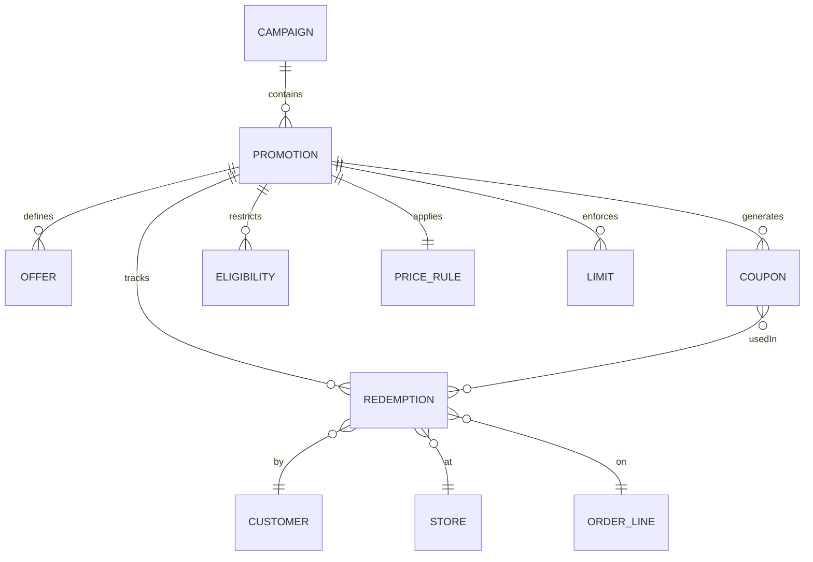

# Promotion Management Application — Full Interview Prep Guide
### .NET Core · Azure · React/Angular · SQL · DevOps · Kubernetes

> **Interview in 24 hours?** Jump straight to the [24-Hour Study Plan](#24-hour-study-plan) and the [Interview Cheat-Sheet](#interview-cheat-sheet).

---

## Table of Contents

1. [Problem & Domain Context](#1-problem--domain-context)
2. [Frontend → Backend → Azure End-to-End Flow](#2-frontend--backend--azure-end-to-end-flow)
3. [REST API Design](#3-rest-api-design)
4. [Azure Cloud Engineering](#4-azure-cloud-engineering)
5. [Database Management (SQL)](#5-database-management-sql)
6. [DevOps / CI-CD with GitHub Actions](#6-devops--ci-cd-with-github-actions)
7. [Containerization and Kubernetes](#7-containerization-and-kubernetes)
8. [Observability and Operations](#8-observability-and-operations)
9. [Agile Process & Communication](#9-agile-process--communication)
10. [Good-to-Have Skills](#10-good-to-have-skills)
11. [Interview Cheat-Sheet](#interview-cheat-sheet)
12. [24-Hour Study Plan](#24-hour-study-plan)

---

## 1. Problem & Domain Context

### 1.1 What a Promotion Management System Does

A **Promotion Management System (PMS)** in retail/POS allows merchandising, marketing, and store-operations teams to:

- Create and manage promotional offers (BOGO, percentage-off, fixed-amount-off, bundle deals, loyalty points multipliers).
- Define eligibility rules — which customers, stores, products, or time windows qualify.
- Publish promotions to Point-of-Sale (POS) terminals, e-commerce channels, and mobile apps.
- Validate promotion applicability at checkout in real time (≤ 50 ms).
- Enforce redemption limits (global caps, per-customer caps, coupon limits).
- Audit every application and redemption for compliance, fraud, and reporting.

### 1.2 Key Domain Entities

| Entity | Description |
|---|---|
| **Campaign** | Top-level marketing initiative (e.g., "Summer Sale 2026"). Contains 1-many Promotions. |
| **Promotion** | A specific deal rule set (e.g., "20% off all shoes"). Belongs to a Campaign. |
| **Offer** | The reward or discount definition within a Promotion (value, type, reward item). |
| **Coupon** | A unique or batch code redeemable against a Promotion. Has own limits & expiry. |
| **Price Rule** | The logic engine for computing discounted price (tiered, threshold, combinability). |
| **Eligibility** | Defines who/what qualifies — customer segment, store group, product category, SKU, date/time window. |
| **Customer Segment** | Marketing-defined grouping (VIP, loyalty tier, email-only). |
| **Store** | Physical or virtual location with region, brand, and POS terminal associations. |
| **Product** | SKU/UPC reference, category hierarchy, price-point. |
| **Redemption** | An actual usage event: which Promotion, by which Customer, at which Store, at what timestamp, for what basket. |
| **Limit** | Max uses global / per-customer / per-store / per-day; enforced at validation time. |
| **Audit Log** | Immutable record of every state change to a Promotion or Redemption. |

### 1.3 Domain Relationships (Mermaid)



### 1.4 Non-Functional Requirements

| Concern | Target |
|---|---|
| **Checkout latency** | p99 < 50 ms for promotion validation; p50 < 10 ms |
| **Throughput** | 50,000 simultaneous POS checkout validations during peak (Black Friday) |
| **Availability** | 99.95% (Active-Active, multi-region Azure) |
| **Consistency** | Strong consistency for redemption limit enforcement; eventual for reporting |
| **Data durability** | RPO ≤ 5 min, RTO ≤ 15 min |
| **Security** | OAuth2/OIDC with Azure AD, RBAC at API level, data encryption at rest/transit |
| **Compliance** | PCI-DSS for coupon data, GDPR for customer PII, SOC2 audit trail |
| **Multi-tenancy** | Separate data per retail brand/region; shared infrastructure |
| **Observability** | 100% structured logs, distributed tracing, < 1 min alerting on SLO breach |

---

## 2. Frontend → Backend → Azure End-to-End Flow

### 2.1 Architecture Overview (ASCII)

```
┌──────────────────────────────────────────────────────────────────────────────┐
│                          FRONTEND (React SPA / Admin Portal)                  │
│  Route /promotions  →  PromotionModule  →  PromoService (HTTP + cache)       │
│  Route /campaigns   →  CampaignModule   →  Redux / Zustand state              │
│  Auth: MSAL.js  →  Azure AD (Entra ID) → id_token + access_token             │
└──────────────────────┬───────────────────────────────────────────────────────┘
                       │ HTTPS + Bearer JWT
                       ▼
┌──────────────────────────────────────────────────────────────────────────────┐
│                    Azure API Management (APIM)                                │
│  - JWT validation policy (Azure AD audience)                                  │
│  - Rate limiting (500 req/min per subscription)                               │
│  - Request/response transformation                                             │
│  - Routes → /promotions → PromoAPI  |  /pos → ValidationAPI                  │
└────────┬─────────────────────────────────────────────────────────────────────┘
         │ Internal VNET
         ▼
┌────────────────────────────────────┐   ┌──────────────────────────────────┐
│  Promotion API (.NET Core 8)       │   │  POS Validation API (.NET Core 8) │
│  - Clean Architecture              │   │  - Optimized for < 50ms           │
│  - CRUD + publish/archive          │   │  - Redis cache for active promos  │
│  - Event publishing to Svc Bus     │   │  - Distributed lock for limits    │
└────────┬───────────────────────────┘   └────────┬─────────────────────────┘
         │                                         │
         ▼                                         ▼
┌─────────────────────────────────────────────────────────────────┐
│               Azure Service Bus (Premium)                        │
│  Topics: promotion-published, redemption-created                 │
│  Subscriptions: notifications, analytics, cache-invalidation     │
└─────────┬───────────────────────────────────────────────────────┘
          │
          ▼
┌─────────────────────────────┐   ┌─────────────────────────────┐
│  Azure Functions            │   │  Azure Logic Apps            │
│  - RedemptionProcessor      │   │  - Approval workflow         │
│  - CacheInvalidator         │   │  - Marketing notifications   │
│  - AuditWriter              │   │  - Teams/email alerts        │
└─────────────────────────────┘   └─────────────────────────────┘
          │
          ▼
┌─────────────────────────────────────────────────────────────────┐
│  Data Layer                                                      │
│  - Cosmos DB: promotion configs, eligibility, limits (NoSQL)    │
│  - Azure SQL: redemptions, audit, reporting (relational)        │
│  - Azure Cache for Redis: hot promos, rate-counter              │
│  - Azure Blob Storage: promotion assets (banners, T&Cs)         │
│  - Azure Key Vault: connection strings, API keys, certs         │
└─────────────────────────────────────────────────────────────────┘
```

### 2.2 Frontend SPA (React)

#### Project Structure

```
src/
├── app/
│   ├── store.ts                 # Redux Toolkit store
│   ├── rootReducer.ts
│   └── App.tsx                  # Root with MsalProvider + Router
├── features/
│   ├── campaigns/
│   │   ├── CampaignList.tsx
│   │   ├── CampaignForm.tsx
│   │   └── campaignSlice.ts
│   ├── promotions/
│   │   ├── PromotionList.tsx
│   │   ├── PromotionForm.tsx    # React Hook Form + Zod validation
│   │   ├── PromotionDetail.tsx
│   │   └── promotionSlice.ts
│   └── auth/
│       ├── AuthGuard.tsx        # RBAC wrapper
│       └── authSlice.ts
├── services/
│   ├── apiClient.ts             # Axios instance with interceptors
│   ├── promotionService.ts
│   └── msalConfig.ts
└── shared/
    ├── components/
    ├── hooks/
    └── utils/
```

#### State Management with Redux Toolkit

```typescript
// features/promotions/promotionSlice.ts
import { createAsyncThunk, createSlice } from '@reduxjs/toolkit';
import { promotionService } from '../../services/promotionService';

export const fetchPromotions = createAsyncThunk(
  'promotions/fetchAll',
  async (params: PromotionQueryParams, { rejectWithValue }) => {
    try {
      return await promotionService.getAll(params);
    } catch (err: any) {
      return rejectWithValue(err.response?.data ?? err.message);
    }
  }
);

const promotionSlice = createSlice({
  name: 'promotions',
  initialState: { items: [], status: 'idle', error: null } as PromoState,
  reducers: {
    resetStatus: (state) => { state.status = 'idle'; }
  },
  extraReducers: (builder) => {
    builder
      .addCase(fetchPromotions.pending, (state) => { state.status = 'loading'; })
      .addCase(fetchPromotions.fulfilled, (state, action) => {
        state.status = 'succeeded';
        state.items = action.payload.items;
      })
      .addCase(fetchPromotions.rejected, (state, action) => {
        state.status = 'failed';
        state.error = action.payload as string;
      });
  }
});
```

#### Auth Flow with MSAL.js (Azure AD / Entra ID)

```typescript
// services/msalConfig.ts
import { Configuration, LogLevel } from '@azure/msal-browser';

export const msalConfig: Configuration = {
  auth: {
    clientId: process.env.REACT_APP_CLIENT_ID!,
    authority: `https://login.microsoftonline.com/${process.env.REACT_APP_TENANT_ID}`,
    redirectUri: window.location.origin,
  },
  cache: { cacheLocation: 'sessionStorage', storeAuthStateInCookie: false },
  system: {
    loggerOptions: {
      loggerCallback: (level, message) => {
        if (level === LogLevel.Error) console.error(message);
      }
    }
  }
};

// Scopes for API access
export const apiRequest = {
  scopes: [`api://${process.env.REACT_APP_API_CLIENT_ID}/Promotions.ReadWrite`]
};
```

```typescript
// services/apiClient.ts — attaches Bearer token to every request
import axios from 'axios';
import { msalInstance, apiRequest } from './msalConfig';

const apiClient = axios.create({ baseURL: process.env.REACT_APP_API_URL });

apiClient.interceptors.request.use(async (config) => {
  const account = msalInstance.getActiveAccount();
  if (!account) throw new Error('No active account');
  const result = await msalInstance.acquireTokenSilent({ ...apiRequest, account });
  config.headers.Authorization = `Bearer ${result.accessToken}`;
  config.headers['X-Correlation-Id'] = crypto.randomUUID();
  return config;
});

apiClient.interceptors.response.use(
  (res) => res,
  async (error) => {
    if (error.response?.status === 401) {
      await msalInstance.acquireTokenRedirect(apiRequest);
    }
    return Promise.reject(error);
  }
);
```

#### Role-Based UI

```typescript
// shared/components/AuthGuard.tsx
import { useMsal } from '@azure/msal-react';

interface Props { roles: string[]; children: React.ReactNode; }

export const AuthGuard: React.FC<Props> = ({ roles, children }) => {
  const { accounts } = useMsal();
  const tokenRoles: string[] = accounts[0]?.idTokenClaims?.roles ?? [];
  const hasRole = roles.some(r => tokenRoles.includes(r));
  return hasRole ? <>{children}</> : <Unauthorized />;
};

// Usage
<AuthGuard roles={['Promotions.Publish', 'Admin']}>
  <PublishButton />
</AuthGuard>
```

#### Feature Flags

```typescript
// Use Azure App Configuration feature flags
const useFeatureFlag = (flagName: string): boolean => {
  const flags = useSelector((state: RootState) => state.featureFlags);
  return flags[flagName] ?? false;
};
```

### 2.3 Auth Flow Details (OAuth2/OIDC)

```
Browser → MSAL → Azure AD /authorize (PKCE)
       ← Azure AD → authorization_code
Browser → Azure AD /token
       ← id_token (user identity) + access_token (API audience)

access_token claims:
{
  "aud": "api://promo-api",
  "scp": "Promotions.ReadWrite",
  "roles": ["Promotions.Admin"],
  "oid": "<user-object-id>",
  "tid": "<tenant-id>",
  "exp": 1744060000
}

Token refresh: MSAL calls /token with refresh_token silently every ~60 min.
```

**APIM JWT Validation Policy:**
```xml
<validate-jwt header-name="Authorization" failed-validation-httpcode="401">
  <openid-config url="https://login.microsoftonline.com/{tenant}/.well-known/openid-configuration"/>
  <audiences>
    <audience>api://promo-api</audience>
  </audiences>
  <required-claims>
    <claim name="scp" match="any">
      <value>Promotions.Read</value>
      <value>Promotions.ReadWrite</value>
    </claim>
  </required-claims>
</validate-jwt>
```

### 2.4 APIM Gateway Layer

```xml
<!-- Rate limiting per subscription (500 req/min) -->
<rate-limit calls="500" renewal-period="60" />

<!-- Correlation ID forwarding -->
<set-header name="X-Correlation-Id" exists-action="skip">
  <value>@(context.RequestId)</value>
</set-header>

<!-- Backend circuit breaker -->
<retry condition="@(context.Response.StatusCode >= 500)" count="3" interval="2">
  <forward-request />
</retry>

<!-- Response caching for promotion catalog (5 min TTL) -->
<cache-lookup vary-by-developer="false" vary-by-developer-groups="false">
  <vary-by-header>Accept</vary-by-header>
</cache-lookup>
<cache-store duration="300" />
```

### 2.5 Backend .NET Core — Clean Architecture

```
PromoManagement.sln
├── src/
│   ├── Domain/                    # Entities, value objects, domain events
│   │   ├── Entities/
│   │   │   ├── Promotion.cs
│   │   │   ├── Campaign.cs
│   │   │   └── Redemption.cs
│   │   ├── Events/
│   │   │   └── PromotionPublishedEvent.cs
│   │   └── Interfaces/
│   │       └── IPromotionRepository.cs
│   ├── Application/               # Use cases, DTOs, validators, interfaces
│   │   ├── Promotions/
│   │   │   ├── Commands/
│   │   │   │   ├── CreatePromotionCommand.cs
│   │   │   │   └── PublishPromotionCommand.cs
│   │   │   └── Queries/
│   │   │       └── GetPromotionByIdQuery.cs
│   │   └── Common/
│   │       ├── Behaviors/         # MediatR pipeline (logging, validation)
│   │       └── Interfaces/
│   ├── Infrastructure/            # EF Core, Cosmos, Service Bus, Redis
│   │   ├── Persistence/
│   │   ├── Messaging/
│   │   └── Caching/
│   └── API/                       # Controllers, middleware, Program.cs
│       ├── Controllers/
│       ├── Middleware/
│       └── Program.cs
└── tests/
    ├── Unit/
    ├── Integration/
    └── Architecture/
```

#### Domain Entity Example

```csharp
// Domain/Entities/Promotion.cs
public class Promotion : BaseAuditableEntity
{
    private readonly List<Eligibility> _eligibilities = new();
    private readonly List<Limit> _limits = new();

    public Guid CampaignId { get; private set; }
    public string Name { get; private set; } = null!;
    public PromotionType Type { get; private set; }
    public PromotionStatus Status { get; private set; }
    public DateTimeOffset StartDate { get; private set; }
    public DateTimeOffset EndDate { get; private set; }
    public Offer Offer { get; private set; } = null!;

    public IReadOnlyCollection<Eligibility> Eligibilities => _eligibilities.AsReadOnly();
    public IReadOnlyCollection<Limit> Limits => _limits.AsReadOnly();

    private Promotion() { }

    public static Promotion Create(
        Guid campaignId, string name, PromotionType type,
        Offer offer, DateTimeOffset start, DateTimeOffset end)
    {
        ArgumentException.ThrowIfNullOrWhiteSpace(name);
        if (end <= start) throw new DomainException("End date must be after start date.");

        var promo = new Promotion
        {
            Id = Guid.NewGuid(),
            CampaignId = campaignId,
            Name = name,
            Type = type,
            Offer = offer,
            StartDate = start,
            EndDate = end,
            Status = PromotionStatus.Draft,
        };
        promo.AddDomainEvent(new PromotionCreatedEvent(promo.Id));
        return promo;
    }

    public void Publish()
    {
        if (Status != PromotionStatus.Draft)
            throw new DomainException($"Cannot publish a promotion in '{Status}' status.");
        Status = PromotionStatus.Published;
        AddDomainEvent(new PromotionPublishedEvent(Id));
    }

    public void Archive()
    {
        if (Status == PromotionStatus.Archived)
            throw new DomainException("Promotion is already archived.");
        Status = PromotionStatus.Archived;
        AddDomainEvent(new PromotionArchivedEvent(Id));
    }
}
```

#### MediatR Command Handler

```csharp
// Application/Promotions/Commands/PublishPromotionCommandHandler.cs
public class PublishPromotionCommandHandler
    : IRequestHandler<PublishPromotionCommand, Result<Guid>>
{
    private readonly IPromotionRepository _repo;
    private readonly IUnitOfWork _uow;
    private readonly IEventBus _eventBus;
    private readonly ILogger<PublishPromotionCommandHandler> _logger;

    public PublishPromotionCommandHandler(
        IPromotionRepository repo, IUnitOfWork uow,
        IEventBus eventBus, ILogger<PublishPromotionCommandHandler> logger)
    {
        _repo = repo; _uow = uow;
        _eventBus = eventBus; _logger = logger;
    }

    public async Task<Result<Guid>> Handle(
        PublishPromotionCommand cmd, CancellationToken ct)
    {
        var promo = await _repo.GetByIdAsync(cmd.PromotionId, ct);
        if (promo is null) return Result.Failure<Guid>("Promotion not found.");

        promo.Publish();
        await _uow.SaveChangesAsync(ct);

        // Outbox pattern: domain events dispatched after DB commit
        foreach (var evt in promo.DomainEvents)
            await _eventBus.PublishAsync(evt, ct);

        _logger.LogInformation("Promotion {PromotionId} published", promo.Id);
        return Result.Success(promo.Id);
    }
}
```

#### Validation Pipeline (FluentValidation + MediatR)

```csharp
// Application/Common/Behaviors/ValidationBehavior.cs
public class ValidationBehavior<TRequest, TResponse>
    : IPipelineBehavior<TRequest, TResponse>
    where TRequest : IRequest<TResponse>
{
    private readonly IEnumerable<IValidator<TRequest>> _validators;

    public ValidationBehavior(IEnumerable<IValidator<TRequest>> validators)
        => _validators = validators;

    public async Task<TResponse> Handle(
        TRequest request, RequestHandlerDelegate<TResponse> next, CancellationToken ct)
    {
        if (!_validators.Any()) return await next();

        var context = new ValidationContext<TRequest>(request);
        var failures = _validators
            .Select(v => v.Validate(context))
            .SelectMany(r => r.Errors)
            .Where(f => f != null)
            .ToList();

        if (failures.Count != 0)
            throw new ValidationException(failures);

        return await next();
    }
}
```

#### API Controller

```csharp
// API/Controllers/PromotionsController.cs
[ApiController]
[Route("api/v{version:apiVersion}/promotions")]
[ApiVersion("1.0")]
[Authorize]
public class PromotionsController : ControllerBase
{
    private readonly ISender _mediator;

    public PromotionsController(ISender mediator) => _mediator = mediator;

    [HttpGet]
    [Authorize(Policy = "Promotions.Read")]
    public async Task<IActionResult> GetAll(
        [FromQuery] GetPromotionsQuery query, CancellationToken ct)
    {
        var result = await _mediator.Send(query, ct);
        return Ok(result);
    }

    [HttpPost]
    [Authorize(Policy = "Promotions.Write")]
    public async Task<IActionResult> Create(
        [FromBody] CreatePromotionCommand cmd, CancellationToken ct)
    {
        var result = await _mediator.Send(cmd, ct);
        return result.IsSuccess
            ? CreatedAtAction(nameof(GetById), new { id = result.Value }, result.Value)
            : BadRequest(result.Error);
    }

    [HttpPut("{id}/publish")]
    [Authorize(Policy = "Promotions.Publish")]
    public async Task<IActionResult> Publish(Guid id, CancellationToken ct)
    {
        var result = await _mediator.Send(new PublishPromotionCommand(id), ct);
        return result.IsSuccess ? NoContent() : BadRequest(result.Error);
    }
}
```

#### Global Exception Middleware

```csharp
// API/Middleware/ExceptionHandlingMiddleware.cs
public class ExceptionHandlingMiddleware
{
    private readonly RequestDelegate _next;
    private readonly ILogger<ExceptionHandlingMiddleware> _logger;

    public ExceptionHandlingMiddleware(
        RequestDelegate next, ILogger<ExceptionHandlingMiddleware> logger)
    { _next = next; _logger = logger; }

    public async Task InvokeAsync(HttpContext context)
    {
        try { await _next(context); }
        catch (ValidationException ex)
        {
            _logger.LogWarning(ex, "Validation failed");
            context.Response.StatusCode = StatusCodes.Status400BadRequest;
            await context.Response.WriteAsJsonAsync(new
            {
                type = "ValidationError",
                errors = ex.Errors.Select(e => new { e.PropertyName, e.ErrorMessage })
            });
        }
        catch (NotFoundException ex)
        {
            _logger.LogWarning(ex, "Resource not found");
            context.Response.StatusCode = StatusCodes.Status404NotFound;
            await context.Response.WriteAsJsonAsync(new { type = "NotFound", message = ex.Message });
        }
        catch (Exception ex)
        {
            var correlationId = context.Request.Headers["X-Correlation-Id"].FirstOrDefault()
                ?? context.TraceIdentifier;
            _logger.LogError(ex, "Unhandled exception. CorrelationId: {CorrelationId}", correlationId);
            context.Response.StatusCode = StatusCodes.Status500InternalServerError;
            await context.Response.WriteAsJsonAsync(new
            {
                type = "ServerError",
                correlationId,
                message = "An unexpected error occurred."
            });
        }
    }
}
```

#### Program.cs (minimal API style, .NET 8)

```csharp
var builder = WebApplication.CreateBuilder(args);

// Azure Key Vault for secrets
builder.Configuration.AddAzureKeyVault(
    new Uri(builder.Configuration["KeyVaultUri"]!),
    new DefaultAzureCredential());

builder.Services
    .AddApplicationServices()       // MediatR, FluentValidation, AutoMapper
    .AddInfrastructureServices(builder.Configuration)  // EF Core, Cosmos, Redis, Service Bus
    .AddApiServices();              // Controllers, versioning, OpenAPI

builder.Services
    .AddAuthentication(JwtBearerDefaults.AuthenticationScheme)
    .AddMicrosoftIdentityWebApi(builder.Configuration.GetSection("AzureAd"));

builder.Services.AddAuthorization(options =>
{
    options.AddPolicy("Promotions.Read",  p => p.RequireRole("Promotions.Reader", "Admin"));
    options.AddPolicy("Promotions.Write", p => p.RequireRole("Promotions.Editor", "Admin"));
    options.AddPolicy("Promotions.Publish", p => p.RequireRole("Promotions.Publisher", "Admin"));
});

builder.Services.AddOpenTelemetry()
    .WithTracing(t => t
        .AddAspNetCoreInstrumentation()
        .AddHttpClientInstrumentation()
        .AddAzureMonitorTraceExporter());

var app = builder.Build();

app.UseMiddleware<ExceptionHandlingMiddleware>();
app.UseAuthentication();
app.UseAuthorization();
app.MapControllers();
app.MapHealthChecks("/health");

app.Run();
```

---

## 3. REST API Design

### 3.1 Endpoint Catalog

```
# Campaign Management
GET    /api/v1/campaigns                        List campaigns (paginated, filtered)
POST   /api/v1/campaigns                        Create campaign
GET    /api/v1/campaigns/{id}                   Get campaign
PUT    /api/v1/campaigns/{id}                   Update campaign
DELETE /api/v1/campaigns/{id}                   Archive campaign

# Promotion CRUD
GET    /api/v1/promotions                       List promotions
POST   /api/v1/promotions                       Create promotion
GET    /api/v1/promotions/{id}                  Get promotion
PUT    /api/v1/promotions/{id}                  Update promotion (draft only)
DELETE /api/v1/promotions/{id}                  Archive promotion

# Promotion Lifecycle
PUT    /api/v1/promotions/{id}/publish          Publish promotion
PUT    /api/v1/promotions/{id}/pause            Pause promotion
PUT    /api/v1/promotions/{id}/archive          Archive promotion
GET    /api/v1/promotions/{id}/history          Audit trail

# Validation & Preview
POST   /api/v1/promotions/validate              Validate promotion rules (draft time)
POST   /api/v1/promotions/{id}/preview-price    Preview discounted price for basket
POST   /api/v1/promotions/apply                 Apply promotions to basket (checkout)

# Redemption
POST   /api/v1/redemptions                      Record a redemption
GET    /api/v1/redemptions/{id}                 Get redemption
GET    /api/v1/promotions/{id}/redemptions      List redemptions for a promotion

# Eligibility
GET    /api/v1/promotions/{id}/eligibility      Get eligibility rules
PUT    /api/v1/promotions/{id}/eligibility      Update eligibility rules
POST   /api/v1/eligibility/check                Check if a customer/basket is eligible

# Coupon
POST   /api/v1/promotions/{id}/coupons/generate Generate coupon batch
POST   /api/v1/coupons/validate                 Validate a coupon code
POST   /api/v1/coupons/redeem                   Redeem a coupon
```

### 3.2 Pagination & Filtering

```http
GET /api/v1/promotions?page=2&pageSize=25&status=Published&campaignId=abc&sortBy=startDate&sortDir=desc

Response:
{
  "items": [...],
  "totalCount": 150,
  "page": 2,
  "pageSize": 25,
  "totalPages": 6,
  "hasNextPage": true,
  "hasPreviousPage": true
}
```

### 3.3 Idempotency

All POST endpoints accept an `Idempotency-Key` header. The server stores the key + response in Redis for 24 hours and returns the cached response on duplicate requests.

```csharp
// Idempotency middleware
var key = context.Request.Headers["Idempotency-Key"].FirstOrDefault();
if (key != null)
{
    var cached = await _cache.GetStringAsync($"idempotency:{key}");
    if (cached != null)
    {
        context.Response.StatusCode = 200;
        await context.Response.WriteAsync(cached);
        return;
    }
}
```

### 3.4 Versioning Strategy

```csharp
// URL segment versioning (recommended for public APIs)
services.AddApiVersioning(options =>
{
    options.DefaultApiVersion = new ApiVersion(1, 0);
    options.AssumeDefaultVersionWhenUnspecified = true;
    options.ReportApiVersions = true;
    options.ApiVersionReader = ApiVersionReader.Combine(
        new UrlSegmentApiVersionReader(),
        new HeaderApiVersionReader("X-API-Version"));
});
```

Deprecation is signaled via `Sunset` and `Deprecation` response headers. Old versions supported for 12 months.

### 3.5 Correlation IDs

Every request should carry `X-Correlation-Id`. The API:
1. Reads it from the incoming request header.
2. Adds it to all log entries (structured logging scope).
3. Forwards it to downstream services.
4. Returns it in the response header.

```csharp
app.Use(async (context, next) =>
{
    var correlationId = context.Request.Headers["X-Correlation-Id"].FirstOrDefault()
        ?? Guid.NewGuid().ToString();
    context.Items["CorrelationId"] = correlationId;
    context.Response.Headers["X-Correlation-Id"] = correlationId;

    using (_logger.BeginScope(new Dictionary<string, object>
        { ["CorrelationId"] = correlationId }))
    {
        await next();
    }
});
```

### 3.6 Security

```csharp
// Input validation — FluentValidation
public class CreatePromotionCommandValidator : AbstractValidator<CreatePromotionCommand>
{
    public CreatePromotionCommandValidator()
    {
        RuleFor(x => x.Name).NotEmpty().MaximumLength(200).Matches(@"^[a-zA-Z0-9 \-_&]+$");
        RuleFor(x => x.StartDate).GreaterThan(DateTimeOffset.UtcNow);
        RuleFor(x => x.EndDate).GreaterThan(x => x.StartDate);
        RuleFor(x => x.Offer.DiscountValue).InclusiveBetween(0.01m, 100m);
    }
}
```

**OWASP Top-10 mitigations:**
- **Injection**: Parameterized queries via EF Core, no raw SQL with user input
- **Broken Auth**: Azure AD OIDC, short-lived tokens (60 min), PKCE
- **Sensitive Data**: Key Vault for secrets, TLS 1.3 in transit, encryption at rest
- **IDOR**: Authorization checks on every resource access against `sub` claim
- **Security Misconfiguration**: Hardened container images, no default passwords
- **Rate Limiting**: APIM policies + in-process `AspNetCoreRateLimit`

---

## 4. Azure Cloud Engineering

### 4.1 Azure Functions

#### HTTP Trigger (Validation, isolated worker model)

```csharp
// Functions/PromotionValidationFunction.cs
[Function("ValidatePromotion")]
public async Task<HttpResponseData> Run(
    [HttpTrigger(AuthorizationLevel.Anonymous, "post", Route = "validate")] HttpRequestData req,
    FunctionContext context)
{
    var logger = context.GetLogger<PromotionValidationFunction>();
    var basket = await req.ReadFromJsonAsync<BasketDto>();
    if (basket is null)
    {
        var badResponse = req.CreateResponse(HttpStatusCode.BadRequest);
        await badResponse.WriteStringAsync("Invalid basket payload.");
        return badResponse;
    }

    var result = await _validationService.ValidateAsync(basket);
    var response = req.CreateResponse(HttpStatusCode.OK);
    await response.WriteAsJsonAsync(result);
    return response;
}
```

#### Service Bus Trigger (Redemption processing)

```csharp
[Function("RedemptionProcessor")]
public async Task Run(
    [ServiceBusTrigger("redemption-created", Connection = "ServiceBusConnection")] 
    ServiceBusReceivedMessage message,
    ServiceBusMessageActions messageActions,
    FunctionContext context)
{
    var logger = context.GetLogger<RedemptionProcessor>();
    try
    {
        var redemption = message.Body.ToObjectFromJson<RedemptionEvent>();
        await _redemptionService.ProcessAsync(redemption);
        await messageActions.CompleteMessageAsync(message);
    }
    catch (TransientException ex)
    {
        logger.LogWarning(ex, "Transient failure, will retry");
        await messageActions.AbandonMessageAsync(message);   // triggers retry
    }
    catch (PoisonMessageException ex)
    {
        logger.LogError(ex, "Poison message, dead-lettering");
        await messageActions.DeadLetterMessageAsync(message, "PoisonMessage", ex.Message);
    }
}
```

#### Durable Functions — Promotion Approval Orchestration

```csharp
[Function("PromotionApprovalOrchestration")]
public async Task RunOrchestrator(
    [OrchestrationTrigger] TaskOrchestrationContext context)
{
    var input = context.GetInput<PromotionApprovalInput>()!;

    // Step 1: Validate rules
    await context.CallActivityAsync("ValidatePromotionRules", input.PromotionId);

    // Step 2: Notify approvers and wait (up to 72 hours)
    await context.CallActivityAsync("NotifyApprovers", input);
    var approved = await context.WaitForExternalEvent<bool>(
        "ApprovalDecision",
        TimeSpan.FromHours(72));

    if (!approved)
    {
        await context.CallActivityAsync("RejectPromotion", input.PromotionId);
        return;
    }

    // Step 3: Publish promotion
    await context.CallActivityAsync("PublishPromotion", input.PromotionId);
    await context.CallActivityAsync("NotifyPublished", input);
}
```

#### Cold Start Mitigations

- Use **Premium Plan (EP1)** or **Dedicated (App Service)** for latency-sensitive functions.
- Enable **Always-On** for App Service.
- Use **pre-warmed instances** in Premium Plan.
- Minimize package size; use **trimming** and **ReadyToRun** compilation.
- Use **Azure Functions Flex Consumption** (preview) for per-function scaling.

```json
// host.json — configure pre-warmed instances
{
  "extensionBundle": { "id": "Microsoft.Azure.Functions.ExtensionBundle", "version": "[4.*, 5.0.0)" },
  "functionTimeout": "00:05:00",
  "extensions": {
    "serviceBus": {
      "prefetchCount": 100,
      "messageHandlerOptions": {
        "maxConcurrentCalls": 16,
        "autoComplete": false
      }
    }
  }
}
```

### 4.2 Azure Service Bus

#### Topology

```
Namespace: promo-servicebus (Premium, geo-redundant)
│
├── Topic: promotion-events
│   ├── Subscription: cache-invalidation   (filter: label = 'published' OR 'archived')
│   ├── Subscription: analytics            (no filter, all events)
│   └── Subscription: notifications        (filter: label = 'published')
│
├── Topic: redemption-events
│   ├── Subscription: redemption-processor
│   └── Subscription: fraud-detection
│
└── Queue:  approval-requests              (sessions enabled for ordering)
```

#### Publishing (Outbox pattern — prevents dual-write)

```csharp
// Infrastructure/Messaging/OutboxProcessor.cs
// Runs as a background service, polls DB for unpublished events
public class OutboxProcessor : BackgroundService
{
    protected override async Task ExecuteAsync(CancellationToken ct)
    {
        while (!ct.IsCancellationRequested)
        {
            var messages = await _outboxRepo.GetPendingAsync(batchSize: 50, ct);
            foreach (var msg in messages)
            {
                await _serviceBusSender.SendMessageAsync(
                    new ServiceBusMessage(msg.Payload)
                    {
                        Subject = msg.EventType,
                        MessageId = msg.Id.ToString(),   // idempotency
                        CorrelationId = msg.CorrelationId,
                        SessionId = msg.PartitionKey,    // ordering by campaign
                    }, ct);
                await _outboxRepo.MarkPublishedAsync(msg.Id, ct);
            }
            await Task.Delay(TimeSpan.FromSeconds(5), ct);
        }
    }
}
```

#### Dead-Letter Queue (DLQ) Handling

```csharp
// Dead-letter messages end up in: <queue>/$DeadLetterQueue
// Monitoring: Alert when DLQ count > 0

public class DlqReprocessor
{
    public async Task ReprocessAsync(string queueName, CancellationToken ct)
    {
        var dlqPath = $"{queueName}/$DeadLetterQueue";
        var receiver = _client.CreateReceiver(dlqPath,
            new ServiceBusReceiverOptions { ReceiveMode = ServiceBusReceiveMode.PeekLock });

        var messages = await receiver.ReceiveMessagesAsync(100, TimeSpan.FromSeconds(5), ct);
        foreach (var msg in messages)
        {
            var reason = msg.DeadLetterReason;
            _logger.LogWarning("DLQ: {Reason} — MessageId: {Id}", reason, msg.MessageId);

            // Fix and resubmit, or log for manual review
            if (reason == "PoisonMessage")
            {
                await _auditService.LogPoisonMessageAsync(msg);
                await receiver.CompleteMessageAsync(msg, ct);
            }
            else
            {
                await _sender.SendMessageAsync(new ServiceBusMessage(msg.Body), ct);
                await receiver.CompleteMessageAsync(msg, ct);
            }
        }
    }
}
```

### 4.3 Logic Apps — Approval Workflow

```json
// Logic App definition excerpt (Standard tier)
{
  "triggers": {
    "When_promotion_approval_requested": {
      "type": "ServiceBus",
      "inputs": {
        "connection": "@parameters('serviceBusConnection')",
        "queueName": "approval-requests"
      }
    }
  },
  "actions": {
    "Send_approval_email": {
      "type": "ApiConnection",
      "inputs": {
        "host": { "connection": { "name": "@parameters('office365Connection')" } },
        "method": "post",
        "path": "/Mail",
        "body": {
          "To": "@triggerBody()?['approverEmail']",
          "Subject": "Promotion Approval Required: @{triggerBody()?['promotionName']}",
          "Body": "Please approve or reject the promotion..."
        }
      }
    },
    "Wait_for_approval": {
      "type": "ApiConnectionWebhook",
      "inputs": { "host": { "api": { "runtimeUrl": "..." } } }
    },
    "Notify_result": {
      "type": "Http",
      "inputs": {
        "method": "POST",
        "uri": "@concat(parameters('apiBaseUrl'), '/api/v1/promotions/', triggerBody()?['promotionId'], '/approval-result')",
        "headers": { "Authorization": "Bearer @{body('Get_access_token')?['access_token']}" },
        "body": { "approved": "@body('Wait_for_approval')?['approved']" }
      }
    }
  }
}
```

### 4.4 Cosmos DB

#### Data Modeling

```json
// Container: promotions (partitionKey: /campaignId)
{
  "id": "promo-001",
  "campaignId": "camp-2026-summer",      // partition key
  "type": "Promotion",
  "name": "20% Off Footwear",
  "status": "Published",
  "startDate": "2026-06-01T00:00:00Z",
  "endDate": "2026-06-30T23:59:59Z",
  "offer": {
    "type": "PercentageOff",
    "value": 20.0,
    "applicableTo": ["Footwear"]
  },
  "eligibility": {
    "customerSegments": ["VIP", "LoyaltyGold"],
    "storeGroups": ["US-East"],
    "minBasketValue": 50.00
  },
  "limits": {
    "globalMax": 10000,
    "perCustomerMax": 1,
    "perDay": 500
  },
  "ttl": -1,
  "_ts": 1744060000
}

// Container: redemptions (partitionKey: /promotionId)
// High-write; partition by promotionId to co-locate with limit checks

// Container: sessions (partitionKey: /sessionId, TTL: 3600)
// Short-lived checkout session state
```

#### RU Planning

| Operation | Estimated RUs |
|---|---|
| Point read by id + partition key | ~1 RU |
| Query promotions by campaign (10 items) | ~5–10 RU |
| Write redemption | ~10–15 RU |
| Cross-partition query (avoid in hot path) | 50–500+ RU |

**Provisioning:**
- Use **autoscale** (max RU = 10,000 RU/s, min = 100 RU/s).
- Separate containers for high-write (redemptions) and read-heavy (promotions).

#### Change Feed — Cache Invalidation

```csharp
// Infrastructure/CosmosChangeProcessor.cs
var processor = container.GetChangeFeedProcessorBuilder<PromotionDocument>(
    "cache-invalidation-processor",
    async (changes, ct) =>
    {
        foreach (var doc in changes)
        {
            if (doc.Status is "Published" or "Archived")
            {
                await _cache.RemoveAsync($"promotion:{doc.Id}", ct);
                await _serviceBus.SendAsync(new CacheInvalidationMessage(doc.Id), ct);
            }
        }
    })
    .WithInstanceName(Environment.MachineName)
    .WithLeaseContainer(leaseContainer)
    .WithStartTime(DateTime.MinValue.ToUniversalTime())
    .Build();

await processor.StartAsync();
```

#### Indexing Policy

```json
{
  "indexingMode": "consistent",
  "includedPaths": [
    { "path": "/status/?" },
    { "path": "/startDate/?" },
    { "path": "/endDate/?" },
    { "path": "/campaignId/?" }
  ],
  "excludedPaths": [
    { "path": "/offer/description/?" },
    { "path": "/_etag/?" }
  ],
  "compositeIndexes": [
    [
      { "path": "/status", "order": "ascending" },
      { "path": "/startDate", "order": "descending" }
    ]
  ]
}
```

### 4.5 Azure Key Vault

```csharp
// Program.cs — managed identity, no stored credentials
builder.Configuration.AddAzureKeyVault(
    new Uri($"https://{builder.Configuration["KeyVaultName"]}.vault.azure.net/"),
    new DefaultAzureCredential());

// Secrets stored in Key Vault:
// - ConnectionStrings--SqlDb
// - ConnectionStrings--CosmosDb
// - ConnectionStrings--RedisCache
// - ServiceBus--ConnectionString
// - Jwt--SigningKey (if using custom tokens)
```

**Key rotation:**
```csharp
// IOptionsMonitor reloads secrets on rotation without restart
services.AddOptions<ServiceBusOptions>()
    .Configure<IConfiguration>((opts, cfg) =>
        opts.ConnectionString = cfg["ServiceBus--ConnectionString"]!);
```

**Access policy (RBAC):**
- API app identity → Key Vault Secrets User
- DevOps pipeline identity → Key Vault Secrets Officer (for rotation)
- No human access to production vault

### 4.6 APIM — Products, Subscriptions, Diagnostics

```xml
<!-- APIM product: POS-Integration -->
<!-- Requires subscription key + JWT -->

<!-- Policy: set-backend-service, retry, circuit-breaker -->
<policies>
  <inbound>
    <base />
    <validate-jwt header-name="Authorization" failed-validation-httpcode="401">
      <openid-config url="https://login.microsoftonline.com/{tenantId}/v2.0/.well-known/openid-configuration"/>
      <audiences><audience>api://promo-api</audience></audiences>
    </validate-jwt>
    <rate-limit-by-key calls="500" renewal-period="60"
      counter-key="@(context.Request.Headers.GetValueOrDefault("X-Store-Id", "unknown"))" />
    <set-header name="X-Internal-Request" exists-action="override">
      <value>true</value>
    </set-header>
  </inbound>
  <backend>
    <retry condition="@(context.Response.StatusCode >= 500)" count="3" interval="2">
      <forward-request />
    </retry>
  </backend>
  <outbound>
    <base />
    <set-header name="X-Response-Time" exists-action="override">
      <value>@(context.Elapsed.TotalMilliseconds.ToString())</value>
    </set-header>
  </outbound>
</policies>
```

---

## 5. Database Management (SQL)

### 5.1 Schema Design

```sql
-- Campaigns table
CREATE TABLE Campaigns (
    CampaignId      UNIQUEIDENTIFIER NOT NULL DEFAULT NEWSEQUENTIALID() PRIMARY KEY,
    Name            NVARCHAR(200)    NOT NULL,
    Description     NVARCHAR(1000)   NULL,
    StartDate       DATETIMEOFFSET   NOT NULL,
    EndDate         DATETIMEOFFSET   NOT NULL,
    Status          NVARCHAR(20)     NOT NULL DEFAULT 'Draft',
    CreatedBy       NVARCHAR(100)    NOT NULL,
    CreatedAt       DATETIMEOFFSET   NOT NULL DEFAULT SYSUTCDATETIME(),
    ModifiedAt      DATETIMEOFFSET   NOT NULL DEFAULT SYSUTCDATETIME(),
    RowVersion      ROWVERSION,
    CONSTRAINT CK_Campaigns_Status CHECK (Status IN ('Draft','Active','Expired','Archived')),
    CONSTRAINT CK_Campaigns_Dates  CHECK (EndDate > StartDate)
);

-- Promotions table
CREATE TABLE Promotions (
    PromotionId       UNIQUEIDENTIFIER NOT NULL DEFAULT NEWSEQUENTIALID() PRIMARY KEY,
    CampaignId        UNIQUEIDENTIFIER NOT NULL REFERENCES Campaigns(CampaignId),
    Name              NVARCHAR(200)    NOT NULL,
    PromotionType     NVARCHAR(50)     NOT NULL,
    Status            NVARCHAR(20)     NOT NULL DEFAULT 'Draft',
    DiscountType      NVARCHAR(20)     NOT NULL,
    DiscountValue     DECIMAL(18,4)    NOT NULL,
    MinBasketValue    DECIMAL(18,4)    NULL,
    StartDate         DATETIMEOFFSET   NOT NULL,
    EndDate           DATETIMEOFFSET   NOT NULL,
    Priority          INT              NOT NULL DEFAULT 0,
    IsStackable       BIT              NOT NULL DEFAULT 0,
    CreatedBy         NVARCHAR(100)    NOT NULL,
    CreatedAt         DATETIMEOFFSET   NOT NULL DEFAULT SYSUTCDATETIME(),
    ModifiedAt        DATETIMEOFFSET   NOT NULL DEFAULT SYSUTCDATETIME(),
    RowVersion        ROWVERSION,
    CONSTRAINT CK_Promotions_Status    CHECK (Status IN ('Draft','Published','Paused','Archived')),
    CONSTRAINT CK_Promotions_Discount  CHECK (DiscountValue > 0),
    CONSTRAINT CK_Promotions_Dates     CHECK (EndDate > StartDate)
);

-- Redemptions table
CREATE TABLE Redemptions (
    RedemptionId      UNIQUEIDENTIFIER NOT NULL DEFAULT NEWSEQUENTIALID() PRIMARY KEY,
    PromotionId       UNIQUEIDENTIFIER NOT NULL REFERENCES Promotions(PromotionId),
    CustomerId        NVARCHAR(100)    NOT NULL,    -- external key, no FK (decoupled)
    StoreId           NVARCHAR(100)    NOT NULL,
    OrderId           NVARCHAR(100)    NOT NULL,
    CouponCode        NVARCHAR(50)     NULL,
    DiscountApplied   DECIMAL(18,4)    NOT NULL,
    BasketValue       DECIMAL(18,4)    NOT NULL,
    RedeemedAt        DATETIMEOFFSET   NOT NULL DEFAULT SYSUTCDATETIME(),
    IsVoided          BIT              NOT NULL DEFAULT 0,
    VoidedAt          DATETIMEOFFSET   NULL,
    VoidReason        NVARCHAR(500)    NULL,
    CorrelationId     NVARCHAR(100)    NOT NULL,
    CONSTRAINT UQ_Redemptions_OrderPromo UNIQUE (OrderId, PromotionId)
);

-- PromotionLimits table
CREATE TABLE PromotionLimits (
    LimitId         UNIQUEIDENTIFIER NOT NULL DEFAULT NEWSEQUENTIALID() PRIMARY KEY,
    PromotionId     UNIQUEIDENTIFIER NOT NULL REFERENCES Promotions(PromotionId),
    LimitType       NVARCHAR(30)     NOT NULL,    -- Global, PerCustomer, PerStore, PerDay
    MaxUses         INT              NOT NULL,
    CurrentUses     INT              NOT NULL DEFAULT 0,
    CONSTRAINT CK_Limits_Type CHECK (LimitType IN ('Global','PerCustomer','PerStore','PerDay'))
);

-- AuditLog table (append-only)
CREATE TABLE AuditLog (
    AuditId       BIGINT           NOT NULL IDENTITY(1,1) PRIMARY KEY,
    EntityType    NVARCHAR(100)    NOT NULL,
    EntityId      NVARCHAR(100)    NOT NULL,
    Action        NVARCHAR(50)     NOT NULL,
    OldValues     NVARCHAR(MAX)    NULL,    -- JSON
    NewValues     NVARCHAR(MAX)    NULL,    -- JSON
    ChangedBy     NVARCHAR(100)    NOT NULL,
    ChangedAt     DATETIMEOFFSET   NOT NULL DEFAULT SYSUTCDATETIME(),
    CorrelationId NVARCHAR(100)    NOT NULL
);
```

### 5.2 Indexing Strategy

```sql
-- Promotions: common query patterns
CREATE INDEX IX_Promotions_Status_StartDate
    ON Promotions (Status, StartDate DESC)
    INCLUDE (CampaignId, Name, DiscountType, DiscountValue, EndDate);

CREATE INDEX IX_Promotions_CampaignId
    ON Promotions (CampaignId)
    INCLUDE (Status, StartDate, EndDate);

-- Redemptions: heavy writes AND reads by PromotionId
CREATE INDEX IX_Redemptions_PromotionId_RedeemedAt
    ON Redemptions (PromotionId, RedeemedAt DESC)
    INCLUDE (CustomerId, DiscountApplied);

CREATE INDEX IX_Redemptions_CustomerId_PromotionId
    ON Redemptions (CustomerId, PromotionId)
    WHERE IsVoided = 0;

-- Filtered index for active promotions (dramatically reduces index size)
CREATE INDEX IX_Promotions_Active
    ON Promotions (StartDate, EndDate)
    INCLUDE (Name, DiscountType, DiscountValue, Priority)
    WHERE Status = 'Published';

-- AuditLog: lookup by entity
CREATE INDEX IX_AuditLog_Entity
    ON AuditLog (EntityType, EntityId, ChangedAt DESC);
```

### 5.3 Complex SQL Query Examples

#### Query 1: Promotion Performance Dashboard

```sql
-- Top 10 promotions by redemption count and revenue impact, last 30 days
SELECT TOP 10
    p.PromotionId,
    p.Name,
    p.PromotionType,
    c.Name                          AS CampaignName,
    COUNT(r.RedemptionId)           AS RedemptionCount,
    SUM(r.DiscountApplied)          AS TotalDiscountGiven,
    SUM(r.BasketValue)              AS TotalBasketValue,
    AVG(r.DiscountApplied)          AS AvgDiscount,
    -- Redemption rate per limit
    CAST(COUNT(r.RedemptionId) AS FLOAT)
        / NULLIF(MAX(pl.MaxUses), 0) * 100  AS LimitUtilizationPct
FROM Promotions p
JOIN Campaigns c
    ON c.CampaignId = p.CampaignId
LEFT JOIN Redemptions r
    ON r.PromotionId = p.PromotionId
    AND r.RedeemedAt >= DATEADD(DAY, -30, SYSUTCDATETIME())
    AND r.IsVoided = 0
LEFT JOIN PromotionLimits pl
    ON pl.PromotionId = p.PromotionId
    AND pl.LimitType = 'Global'
WHERE p.Status IN ('Published', 'Archived')
GROUP BY
    p.PromotionId, p.Name, p.PromotionType, c.Name
ORDER BY
    RedemptionCount DESC;
```

**Optimization:** Ensure `IX_Redemptions_PromotionId_RedeemedAt` covers the JOIN and date filter. Check execution plan for hash vs nested-loop join.

---

#### Query 2: Customer Redemption Eligibility Check

```sql
-- Check if customer has already used a specific promotion (per-customer limit)
-- Must be < 10ms — called at checkout
DECLARE @CustomerId   NVARCHAR(100) = 'CUST-001';
DECLARE @PromotionId  UNIQUEIDENTIFIER = 'PROMO-GUID';

SELECT
    pl.MaxUses,
    COUNT(r.RedemptionId)  AS UsedCount,
    pl.MaxUses - COUNT(r.RedemptionId)  AS RemainingUses,
    CASE
        WHEN COUNT(r.RedemptionId) >= pl.MaxUses THEN 'LIMIT_EXCEEDED'
        ELSE 'ELIGIBLE'
    END AS EligibilityStatus
FROM PromotionLimits pl
LEFT JOIN Redemptions r
    ON r.PromotionId = pl.PromotionId
    AND r.CustomerId = @CustomerId
    AND r.IsVoided = 0
WHERE pl.PromotionId = @PromotionId
  AND pl.LimitType = 'PerCustomer'
GROUP BY pl.MaxUses;
```

**Optimization:** This is a hot-path query. Consider a **Redis counter** as primary check: `INCR promo:{id}:customer:{custId}` with `EXPIRE`. SQL is the fallback for accuracy.

---

#### Query 3: Sliding Window Fraud Detection

```sql
-- Identify customers who redeemed MORE than 5 different promotions in the last hour
-- (potential abuse pattern)
WITH RecentRedemptions AS (
    SELECT
        CustomerId,
        PromotionId,
        RedeemedAt,
        COUNT(DISTINCT PromotionId) OVER (
            PARTITION BY CustomerId
            ORDER BY RedeemedAt
            RANGE BETWEEN INTERVAL '1' HOUR PRECEDING AND CURRENT ROW
        ) AS DistinctPromosInLastHour
    FROM Redemptions
    WHERE RedeemedAt >= DATEADD(HOUR, -2, SYSUTCDATETIME())  -- pre-filter for perf
      AND IsVoided = 0
)
SELECT DISTINCT
    CustomerId,
    MAX(DistinctPromosInLastHour) AS MaxDistinctPromosInHour
FROM RecentRedemptions
WHERE DistinctPromosInLastHour > 5
GROUP BY CustomerId
ORDER BY MaxDistinctPromosInHour DESC;
```

---

#### Query 4: Daily Redemption Trend (Rolling 7-Day Average)

```sql
WITH DailyTotals AS (
    SELECT
        CAST(RedeemedAt AT TIME ZONE 'UTC' AT TIME ZONE 'Eastern Standard Time' AS DATE) AS RedemptionDate,
        COUNT(*)            AS DailyCount,
        SUM(DiscountApplied) AS DailyDiscount
    FROM Redemptions
    WHERE IsVoided = 0
      AND RedeemedAt >= DATEADD(DAY, -37, SYSUTCDATETIME())
    GROUP BY CAST(RedeemedAt AT TIME ZONE 'UTC' AT TIME ZONE 'Eastern Standard Time' AS DATE)
)
SELECT
    RedemptionDate,
    DailyCount,
    DailyDiscount,
    AVG(DailyCount) OVER (
        ORDER BY RedemptionDate
        ROWS BETWEEN 6 PRECEDING AND CURRENT ROW
    ) AS Rolling7DayAvgCount,
    SUM(DailyDiscount) OVER (
        ORDER BY RedemptionDate
        ROWS BETWEEN 6 PRECEDING AND CURRENT ROW
    ) AS Rolling7DayTotalDiscount
FROM DailyTotals
ORDER BY RedemptionDate DESC;
```

---

#### Query 5: Promotion Stack Analysis (Which Promotions Are Co-Applied)

```sql
-- Find pairs of promotions frequently redeemed on the same order
-- Useful for validating stackability rules
SELECT
    p1.Name          AS Promotion1,
    p2.Name          AS Promotion2,
    COUNT(*)         AS CoRedemptionCount
FROM Redemptions r1
JOIN Redemptions r2
    ON r1.OrderId = r2.OrderId
    AND r1.PromotionId < r2.PromotionId  -- avoid duplicates
    AND r1.IsVoided = 0
    AND r2.IsVoided = 0
JOIN Promotions p1 ON p1.PromotionId = r1.PromotionId
JOIN Promotions p2 ON p2.PromotionId = r2.PromotionId
WHERE r1.RedeemedAt >= DATEADD(DAY, -90, SYSUTCDATETIME())
GROUP BY p1.Name, p2.Name
HAVING COUNT(*) > 10
ORDER BY CoRedemptionCount DESC;
```

**Optimization note:** This self-join can be expensive. Add a covering index on `(OrderId, PromotionId) INCLUDE (IsVoided)` and limit the date range.

### 5.4 Transactions & Isolation

```csharp
// Redemption creation with optimistic concurrency on limit counter
using var tx = await _db.Database.BeginTransactionAsync(
    IsolationLevel.ReadCommitted, ct);
try
{
    var limit = await _db.PromotionLimits
        .Where(l => l.PromotionId == cmd.PromotionId && l.LimitType == "Global")
        .FirstOrDefaultAsync(ct);

    if (limit is null || limit.CurrentUses >= limit.MaxUses)
        return Result.Failure("Promotion limit exceeded.");

    limit.CurrentUses++;
    _db.Redemptions.Add(redemption);

    // SQL row-level lock prevents concurrent limit bypass
    await _db.SaveChangesAsync(ct);   // optimistic concurrency on RowVersion
    await tx.CommitAsync(ct);
    return Result.Success(redemption.RedemptionId);
}
catch (DbUpdateConcurrencyException)
{
    await tx.RollbackAsync(ct);
    return Result.Failure("Concurrent update conflict, please retry.");
}
```

---

## 6. DevOps / CI-CD with GitHub Actions

### 6.1 Pipeline Overview

```
Feature branch push
    → PR to main
        → CI workflow (build, test, scan)
            → PR approval
                → Merge to main
                    → CD to Dev (automatic)
                        → CD to Test (automatic)
                            → Manual approval
                                → CD to Production
```

### 6.2 CI Workflow

```yaml
# .github/workflows/ci.yml
name: CI — Build & Test

on:
  push:
    branches: [ "main", "release/*" ]
  pull_request:
    branches: [ "main" ]

env:
  DOTNET_VERSION: '8.0.x'

jobs:
  build-and-test:
    runs-on: ubuntu-latest
    steps:
      - uses: actions/checkout@v4

      - name: Setup .NET
        uses: actions/setup-dotnet@v4
        with:
          dotnet-version: ${{ env.DOTNET_VERSION }}

      - name: Restore dependencies
        run: dotnet restore PromoManagement.sln

      - name: Build
        run: dotnet build PromoManagement.sln --no-restore --configuration Release

      - name: Run unit tests
        run: |
          dotnet test tests/Unit/ \
            --no-build \
            --configuration Release \
            --logger trx \
            --results-directory TestResults/

      - name: Run integration tests
        run: |
          dotnet test tests/Integration/ \
            --no-build \
            --configuration Release \
            --logger trx \
            --results-directory TestResults/
        env:
          ASPNETCORE_ENVIRONMENT: Test
          ConnectionStrings__SqlDb: ${{ secrets.TEST_SQL_CONNECTION }}

      - name: Publish test results
        uses: dorny/test-reporter@v1
        if: always()
        with:
          name: 'Test Results'
          path: 'TestResults/*.trx'
          reporter: 'dotnet-trx'

      - name: Security scan (Trivy)
        uses: aquasecurity/trivy-action@master
        with:
          scan-type: 'fs'
          scan-ref: '.'
          format: 'sarif'
          output: 'trivy-results.sarif'

      - name: Upload Trivy results to GitHub Security
        uses: github/codeql-action/upload-sarif@v3
        with:
          sarif_file: 'trivy-results.sarif'

      - name: Build Docker image
        run: |
          docker build -t promo-api:${{ github.sha }} \
            --build-arg BUILD_NUMBER=${{ github.run_number }} \
            -f src/API/Dockerfile .

      - name: Push to ACR
        if: github.ref == 'refs/heads/main'
        uses: azure/docker-login@v1
        with:
          login-server: ${{ secrets.ACR_LOGIN_SERVER }}
          username: ${{ secrets.ACR_USERNAME }}
          password: ${{ secrets.ACR_PASSWORD }}
        # Then: docker push
```

### 6.3 CD Workflow (OIDC to Azure — no long-lived secrets)

```yaml
# .github/workflows/cd-production.yml
name: CD — Deploy to Production

on:
  workflow_dispatch:
    inputs:
      image_tag:
        description: 'Docker image tag to deploy'
        required: true

permissions:
  id-token: write    # Required for OIDC
  contents: read

jobs:
  deploy-production:
    runs-on: ubuntu-latest
    environment: production    # Requires manual approval in GitHub Environments
    steps:
      - uses: actions/checkout@v4

      - name: Azure Login (OIDC — no credentials stored)
        uses: azure/login@v2
        with:
          client-id: ${{ secrets.AZURE_CLIENT_ID }}
          tenant-id: ${{ secrets.AZURE_TENANT_ID }}
          subscription-id: ${{ secrets.AZURE_SUBSCRIPTION_ID }}

      - name: Get AKS credentials
        uses: azure/aks-set-context@v4
        with:
          resource-group: ${{ secrets.AKS_RESOURCE_GROUP }}
          cluster-name: ${{ secrets.AKS_CLUSTER_NAME }}

      - name: Deploy to AKS (rolling update)
        run: |
          kubectl set image deployment/promo-api \
            promo-api=${{ secrets.ACR_LOGIN_SERVER }}/promo-api:${{ inputs.image_tag }} \
            --namespace production \
            --record

          kubectl rollout status deployment/promo-api \
            --namespace production \
            --timeout=5m

      - name: Run smoke tests
        run: |
          curl -f https://api.promoapp.com/health || exit 1

      - name: Notify Teams on success
        if: success()
        uses: jdcargile/ms-teams-notification@v1.4
        with:
          github-token: ${{ github.token }}
          ms-teams-webhook-uri: ${{ secrets.TEAMS_WEBHOOK }}
          notification-summary: "Production deployment succeeded"
          notification-color: 28a745
```

### 6.4 Infrastructure as Code (Bicep)

```bicep
// infra/main.bicep
param location string = resourceGroup().location
param environment string

var prefix = 'promo-${environment}'

// Cosmos DB
resource cosmosAccount 'Microsoft.DocumentDB/databaseAccounts@2023-04-15' = {
  name: '${prefix}-cosmos'
  location: location
  kind: 'GlobalDocumentDB'
  properties: {
    databaseAccountOfferType: 'Standard'
    consistencyPolicy: { defaultConsistencyLevel: 'Session' }
    locations: [
      { locationName: location, failoverPriority: 0, isZoneRedundant: true }
      { locationName: 'westus2',  failoverPriority: 1, isZoneRedundant: false }
    ]
    enableAutomaticFailover: true
    enableMultipleWriteLocations: false
  }
}

// Service Bus
resource serviceBusNamespace 'Microsoft.ServiceBus/namespaces@2022-10-01-preview' = {
  name: '${prefix}-sbus'
  location: location
  sku: { name: 'Premium', tier: 'Premium', capacity: 1 }
  properties: { zoneRedundant: true }
}

// Key Vault
resource keyVault 'Microsoft.KeyVault/vaults@2023-02-01' = {
  name: '${prefix}-kv'
  location: location
  properties: {
    sku: { family: 'A', name: 'standard' }
    tenantId: subscription().tenantId
    enableRbacAuthorization: true
    enableSoftDelete: true
    softDeleteRetentionInDays: 90
  }
}
```

---

## 7. Containerization and Kubernetes

### 7.1 Dockerfile (.NET 8, multi-stage)

```dockerfile
# Stage 1: build
FROM mcr.microsoft.com/dotnet/sdk:8.0 AS build
WORKDIR /src

COPY ["src/API/API.csproj",            "API/"]
COPY ["src/Application/Application.csproj", "Application/"]
COPY ["src/Domain/Domain.csproj",       "Domain/"]
COPY ["src/Infrastructure/Infrastructure.csproj", "Infrastructure/"]
RUN dotnet restore "API/API.csproj"

COPY src/ .
WORKDIR /src/API
RUN dotnet publish "API.csproj" \
    -c Release \
    -o /app/publish \
    --no-restore \
    /p:UseAppHost=false

# Stage 2: runtime (minimal, non-root)
FROM mcr.microsoft.com/dotnet/aspnet:8.0-alpine AS runtime
WORKDIR /app

# Security: run as non-root
RUN addgroup -g 1001 appgroup && adduser -u 1001 -G appgroup -s /bin/sh -D appuser
USER appuser

COPY --from=build /app/publish .

# Health check
HEALTHCHECK --interval=30s --timeout=10s --start-period=5s --retries=3 \
    CMD wget -qO- http://localhost:8080/health || exit 1

EXPOSE 8080
ENV ASPNETCORE_URLS="http://+:8080"
ENV ASPNETCORE_ENVIRONMENT=Production

ENTRYPOINT ["dotnet", "API.dll"]
```

**.dockerignore:**
```
**/.git
**/.vs
**/bin
**/obj
**/*.user
**/node_modules
**/.env
**/TestResults
```

### 7.2 Kubernetes Manifests

#### Namespace & ConfigMap

```yaml
# k8s/namespace.yaml
apiVersion: v1
kind: Namespace
metadata:
  name: promo-prod
  labels:
    name: promo-prod
    environment: production
```

```yaml
# k8s/configmap.yaml
apiVersion: v1
kind: ConfigMap
metadata:
  name: promo-api-config
  namespace: promo-prod
data:
  ASPNETCORE_ENVIRONMENT: "Production"
  AzureAd__TenantId: "your-tenant-id"
  KeyVaultName: "promo-prod-kv"
  CosmosDb__DatabaseName: "PromoManagement"
```

#### Deployment with HPA

```yaml
# k8s/deployment.yaml
apiVersion: apps/v1
kind: Deployment
metadata:
  name: promo-api
  namespace: promo-prod
  labels:
    app: promo-api
    version: "1.0"
spec:
  replicas: 3
  selector:
    matchLabels:
      app: promo-api
  strategy:
    type: RollingUpdate
    rollingUpdate:
      maxSurge: 1
      maxUnavailable: 0    # zero-downtime
  template:
    metadata:
      labels:
        app: promo-api
      annotations:
        prometheus.io/scrape: "true"
        prometheus.io/port:   "8080"
    spec:
      serviceAccountName: promo-api-sa   # workload identity for Key Vault
      containers:
        - name: promo-api
          image: promoprod.azurecr.io/promo-api:1.2.3
          ports:
            - containerPort: 8080
          envFrom:
            - configMapRef:
                name: promo-api-config
          resources:
            requests:
              cpu: "250m"
              memory: "256Mi"
            limits:
              cpu: "1000m"
              memory: "512Mi"
          livenessProbe:
            httpGet:
              path: /health/live
              port: 8080
            initialDelaySeconds: 15
            periodSeconds: 20
          readinessProbe:
            httpGet:
              path: /health/ready
              port: 8080
            initialDelaySeconds: 5
            periodSeconds: 10
          securityContext:
            allowPrivilegeEscalation: false
            runAsNonRoot: true
            runAsUser: 1001
            readOnlyRootFilesystem: true
      affinity:
        podAntiAffinity:
          preferredDuringSchedulingIgnoredDuringExecution:
            - weight: 100
              podAffinityTerm:
                labelSelector:
                  matchExpressions:
                    - key: app
                      operator: In
                      values: [ promo-api ]
                topologyKey: kubernetes.io/hostname
```

```yaml
# k8s/hpa.yaml
apiVersion: autoscaling/v2
kind: HorizontalPodAutoscaler
metadata:
  name: promo-api-hpa
  namespace: promo-prod
spec:
  scaleTargetRef:
    apiVersion: apps/v1
    kind: Deployment
    name: promo-api
  minReplicas: 3
  maxReplicas: 20
  metrics:
    - type: Resource
      resource:
        name: cpu
        target:
          type: Utilization
          averageUtilization: 60
    - type: Resource
      resource:
        name: memory
        target:
          type: Utilization
          averageUtilization: 70
```

#### Service & Ingress

```yaml
# k8s/service.yaml
apiVersion: v1
kind: Service
metadata:
  name: promo-api-svc
  namespace: promo-prod
spec:
  selector:
    app: promo-api
  ports:
    - port: 80
      targetPort: 8080
  type: ClusterIP
---
# k8s/ingress.yaml
apiVersion: networking.k8s.io/v1
kind: Ingress
metadata:
  name: promo-api-ingress
  namespace: promo-prod
  annotations:
    nginx.ingress.kubernetes.io/ssl-redirect: "true"
    nginx.ingress.kubernetes.io/rate-limit: "500"
    nginx.ingress.kubernetes.io/rate-limit-window: "1m"
spec:
  ingressClassName: nginx
  tls:
    - hosts:
        - api.promoapp.com
      secretName: promo-api-tls
  rules:
    - host: api.promoapp.com
      http:
        paths:
          - path: /api
            pathType: Prefix
            backend:
              service:
                name: promo-api-svc
                port:
                  number: 80
```

### 7.3 AKS + ACR Setup

```bash
# Create ACR
az acr create --name promoprod --resource-group promo-rg --sku Premium

# Create AKS with managed identity and OIDC
az aks create \
  --name promo-aks \
  --resource-group promo-rg \
  --node-count 3 \
  --node-vm-size Standard_D4s_v5 \
  --enable-managed-identity \
  --enable-oidc-issuer \
  --enable-workload-identity \
  --attach-acr promoprod \
  --zones 1 2 3

# Workload identity for Key Vault access
az aks get-credentials --name promo-aks --resource-group promo-rg

# Create federated identity credential
az identity federated-credential create \
  --name promo-api-federated \
  --identity-name promo-api-identity \
  --resource-group promo-rg \
  --issuer "$(az aks show --name promo-aks --resource-group promo-rg --query oidcIssuerProfile.issuerUrl -o tsv)" \
  --subject "system:serviceaccount:promo-prod:promo-api-sa"
```

---

## 8. Observability and Operations

### 8.1 Structured Logging with Serilog + OpenTelemetry

```csharp
// Program.cs — logging setup
builder.Host.UseSerilog((ctx, services, cfg) =>
{
    cfg
        .ReadFrom.Configuration(ctx.Configuration)
        .ReadFrom.Services(services)
        .Enrich.FromLogContext()
        .Enrich.WithMachineName()
        .Enrich.WithEnvironmentName()
        .WriteTo.Console(new JsonFormatter())
        .WriteTo.ApplicationInsights(
            services.GetRequiredService<TelemetryConfiguration>(),
            TelemetryConverter.Traces);
});

// OpenTelemetry tracing
builder.Services.AddOpenTelemetry()
    .ConfigureResource(r => r
        .AddService("promo-api", serviceVersion: "1.0.0"))
    .WithTracing(t => t
        .AddAspNetCoreInstrumentation(o => o.RecordException = true)
        .AddHttpClientInstrumentation()
        .AddEntityFrameworkCoreInstrumentation()
        .AddAzureMonitorTraceExporter(o =>
            o.ConnectionString = builder.Configuration["ApplicationInsights:ConnectionString"]))
    .WithMetrics(m => m
        .AddAspNetCoreInstrumentation()
        .AddRuntimeInstrumentation()
        .AddAzureMonitorMetricExporter());
```

### 8.2 Custom Metrics

```csharp
// Promotion validation custom metrics
public class PromotionMetrics
{
    private readonly Counter<long>    _validations;
    private readonly Histogram<double> _validationDuration;
    private readonly Counter<long>    _redemptions;
    private readonly Counter<long>    _limitExceeded;

    public PromotionMetrics(IMeterFactory factory)
    {
        var meter = factory.Create("PromoManagement.Validation");
        _validations        = meter.CreateCounter<long>("promo.validations.total");
        _validationDuration = meter.CreateHistogram<double>("promo.validation.duration.ms");
        _redemptions        = meter.CreateCounter<long>("promo.redemptions.total");
        _limitExceeded      = meter.CreateCounter<long>("promo.limit_exceeded.total");
    }

    public void RecordValidation(string promoId, double durationMs, bool eligible)
    {
        _validations.Add(1, new("promo_id", promoId), new("eligible", eligible));
        _validationDuration.Record(durationMs, new("promo_id", promoId));
    }
}
```

### 8.3 Azure Monitor Alerts

```bicep
// KQL Alert: p99 validation latency > 100ms
resource validationLatencyAlert 'Microsoft.Insights/scheduledQueryRules@2022-06-15' = {
  name: 'Promo-Validation-HighLatency'
  location: location
  properties: {
    severity: 2
    enabled: true
    evaluationFrequency: 'PT5M'
    windowSize: 'PT10M'
    criteria: {
      allOf: [
        {
          query: '''
            customMetrics
            | where name == "promo.validation.duration.ms"
            | summarize p99 = percentile(valueMax, 99) by bin(timestamp, 5m)
            | where p99 > 100
          '''
          timeAggregation: 'Count'
          operator: 'GreaterThan'
          threshold: 0
        }
      ]
    }
    actions: {
      actionGroups: [ '/subscriptions/.../actionGroups/PromoTeam' ]
    }
  }
}
```

### 8.4 SLOs & SLIs

| SLI | SLO Target | Alert Threshold |
|---|---|---|
| Checkout validation p99 latency | < 50 ms | > 100 ms |
| API availability | 99.95% | < 99.9% (30-day window) |
| Redemption processing lag (SB → DB) | < 5 seconds | > 30 seconds |
| Error rate (5xx) | < 0.1% | > 0.5% |
| Cache hit rate | > 90% | < 80% |

### 8.5 Health Checks

```csharp
builder.Services.AddHealthChecks()
    .AddDbContextCheck<AppDbContext>("sql-db")
    .AddCosmosDb(builder.Configuration["CosmosDb:Endpoint"], "cosmos-db")
    .AddRedis(builder.Configuration["Redis:ConnectionString"], "redis")
    .AddAzureServiceBusTopic(
        builder.Configuration["ServiceBus:ConnectionString"],
        "promotion-events", "servicebus");

app.MapHealthChecks("/health/live",  new HealthCheckOptions { Predicate = _ => false });
app.MapHealthChecks("/health/ready", new HealthCheckOptions
{
    ResponseWriter = UIResponseWriter.WriteHealthCheckUIResponse
});
```

### 8.6 Distributed Tracing — Correlation Flow

```
Browser (X-Correlation-Id: abc123)
  → APIM (injects X-Correlation-Id: abc123 into backend request)
    → Promo API (logs with CorrelationId=abc123, starts trace span)
      → SQL DB (EF Core instrumented)
      → Redis (instrumented)
      → Service Bus publish (propagates trace context in message properties)
        → Azure Function (reads trace context, continues span)
          → Cosmos DB
```

All spans visible in **Application Insights → Transaction Search → End-to-end transaction**.

---

## 9. Agile Process & Communication

### 9.1 Sprint Structure

**2-week sprints:**
- **Day 1 Sprint Planning**: Team pulls stories from prioritized backlog. Story points via Planning Poker. Definition of Ready: acceptance criteria defined, dependencies identified, design approved.
- **Daily Standup** (15 min): What did I do yesterday? What will I do today? Any blockers?
- **Mid-sprint Demo** (Day 7): Show WIP to stakeholders, catch scope creep early.
- **Sprint Review** (Day 14): Demo to stakeholders, accept/reject stories.
- **Retrospective** (Day 14): What went well / didn't / should we try?

### 9.2 Definition of Done

- [ ] Code written with unit + integration tests (coverage ≥ 80%)
- [ ] PR reviewed and approved (2 reviewers minimum)
- [ ] CI pipeline green (build, test, scan)
- [ ] Deployed to Dev environment
- [ ] Acceptance criteria verified by QA
- [ ] Monitoring/alerting configured for new feature
- [ ] Documentation updated (Swagger, ADR if architectural change)
- [ ] Security review for new endpoints/data flows

### 9.3 Communicating Technical Tradeoffs to Stakeholders

**Framework: ACES (Audience, Context, Evidence, Solution)**

Example: *"We're proposing to use Redis for promotion validation caching. Here's the tradeoff in terms your team cares about:"*

| Concern | Option A: Database only | Option B: Redis cache |
|---|---|---|
| Performance | 200ms p99 | 10ms p99 ✅ |
| Cost | Low infra | +$500/month |
| Complexity | Low | Medium |
| Risk | DB bottleneck at peak | Cache stale data |
| Recommendation | Dev/low traffic | **Production** |

*"For Black Friday, 50,000 concurrent validations hitting SQL directly would exhaust connection pools. Redis cache with 5-minute TTL reduces DB load by 95% and meets our 50ms SLO."*

---

## 10. Good-to-Have Skills

### 10.1 Kafka vs Azure Service Bus — When to Use Each

| Dimension | Apache Kafka | Azure Service Bus |
|---|---|---|
| **Model** | Distributed log (pull) | Queue/Topic (push) |
| **Retention** | Configurable (days–forever) | Max 14 days |
| **Throughput** | Millions msg/sec | Thousands msg/sec |
| **Ordering** | Per-partition (strict) | Per-session |
| **Replay** | Yes (seek to offset) | No |
| **Consumer groups** | Yes (independent progress) | Yes (subscriptions) |
| **Exactly-once** | Yes (idempotent producer + transactions) | No (at-least-once) |
| **Operations overhead** | High (cluster management) | Low (managed) |
| **Best for** | Event streaming, CDC, audit logs, ML pipelines | Transactional messaging, workflow, microservices |
| **Azure managed** | Azure Event Hubs (Kafka-compatible) | Azure Service Bus |

**In a Promotion system:** Use **Service Bus** for transactional flows (redemption processing, approval workflows). Use **Kafka/Event Hubs** if you need to stream all redemption events to a data lake for ML-based fraud detection or recommendation engines.

### 10.2 Azure Data Factory (ADF)

**Use cases in Promotion Management:**
- **ETL for reporting**: Copy redemption data from Azure SQL → Azure Synapse Analytics nightly.
- **Data migration**: Migrate legacy promotion data from on-prem Oracle → Cosmos DB.
- **Campaign performance ingestion**: Pull POS transaction data from partner APIs → SQL staging tables.
- **CDC pipeline**: Use ADF's SQL CDC connector to stream changes to Azure Data Lake.

```json
// ADF Pipeline: Copy redemptions to Synapse (simplified)
{
  "name": "CopyRedemptionsToSynapse",
  "activities": [
    {
      "name": "CopyActivity",
      "type": "Copy",
      "inputs": [{ "referenceName": "AzureSqlRedemptions", "type": "DatasetReference" }],
      "outputs": [{ "referenceName": "SynapseRedemptions", "type": "DatasetReference" }],
      "typeProperties": {
        "source": {
          "type": "AzureSqlSource",
          "sqlReaderQuery": "SELECT * FROM Redemptions WHERE RedeemedAt >= '@{adddays(utcnow(),-1)}'"
        },
        "sink": { "type": "SqlDWSink", "writeBatchSize": 10000 }
      }
    }
  ]
}
```

### 10.3 Java / Spring Boot Interoperability

- **REST contract**: .NET APIs and Java/Spring Boot services share OpenAPI (Swagger) specs. Generate clients with `openapi-generator`.
- **Messaging**: Both can publish/subscribe to the same Service Bus topics via their respective Azure SDK libraries.
- **Spring Boot equivalent patterns**:

| .NET Core | Spring Boot |
|---|---|
| `IServiceCollection` DI | Spring IoC / `@Autowired` |
| MediatR | Spring ApplicationEventPublisher |
| FluentValidation | Hibernate Validator / Bean Validation |
| Serilog | Logback / Log4j2 |
| EF Core | Spring Data JPA / Hibernate |
| `IHostedService` | `@Scheduled` / Spring Batch |
| `appsettings.json` | `application.yml` |

- **Maven build for Spring Boot:**
```xml
<dependency>
  <groupId>com.azure</groupId>
  <artifactId>azure-messaging-servicebus</artifactId>
  <version>7.15.0</version>
</dependency>
```

### 10.4 Postman Advanced Usage

```javascript
// Pre-request script: get Azure AD token and cache it
const tokenUrl = `https://login.microsoftonline.com/${pm.environment.get('tenantId')}/oauth2/v2.0/token`;
const now = Math.floor(Date.now() / 1000);
const cachedToken = pm.environment.get('accessToken');
const tokenExpiry = pm.environment.get('tokenExpiry');

if (!cachedToken || now >= parseInt(tokenExpiry) - 60) {
    pm.sendRequest({
        url: tokenUrl,
        method: 'POST',
        header: { 'Content-Type': 'application/x-www-form-urlencoded' },
        body: {
            mode: 'urlencoded',
            urlencoded: [
                { key: 'grant_type', value: 'client_credentials' },
                { key: 'client_id', value: pm.environment.get('clientId') },
                { key: 'client_secret', value: pm.environment.get('clientSecret') },
                { key: 'scope', value: `api://${pm.environment.get('apiClientId')}/.default` }
            ]
        }
    }, (err, res) => {
        const body = res.json();
        pm.environment.set('accessToken', body.access_token);
        pm.environment.set('tokenExpiry', now + body.expires_in);
    });
}

// Test script: validate response structure
pm.test("Promotion created successfully", () => {
    pm.response.to.have.status(201);
    const body = pm.response.json();
    pm.expect(body).to.have.property('id');
    pm.environment.set('lastPromotionId', body.id);
});

// Newman CLI for CI
// newman run PromoAPI.postman_collection.json \
//   -e Production.postman_environment.json \
//   --reporters cli,junit \
//   --reporter-junit-export newman-results.xml
```

### 10.5 YAML Best Practices

```yaml
# Good YAML
name: Deploy Promotion API
on:
  workflow_dispatch:
    inputs:
      environment:
        description: Target environment
        required: true
        type: choice
        options: [ dev, test, prod ]
      image_tag:
        description: Image tag
        required: true

# Best practices:
# 1. Use quotes for strings that look like other types
status: "true"          # string, not boolean

# 2. Prefer multi-line strings for readability
run: |
  dotnet test \
    --configuration Release \
    --no-build

# 3. Use anchors/aliases for DRY configuration
x-common-env: &common-env
  ASPNETCORE_ENVIRONMENT: Production
  LOG_LEVEL: Warning

services:
  api:
    environment:
      <<: *common-env
      PORT: "8080"
  worker:
    environment:
      <<: *common-env

# 4. Indent with 2 spaces, never tabs
# 5. Pin action versions (SHA or tag) in GitHub Actions
uses: actions/checkout@v4   # good; never use @main
```

---

## Interview Cheat-Sheet

### Common Questions & Strong Sample Answers

---

**Q: Walk me through how a promotion validation works at checkout.**

**A:** "When a customer checks out, the POS client calls our Promotion Validation API via APIM. The API first hits Redis to retrieve active promotions for the store (cached with 5-minute TTL from Cosmos DB). It then evaluates each promotion's eligibility rules against the basket — customer segment, basket value, product categories. For promotions that pass eligibility, it checks redemption limits using a Redis counter (`INCR` with `EXPIREAT`). This gives sub-millisecond limit checks. Once a winner set is determined (applying combinability rules), the final discount is computed and returned — all within our 50ms p99 SLO. The actual redemption is written asynchronously via Service Bus to avoid blocking checkout."

---

**Q: How do you prevent the same promotion from being over-redeemed in a distributed system?**

**A:** "We use a two-layer approach. First, Redis `INCR` / `SETNX` counters serve as fast distributed locks — atomic by nature. The counter is set to the promotion's limit with `EXPIREAT` at end date. On increment, if the returned value exceeds max, we reject immediately. Second, the SQL Redemptions table has a unique constraint on `(OrderId, PromotionId)` and we use optimistic concurrency (RowVersion) on the `PromotionLimits.CurrentUses` column. This guards against race conditions that bypass Redis. For strict exactly-once guarantees under partition failure, we use the Service Bus outbox pattern with deduplication on MessageId."

---

**Q: What is Clean Architecture and why use it here?**

**A:** "Clean Architecture separates the codebase into concentric rings: Domain (core business rules, no dependencies), Application (use cases via MediatR commands/queries, depends on Domain), Infrastructure (EF Core, Cosmos, Redis, Service Bus — depends on Application interfaces), and API (controllers, middleware). The key rule is the dependency direction points inward — outer layers depend on inner ones, never vice versa. For a Promotion system, this means our domain promotion rules are testable without a database, and we can swap Cosmos DB for SQL with zero changes to business logic. MediatR adds a clean pipeline for cross-cutting concerns: validation, logging, caching, authorization."

---

**Q: What are Cosmos DB consistency levels and which would you use?**

**A:** "There are five levels: Strong, Bounded Staleness, Session, Consistent Prefix, and Eventual. Strong gives linearizability but with higher latency and lower availability in multi-region. Eventual is fastest but reads may return old data. For our Promotion catalog (reads by POS terminals), I'd use **Session consistency** — guarantees the same user's reads reflect their writes (monotonic read), which is sufficient for our use case and the default. For redemption limit enforcement, we use **Redis with atomic operations** (bypassing Cosmos consistency concerns entirely) backed by SQL with **Read Committed** isolation."

---

**Q: How do you handle Service Bus poison messages?**

**A:** "A poison message is one that causes processing to fail repeatedly until the delivery count is exhausted. Azure Service Bus automatically moves messages to the Dead Letter Queue (DLQ) after `MaxDeliveryCount` retries (typically 10). In our Function app, we catch non-transient exceptions and dead-letter the message immediately with a reason code rather than waiting for the retry loop. We have a monitoring alert when DLQ depth > 0. A separate `DlqReprocessor` service (or Logic App) inspects dead-lettered messages, logs them to our audit table with the error reason, and either fixes and resubmits or flags for manual review."

---

**Q: How does APIM add value in your architecture?**

**A:** "APIM sits between the frontend and our backend APIs as the single entry point. It handles JWT validation (Azure AD token verification) so the backend doesn't need to repeat that. It enforces rate limits per store or subscription to prevent DDoS from rogue POS terminals. It injects correlation IDs for tracing, transforms request/response headers, and can cache promotion catalog responses for 5 minutes — offloading significant read traffic from our backend. APIM also provides a developer portal with OpenAPI docs, versioning support, and analytics on API usage."

---

**Q: How would you design CI/CD for this system?**

**A:** "I'd use GitHub Actions with three environments: Dev (auto-deploy on merge to main), Test (auto-deploy after Dev smoke tests pass), and Production (manual approval gate). The CI workflow runs on every PR: build, unit tests, integration tests against a test DB, container build, and Trivy security scan. Secrets are managed via GitHub Environments + OIDC federation to Azure — no long-lived credentials stored in GitHub. The CD workflow uses `azure/login` with OIDC, then `kubectl set image` for rolling deployments to AKS, followed by automated smoke tests. On failure, `kubectl rollout undo` auto-reverts. Infrastructure is managed via Bicep in the same repo, deployed by a separate `infra.yml` workflow."

---

**Q: How do you ensure database query performance?**

**A:** "Three-step approach: First, **design for access patterns** — identify the top 10 query patterns at schema design time and ensure each has a covering index. For example, checkout eligibility check is `WHERE PromotionId = ? AND Status = 'Published' AND StartDate <= ? AND EndDate >= ?` — so I'd create a filtered index on active promotions. Second, **review execution plans** — `SET STATISTICS IO ON` + `EXPLAIN` or SSMS's Query Store to identify table scans, key lookups, and hash joins. Third, **Redis for hot-path queries** — the per-customer limit check runs at checkout p99 < 10ms, which SQL alone can't guarantee at 50k TPS. Redis atomic counters handle this with sub-millisecond latency."

---

### Pitfalls & Troubleshooting Scenarios

#### Scenario 1: Service Bus DLQ Growing

```
Symptoms: DLQ depth alert fires, redemptions not processing
Steps:
1. View DLQ messages in Azure Portal → Service Bus → Topic → Subscription → DLQ
2. Check message body (often JSON deserialization error or schema change)
3. Check DeadLetterReason and DeadLetterErrorDescription properties
4. Common causes:
   - Schema mismatch (producer deployed before consumer): check message version
   - Null reference in consumer code: add null checks
   - DB connection failure: check connection string in Key Vault
5. Fix: update consumer code, redeploy, use DlqReprocessor to replay messages
```

#### Scenario 2: Cosmos DB Hot Partition

```
Symptoms: 429 (Too Many Requests) on specific partition, RU consumption spike
Root cause: All POS terminals querying promotions by storeId, but all active 
            promotions share the same campaignId partition key

Diagnosis:
- Check Azure Monitor: Cosmos DB Normalized RU Consumption by partition
- Look for a "hot" partition > 80% of total RUs

Fix options:
1. Re-partition: use /storeId as partition key for promotions container
   (if stores are the primary access pattern)
2. Synthetic partition key: /id (GUID) with change feed to populate a 
   secondary container partitioned by /storeId for reads
3. Redis cache: cache all Published promotions in Redis, eliminating 
   Cosmos hot-read entirely
4. Provisioned throughput increase (short-term mitigation)
```

#### Scenario 3: APIM Policy Bug — JWT Validation Failing

```
Symptoms: All API calls return 401, even with valid tokens

Debug steps:
1. APIM Test Console → Test endpoint → Check policy trace
2. Enable policy tracing: Ocp-Apim-Trace: true + Ocp-Apim-Subscription-Key
3. Common issues:
   - Wrong audience: token aud = "api://promo-api" but policy expects different value
   - Wrong openid-config URL: tenant ID incorrect
   - Clock skew: token "not before" check (use require-expiration-time="true" 
     and clock-skew-minutes="5")
   - Scope vs role: using <claim name="roles"> but token only has "scp"
4. Fix: Match policy claim names to actual token claims (verify in jwt.ms)
```

#### Scenario 4: Azure Functions Timeout

```
Symptoms: Function times out at 5 minutes, some redemptions unprocessed

Analysis:
- Check Application Insights: operation durations, dependency calls
- Service Bus message lock duration (default 60s) may expire before processing

Fixes:
1. Increase function timeout (host.json "functionTimeout": "00:10:00")
2. Renew message lock during long processing:
   await messageActions.RenewMessageLockAsync(message);
3. Break processing into smaller steps (Durable Functions fan-out)
4. Optimize DB queries causing the slowdown
5. Increase Service Bus message lock duration (max 5 min per renewal)
```

#### Scenario 5: Promotion Over-Redemption Race Condition

```
Symptoms: Global limit of 1000 exceeded — 1,050 redemptions recorded

Root cause: Redis counter and SQL write are NOT atomic together.
Under load, multiple threads can pass Redis check simultaneously before 
SQL constraint fires.

Fix:
1. Use Redis WATCH/MULTI/EXEC (optimistic lock) or Lua script for 
   atomic check-and-increment
2. SQL: Use OUTPUT clause and check in same statement:
   UPDATE PromotionLimits 
   SET CurrentUses = CurrentUses + 1 
   OUTPUT INSERTED.CurrentUses, INSERTED.MaxUses
   WHERE PromotionId = @id AND CurrentUses < MaxUses
   — Zero rows affected = limit exceeded
3. Distributed lock (Redlock algorithm) for the entire check-redeem sequence
```

---

## 24-Hour Study Plan

### Tonight (3–4 hours)

| Time | Topic | What to Focus On |
|---|---|---|
| Hour 1 | Domain + Architecture | Read sections 1 & 2. Memorize the entity diagram. Practice explaining the checkout flow out loud. |
| Hour 2 | .NET Core | Study Clean Architecture layers, MediatR pattern, DI, validation pipeline. Be able to code a handler from memory. |
| Hour 3 | Azure Services | Focus on Service Bus (DLQ, retry, sessions), Cosmos DB (partitioning, consistency, change feed), APIM (JWT policy). |
| Hour 4 | SQL | Study the schema, be able to write the performance dashboard query. Explain index selection logic. |

### Morning of Interview (1–2 hours)

| Time | Topic |
|---|---|
| 30 min | Review Cheat-Sheet Q&A — read each answer, then cover and recite |
| 30 min | Troubleshooting scenarios — walk through each one mentally |
| 30 min | CI/CD + Kubernetes — understand the GitHub Actions YAML, Dockerfile, HPA |
| 20 min | Good-to-have: Kafka vs Service Bus comparison, Postman pre-request script |

### Key Things to Memorize

1. **System flow**: Browser → MSAL → Azure AD → token → APIM (JWT validate) → .NET API → Cosmos/Redis/SQL → Service Bus → Functions
2. **Clean Architecture layers**: Domain → Application → Infrastructure → API (dependencies point inward)
3. **Cosmos partition key choice**: High cardinality, evenly distributed writes/reads. For promotions = `/campaignId`; for redemptions = `/promotionId`
4. **Service Bus DLQ**: `MaxDeliveryCount` exceeded → moves to `<queue>/$DeadLetterQueue`. Monitor with alert. Fix + replay.
5. **Redis for limits**: `INCR promo:{id}:cust:{custId}` is atomic → safe for distributed limit enforcement
6. **OIDC GitHub Actions**: `permissions: id-token: write` + `azure/login` with client-id/tenant-id/subscription-id — no stored credentials
7. **HPA**: scales on CPU/memory utilization, min 3 replicas, max 20, targets 60% CPU

### One-Sentence Summaries Per Section

- **Promotions domain**: Campaigns contain Promotions which apply Offers to eligible Customers at Stores, tracked as Redemptions against Limits.
- **Auth**: MSAL.js → Azure AD PKCE → access_token → Bearer header → APIM validates JWT → backend trusts claims.
- **APIM**: Single ingress, JWT validation, rate limiting, caching, retry — keeps backend clean.
- **Clean Architecture**: Business logic in Domain/Application, DB/messaging in Infrastructure, HTTP surface in API — testable and swappable.
- **Cosmos DB**: NoSQL document store, partition key drives performance, Session consistency, change feed for reactive processing.
- **Service Bus**: Enterprise async messaging, topics/subscriptions for fan-out, DLQ for failures, sessions for ordering.
- **CI/CD**: GitHub Actions — CI on every PR, CD via OIDC to Azure, manual gate for prod, Bicep for infra.
- **AKS**: Rolling deployments, HPA for scaling, workload identity for Key Vault, liveness/readiness for zero-downtime.
- **Observability**: Serilog + OpenTelemetry → App Insights → KQL alerts on SLO breach.
- **Agile**: 2-week sprints, DoD includes tests + monitoring + security review, communicate tradeoffs with data not opinions.

---

*Good luck in your interview tomorrow!* 🚀
